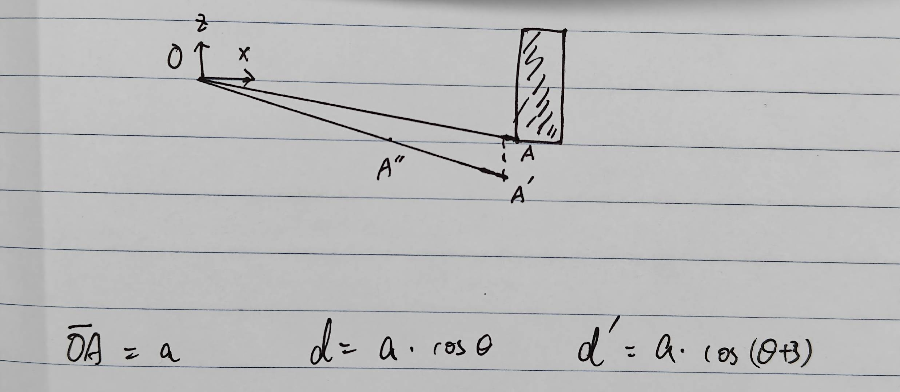

# 侧目相机外参标定的意义

# 1. 结论：

**侧目相机测距不是需要非常精细，所以外参标定不需要，直接使用结构值就可以了。**

# 2. 侧目的主要作用

## 2.1 活体检测

### 2.1.1 正前方双目能看到的，那就双目避障；双目看不到的，直行也不会压到

### 2.1.2 所以侧目只有转向盲区有意义

1. 所以当前活体检测完全满足需求

### 2.1.3 侧目测距的障碍物不画地图的原因考虑（当前状态）

1. 建图消图的意义如果是补割，那双目避障的建图、消图结果更准。

2. 如果侧目障碍物出现在已割一侧，没有必要去补割

3. 如果侧目障碍物出现在未割一侧，之后走过来，如果障碍物消失，前视双目可以发现没有障碍物；如果障碍物未消失，前视双目可以结合定位，将障碍物画在障碍物地图上

4. 由于绕障造成的漏割、补割，也可以通过涂色地图来做，而不是依赖障碍物地图

### 2.1.4 测距障碍物画地图的原因考虑（可能的优化方向）

1. 方便导航规划路径

2. 尤其是前方障碍物避障，侧目也发现障碍物时

3. 具体避障方案导航同事再与产品同事讨论。

4. 即使侧目画地图，也可以不标外参的原因参考[ 侧目相机外参标定的意义](https://roborock.feishu.cn/wiki/HuLcwSYcBioGjckGVDWc76wpnob#share-FlK0dmDKpoxSYvxC1vkceSWfnKe)第3节

## 2.2 危险边界和线材

### 2.2.1 问题分析

1. 侧目因为成像质量差，单目测距精度低，只能用来辅助识别，不能用来直接测距沿线。

2. 危险边界依靠前视双目

3. 线材目前从技术上暂时没有解决方案

4. 思羽提出一种需求：扫地机沿垃圾桶，割草机可以用单目测距模拟吗？

   1. 沿墙传感器不贵，但是受灰尘影响严重

   2. 沿墙传感器的精度是±1mm量级，单目测距完全不够

5. 思羽提出一种需求：双目被阳光照射，侧目可以稳定识别边界，更加靠近草坪（远离危险区域）

   1. 这个需求的实现类似于活体检测，也是躲避行为，不是标、消障碍物的行为

### 2.2.2 补充侧目盲区信息

1. 侧目垂直FOV=118度，安装高度18.01cm，因此测距盲区10.8cm。

# 3. 机器人在草地的姿态振动

1. 机器人在草地中移动，有1\~3°的pitch\roll角是非常正常的

2. 1\~3°的pitch\roll角，gyro积分的姿态不一定能准确响应，也就是说，机器人的pitch\roll和真值可能差1\~3°

3. 对双目测距，距离不依赖pitch\roll角，波动导致的测距误差可以直接用三角函数计算

4. 对单目当前的测距方案，强假设为识别下边框为地面（z=0），这个波动会直接影响测距，导致标消障碍物不准确，因此用于障碍物建图时需要较大的障碍物膨胀距离（3、4的示意图见下图）

（抬头3°，在gyro积分姿态角都是0°的前提下，测距的效果）

* 标定精度也在同一量级（1\~3°），因此从这个角度看，侧目相机外参标定也没有意义（用结构参数即可，用于障碍物建图时需要较远的避障距离）

