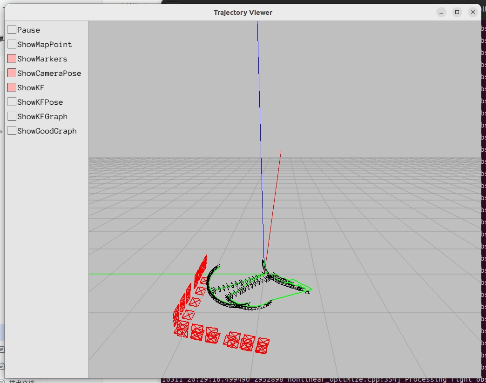
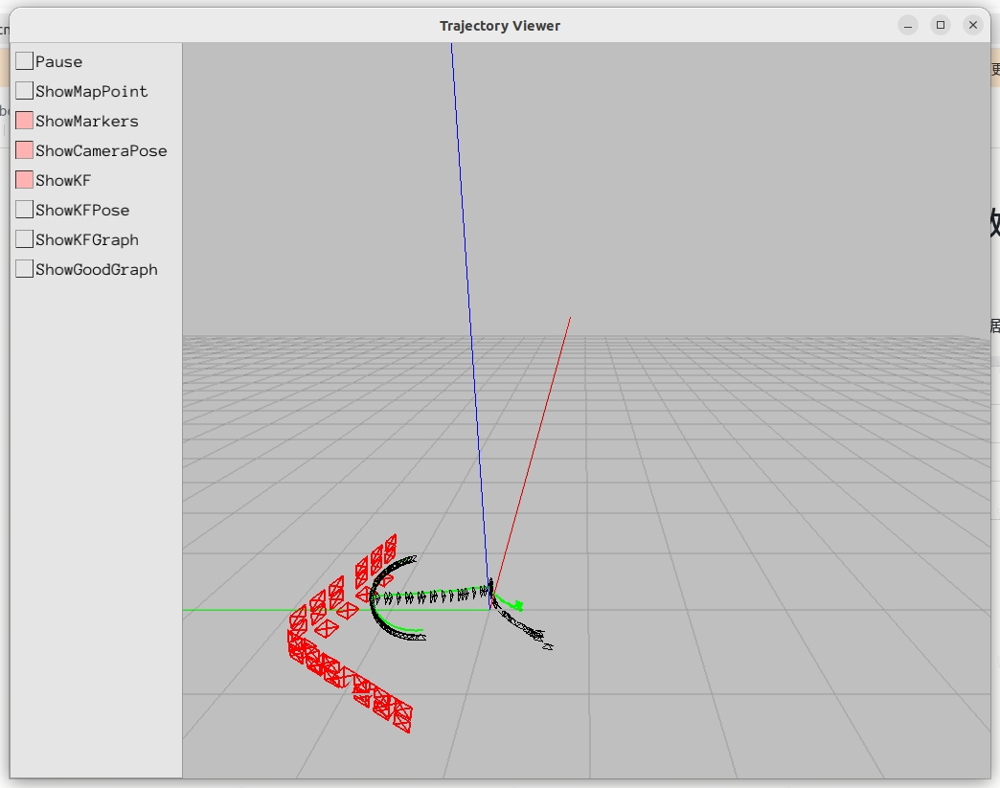

# 售后标定筛掉lidar掉头路线的数据

针对LDS型机器，如versa、lumos，筛掉前30s用于标定lidar的数据。

|          | **frame** | **PC标定时间**     | **路线**                                                                               |
| -------- | --------- | -------------- | ------------------------------------------------------------------------------------ |
| **原数据**  | 612       | 24s            |  |
| **筛选数据** | 386       | 12s（机器2min30s） |  |

查看机器日志发现，主要是第一次slam占用时间长，除第一分钟内处理速度（115/min）较快外，剩下时间基本匀速（38/min）。

| 时间         | 帧数        | 1min内处理图像的数量 |
| ---------- | --------- | ------------ |
| 1st minute | 115 frame | 115          |
| 2nd minute | 174 frame | 59           |
| 3rd minute | 212 frame | 38           |
| 4th minute | 252 frame | 40           |
| 5th minute | 286 frame | 34           |
| 20s        | 302 frame | 16           |
