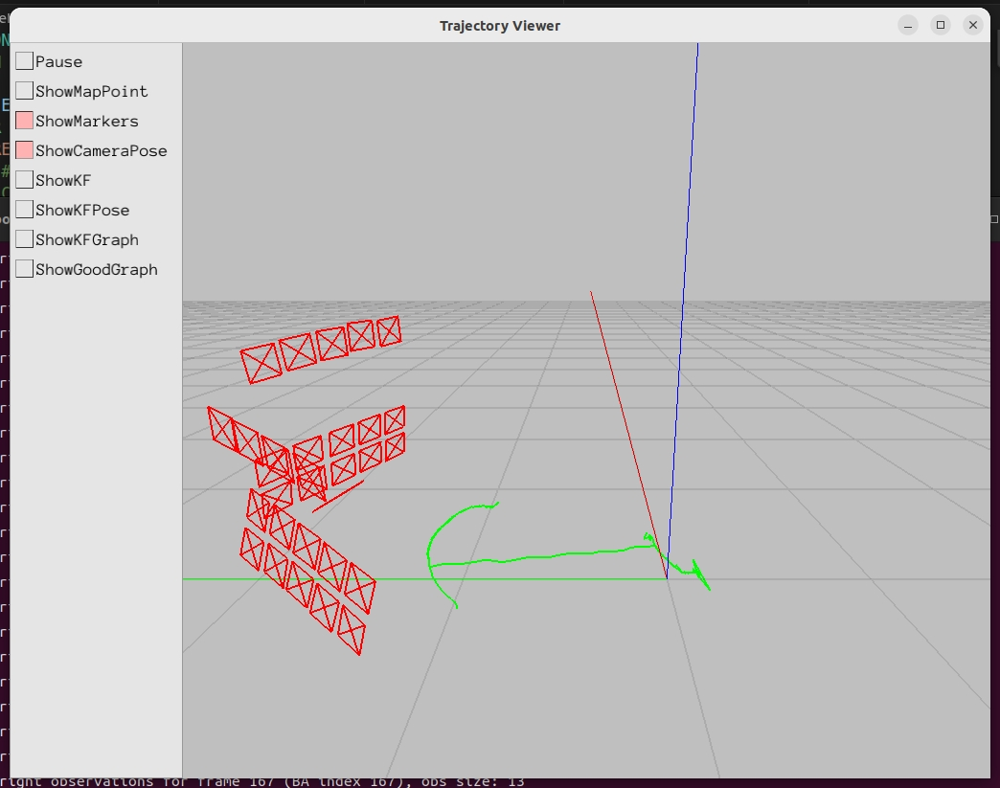
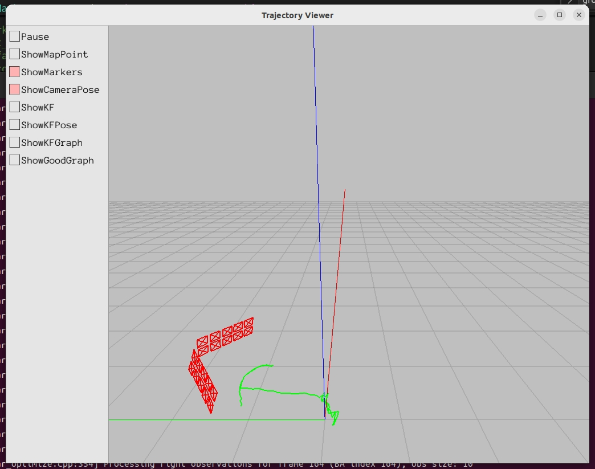

# 售后标定二维码测试

# 标定日志分析报告

一共9个数据，其中5次实机，3次PC模拟只保留下面两行marker，一次MCT;

**结果**看roll、pitch比较稳定，极差在0.7度内，与结构值相比误差在+-0.6度内。yaw波动比较大，极差1.5度内，与结构值相比误差在+-1度内。line diff波动在0.3内，比较稳定。

3行marker yaw极差在1.3度内，与结构值相比误差在+-1度内，roll、pitch比较稳定，极差在0.2度内，与结构值相比误差在+-0.3度内。roll、pitch和linediff更收敛更稳定，但yaw未发现明显收敛。

| **次数**               | **时间**   | **Line Diff (pixels)** | **cam-odom-roll (deg)** | **cam-odom-pitch (deg)** | **cam-odom-yaw (deg)** | tcrcl                                                                                                                                                                                                                                                                                                                              |
| -------------------- | -------- | ---------------------- | ----------------------- | ------------------------ | ---------------------- | ---------------------------------------------------------------------------------------------------------------------------------------------------------------------------------------------------------------------------------------------------------------------------------------------------------------------------------- |
| 1                    | 09:33:57 | **0.275**              | -99.190                 | -0.172                   | -89.711                | \[-0.0649302, 0.000496303, 0.000270255, 0.00571305, 0.0056946, -0.00780192]                                                                                                                                                                                                                                                        |
| 2                    | 09:44:02 | **0.529**              | -99.282                 | +0.092                   | -90.017                | \[-0.0649278, 0.000712018, 0.000294895, 0.00591756, 0.00590493, -0.00782971]                                                                                                                                                                                                                                                       |
| 3                    | 09:51:49 | **0.343**              | -99.167                 | -0.216                   | -90.584                | \[-0.0649278, 0.0007205, 0.000257524, 0.00601299, 0.0057699, -0.00790461]                                                                                                                                                                                                                                                          |
| 4                    | 10:02:24 | **0.463**              | -99.282                 | -0.337                   | -89.787                | \[-0.0649291, 0.000535837, 0.000298121, 0.00576867, 0.00592585, -0.00768894]                                                                                                                                                                                                                                                       |
| 5                    | 10:10:09 | **0.368**              | -99.152                 | -0.327                   | -89.788                | \[-0.0649286, 0.000617998, 0.000212229, 0.00586193, 0.00574692, -0.00782048]                                                                                                                                                                                                                                                       |
| 只保留下面2行marker（PC模拟1） |          | **0.391953**           | -99.2246                | -0.543757                | -89.0972               | \[-0.0649312, 0.000532666, 0.000256568, 0.00573867, 0.00568455, -0.00782971]                                                                                                                                                                                                                                                       |
| 只保留下面2行marker（PC模拟2） |          | **0.358835**           | -99.333                 | -0.302515                | -90.2963               | \[-0.0649266, 0.000783606, 0.000303973, 0.00604771, 0.00598105, -0.00764053]                                                                                                                                                                                                                                                       |
| 只保留下面2行marker（PC模拟3） |          | **0.433527**           | -99.1245                | -0.108429                | -89.6002               | \[-0.0649277, 0.000729424, 0.000267394, 0.00604559, 0.00582687, -0.00776767]                                                                                                                                                                                                                                                       |
| mct                  |          | **0.418996**           | -99.1867                | -0.0348579               | -90.1903               | "tx":        -0.06492828133864,                        "ty":        0.0007299223467916,                        "tz":        0.0002779707341772,                        "r00":        0.0054992195368050835,                        "r01":        0.0065080673725218486,                        "r02":        -0.00795461511949595, |
| 3行marker1            | 08:37:35 | **0.253382**           | -98.8654                | 0.11957                  | -89.6747               | \[-0.0649274, 0.000676873, 0.000331484, 0.00618403, 0.00565272, -0.00784076]                                                                                                                                                                                                                                                       |
| 3行marker2            | 08:48:58 | **0.338631**           | -98.8309                | 0.160515                 | -90.3992               | \[-0.0649348, 0.000628092, 0.000362961, 0.0061202, 0.00562972, -0.00779436]                                                                                                                                                                                                                                                        |
| 3行marker3            | 08:59:33 | **0.300717**           | -98.9437                | 0.213325                 | -90.9281               | \[-0.0649344, 0.000660195, 0.00037094, 0.00619461, 0.00557612, -0.00784656]                                                                                                                                                                                                                                                        |
| 3行marker4            | 09:05:48 | **0.322471&#x20;**     | -98.9098                | 0.217837                 | -90.6205               | \[-0.0649341, 0.000700926, 0.000351224, 0.00623609, 0.00559624, -0.00781902]                                                                                                                                                                                                                                                       |
| 3行marker5            | 09:11:19 | **0.317858**           | -98.9602                | 0.17134                  | -89.9964               | \[-0.0649345, 0.000667928, 0.000330852, 0.00618912, 0.00551898, -0.00784431]                                                                                                                                                                                                                                                       |

| 参数                       | 平均值         | 标准差       | 最大值         | 最小值         | 极差        |
| ------------------------ | ----------- | --------- | ----------- | ----------- | --------- |
| **Line Diff**            | **0.392**   | **0.073** | **0.529**   | **0.275**   | **0.254** |
| **cam-odom-roll (deg)**  | **-99.215** | **0.067** | **-99.125** | **-99.333** | **0.208** |
| **cam-odom-pitch (deg)** | **-0.218**  | **0.178** | **+0.092**  | **-0.544**  | **0.636** |
| **cam-odom-yaw (deg)**   | **-89.919** | **0.442** | **-89.097** | **-90.584** | **1.487** |

| 分组           | 次数 | Line Diff         | Roll                  | Pitch                | Yaw                   |
| ------------ | -- | ----------------- | --------------------- | -------------------- | --------------------- |
| **5次实机**     | 5  | 0.396 ± 0.098     | -99.215° ± 0.059°     | -0.192° ± 0.169°     | -89.977° ± 0.374°     |
| **3次PC模拟**   | 3  | 0.395 ± 0.037     | -99.227° ± 0.104°     | -0.319° ± 0.218°     | -89.664° ± 0.600°     |
| **1次MCT**    | 1  | 0.419             | -99.187°              | -0.035°              | -90.190°              |
| **全部9次**     | 9  | **0.392 ± 0.073** | **-99.215° ± 0.067°** | **-0.218° ± 0.178°** | **-89.919° ± 0.442°** |
| **3行marker** | 5  | **0.307 ± 0.032** | **-98.902 ± 0.050**   | **+0.177 ± 0.039**   | **-90.324 ± 0.489**   |

PC模拟只保留下面2行：

3行marker

