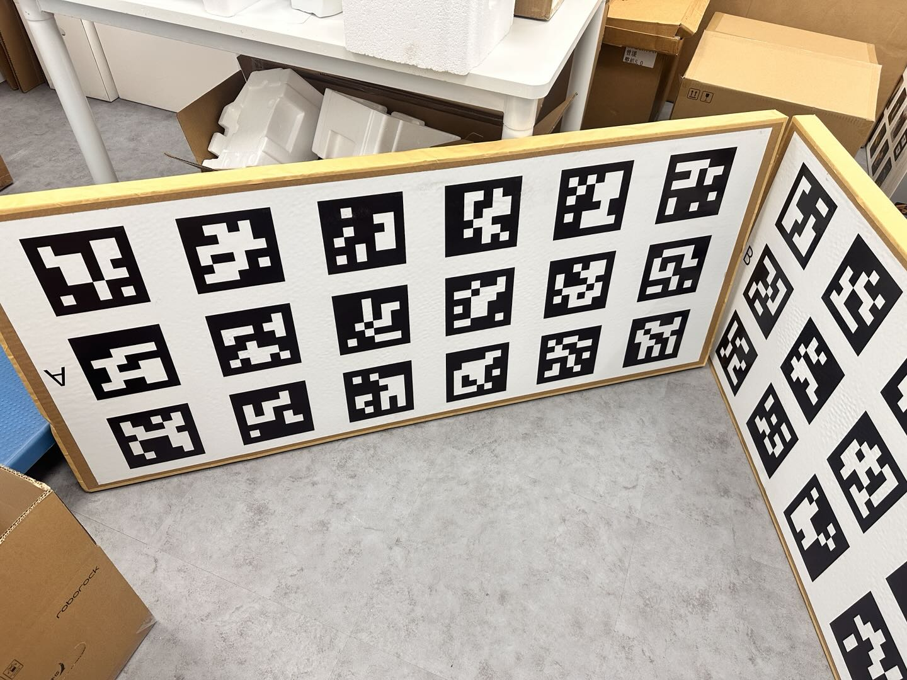
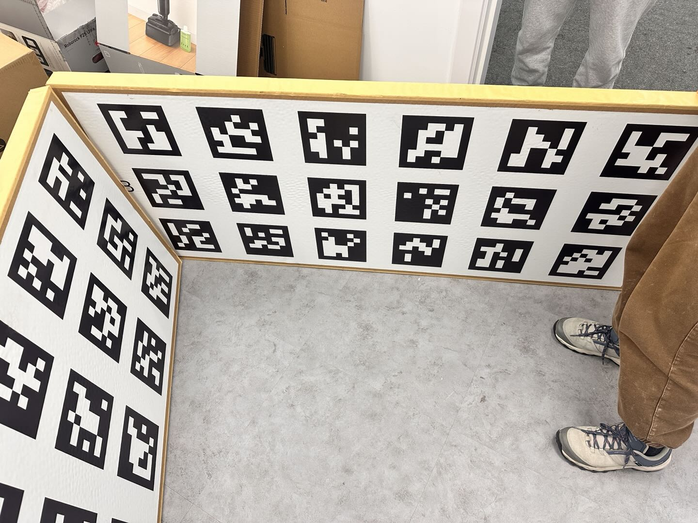
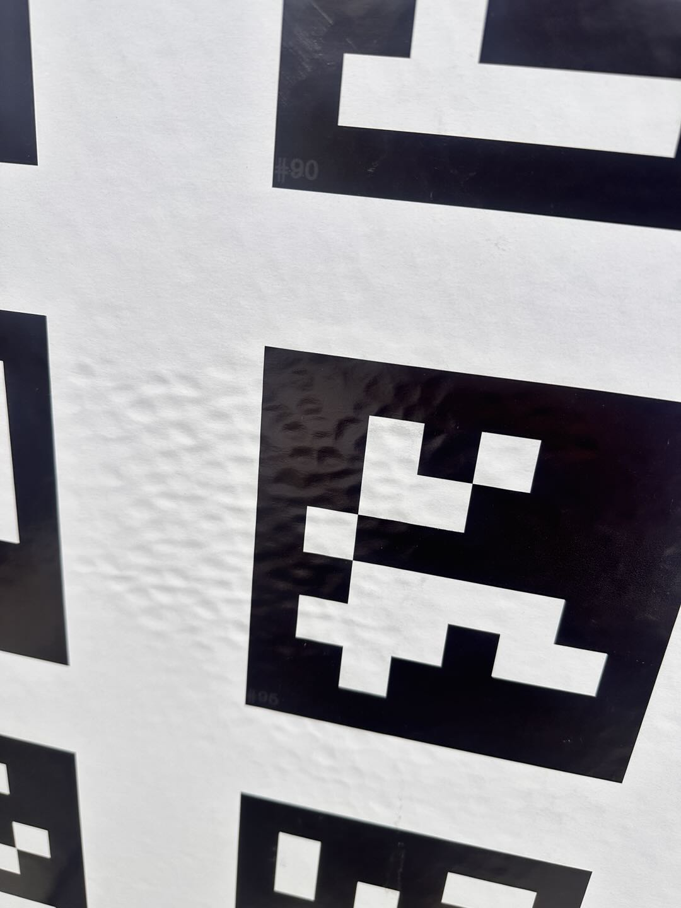
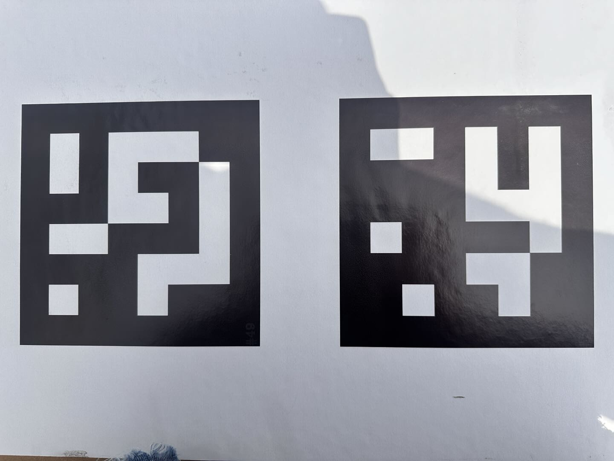
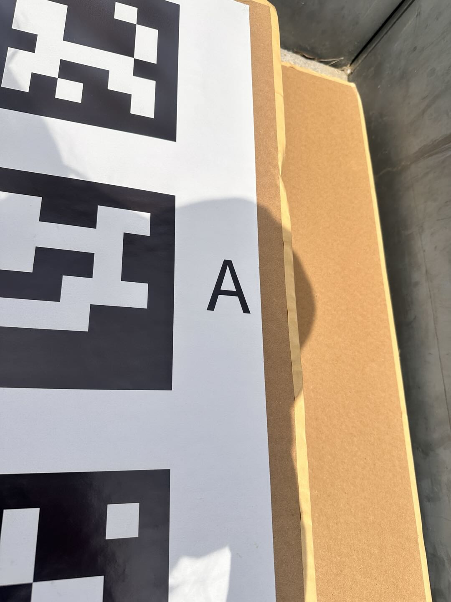
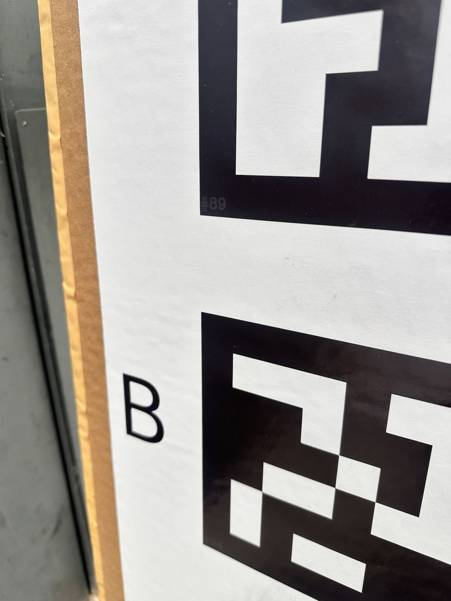
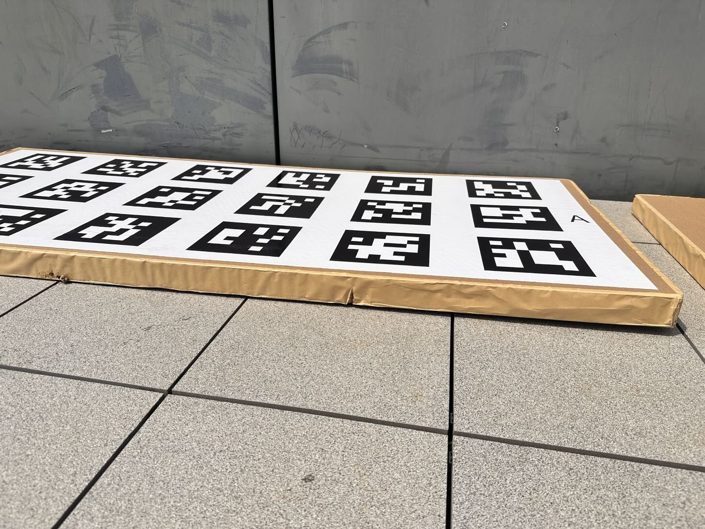
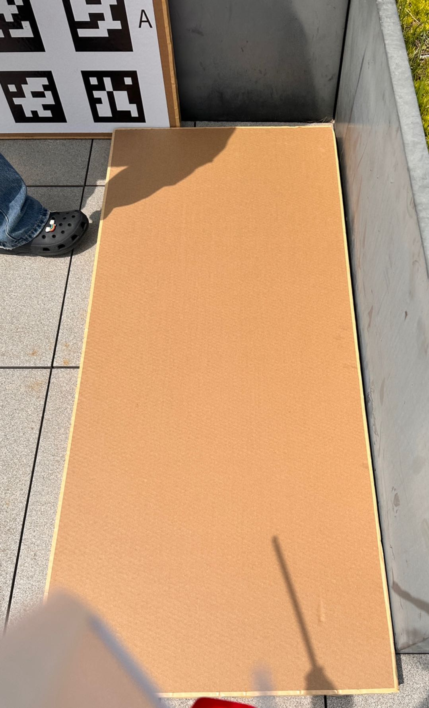

# 售后标定治具验证

# 一、治具外观

1. 治具尺寸：目前用厚度4.3cm的纸板上贴而二维码（15cm×15cm），每个纸板65cm×150cm，3行6列marker; 共2个板子，侧边分别标有A、B字样组成一套治具，两个板子的marker各不相同。

* 治具表面有纸板的纹路，肉眼可见的均匀凹凸如下图：

* marker的印刷边界清晰，细节如下图：

* 两个板子的拼接处有A、B标识：

* 平放于地面有翘边

* 背面

# 二、标定验证

一共4个数据，其中3次售后标定，一次MCT;

**结果**看roll、pitch比较稳定，极差在0.3度内，与结构值相比误差在+-0.3度内。yaw波动比较大，极差1度内，与结构值相比误差在+-1度内。line diff波动在0.2内，比较稳定。

| 次数 | 来源       | 时间          | Line Diff (px) | cam-odom-roll (°) | cam-odom-pitch (°) | cam-odom-yaw (°) | tcrcl                                                           |
| -- | -------- | ----------- | -------------- | ----------------- | ------------------ | ---------------- | --------------------------------------------------------------- |
| 1  | **MCT**  | 04/08 13:55 | */*            | -98.897           | -0.169             | -90.067          | \[-0.064928, 0.000730, 0.000278, 0.005499, 0.006508, -0.007955] |
| 2  | **售后#1** | 04/08 02:35 | **0.117**      | -99.002           | -0.219             | -89.361          | \[-0.065001, 0.000107, 0.000306, 0.001446, 0.002795, -0.004643] |
| 3  | **售后#2** | 04/08 03:00 | **0.130**      | -98.748           | +0.036             | -89.957          | \[-0.064980, 0.000067, 0.000331, 0.001440, 0.002547, -0.004604] |
| 4  | **售后#3** | 04/08 03:14 | **0.123**      | -98.835           | -0.021             | -89.159          | \[-0.064933, 0.000098, 0.000325, 0.001462, 0.002550, -0.004641] |

| 参数                     | 统计项 | **4组平均**    |
| ---------------------- | --- | ----------- |
| **Line Diff (px)**     | 值   | **0.123**   |
|                        | 标准差 | **±0.007**  |
|                        | 最大  | **0.130**   |
|                        | 最小  | **0.117**   |
|                        | 极差  | **0.013**   |
| **cam-odom-roll (°)**  | 值   | **-98.870** |
|                        | 标准差 | **±0.107**  |
|                        | 最大  | **-98.748** |
|                        | 最小  | **-99.002** |
|                        | 极差  | **0.254**   |
| **cam-odom-pitch (°)** | 值   | **-0.093**  |
|                        | 标准差 | **±0.120**  |
|                        | 最大  | **+0.036**  |
|                        | 最小  | **-0.219**  |
|                        | 极差  | **0.255**   |
| **cam-odom-yaw (°)**   | 值   | **-89.636** |
|                        | 标准差 | **±0.444**  |
|                        | 最大  | **-89.159** |
|                        | 最小  | **-90.067** |
|                        | 极差  | **0.908**   |

| 分组      | 次数 | Line Diff         | Roll                | Pitch              | Yaw                 |
| ------- | -- | ----------------- | ------------------- | ------------------ | ------------------- |
| **MCT** | 1  | -                 | -98.897             | -0.169             | -90.067             |
| **售后**  | 3  | **0.123 ± 0.007** | **-98.870 ± 0.107** | **-0.093 ± 0.120** | **-89.636 ± 0.444** |

