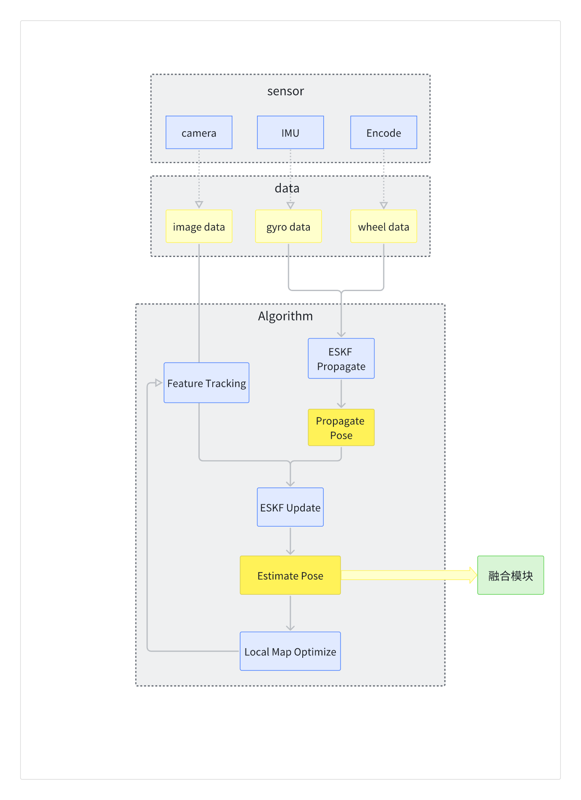

# 割草机多传感器融合定位概要设计

# 一、总述

## 1.1 背景

针对室外割草机的工作场景与环境特点，设计定位传感器组合及对应的融合定位框架

## 1.2 场景分析

环境相对空旷，同时具备较丰富的重复地面纹理。草皮分布在地表，更关注工作平面中定位的可靠性与准确性。

### 1.2.1 传感器组合及功能

RTK：基于其厘米级定位精度，提供空旷场景下精准的三维位置信息

双目视觉定位：利用丰富的草皮纹理，结合轮速计与陀螺仪提供可靠的局部6DOF相对位姿

轮速计：提供短时间内准确的二维移动

陀螺仪：提供短时间内准确的航向角度

加速度计：提供短时间内准确的三维移动

### 1.2.2 对定位的干扰分析

a）树木、房屋等遮挡导致RTK观测不佳、误差增大

应对策略：使用视觉VIO融合位姿进行短时过渡

b）草皮的重复纹理可支持视觉短期定位，但无法重定位，不利于构建全局地图

应对策略：全局定位信息由RTK提供，视觉位姿输出局部相对位姿

c）轮速计与陀螺仪容易受打滑、漂移等影响给出错误观测

应对策略：仅提供短时相对位姿，同时用于视觉融合定位以提高视觉可靠性

d）加速度计受振动、漂移的干扰导致数据误差较大

应对策略：仅提供短时相对位姿，同时在位姿预测阶段设定较大的数据方差

e）多传感器长时间均观测不佳的极端情况

应对策略：给出报警信息，导航模块调整割草路径

# 二、总体设计

## 2.1 定位总体框架

结合端侧算力与传感器特性，考虑使用误差扩展卡尔曼滤波（ESKF）的框架融合多传感器信息，其中轮速计

+IMU提供短时间内位姿预测，RTK提供位置观测进行持续纠偏，视觉VIO提供局部位姿对融合定位进行补充纠偏，并

在RTK观测不佳的时间内提供相对稳定的位姿。

# 三、模块设计

## 4.1 VIO 模块算法框架

VIO模块有三个主要部分：传感器（sensor）、数据（data）、和算法（Algorithm）。

1. 传感器（sensor）：包括摄像头（camera）、惯性测量单元（IMU）、和编码器（Encode）；

2. 数据（data）：传感器采集的数据被处理为图像数据（image data）、陀螺仪数据（gyro data）和轮速数据（wheel data），作为后续算法处理的输入。

3. 算法（Algorithm）：&#x20;

   * **Feature Tracking**：处理图像数据，进行特征跟踪，提取出图像中的特征点。

   * **ESKF Propagate**：输入gyro 和 wheel 数据，利用误差状态卡尔曼滤波（ESKF）进行位姿的预测，获得 **Propagate Pose。**

   * **ESKF Update**：利用 **Feature Tracking** 获得的图像观测数据对位姿进行更新，实时输出 **Estimate Pose**。

   * **Local Map Optimize**：在局部地图上进行非实时优化，以提高定位的准确性和稳定性。

估计的位姿结果传递到**融合模块**，用于进一步的多传感器数据融合。

VIO模块通过结合图像、IMU 和编码器的数据，实时估计出机器人位姿。

## 4.2 RTK模块

SLAM在融合模块，会将RTK原始数据进行处理转换，形成一个在固定坐标系下的三维位置，以及一个协方差矩阵表示的置信度，作为总体状态量的一个观测进行EKF更新。

RTK模块目前定位组对于传感器的输出不明确，希望能够提供器件的规格说明、SDK以及接口定义以支持开发。

