# RTK固定解跳变判断逻辑v1.0

# 目前的数据出现的问题

1. 固定解偶发跳变

2. 浮点解--->固定解--->浮点解的过程中，受浮点解影响，固定解是假固定

# 处理目的

1. 处理大跳变假固定

2. 处理视觉恢复到固定解时刻的假固定

3. 通用性和鲁棒性

# 处理逻辑图

【卡方临界值】

99%门限， 16.81（6d），11.34（3d）

【兜底】

计数器fixed\_rtk\_failure\_cnt>50时进入强制融合（融合到mahalanobis距离小于阈值），机器静止时，如果mahalanobis距离超过阈值，直接拒绝，计数器不增加；

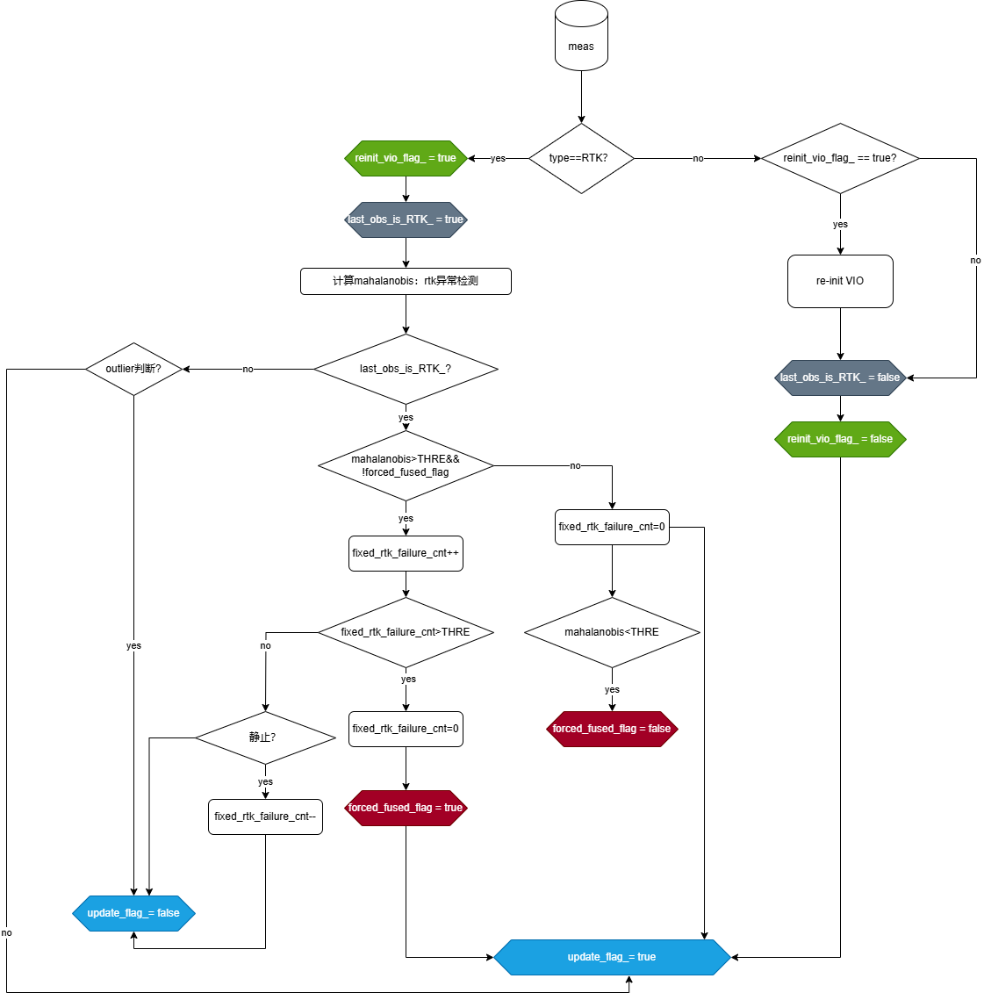

# 测试数据和结果

| 数据                                                     | 数据问题 | 目的                                                                                                              | 处理前结果                                                                                | 处理后结果                                                                                                                                                                    |
| ------------------------------------------------------ | ---- | --------------------------------------------------------------------------------------------------------------- | ------------------------------------------------------------------------------------ | ------------------------------------------------------------------------------------------------------------------------------------------------------------------------ |
| P2-78-slope2\_10X8\_cloudy                             |      | **是**否可正常处理假固定                                                                                                  | 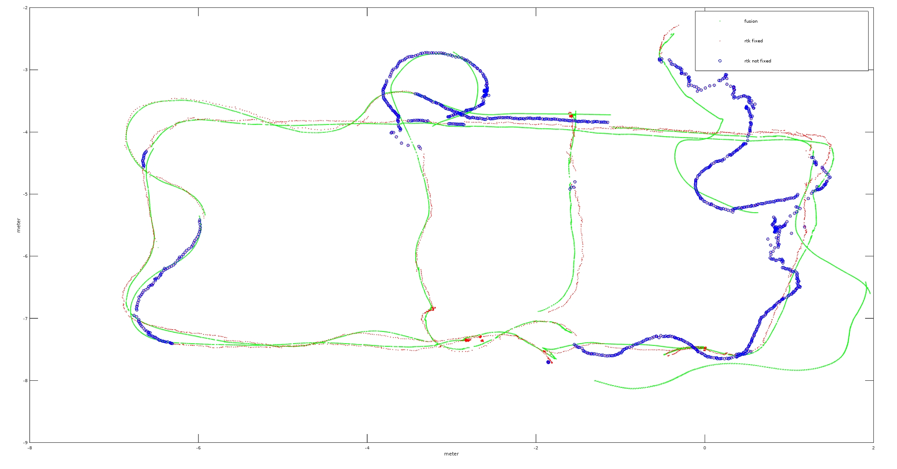  | 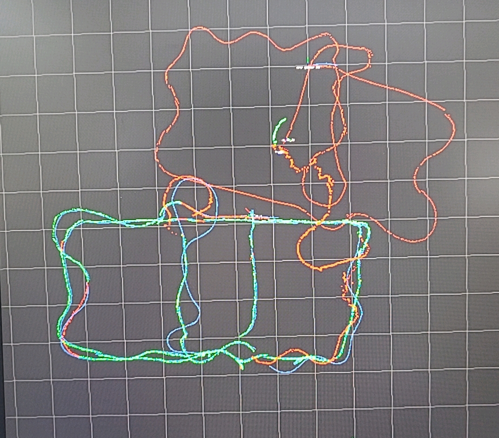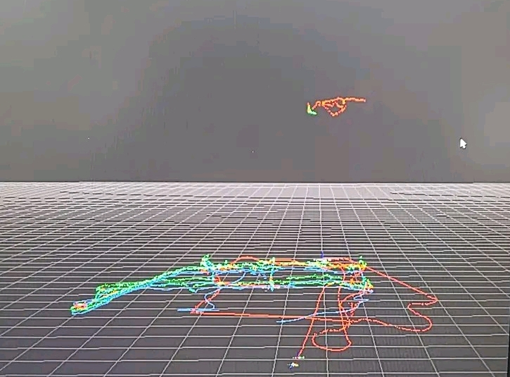 |
| 000054.20250514104252009\_0000000000000\_2025051308DEV |      | 是否可正常处理假固定：**增加静态判断（非过度设计）**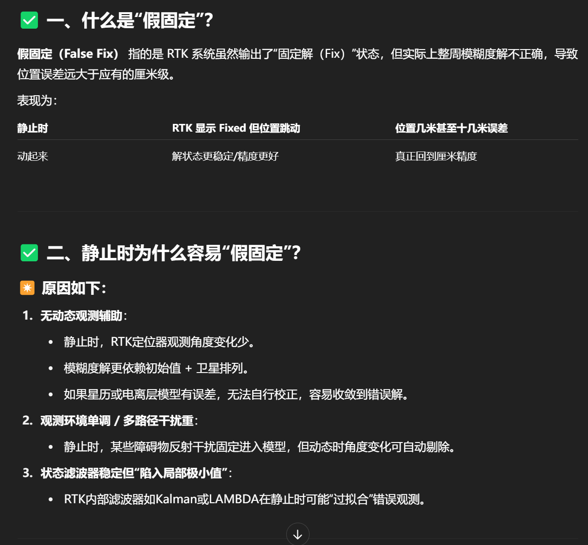 | 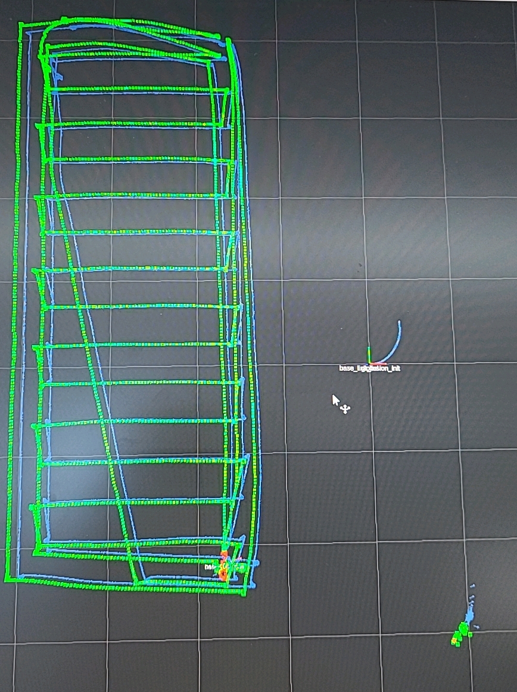 | 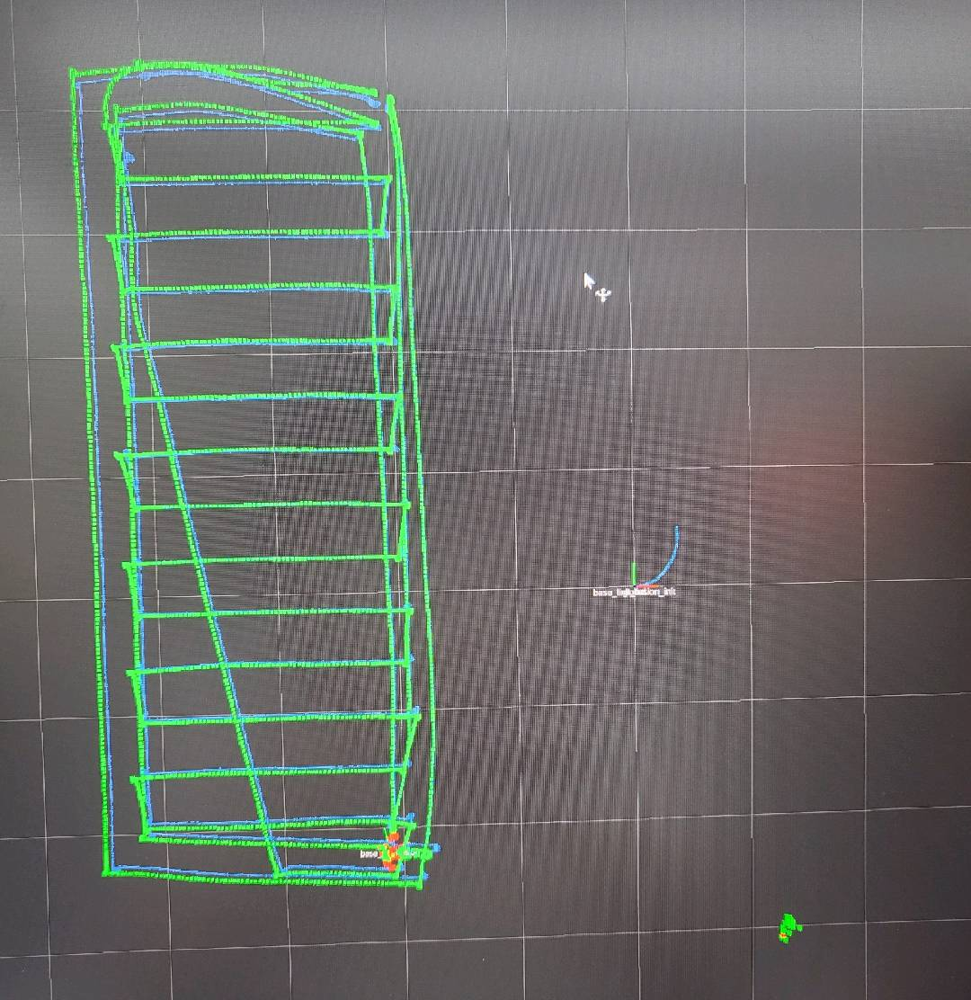                                                                                     |
| MK2-32\_78\_lake2\_sunshine                            |      | 算法是**否**劣化                                                                                                      | /                                                                                    | 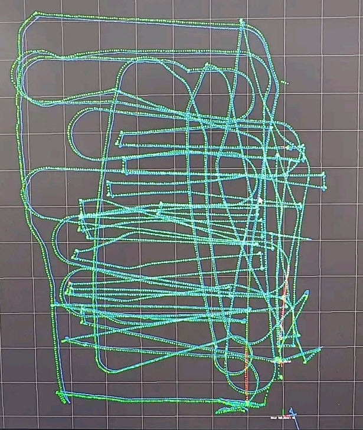                                                                                     |
| MK2-52\_105\_forest0\_10x5                             | 无    | 算法是**否**劣化                                                                                                      | /                                                                                    | 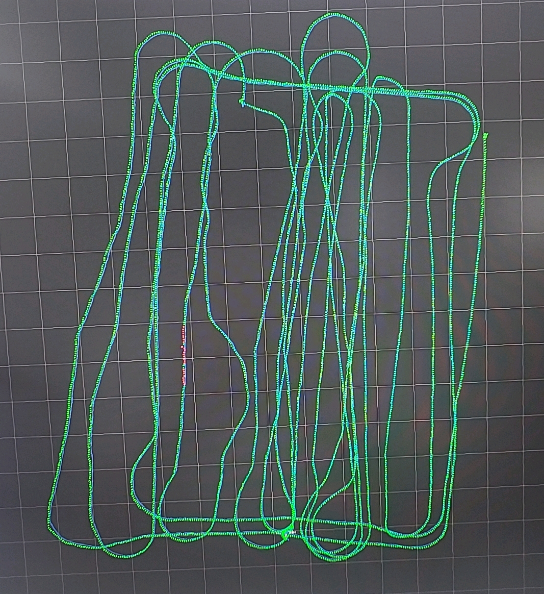                                                                                     |
| MK2-50\_78\_lake2\_sunlight                            | 无    | 算法是**否**劣化                                                                                                      | /                                                                                    | 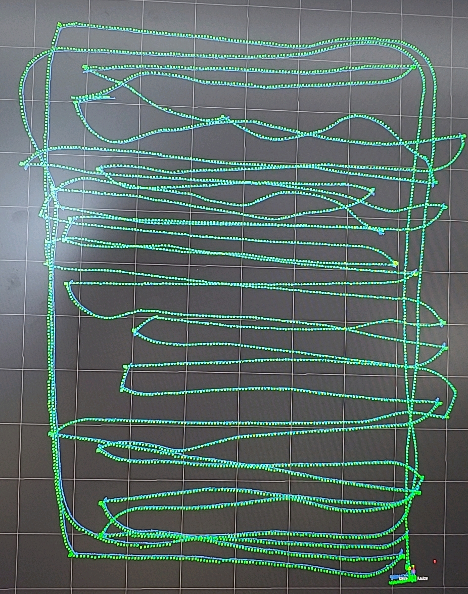                                                                                     |
| MK2-40\_105\_forest0\_10X5                             | 无    | 算法是**否**劣化                                                                                                      | /                                                                                    | 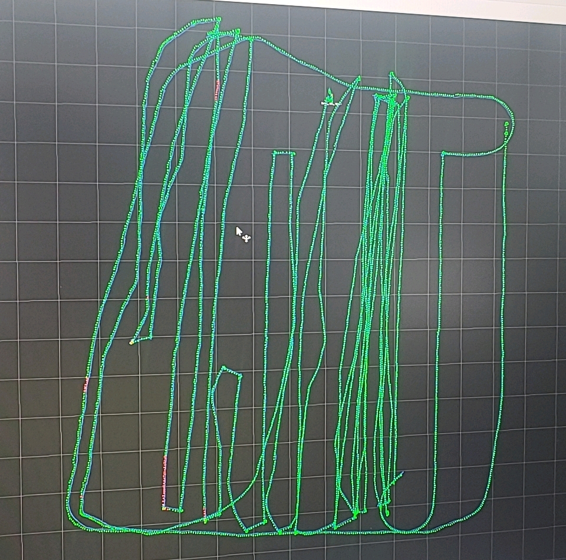                                                                                     |

# 后续优化点

1. 目前版本设置位置高度误差为1m，等打开roll和pitch后可适当缩小：影响上下坡时的融合，高度res过大

2. 目前版本未使用速度res：误差过大，影响判断

3. 视觉辅助假固定的判断：需要视觉稳定，累计误差在合理范围

4. 更多的问题数据：比如**打滑**等

