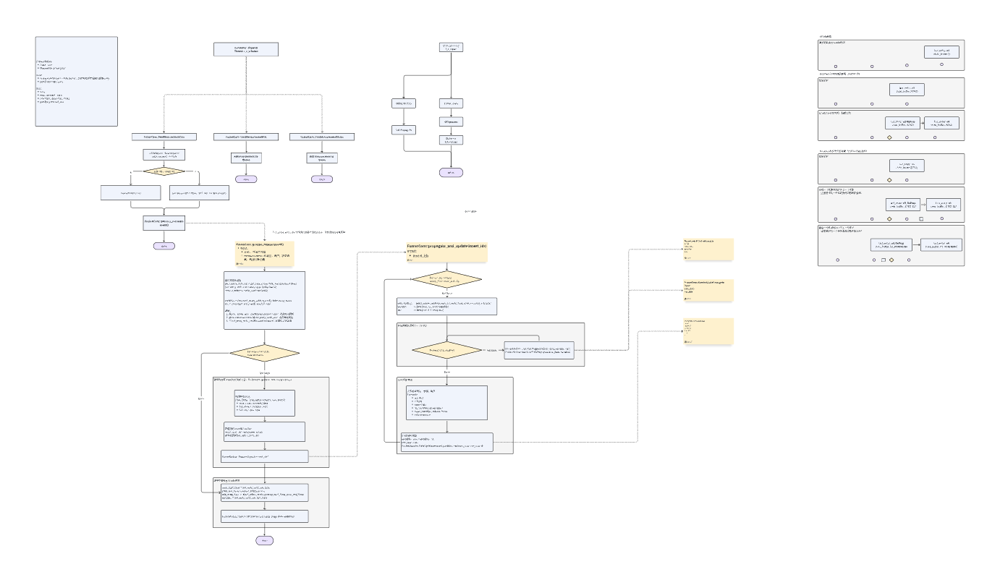

# ESKF融合方案设计

# 一、流程图与类图

# 二、初始化方案

RTK数据目前只有基站东北天系下的xyz坐标，启动时机器不知道其具体姿态角，需要进行初始化过程。

## 2.1 简单方案

机器沿x轴方向前进一段距离
$$R_x = t^w_{R_1R_2}, R_z = [0,0,1]^T,R_y=f(R_x,R_z)$$

参考：https://www.hanspub.org/journal/paperinformation?paperid=17338

## 2.2 通用方案

机器不受限地运动一段时间

已知：

* $$T_{iR}$$，外参

* $$t_{wR}$$，RTK数据

* $$T_{vi}$$ vslam输出，启动时不一定可靠

* $$T_{oi}$$ gyro odo输出，打滑时不可靠

求： $$T_{wi}$$

* 关联项：

  * $$T_{wi}=T_{wR}T_{Ri}$$

    * $$R_{wR}=R_{wi}$$

    * $$t_{wi}=R_{wi}t_{Ri}+t_{wR}$$

  * $$T_{wi}=T_{wv}T_{vi}$$

    * 残差项：$$R_{wv}R_{vi}t_{Ri}+t_{wR}=R_{wv}t_{vi}+t_{wv}$$

  * $$T_{wi}=T_{wo}T_{oi}$$

    * 残差项：$$R_{wo}R_{oi}t_{Ri}+t_{wR}=R_{wo}t_{oi}+t_{wo}$$

* 待求量： $$T_{wv},T_{wo}$$

  * 多组数据最小二乘解得后可以求解所有 $$T_{wi}$$

