# ESKF算法

# 1. 为什么选择ESKF

KF根据运动方程和观测方程持续更新高斯变量的均值和方差，它的推导基于 **最小均方误差（MMSE）**&#x51C6;则。

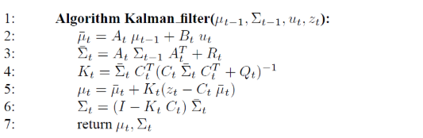

EKF用非线性的生成规则替代了卡尔曼滤波器的线性预测函数，在更新时对**非线性函数一阶泰勒展开得到线性近似**。EKF用雅可比矩阵（非线性函数的一阶偏导数矩阵）Gt代替了状态方程中的矩阵At,Bt， 用Ht替代了测量方程中的矩阵Ct。

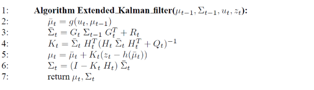

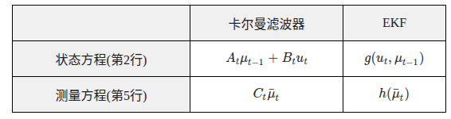

ESKF相比EKF而言，名义状态保持非线性化更新，对涉及误差状态的部分进行线性化更新，误差状态是小量，线性化更精确。ESKF的卡尔曼滤波只作用在误差状态上。ESKF避免直接对高维非线性系统（如旋转、位姿）进行全局线性化，提升数值稳定性和计算效率。

|    | KF   | EKF        | ESKF          |
| -- | ---- | ---------- | ------------- |
| 区别 | 线性系统 | 非线性系统全局线性化 | 对非线性系统进行局部线性化 |

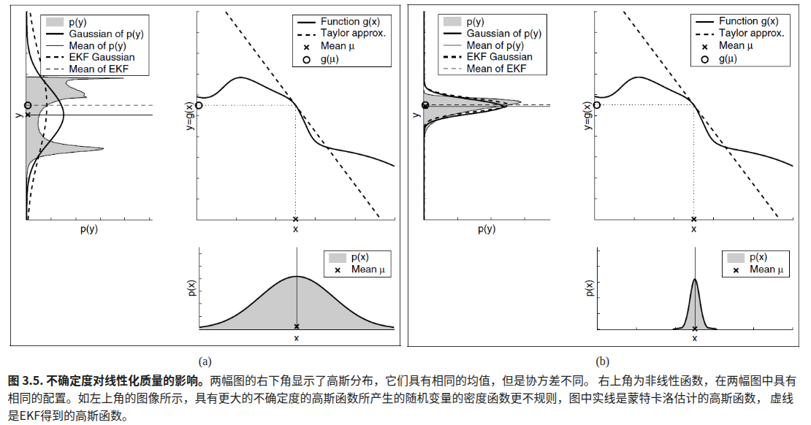

# 2. ESKF算法步骤

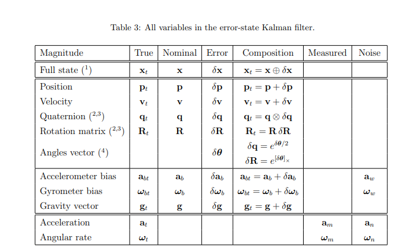

## 2.1 先验估计

### 2.1.1 名义状态动力学更新（保持该有的计算方式，并不进行线性化）

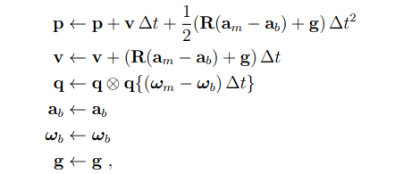

### 2.1.2 误差状态动力学更新和先验估计

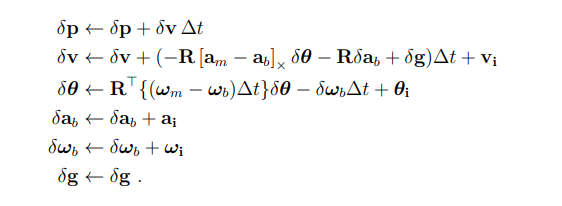

表示成向量的形式：

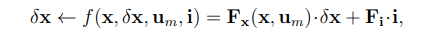

等号部分是函数f对误差量$$\delta_x$$求偏导得到线性化表示（为什么我们要线性化？因为我们通常认为误差是服从高斯分布的，那么非线性转换之后的分布变为非高斯分布，我们无法再使用卡尔曼滤波进行后续的推导和估计了）

**预测部分（先验估计均值和方差）**：

把误差量$$\delta_x $$当作EKF中的u\_t-1代入

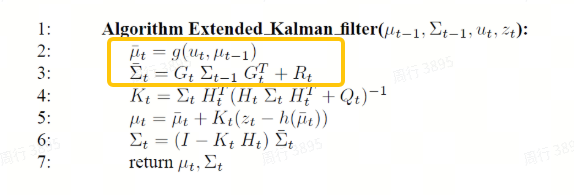

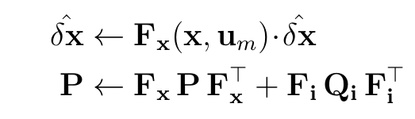

其中

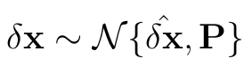

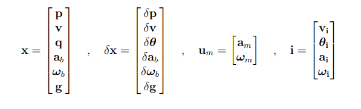

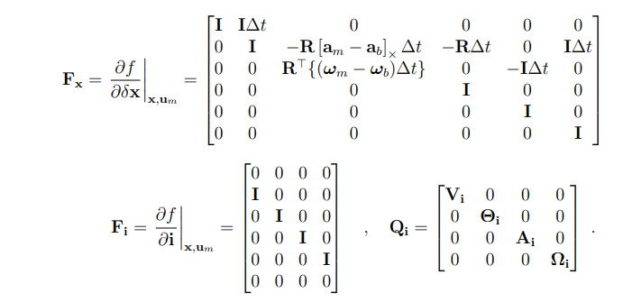

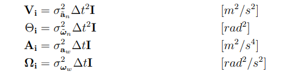

## 2.2 后验估计

### 2.2.1 从观测残差更新卡尔曼增益K和误差状态的后验均值方差

**后验估计=先验估计+K\*观测残差**

我们让后验估计的均方差最小，可以求得K，进而得到最佳后验估计值(**后验均值**)及其方差

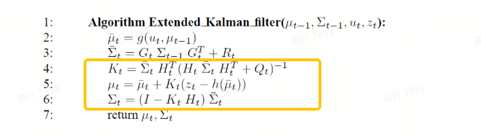

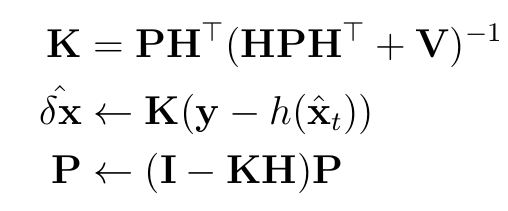

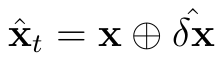

可以看到这里的**后验估计**和通用的表达有一些不同，y为观测值， $$\hat X_t$$为包含先验估计的估计值。

其中，雅可比矩阵H为h对误差状态*δx* 求偏导

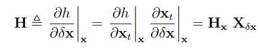

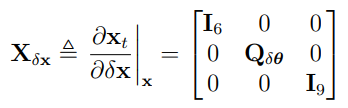

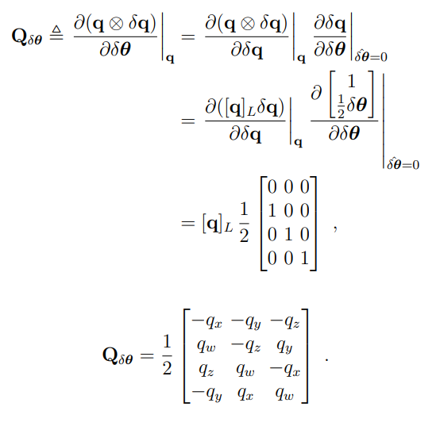

### 2.2.2 把误差状态的**均值(后验估计)**&#x6CE8;入名义状态中进行修正

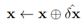

或者分开表示的形式：

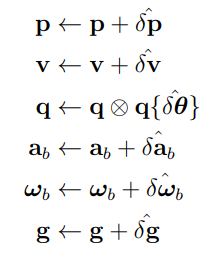

### 2.2.3 误差状态重置(均值归0，方差更新)

因为我们把误差状态估计更新到名义状态中了，误差状态应该被重置，这一点在姿态部分尤为重要，因为新的姿态误差将相对于新名义状态的姿态坐标系进行局部表示，记g()为误差重置函数。

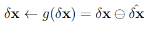

重置之后的均值归0（不应该在原有基础上继续累计误差给名义状态），协方差P 也发生变化。

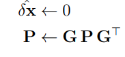

雅可比矩阵G定义为：

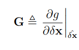

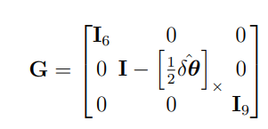

# 3. 附录：KF卡尔曼滤波公式推导

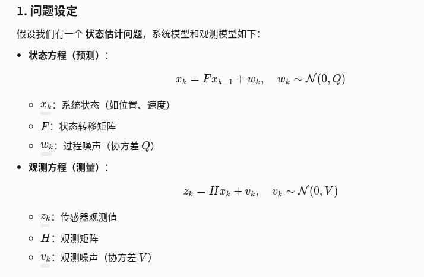

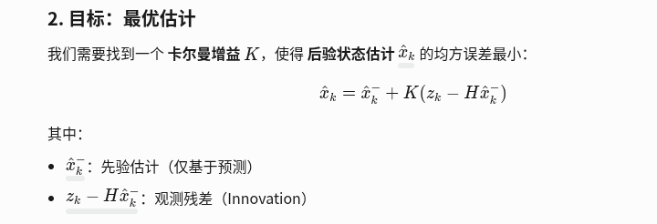

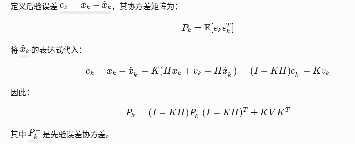

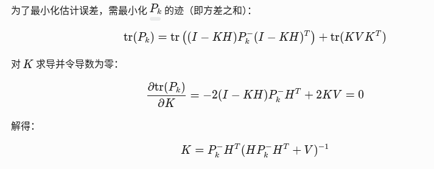
