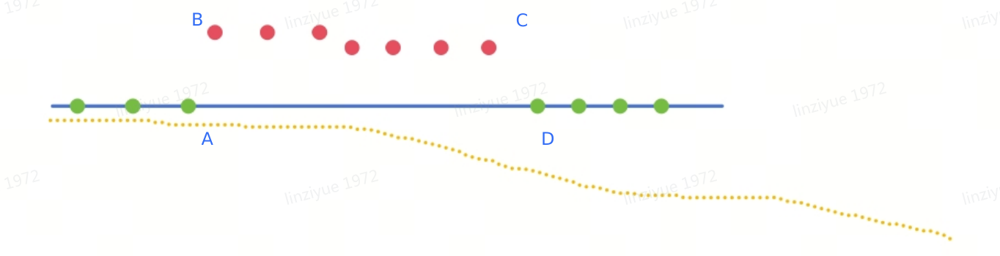
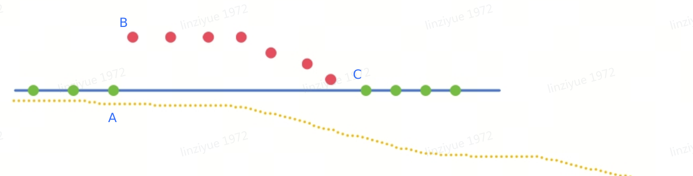
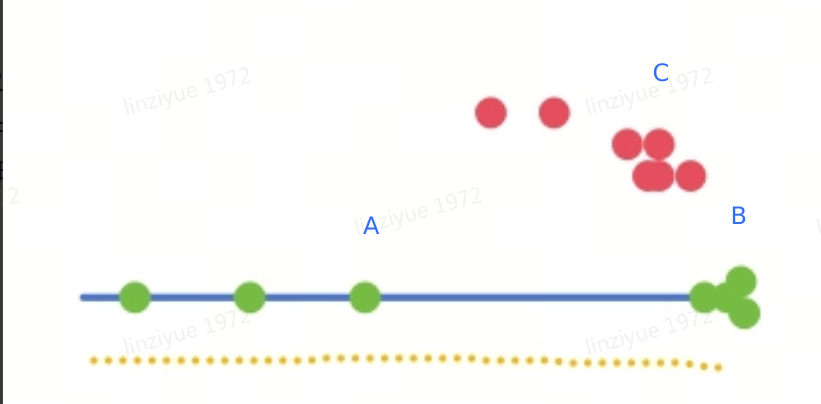
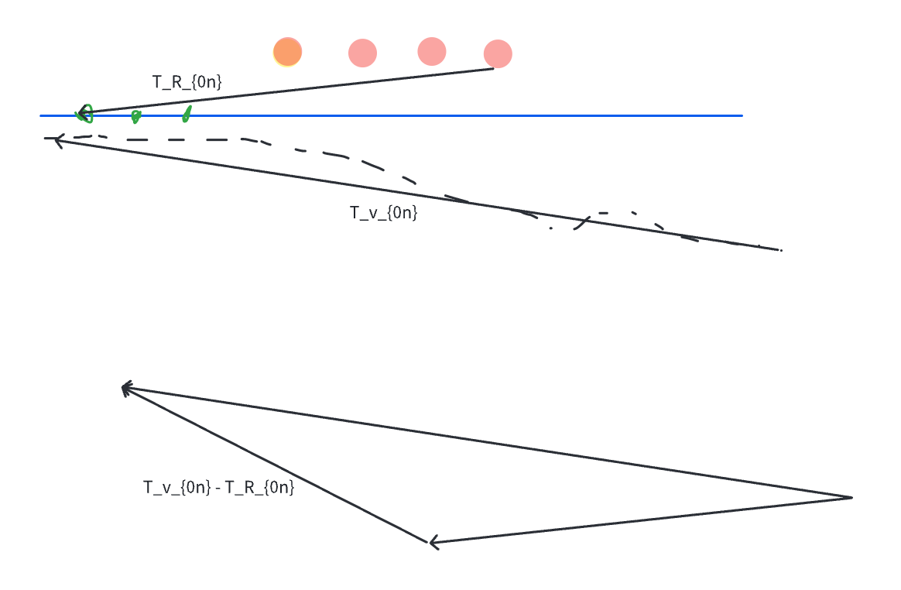

# 融合RTK、Vio逻辑1.1

# v1.1

1. 加入RTK位置方差、速度方差判断假固定解，如果方差已经能判断，不用继续后续步骤 [ RTK假固定原始数据分析](https://roborock.feishu.cn/wiki/ZAo1wOkN7iOo4qkaDJacc0rHnne)

2. 如果相邻两个RTK状态（不论解状态为4或5）的跳变超过阈值（如0.2m），或者在RTK状态转换时（4转5，5转4），改用VIO持续递推

3. 用vio检测RTK观测，只有RTK和vio在一段时间内相符时，才认为RTK固定解是好的固定解

   1. 改用vio后，记录RTK观测队列和Fusion观测队列（队列长度阈值为20s），每插入一个观测进行一次下列判定

   2. 每次RTK跳变超过0.2m，或RTK状态转换（4转5，5转4），清空队列，重新判定

   3. 如果Fusion队列和RTK队列首尾位移偏差（|t\_R\_{0n} - t\_v\_{0n}|）大于10%，清空两个队列，重新统计；否则，切换到RTK观测

   

   * 如果vio/惯导超过1min

     1. 如果当前RTK为固定解，直接切换到RTK观测

     2. 如果当前RTK非固定解，立即重定位

4. 静止状态下，不理会RTK跳变

5. 优势

   1. 比较好解决RTK解4/5/4来回跳变的情况

6. 其他风险

   1. 在5转4，且RTK是真固定解的情况下，会多递推20s

各种情况如下图：

（绿色 真固定解，红色假固定解，  蓝色线段：真实路径，  黄色虚线： odom-vio递推路线）

| 情况                      | 图片                                                                                  | dev                                               | 新方案                                                                  |
| ----------------------- | ----------------------------------------------------------------------------------- | ------------------------------------------------- | -------------------------------------------------------------------- |
| （1）RTK缓慢的飘走， 后续通过跳变回来   |  | 在B处将C的真固定判为假固定，递推5s后，跳回到真固定                       | 在B处开始VIO递推，递推20s之后，跳回回到真固定，略有劣势                                      |
| （2）RTK跳变失效，然后又跳变回来      |  | 在A处将B判为假固定解，递推5s后，跳到假固定；在C处将D判为假固定解，递推5s后，跳回到真固定解 | 在A处开始VIO递推，递推20s；在D处再递推20s后回到固定解                                     |
| （3）RTK跳变失效，缓慢飘回来        |  | 在A处将B处判为假固定解解，递推5s后，跳到假固定；最后回到C                   | 在A处开始VIO递推，递推20s；如果假固定解和VIO相似，跳到假固定解后回到C；如果假固定解和VIO不相似，1min后超时跳回真固定解 |
| （4）机器静止，RTK跳出去一段时间，又跳回来 |  | 在B处静止5s，跳到C处；在C处多静止5s，跳到B处                        | B处静止20s，跳到C处；在C处多静止20s，跳到B处                                          |

***

# v1.0

1. 关注RTK跳变，如果相邻两个RTK（不论4、5解）跳变超过0.2m（0.6m/s\*0.1s=0.06m）

   * rework，最近5s的观测改用vio

2. ~~改用vio后，持续关注RTK和Fusion的转换矩阵T\_{Rf}中的平移项（实际也没有旋转项，因为RTK没有姿态）（废弃这个方案，因为姿态对齐问题，可能导致T\_{Rf}中的平移项随时间增大）~~

   * ~~如果持续20s稳定在0.2m以内，观测改用RTK~~

   * ~~如果vio跟丢，改用惯导~~

3. 改用vio后，记录RTK观测队列和Fusion观测队列（队列长度小于20s，每插入一个观测进行一次下列判定）

   * 如果RTK自己跳变超过0.2m，清空两个队列，重新统计

   * 如果vio跟丢，改用惯导，同时清空队列，重新统计（防止vio已经飘了一些）

     1. 不直接使用RTK作为观测的原因是，RTK可能假固定，也可能浮点

     2. 不立即重定位的原因是，这个位置是因为RTK不好才采用vio的，这附近大概率重定位不成功、假成功或窄通道没有重定位路径施展空间

   * 如果vio/惯导超过1min

     1. 如果当前RTK为固定解，直接切换到RTK观测

     2. 如果当前RTK非固定解，立即重定位

   * 如果Fusion队列和RTK队列首尾位移偏差（|t\_R\_{0n} - t\_v\_{0n}|）大于10%，清空两个队列，重新统计

     1. 否则，切换到RTK观测

     2.

     
