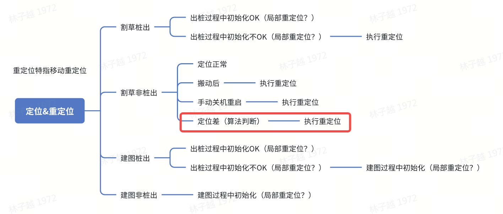
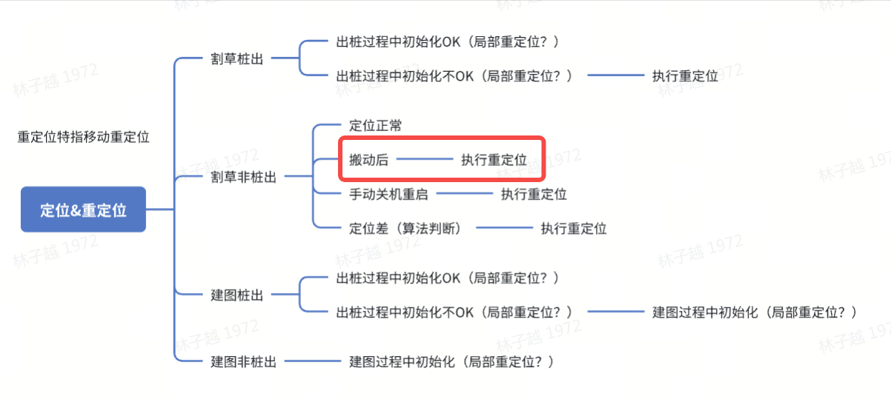
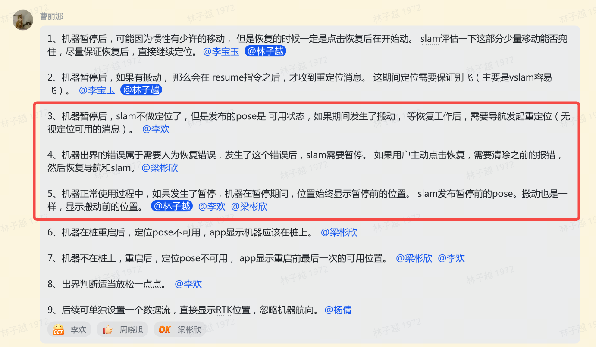

# 导航-slam重定位接口

# 背景

在定位不佳的情况下，如RTK失效、视觉失效或机器被搬动、重启时，进行特殊动作来恢复定位信息


# 场景和交互描述

产品策略见：[ 定位&重定位策略（小倩）](https://roborock.feishu.cn/wiki/J87lwBzQdiqfYZk48nZc5RNAn8c)

## 一、割草定位差



1. 在RTK非固定解且视觉丢失时，触发重定位。

2. 与导航交互：

   1. 如果该情况发生，由slam判断需要重定位，发布需要重定位消息到导航

   2. 该情况的重定位类型是连续轨迹的重定位，导航对slam不需要发reset

   3. 导航速度减半（意义在于降低打滑导致速度不准确而对初始化的影响）

   4. 如果定位找回，slam发布重定位结束信息到导航；如果定位长时间无法找回，导航可直接报错

3. 接口定义：

```c++
// common_protobuf/proto/common/SlamMsg.proto
message SlamToNavMsg {
    enum Type {
        // 新增消息
        RELOCATE_BAD_LOCATION = 2;
    }
    
    // 新增消息
    bool relocate_cmd = 3; // 1: 开始重定位动作（slam判断定位较差），0：结束重定位动作（slam判断定位找回）
};
```

* 与状态机交互 （2025.11.11新增）

  发送重定位消息给状态机：

  1. 如果处于建图模式，报错

  2. 如果处于割草模式，忽略（实际机器进入主动重定位状态）

```protobuf
// common_protobuf/proto/common/SlamMsg.proto
message SlamMsg {
    enum Type {
        // 新增消息
        RELOCATE_BAD_LOCATION = 4;
    }
    
    // 新增消息
    bool relocate_cmd = 7; // 1: 开始重定位动作（slam判断定位较差），0：结束重定位动作（slam判断定位找回）
};
```


## 二、搬动重定位



1. 在检测到机器被人为搬动时，触发重定位

2. 与导航交互

   * 由导航判断机器被搬动，当导航开始重定位动作时，发布重定位消息给slam

   * 由slam判断重定位是否成功，当发布搬动重定位消息之后，slam pose中init字段变为0，如果init再变为1，表示重定位成功；如果定位长时间无法找回，导航可直接报错

   * 导航在重定位期间动作：走2\*2方形，成功就停止

3. 接口定义：

```protobuf
// common_protobuf/proto/common/SlamMsg.proto
// 导航发布移动重定位开始
message NavToSlamMsg {
    enum Type {
        // 新增
        RELOCATE_MOVED = 10;
    }
};
```

* slam重定位成功条件：slam能够找到RTK固定解且重新初始对准成功

* 与APP交互：机器运行到A点，被搬动到B点，然后用户点击继续工作。  机器被搬动的时候，通知slam，slam后续发布的pose都是不可用。 在B位置做重定位成功之前，app一直显示机器在A点，状态显示未重定位中。 等定位成功后，slam发布可用的pose，app中机器的位置更新为可用pose

* 暂停期间搬动策略 （11.05新增）

  [ 割草机位置显示](https://roborock.feishu.cn/wiki/HySewyJJXiABVCk7MdZckadenFf)

  


## 三、其他情况

1. 文档中定义的其他情况下触发的重定位

2. 与导航交互：

   1. 如果该情况发生，由导航判断需要重定位，发送reset消息到定位

3. 接口定义：复用原有的`NavToSlamMsg: reset_cmd`


## 四、参考
