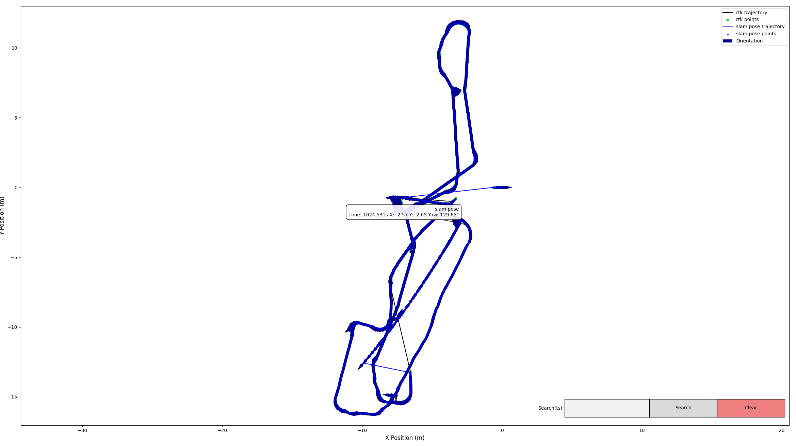
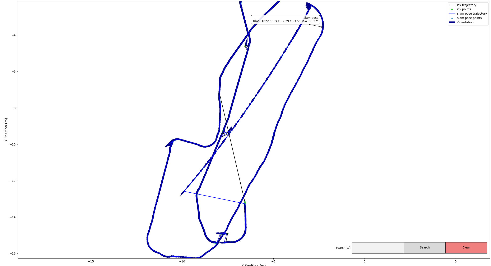
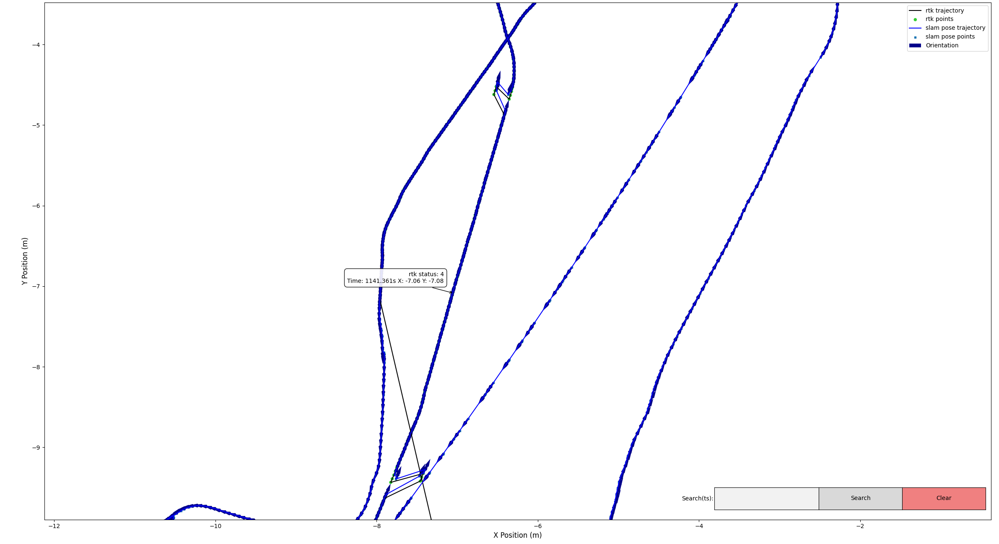
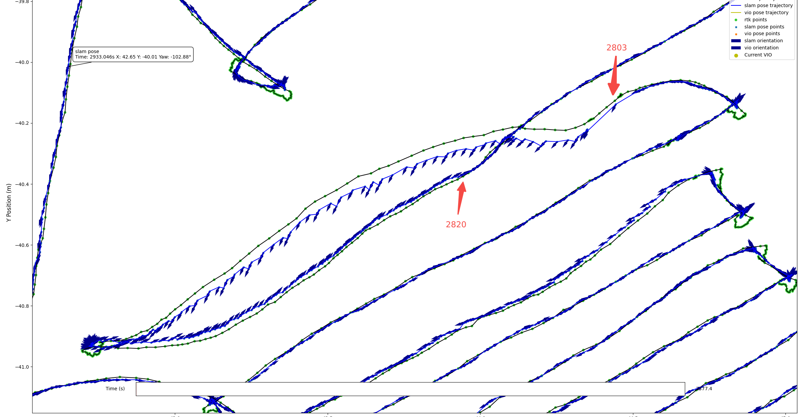
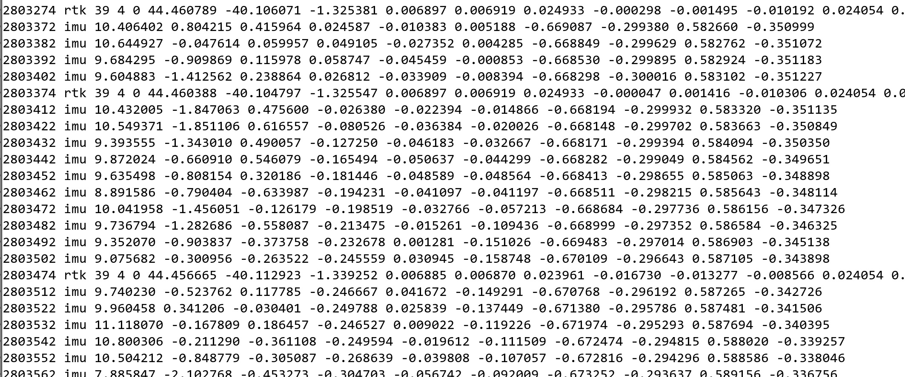
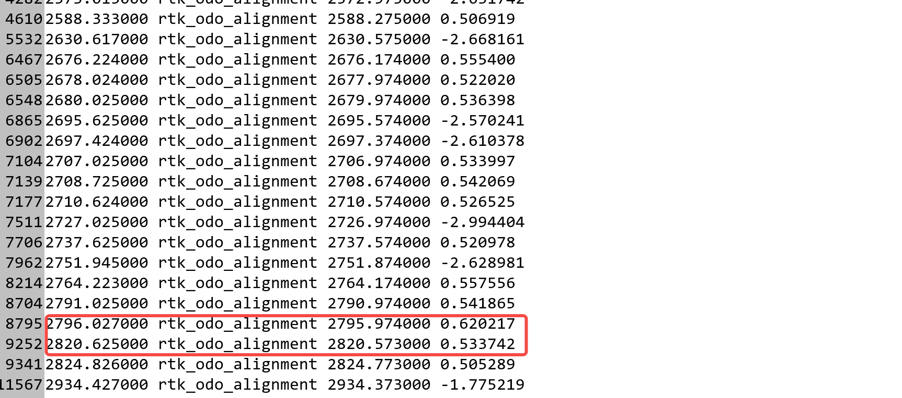

# Rtk odom初始化线程

### **背景：**

为了能使融合定位姿态在某些特殊情况下(rtk浮点解到固定解，视觉到固定解之间变化等)快速收敛，在初对齐（通过rtk速度对齐[ 融合速度处理](https://roborock.feishu.cn/wiki/KEoFwWra7i0L9FkoOMHcVCTpn1e)）的基础上，增加rtk与odom对齐线程。

### **方案设计：**

增加rtk与odom对齐线程，一直做odom与rtk的对准，当计算出yaw后替

换状态估计中的yaw。为了能计算出准确的yaw，需要对参与对齐的rtk和odom轨迹具备如下要求：

1. rtk和odom的数据队列长度为固定size:10，rtk队列中的数据均为固定解，当满足组长度后做轨迹质量检查，检查通过后做线性对齐（SVD分解）；

2. 轨迹质量检查标准：rtk和odom的轨迹是直线行驶，需满足两帧之间的行驶角度不超过5deg，且总的rtk累加长度不超过1m（防止固定解异常）。

3. 对齐计算出yaw后，做残差分析（即将odom轨迹通过yaw转到rtk坐标系，计算转换后与对应rtk轨迹的角度误差），若平均角度误差小于5deg，认为yaw有效

4. 若step1-3中其中一项不满足，则清空数据队列，重新累计数据。

5. 若get\_pose的时间戳与计算出yaw的时间戳小于50ms，则使用yaw更新当前状态

### 后续改进：

1. 目前使用的是固定size的数据做对齐，用完清空，后续可改成滑动窗口的形式。

2. 目前轨迹质量检查标准过于苛刻或不是最优，后续可设计出更优的判断标准，输出的yaw既能保证准确度也能有较高的输出频率。

3. 由RTK-odo对齐计算出的yaw角，作为观测进入滤波器，而不是像目前这样强制更改状态中的yaw

本地仿真数据：

增加rtk odom对齐线程前：

增加rtk odom对齐线程后

上机自测数据

补充：

在2803处因为odo数据不发导致航向错误，在2820处通过rtk\_odo\_alignment纠正

2803：

2820：

