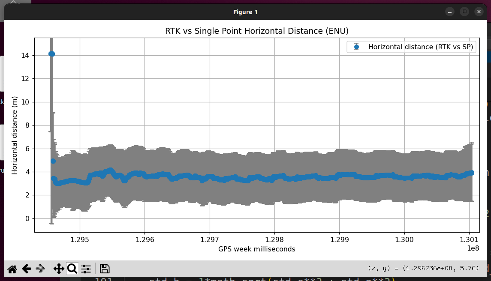
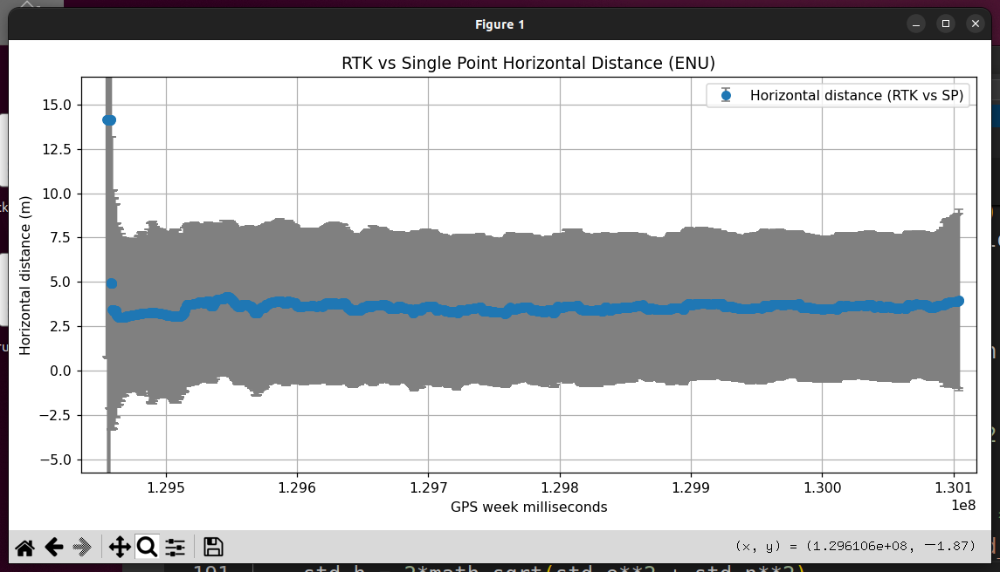
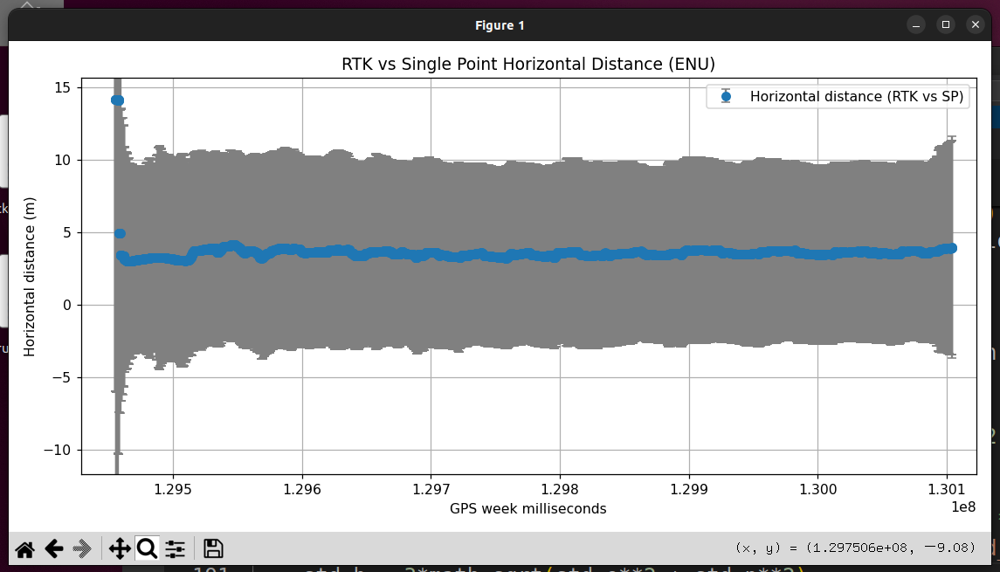
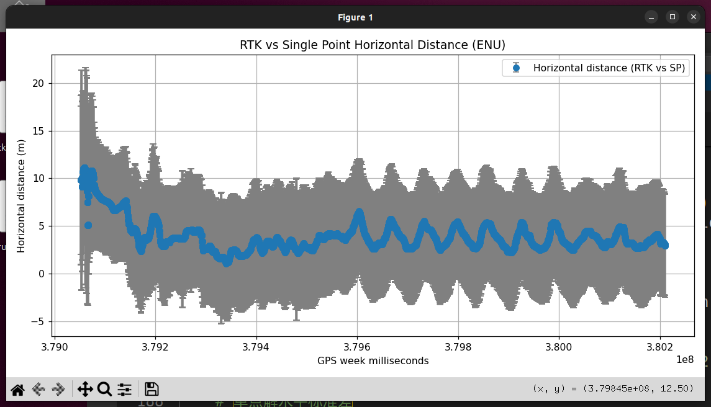
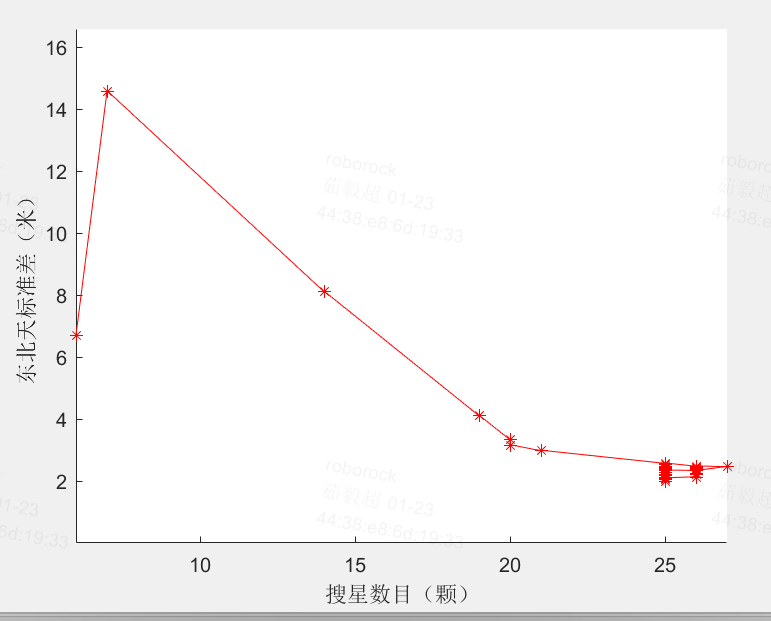

# RTK单点解精度（微缩版）

# 1. 结论

1. PSRPOSA报文在完全关闭固定站只保留移动站时提供单点解。

   | 解类型 | 最大误差（单位：m） | 平均误差（单位：m） | 最小误差（单位：m） |
   | --- | ---------- | ---------- | ---------- |
   | 单点解 | 4.53       | 3.99       | 3.53       |

2. 单点解标准差可信度：

   1. 在卫星条件较差的情况下3-sigma误差范围可以覆盖真值

3. 单点解标准差和星数相关性不显著

# 2. 单点解位置误差评估

## 2.1 测试方法&#x20;

使用butchart割草机的rtk定位信息作为真值。把一套单模组放在割草机上（不配对基站），输出psrposa报文，作为单点数据。

### 2.1.1 psrposa报文：

1. 在无基站环境中，该报文表示纯单点精度，经纬高坐标与AGRICA相同，经纬高标准差与AGRICA移动站相同。

2. 在和基站有通讯的情况下，该报文表示伪距差分的精度（略比单点解高，远差于浮点解和固定解）

3. 供应商不保证该报文的精度。

## 2.2 数据与结果

### 2.2.1 数据（星数良好）：

### 2.2.2 结果（时间戳对齐）

#### 2.2.2.1 方法：

1. 单模组相对于整机固定站的坐标与整机RTK坐标进行对比。

#### 2.2.2.2 误差来源

1. rtk的坐标原点为基站的中心点，但是基站的经纬度是单点定位精度。

2. 另一个完全独立的gnss模组，收到的经纬度也是单点定位的精度，所以轨迹没对齐是单点定位的误差。

   1. 这一误差也可以反映单点GPS每次启动之间的初始位置误差

#### 2.2.2.3 定位结果

| 解类型 | 最大误差（单位：m） | 平均误差（单位：m） | 最小误差（单位：m） |
| --- | ---------- | ---------- | ---------- |
| 单点解 | 4.53       | 3.99       | 3.53       |

# 3. 单点解标准差可信程度评估

## 3.1 结论

单点解3倍标准差可以覆盖RTK位置。

## 3.2 原始数据：

横坐标是时间，纵坐标是单点解位置和rtk位置的2D平面距离差，和单点解2D位置标准差。这张图用来衡量单点解标准差的可信度

横坐标是周内毫秒数

位置差是共用RTK的基站坐标，换算到ENU坐标系做的差

标准差是ECEF标准差换算到ENU坐标系的标准差&#x20;

数据1：

|         | 完整数据                                                                                | 局部放大                                                                                | 效果         |
| ------- | ----------------------------------------------------------------------------------- | ----------------------------------------------------------------------------------- | ---------- |
| 1-sigma |  |  | 无法覆盖真值     |
| 2-sigma |  |  | 部分数据无法覆盖真值 |
| 3-sigma |  |  | 可以覆盖真值     |

数据2：

|         | 完整数据                                                                                | 效果         |
| ------- | ----------------------------------------------------------------------------------- | ---------- |
| 1-sigma |  | 无法覆盖真值     |
| 2-sigma |  | 部分数据无法覆盖真值 |
| 3-sigma |  | 可以覆盖真值     |

# 4. 单点解标准差和星数的关系

单点解标准差和星数相关性不显著

| 数据1                                                                                 | 数据2                                                                                 |
| ----------------------------------------------------------------------------------- | ----------------------------------------------------------------------------------- |
|  |  |

