# 点云染色调优

# 1. 原始版本的点云

像是冬日限定版，有点抽象。

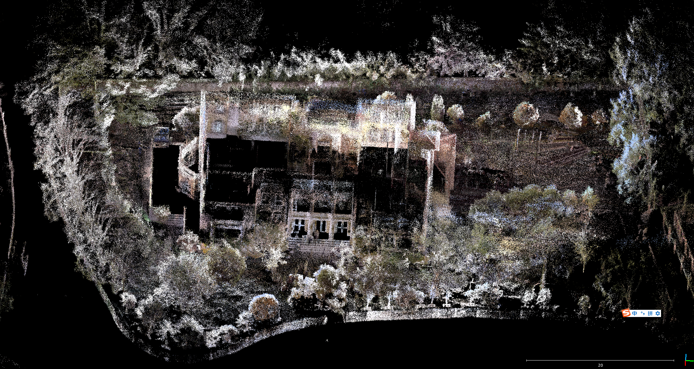


# 2. Fix 加入过曝区域处理，天空颜色过滤

```c++
int brightness = (color[0] + color[1] + color[2]) / 3;
if (brightness > 180) continue; // 太亮区域过滤（避免过曝）

bool likely_sky = (color[0] > 150 &&  // B 通道高
                   color[0] > color[1] + 20 &&    // B 明显高于 G
                   color[0] > color[2] + 40 &&    // B 明显高于 R
                   brightness > 100);               // 亮度中高

if (likely_sky) continue;
```

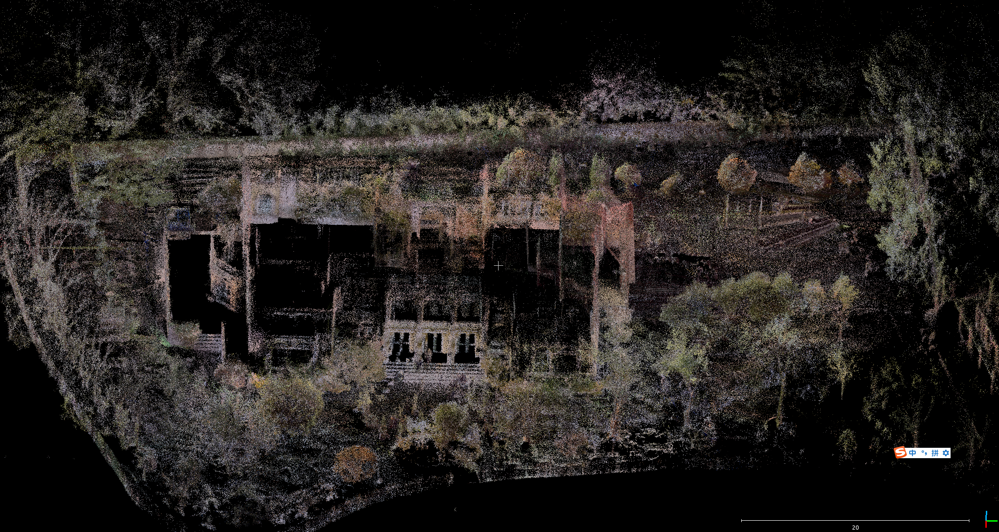


# 3. Fix 影响视觉效果的貌似是灰色的点和白色的点

```c++
int cmax = std::max({color[0], color[1], color[2]});
int cmin = std::min({color[0], color[1], color[2]});
int diff = cmax - cmin;
if (diff < 20) continue;
```

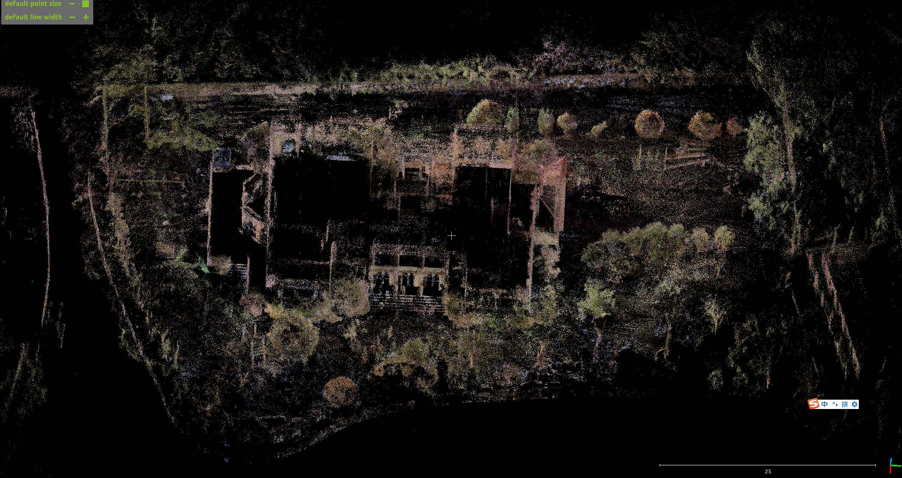

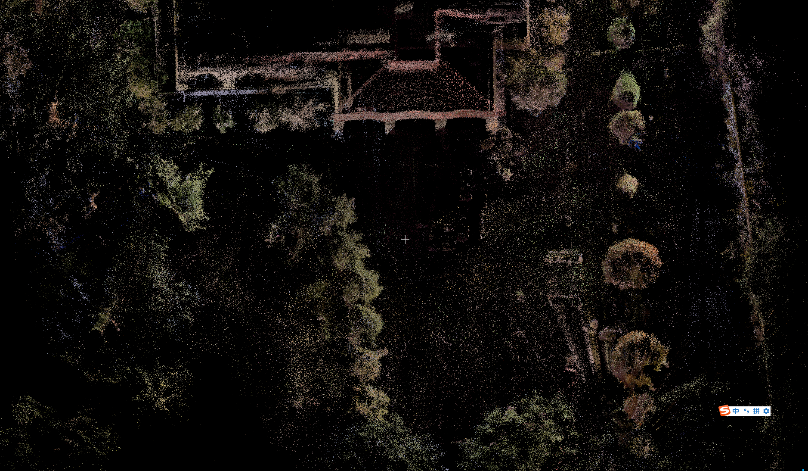

# 4. 发现了点云变稀疏了，不好看了，利用体素地图给真实的点上色。

遍历这个点周围 3\*3体素，如果有点的话，赋予成这些体素的平均值。

```c++
if (!valid_color && colorVoxmap_.hasNeighbors(pos, 2))
{
    col = colorVoxmap_.averageNeighborColor(pos, 2);
    if (!col.isZero(1e-6)) {
      valid_color = true;
    }
}
```

```java
bool hasNeighbors(const Eigen::Vector3f& p, int neighbor_size = 1) const {
    VoxelKey key = coordToKey(p);
    for (int dx = -neighbor_size; dx <= neighbor_size; ++dx)
        for (int dy = -neighbor_size; dy <= neighbor_size; ++dy)
            for (int dz = -neighbor_size; dz <= neighbor_size; ++dz) {
                VoxelKey nk = {key.x + dx, key.y + dy, key.z + dz};
                if (map_.find(nk) != map_.end()) return true;
            }
    return false;
}

Eigen::Vector3f averageNeighborColor(const Eigen::Vector3f& p, int neighbor_size = 1) const {
    VoxelKey key = coordToKey(p);
    Eigen::Vector3f color_sum = Eigen::Vector3f::Zero();
    int count = 0;
    for (int dx = -neighbor_size; dx <= neighbor_size; ++dx)
        for (int dy = -neighbor_size; dy <= neighbor_size; ++dy)
            for (int dz = -neighbor_size; dz <= neighbor_size; ++dz) {
                VoxelKey nk = {key.x + dx, key.y + dy, key.z + dz};
                auto it = map_.find(nk);
                if (it == map_.end()) continue;
                color_sum += it->second.avg_color();
                count++;
            }
    if (count == 0) return Eigen::Vector3f::Zero();  // 默认灰色
    return color_sum / static_cast<float>(count);
}
```

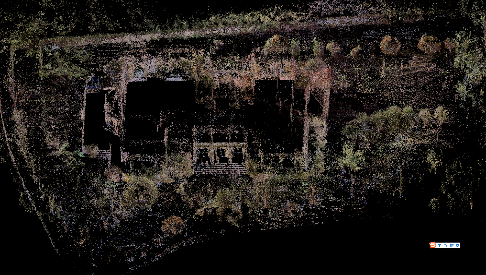

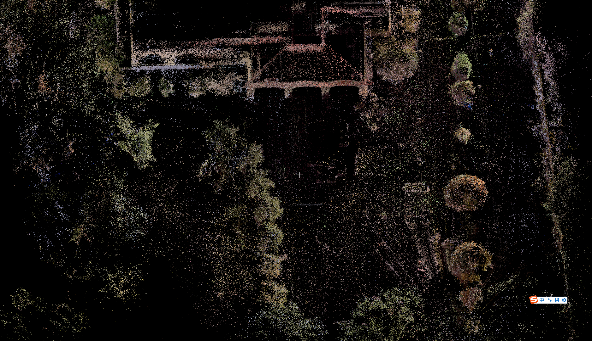

# 5. 给所有激光雷达点云上色。

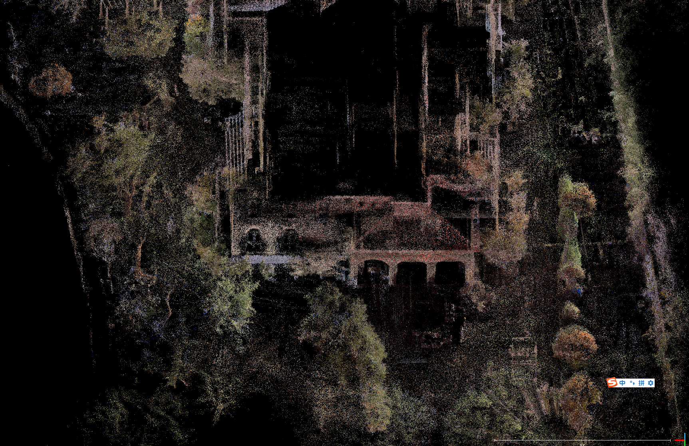

# 6. 补充颜色策略

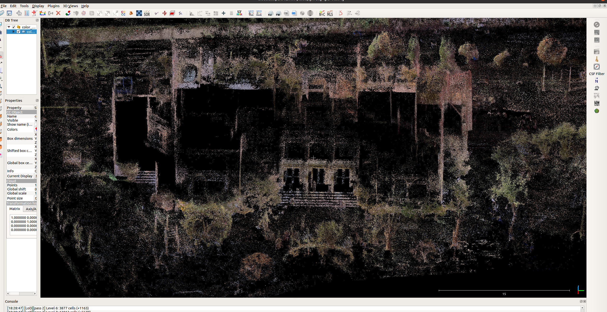

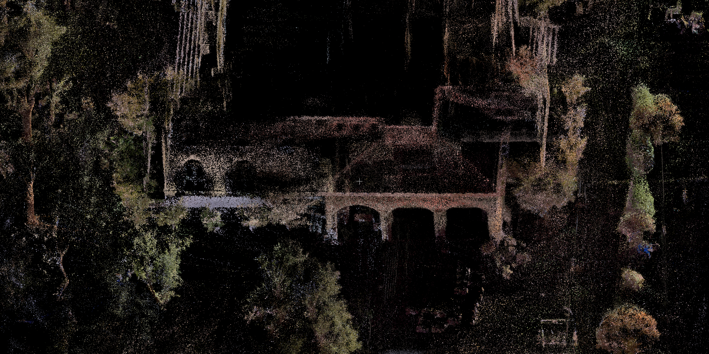


# 7. mesh效果

时间耗时：19：41 x86运行，19：44结束，峰值内存占用约6G，点云大小为 76.65MB。有两百万个点。效果不好，总之：

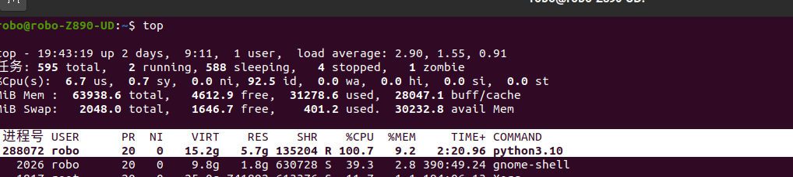

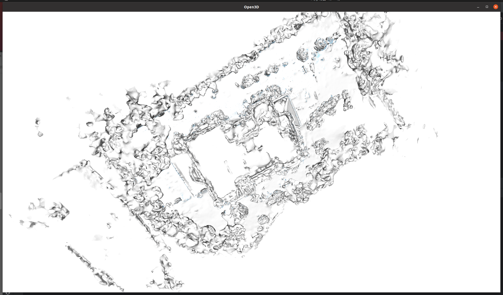

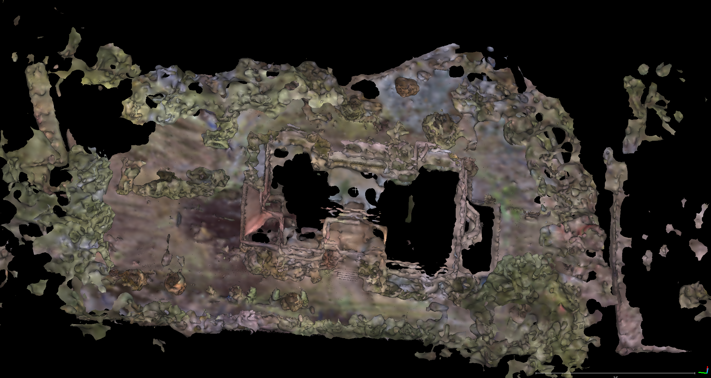

| 原因类别      | 详细解释                                                                                           |
| --------- | ---------------------------------------------------------------------------------------------- |
| 点云分布不规则   | 室外点云的密度极不均匀：地面区域点多、远处墙体稀疏、树叶和草地是“空心”结构。这会导致 Poisson 或 Alpha Shape 误以为这些“空隙”是实体表面，于是重建出一层“漂浮壳”。 |
| 法向难以统一    | 室外点云法向估计很困难：地面法向朝上、墙体法向水平、树木随机，结果 Poisson 在求解隐式场时出现法向相互抵消 → 出现泡状网格或孔洞。                         |
| 数据边界复杂    | 室外点云往往没有“封闭”边界（比如地面延伸到无限远），Poisson 会试图补齐这些“无限平面”，生成厚重的外壳。                                      |
| 光照和纹理变化   | 颜色映射时受阴影、曝光影响严重，Mesh 上色容易变得“花”“糊”“灰”。                                                          |
| 存在大量非刚性物体 | 植被、树叶、车、行人等都是非静态的，点云中存在局部漂浮或重影。Poisson 的隐式曲面会在这些地方“拉皮”导致异常连接。                                  |

首先，户外点云的空间密度往往不均匀。地面、建筑物等平面区域点较密，而远处或高空区域则非常稀疏，这种非均匀分布会导致网格生成时出现大面积的空洞或面片拉伸，难以形成连续表面。其次，户外环境中的树木、草丛等植被结构复杂且形态细碎。植被点云往往呈半透明状，表面法向分布混乱，算法难以判断表面走向，从而生成大量错误面片或碎裂的三角网。再次，户外场景的反射特性变化大。草地、水面、玻璃等区域的激光回波不稳定，会造成点云中存在大量强度噪声或孤立点，影响曲面拟合的稳定性。此外，户外场景通常存在动态物体，例如行人、车辆、飘动的树叶，这些点会导致局部空间结构不连续，生成的mesh表面会出现破损或悬浮现象。再者，户外点云受遮挡严重，同一位置的视角覆盖有限，导致法向估计不准确，而法向是Poisson或Marching Cubes等重建算法的关键输入，法向方向错误会直接导致面片翻转或畸变。最后，户外场景范围往往较大，体素数量极多。若直接对全局点云进行mesh重建，内存和计算量极高，容易出现内存溢出或重建失败。因此，mesh更适合在局部稠密、小范围、结构清晰的室内或物体级场景中使用，而不适合全局户外点云的直接重建。

# 8. 占用每个体素

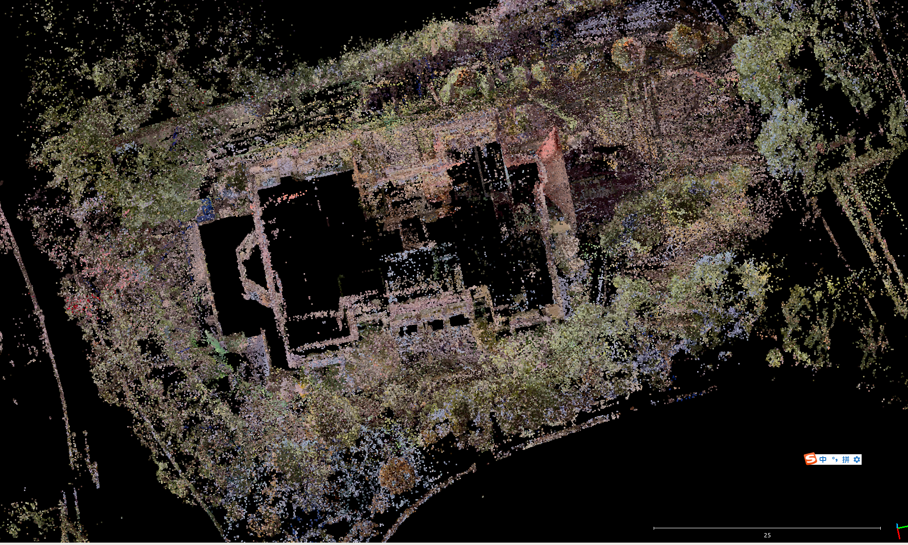

也不是很好看。


# 9. 数据集问题

测试拿推车采集的

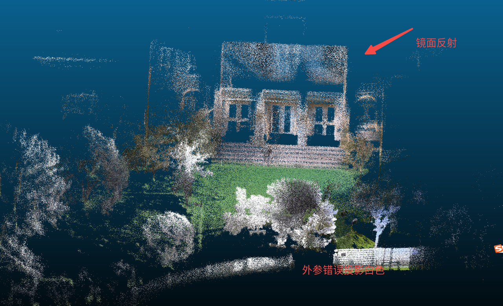

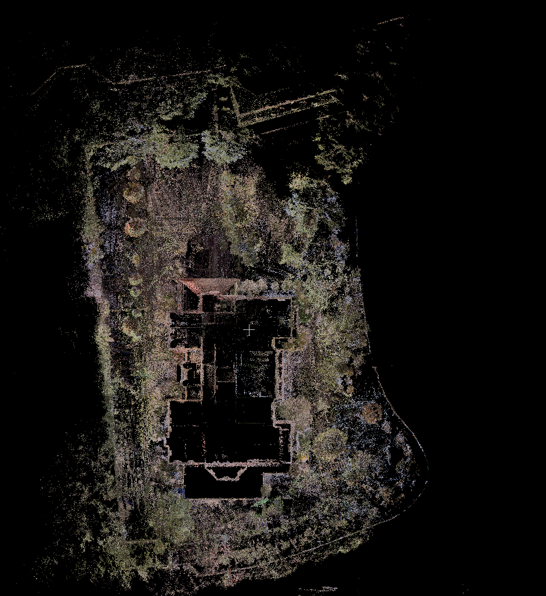

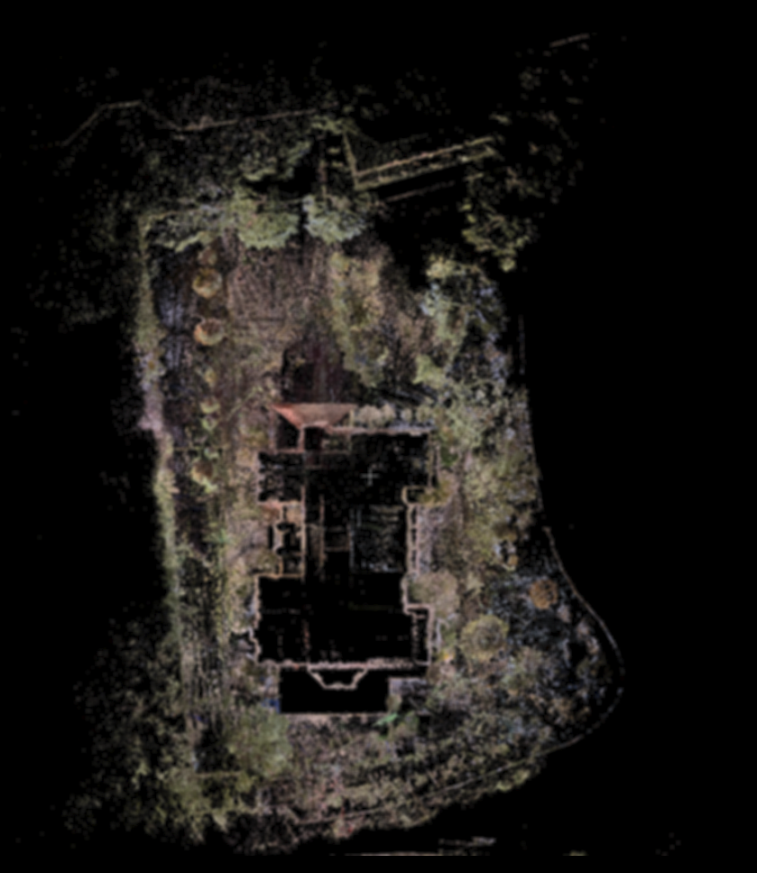

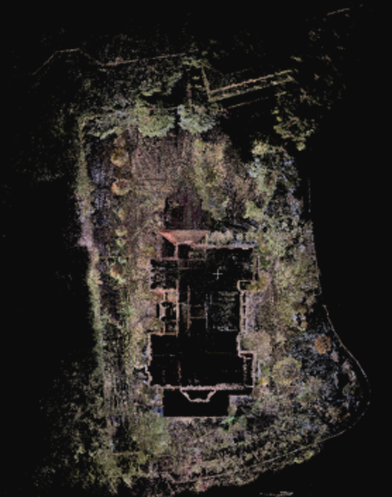

曲线救国，用opencv

```c++
#include <opencv2/opencv.hpp>
#include <iostream>

int main(int argc, char** argv)
{
    if (argc < 3) {
        std::cerr << "用法: ./smooth_like_eog input.png output.png" << std::endl;
        return -1;
    }

    // 读取图像
    cv::Mat img = cv::imread(argv[1], cv::IMREAD_COLOR);
    if (img.empty()) {
        std::cerr << "无法读取图像" << std::endl;
        return -1;
    }

    // --- Step 0: 轻度高斯预模糊（减少像素毛刺） ---
    cv::Mat preblur;
    cv::GaussianBlur(img, preblur, cv::Size(3, 3), 1.0);
    // 这个步骤可以显著减少后续步骤放大的毛刺

    // --- Step 1: 下采样（核心去颗粒步骤） ---
    cv::Mat down;
    double scale = 0.35;                    // 越小越平滑，可调：0.3~0.6
    cv::resize(preblur, down, cv::Size(), scale, scale, cv::INTER_AREA);

    // --- Step 2: 上采样（高质量重采样） ---
    cv::Mat up;
    cv::resize(down, up, img.size(), 0, 0, cv::INTER_CUBIC);
    // 更清晰可以试试：INTER_LANCZOS4

    // --- Step 3: 轻锐化增强（Unsharp Mask） ---
    cv::Mat blur, sharp;
    cv::GaussianBlur(up, blur, cv::Size(3, 3), 1.0);

    double alpha = 1.4;         // 锐化强度
    double beta  = -0.4;        // 反差增强
    cv::addWeighted(up, alpha, blur, beta, 0, sharp);

    // --- Step 4: 提亮亮度（可调） ---
    double contrast = 1.05;     // 对比度增强
    int brightness   = 12;      // 亮度偏移
    cv::Mat brightened;
    sharp.convertTo(brightened, -1, contrast, brightness);

    // 保存最终输出
    cv::imwrite(argv[2], brightened);

    std::cout << "完成：已生成（高斯预模糊 + eog 风格平滑 + 锐化 + 提亮）图像 → "
              << argv[2] << std::endl;

    return 0;
}
```
