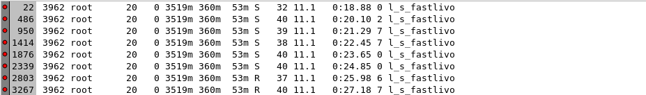
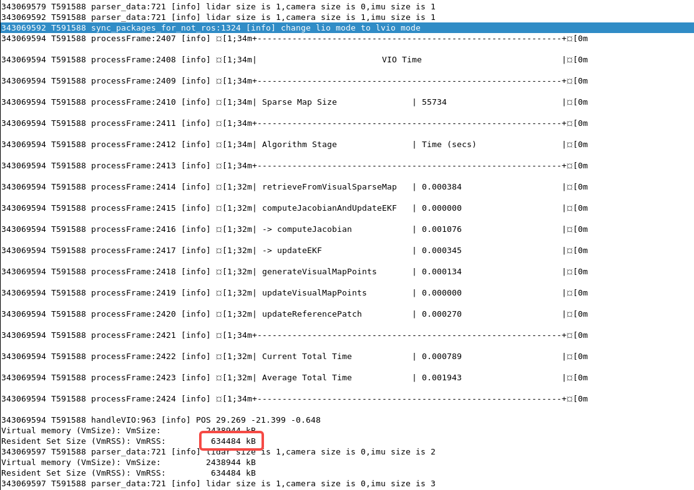
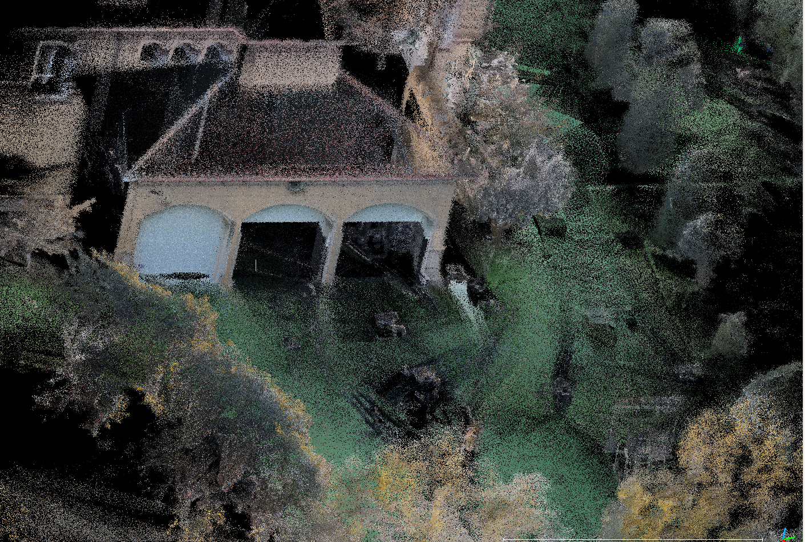
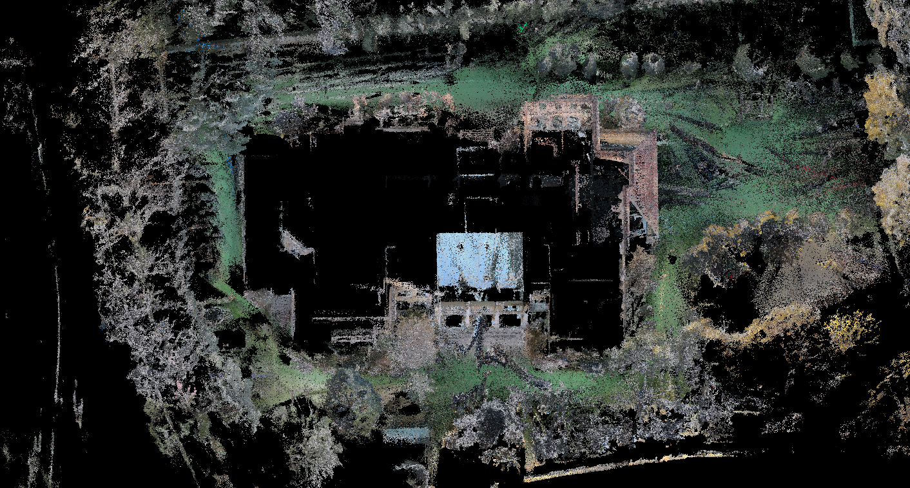
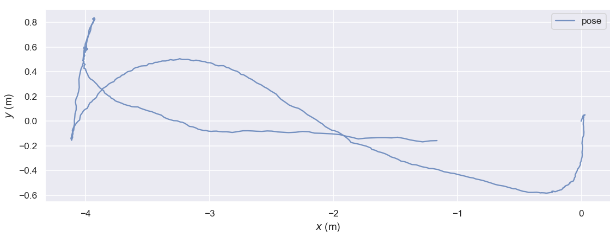
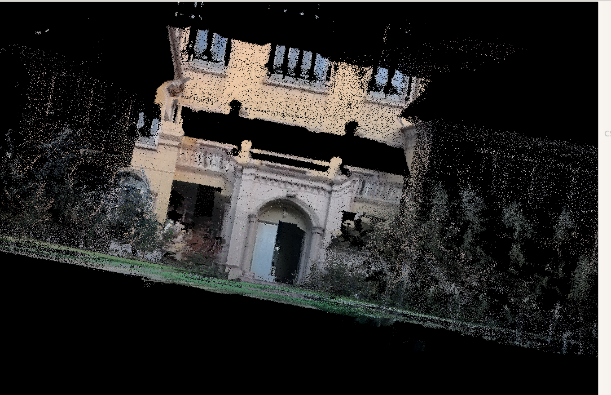
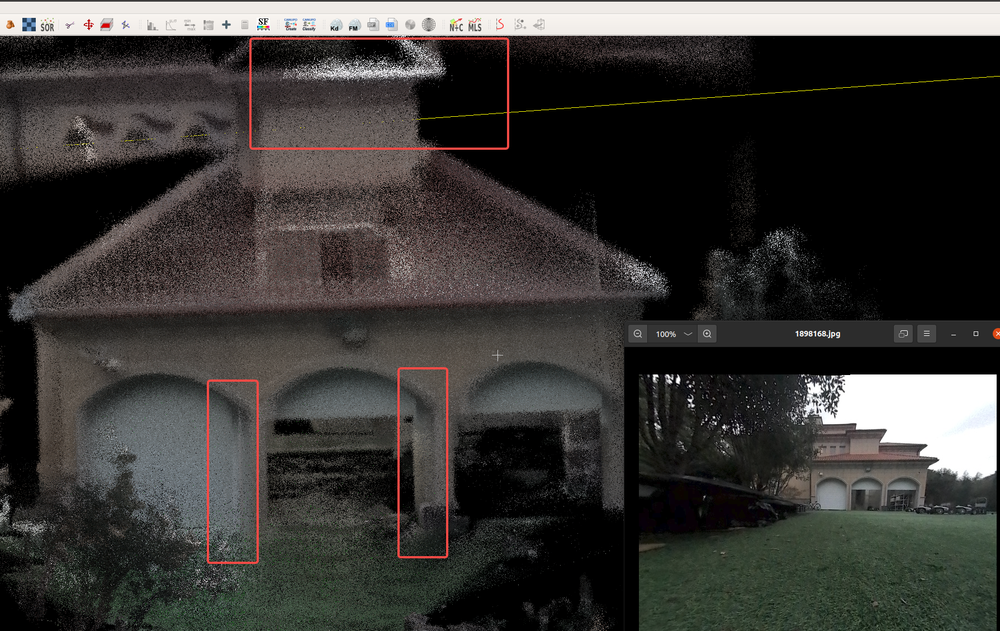

# FAST-LIVO2优化

# 1. CPU优化

## 1.1 背景

先前的代码中，CPU占用过高，75% - 90%，排查原因。

## 1.2 原因及解决

由于 plugins 侧传入的是 **YUV 格式图像**，若在接收阶段立即使用 OpenCV 的 `cvtColor` 将其转换为 **RGB 图像**，会产生显著的 **CPU 开销**；随后从 RGB 再转换为灰度图用于视觉追踪，同样会进一步占用计算资源。然而，在点云赋色阶段，我们又必须依赖 **RGB 颜色信息**，这就造成了实时性与算力之间的矛盾。

降低前端计算压力，采用入选策略：系统在接收到一帧 YUV 图像时，不再立即进行完整的 YUV→RGB 转换，而是 **直接提取 Y 通道作为灰度图**用于视觉追踪，从而显著降低实时阶段的 CPU 负载。在点云赋色环节，则 **暂时保存原始 YUV 值**，无需即时转成 RGB；待机器人停止运行或系统处于空闲状态时，再异步触发批量执行 **YUV→RGB 的后处理**，完成最终的彩色点云渲染。

CPU降下来了。

# 2. 乱开线程问题原因及优化

## 2.1 背景

代码里没有开线程的运算，但是从top上看貌似开了好多线程在算。

## 2.2 原因及解决

使用 gdb break pthread\_create在x86进行调试，x5验证。

A. 发现log\_parser开线程再算

B. cvtColor 偷偷开线程算

C. cv::cvtColor 偷偷开线程 BGR → Gray 转换。

## 2.3 结论

pc端opencv和log\_parser偷偷开线程计算。代码优化后，不使用 opencv 进行图像转换。上机检测，问题修复。

# 3. 仿真与机器上跑内存不符合

## 3.1 背景

在 x86 和 x5平台，内存使用量不符合，跑外场60栋 7200 平大数据时，pc占用内存 3G，x5板端内存占用 500MB，很奇怪，需要排查。

## 3.2 机器表现

算法每处理一帧 IMU 后打印内存消耗量，发现pc端有个很奇怪的现象：

由于原始算法并未支持 LVIO 与 LIO 模式动态切换，在实际上机过程中相机会频繁开启和关闭，导致系统在两种模式之间不断往返，因此需要在 LVIO→LIO 时执行视觉地图的重置。同时，为了降低视觉地图长期占用的内存设计了基于 LRU 的清理策略，希望在 reset VIO 模块或重置体素地图后能够释放大量空间。但在实际运行中可以观察到：即使对象被正确删除，进程的内存占用却并未下降，只是在一段时间内保持不再增长。这并不是内存泄漏，而是 glibc 默认的内存管理策略所致——释放的内存并不会立即归还给操作系统，而是进入 glibc 的内部 arena，当存在碎片化或块大小不合适时，RSS 会保持不变。尤其 SLAM 系统中存在大量小对象（Feature、Patch、VoxelPoints、Eigen 缓冲等），再加上多线程导致多个 arena，使得内存更难以自动收缩。为解决该现象，执行`malloc_trim()` 代码后，glibc 会强制尝试将未使用的连续空闲区域真正归还给操作系统，因此 RSS 会立即下降。最终证明：算法逻辑本身没有泄漏，只是 glibc 的内存池未主动释放，通过显式调用 `malloc_trim()` 即可有效回收内存。

# 4. 算法效果优化

## 4.1 染色优化

让测试密集扫描，共采集数据两组，效果如下：

| 场景          | 整个外场60栋。                                                                                                                                                                                                                                                  |
| ----------- | --------------------------------------------------------------------------------------------------------------------------------------------------------------------------------------------------------------------------------------------------------- |
| 点云文件 & 轨迹文件 |                                                                                                                                                                                                                                                           |
| 走法          | IMU丢帧。无法走回终点。                                                                       |
| 点云染色效果      |  |
| 问题          | 人太多，有鬼影。                                                                                                                                                                                                                                                  |
| 内存占用        | 点云占了 440 兆，算法内存才占了 1.2GB。                                                                                                                                                                                                                                 |

| 场景     |                                                                                                                                                                        |
| ------ | --------------------------------------------------------------------------------------------------------------------------------------------------------------------------------------------------------------------------------------------------------- |
| 走法     |                                                                                                                                                                        |
| 点云染色效果 |  |
| 问题     | 貌似pitch角有问题。                                                                                                                                                                                                                                              |

| 场景   | 外场60栋，傍晚，颜色不太鲜艳。                                                                                              |
| ---- | ------------------------------------------------------------------------------------------------------------------------------------------------------------------------------------------------ |
| 点云效果 |                                                                                                               |
| 路线   |                                                                                                               |
| 问题   | 标定还是有点小问题？？ yaw和pitch貌似有问题 |

## 4.2 功能优化

原算法不支持 LVIO 和 LIO 模式切换，但是上机时相机会频繁开启关闭导致算法飘。

FIX。目前策略是相机关闭且LIO模块并 reset VIO模块，相机再次开启重新启动VIO。
