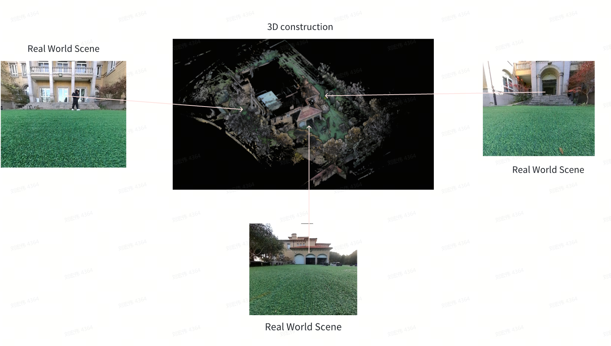
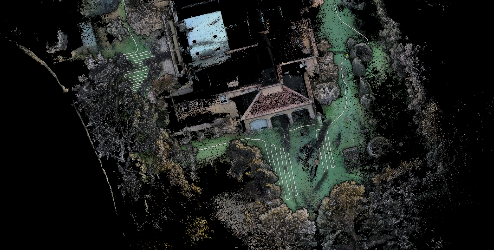
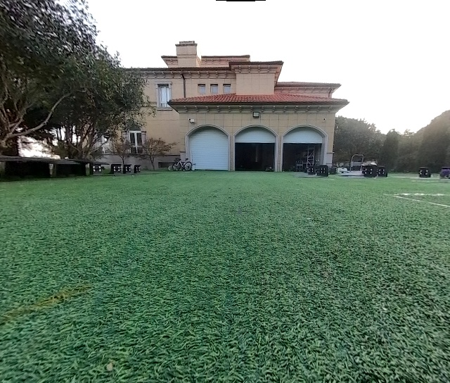
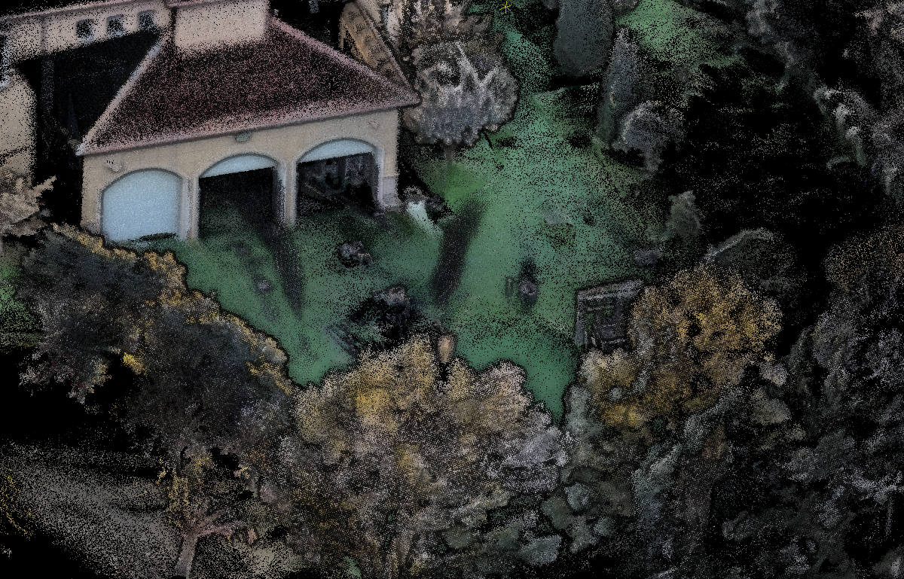
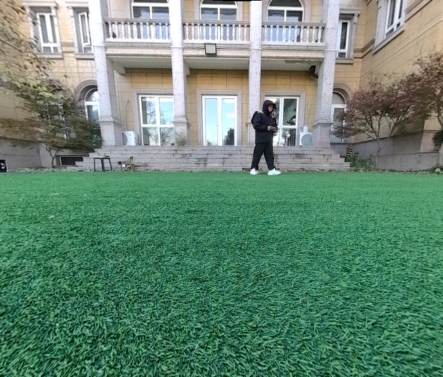
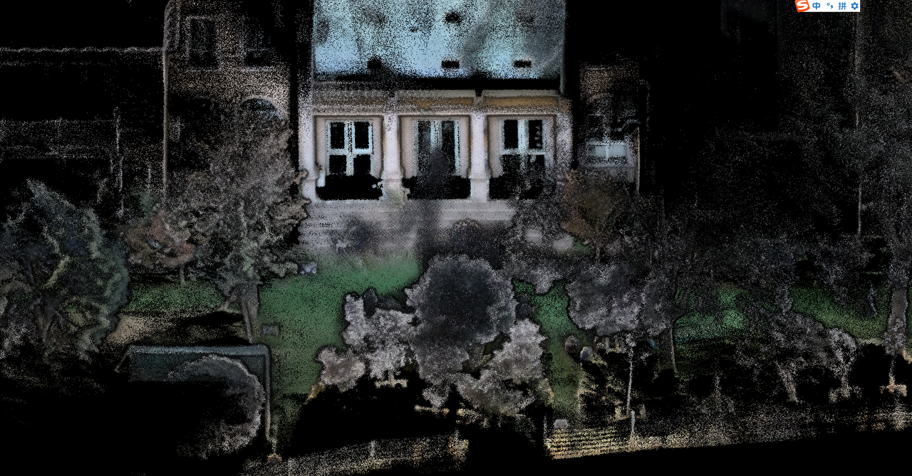
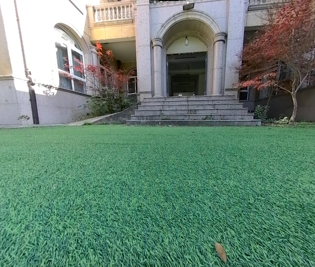

# 割草机全景地图预研功能简介

# 一、功能简介

近期定位组针对**割草机激光项目**（Versa）上，全景地图展示功能进行了技术预研，可提升用户在地图交互、避障展示上的用户体验。

核心功能特性包括：

* **3D地图**：利用激光点云进行三维重建，构造三维地图展示，替代传统的平面二维地图

* **点云赋色**：为激光点云赋予场景颜色信息，贴近真实世界视觉效果

* **点云增强**：基于图像渲染增强点云的深度效果，使地图呈现更加立体和清晰

# 二、Demo效果

| 实际场景                                                                                                   | 重建场景                                                                                                                                                                                                                                                          |
| ------------------------------------------------------------------------------------------------------ | ------------------------------------------------------------------------------------------------------------------------------------------------------------------------------------------------------------------------------------------------------------- |
| （外场60栋全景 + 割草路线可视化） | GIF： |
|                    |                                                                                                                                                                            |
|                    |                                                                                                                                                                            |
|                    |                                                                                                                                                                            |

# 三、未来工作

* 雷达-相机标定工&#x4F5C;**（已完成）**

* APP显示支持EDL渲染器

  * 手机端开源代码：[ EDL shader 原理&调研](https://roborock.feishu.cn/wiki/ZhtAwVlkhiiWuWkku8NcOPHXncc)

* 地图传输功能

* 不做定位，使用slam定位的pose做后续的处理，减少cpu占用，同时保证和定位的结果一致。

* ……

# 四、风险项

* app渲染难度（同时保证丝滑和清晰）

* 地图大，传输时间长，流量消耗多

  * 外场60栋全景为例，彩色体素地图pcd占 452.3 MB（实际算法存储点有数据结构，实际体素地图会更大）

* 算力、内存需求多

  * 内存占用： 总占用为 1.2 G

  * CPU占用：上机单核 60%

* 地图花风险

* 目前建图不工作，割草的时候工作

  * 建图的时候只走一圈，重建点云地图的效果很差，不好看。

  * 割草的时候来回视角比较丰富，效果会更好一些。

* 与激光的线数相关，低端激光效果可能不好

