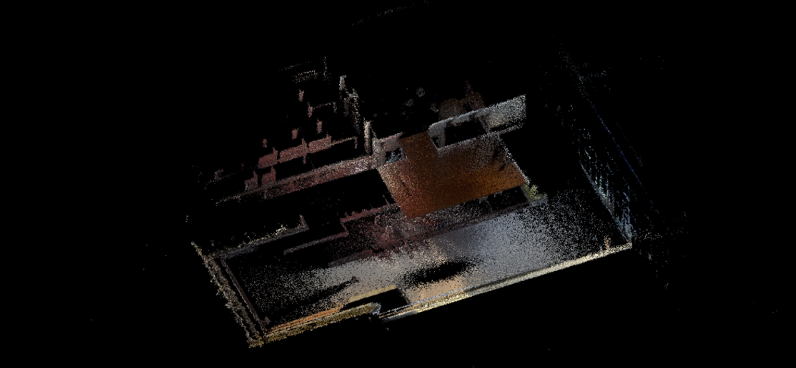
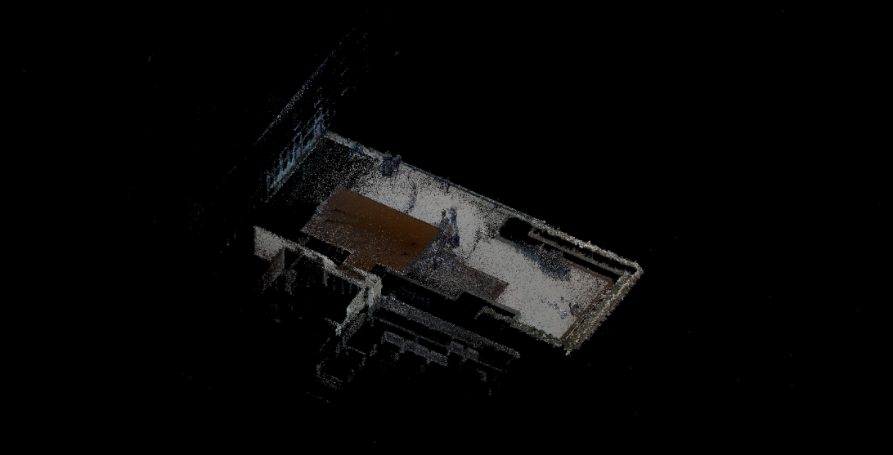
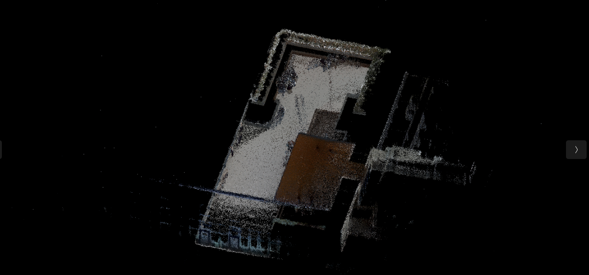
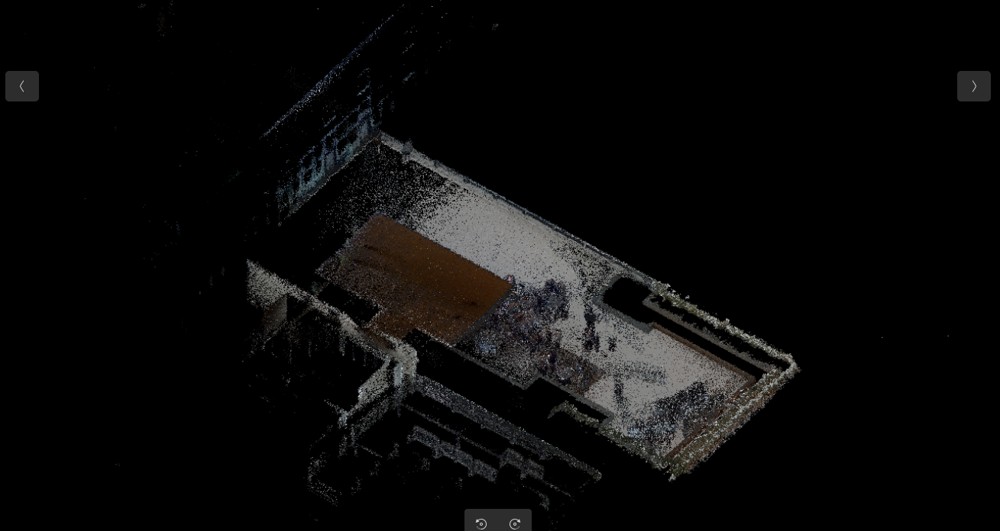
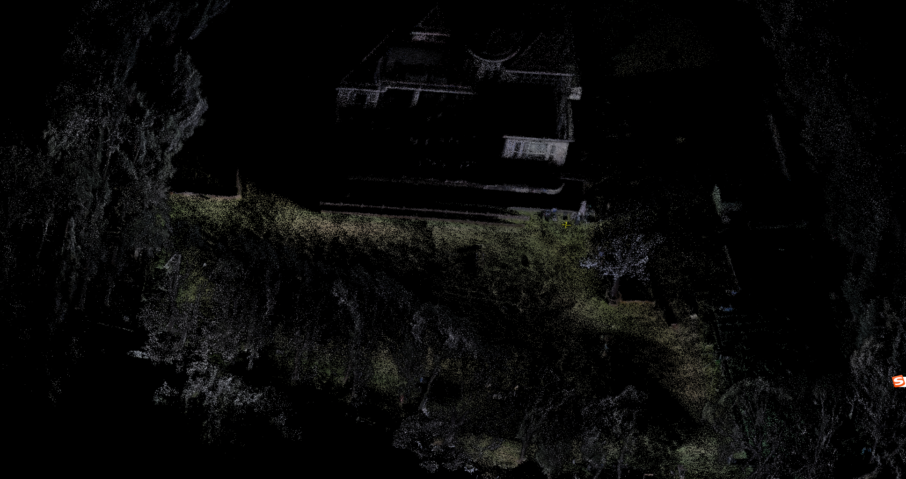
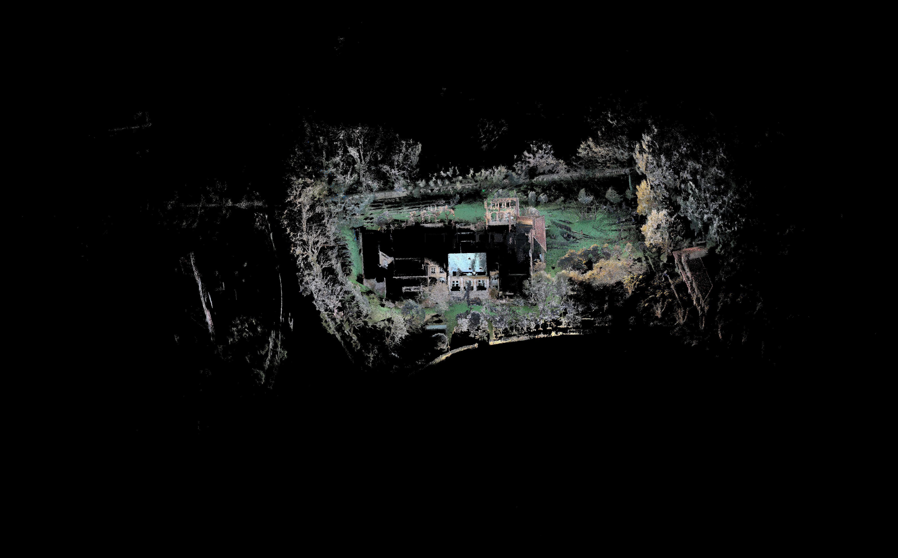

# FAST-LIVO2 存图及使用时机

# 1. 存图地址

/mnt/data/rockrobo/devtest/color\_voxel\_map\_ascii.pcd


# 2. 存图策略

```plain&#x20;text
typedef enum {
  SLAM_FSM_UNKNOWN = 0,
  SLAM_FSM_MAP     = 1,
  SLAM_FSM_MOW     = 2,
  SLAM_FSM_DOCK    = 3,
  SLAM_FSM_CHARGE  = 4
} rock_machine_state_t;
```

割草时 SLAM\_FSM\_MOW 启动彩色点云建图。（**发现的问题：在割草过程中未接收到状态机的割草状态信息。与 @王新 确认后发现，该信息在 controller 初始化之前就已发送，因此当前流程中无法被使用。临时方案：使用 SET\_SLAM\_MODE 作为彩色点云建图的起始触发时间。**）

回充时 SLAM\_FSM\_DOCK停止彩色点云建图。

上电时 SLAM\_FSM\_CHARGE开始处理彩色点云。


* 写入是“单文件追加分块”：

  * 每次写一个 PCD chunk（带完整 header + binary 数据）

  * 第一个 chunk 用 trunc 覆盖旧文件，后续 chunk 用 app 追加

* chunk 大小是 16KB 缓冲策略：POINTS\_PER\_PATCH = 16\*1024 / sizeof(PointXYZRGBPacked)，PointXYZRGBPacked 是 16 字节，所以约 1024 点/chunk。不断写入到一个文件里。

* 这个pcd文件每次建图 / 割草都会被清空。


# 3. 测试结果

测试使用 Versa 机器，标定文件采用量产标定结果。

| 序号 | 点云pcd文件 | 视频 | 转换为图片的pcd                                                                           | 全流程 |
| -- | ------- | -- | ----------------------------------------------------------------------------------- | --- |
| 1  |         |    |  | 无死机 |
| 2  |         |    |  | 无死机 |
| 3  |         |    |  | 无死机 |
| 4  |         |    |  | 无死机 |

1000平米建图：

| 建图 |  |
| -- | ----------------------------------------------------------------------------------- |
| 割草 | 雷达断流导致LIO / VIO建图异常引发内存持续增长，最终触发 OOM。当前策略为：一旦检测到断流，立即保存当前地图并执行系统重置。                 |

# 4. 转化pcd为图像的代码

这个程序的作用是：把输入的三维彩色点云按照指定的观察角度“拍成”一张二维图片，过程中会把空间中的点投影到一个平面上，并只保留离视角最近的点来避免遮挡错误，最终生成一张可以直观查看点云结构和质量的图像。**从斜上方（45°），再偏一个侧方向（70°）看点云。**

小例程：

```c++
#include <iostream>
#include <string>
#include <cmath>
#include <pcl/io/pcd_io.h>
#include <pcl/point_types.h>
#include <opencv2/opencv.hpp>

// 三维向量工具
struct Vec3 { float x, y, z; };
Vec3 normalize(Vec3 v) {
    float len = std::sqrt(v.x*v.x + v.y*v.y + v.z*v.z);
    return {v.x/len, v.y/len, v.z/len};
}
Vec3 cross(Vec3 a, Vec3 b) {
    return {a.y*b.z - a.z*b.y, a.z*b.x - a.x*b.z, a.x*b.y - a.y*b.x};
}
float dot(Vec3 a, Vec3 b) { return a.x*b.x + a.y*b.y + a.z*b.z; }

int main(int argc, char** argv)
{
    if (argc < 3) {
        return -1;
    }

    const std::string pcd_path   = argv[1];
    const std::string img_path   = argv[2];
    const float resolution       = (argc >= 4) ? std::stof(argv[3]) : 0.05f;
    const float padding          = (argc >= 5) ? std::stof(argv[4]) : 5.0f;
    const float azimuth_deg      = (argc >= 6) ? std::stof(argv[5]) : 70.0f;
    const float elevation_deg    = (argc >= 7) ? std::stof(argv[6]) : 45.0f;

    const float az  = azimuth_deg   * M_PI / 180.0f;
    const float el  = elevation_deg * M_PI / 180.0f;

    // 视线方向（从相机指向场景）
    Vec3 view_dir = {
        std::cos(el) * std::cos(az),
        std::cos(el) * std::sin(az),
       -std::sin(el)
    };

    // 世界"上"方向：elevation=90时退化，用Y轴保底
    Vec3 world_up = (elevation_deg > 89.0f) ? Vec3{0, 1, 0} : Vec3{0, 0, 1};

    // 相机坐标轴
    Vec3 cam_right = normalize(cross(view_dir, world_up)); // 图像水平方向
    Vec3 cam_up    = normalize(cross(cam_right, view_dir)); // 图像垂直方向（向上）

    std::cout << "View dir : (" << view_dir.x << ", " << view_dir.y << ", " << view_dir.z << ")\n";
    std::cout << "Cam right: (" << cam_right.x << ", " << cam_right.y << ", " << cam_right.z << ")\n";
    std::cout << "Cam up   : (" << cam_up.x    << ", " << cam_up.y    << ", " << cam_up.z    << ")\n";

    // 读取彩色点云
    pcl::PointCloud<pcl::PointXYZRGB>::Ptr cloud(new pcl::PointCloud<pcl::PointXYZRGB>);
    if (pcl::io::loadPCDFile<pcl::PointXYZRGB>(pcd_path, *cloud) == -1) {
        std::cerr << "Failed to load PCD file: " << pcd_path << std::endl;
        return -1;
    }
    std::cout << "Loaded " << cloud->size() << " points." << std::endl;

    // 第一遍：计算投影后的UV范围
    float u_min =  std::numeric_limits<float>::max();
    float u_max = -std::numeric_limits<float>::max();
    float v_min =  std::numeric_limits<float>::max();
    float v_max = -std::numeric_limits<float>::max();

    for (const auto& pt : cloud->points) {
        if (!std::isfinite(pt.x) || !std::isfinite(pt.y) || !std::isfinite(pt.z)) continue;
        Vec3 p = {pt.x, pt.y, pt.z};
        float u = dot(p, cam_right);
        float v = dot(p, cam_up);
        u_min = std::min(u_min, u); u_max = std::max(u_max, u);
        v_min = std::min(v_min, v); v_max = std::max(v_max, v);
    }

    // 加边距
    u_min -= padding; u_max += padding;
    v_min -= padding; v_max += padding;

    const int width  = static_cast<int>((u_max - u_min) / resolution) + 1;
    const int height = static_cast<int>((v_max - v_min) / resolution) + 1;
    std::cout << "Image size: " << width << " x " << height << std::endl;

    // 创建图像和深度缓冲（沿视线方向，值越小越靠近相机，优先显示）
    cv::Mat image(height, width, CV_8UC3, cv::Scalar(0, 0, 0));
    cv::Mat depth_buf(height, width, CV_32FC1,  std::numeric_limits<float>::max());

    // 第二遍：投影并填充图像
    for (const auto& pt : cloud->points) {
        if (!std::isfinite(pt.x) || !std::isfinite(pt.y) || !std::isfinite(pt.z)) continue;
        Vec3 p = {pt.x, pt.y, pt.z};
        float u     = dot(p, cam_right);
        float v     = dot(p, cam_up);
        float depth = dot(p, view_dir); // 沿视线的深度

        int col = static_cast<int>((u - u_min) / resolution);
        int row = static_cast<int>((v - v_min) / resolution);

        if (col < 0 || col >= width || row < 0 || row >= height) continue;

        // 深度更小（更靠近相机）的点覆盖后面的点
        if (depth < depth_buf.at<float>(row, col)) {
            depth_buf.at<float>(row, col) = depth;
            image.at<cv::Vec3b>(row, col) = cv::Vec3b(pt.b, pt.g, pt.r);
        }
    }

    // V轴翻转（图像坐标Y朝下，相机up朝上）
    cv::flip(image, image, 0);

    if (!cv::imwrite(img_path, image)) {
        std::cerr << "Failed to save image: " << img_path << std::endl;
        return -1;
    }
    std::cout << "Saved image to: " << img_path << std::endl;
    return 0;
}
```

使用上述代码将点云转换为图片。



