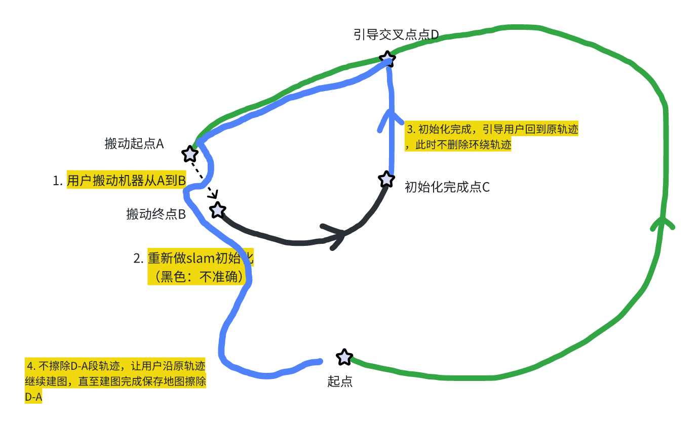
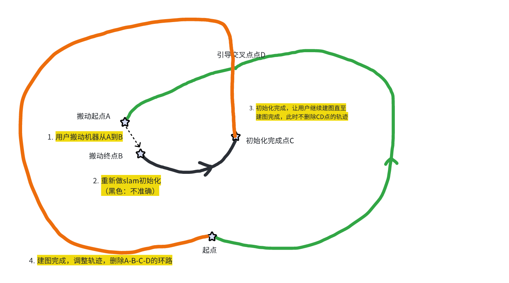

# RTK机器建图中搬动，恢复建图方案

# **一、背景**

目前在遥控建图过程中，搬动机器会触发搬动重定位，而建图中无法做重定位动作，所以会报建图失败。

在建图中搬动机器后，需要恢复建图的方案。

# **二、方案**

1. 专利风险 &#x20;

2. 优先草坪边界，考虑禁区/通道边界

3. 其他方法

   1. 地图合并

   2. 轨迹的融合，不擦除原轨迹，把新轨迹和原轨迹合并到一起

