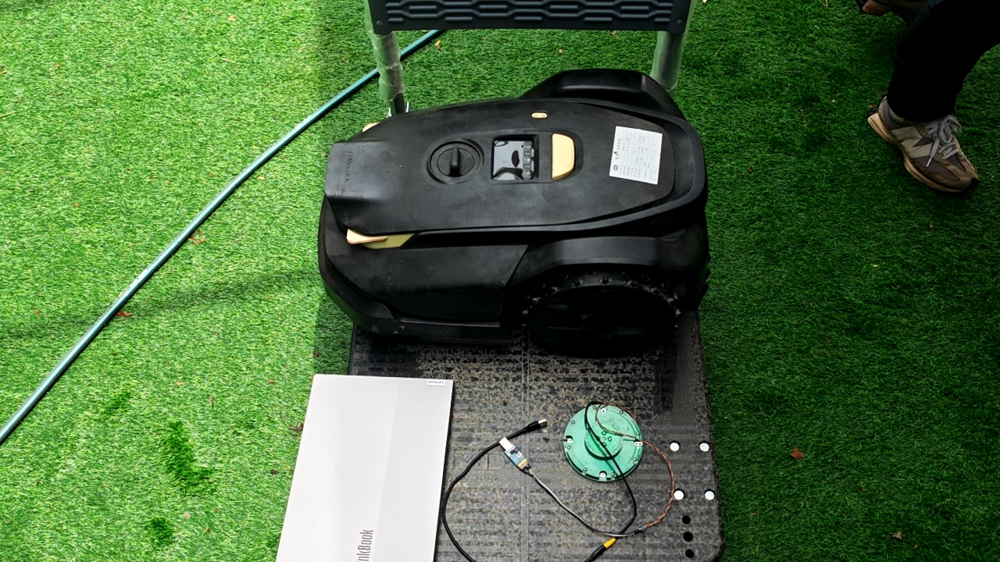
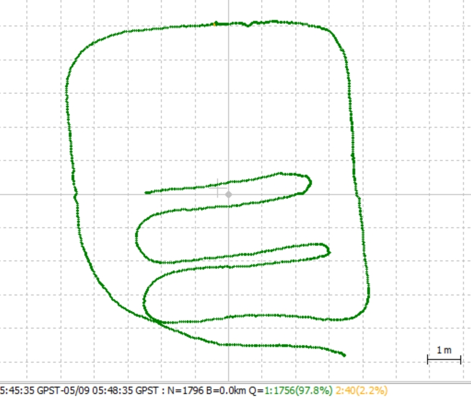

# RTK模块测试

【测试目的】：验证MK2输出的RTK-非固定解数据，是模组问题还是整机线束影响的原因

【测试方案】：将RTK单模组（先使用MK1的RTK模组，之前毅超和张赛操作过，如图：）连着电脑一起跑，和割草机机器(轮子一直转动) 放在小车上，同步采集数据，看两组数据是否一致

如果徐成可以提供MK2的RTK模组相关线束，可再使用MK2的RTK模组进行一次测试

【数据分析】：整机RTK全程为固定解，MK1的RTK模组固定解占比97.8%，非固定解集中在最上方中央

【测试结论】：针对这组数据，整机的RTK表现比RTK单模块要好一点点（2.2%）

参考资料：

分析：RTKplot

采集：Myport

如果使用UPrecise，使用教程： https://www.bilibili.com/video/BV1XF4m1j7p9/?vd\_source=aac48a6abb02ab402a2778ce84c730ac
