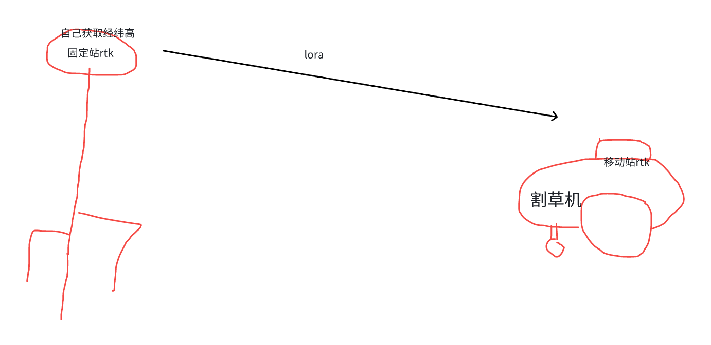
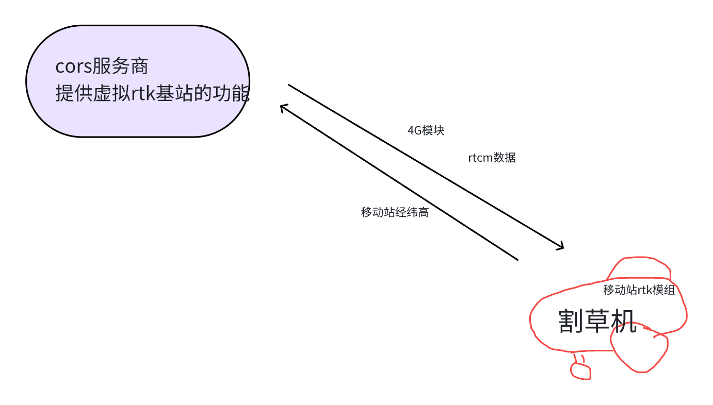

# GAIA三种rtk模式

| 叫法         | rtk模组个数               | lora（无线电） | 4G流量 | cors服务 | 延时         | 费用                    |
| ---------- | --------------------- | --------- | ---- | ------ | ---------- | --------------------- |
| 1+1rtk（先用） | 2个（一个做rtk固定站，一个在割草机上） | 有         | 无    | 无      | lora的延时    | 多一个rtk模组              |
| 主机nrtk     | 1个（割草机上）              | 无         | 有    | 有      | 4G的延时      | 流量费用+cors服务           |
| 桩nrtk      | 1个（割草机上）              | 有         | 无    | 有      | lora+4g的延时 | esp32 硬件费用（很低）+cors费用 |

# 1  1+1 rtk

&#x20; &#x20;

# 2 4G nrtk

# 3 桩rtk

