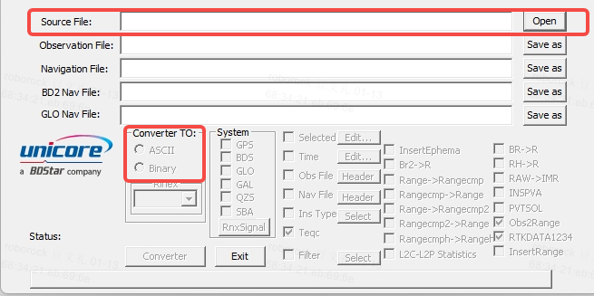
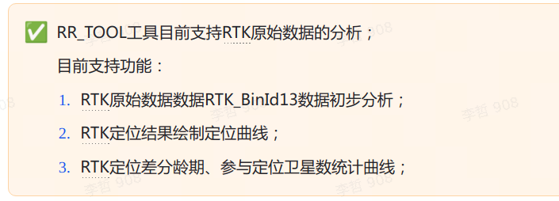

# RTK debug日志分析工具

# 1. 工具

1. 下载割草机日志，包含RTK\_binId13

2. 在win系统下使用下面工具：

   1. 用法：

   

3. 单点解与RTK解对比脚本：

   1. 增加tools下面的地址

# 2. 驱动工具

[ RR\_TOOL分析RTK数据使用方法](https://roborock.feishu.cn/docx/RmYPdday4odCKXx8436cd54Nn7b)
