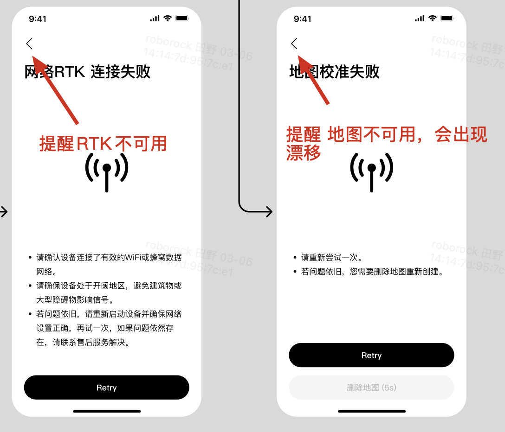
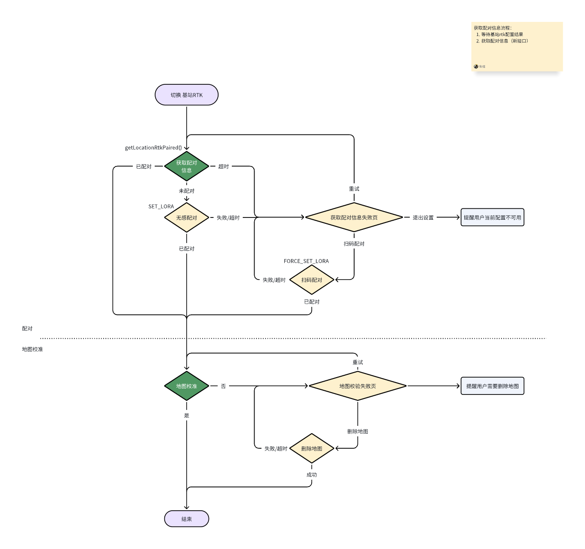
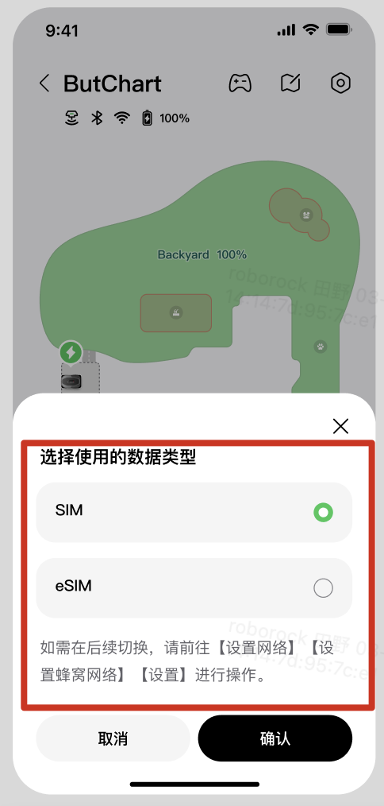
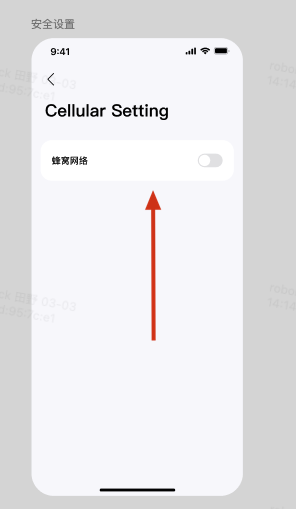
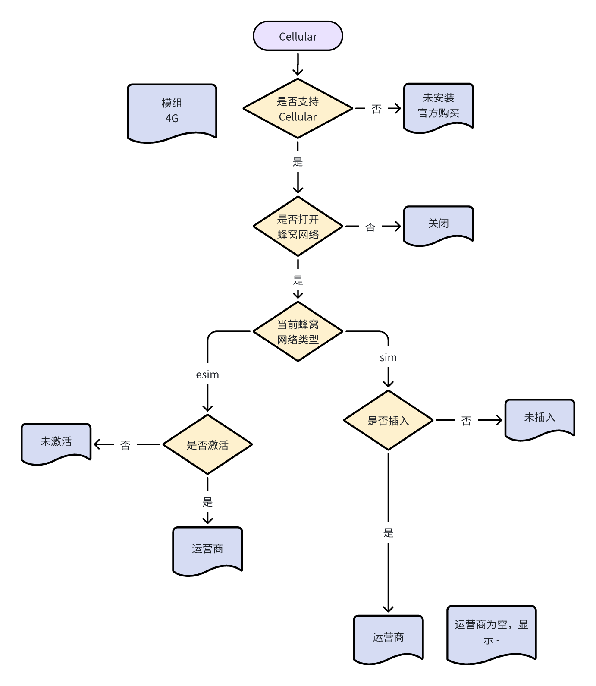
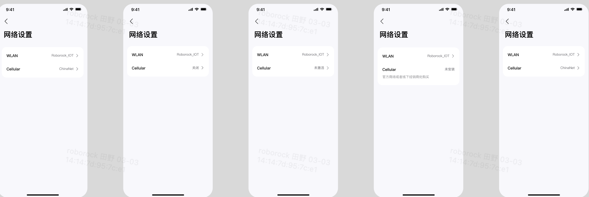
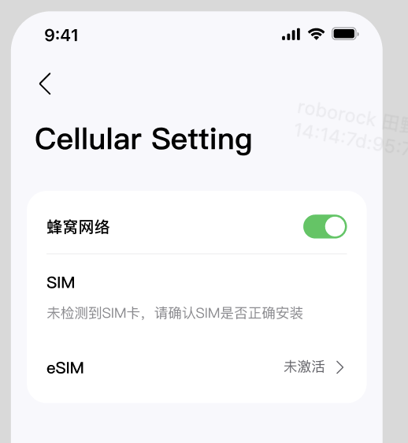
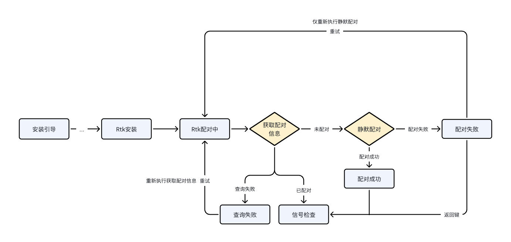

# 1. NRTK & 实体Sim卡 & Lora需求梳理

# 1. NRTK

* 接口

  1. 获取地图校对信息 -- 吉莉、朱榕&#x20;

  2. 获取当前定位模式     -- getUserConfig 增加字段

  3. 切换到 网络RTK

     1. 增加 连接网络RTK 接口 &#x20;

        1. 连接结果  -- 广播

           1. 超时/失败，进入网络连接失败页

           2. 成功，进入校准

     2. 增加 地图校准 接口  &#x20;

        1. 地图检准结果 --- 广播 超时1min

           1. 超时/校准失败 ，进入地图校准失败页

           2. 校准成功， 进入步骤 3

     3. 增加 插件端 切换定位模式   -- switchRtkLocationModel()

     

  

  * 切换到 基站RTK

    1. 增加 获取配对信息 接口   -- getLocationRtkPaired()&#x20;

       1. 配对信息 --- 广播/轮询 超时1min

          1. 若已配对，进入 地图校准

          2. 若未配对，进入 无感配对流程

          3. 超时，进入配对失败页

       2. 执行无感配对流程

          1. 配对成功，进入 地图校准

          2. 配对失败，进入 配对失败页

             1. 重试，执行步骤2

             2. 扫码配对，强制配对

                1. 配对成功，进入 地图校准

                2. 配对失败，进入 配对失败页

    2. 增加 地图校准 接口  &#x20;

       1. 地图检准结果 --- 广播 超时1min

          1. 超时/校准失败 ，进入地图校准失败页

          2. 校准成功， 进入步骤 3

    3. 增加 插件端 切换定位模式   -- switchRtkLocationModel()

    

* 网络电离层覆盖 - 网站 <https://console.euc1-prod.truepoint.io/global.html#/>

* 删除地图后，重新进入地图校准  -- 已确认 -->> 直接发送切换定位模式指令

* 切换 定位模式流程中，插件退出或者app关闭，固件流程如何中止？   -- 已确认

* 安装引导 -- 网络RTK配对？？？

# 2. 实体Sim卡

1. 接口 -- &#x20;

   1. 检测到用户安装了实体Sim卡  -- 广播通知 -- >> 机器人消息 &#x20;

   2. 获取Sim卡信息--- getESimInfo  复用当前接口

      1. 信号强度 使用哪个字段？   与ESIM一致

   3. ~~获取当前设置蜂窝网络类型~~：eSim & sim  ---  getUserConfig()    复用当前接口

   4. ~~蜂窝网络是否打开~~：复用网络优先级逻辑，Wifi & 4G是 打开状态 仅wifi 为关闭状态

   5. ~~设置蜂窝网络类型~~：复用网络优先级逻辑 ，打开时，增加返回 sim/esim信息及 蜂窝类型 &#x20;

   6. ~~sim 卡 是否安插入~~ -- getUserConfig 增加字段 &#x20;

   7. ~~是否支持 Sim卡 ~~--  getUserConfig 增加字段  &#x20;

2. ~~网络优先级切换 功能去除，相关接口不再调用 ~~

3. ~~**eSim 激活后，默认打开蜂窝网络。**~~

   1. 插件端向固件端发送打开蜂窝的指令，仅下发指令，不关心结&#x679C;**。 &#x20;**

   2. 激活后，若是返回到网络设置页，插件端主动重新获取 蜂窝网络状态 （与刷新逻辑一致）。&#x20;

4. 选择 Sim和eSim 弹窗的触发条件 --- 修改为机器人消息，点击后，显示 弹窗 &#x20;

* 由关闭到打开状态，蜂窝网络的返回的类型是上次设置的类型。若是首次，默认为ESim。 &#x20;

* ~~网络设置 Celluar 显示逻辑 ~~&#x20;

蜂窝网络类型打开/关闭状态：

* 打开：wifi/4G

* 关闭：仅Wifi

默认蜂窝网络类型为 eSim。

| 描述        |      是否支持4G模组 | 打开蜂窝网络 | 蜂窝网络类型 | 插入Sim | eSim激活 |
| --------- | ------------- | ------ | ------ | ----- | ------ |
| 未安装(官方购买) |  否            |  --    | --     | --    | --     |
| 关闭        | 是             | 否      | --     | 是     | --     |
|           |               |        | --     | 否     | 是      |
|           |               |        | --     | 是     | 是      |
|    未激活    | 是             | 是      | eSim   | --    | 否      |
| eSim运营商   | 是             | 是      | eSim   | --    | 是      |
| Sim运营商    | 是             | 是      | sim    | 是     | --     |
| 未插入       | 是             | 是      | sim    | 否     | --     |

* ~~蜂窝网络类型~~ -- &#x20;

Monet、Versa 不支持sim(因为模组在机器内部)。---  仅显示eSim信息， 不做 sim和 eSim 切换

ButChart & ButChartPro 支持 eSim & sim。

* ~~兼容老版本固件 --- 需要显示 SIM 未安装 ~~ &#x20;

[ 激活流程通信接口](https://roborock.feishu.cn/wiki/K5nFwQNV9i7PS5kMH01cHzg2nGh)

# 3. Lora

1. 因接口底层方法修改，影响以下功能，需要复测：

   1. Bit检测开启 & 关闭

   2. bindRtkInfo

   3. 绑定RTK基站

   4. 修改PIN码 - 更新PIN码 - modifyPinCode()

   5. 修改PIN码 - 验证旧PIN码 - verifyPinCode()

   6. 忘记PIN码 - 重置PIN码 - resetPinCode()

   7. 雨淋保护 - 打开/关闭雨淋保护 - setRainfallConfig()

   8. 多Wifi保护 - 删除Wifi - deleteConnectedWifi()

   9. 勿扰模式 - 打开/关闭勿扰模式 - setNotDisturb()

   10. 安装引导 - 设置PIN码 - modifyPinCode()

2. Lora 影响功能Rtk配对中(RtkBinding)界面

   * [x] 安装引导 - 选址与安装 - ... - RTK安装 - 获取RTK配对信息 # 未配对 -  RtkBinding(静默配对)&#x20;

   * [x] 安装引导 - 选址与安装 - ... - RTK安装 - 获取RTK配对信息 # 未配对 -  RtkBinding(静默配对)&#x20;

   * [x] 安装引导 - 选址与安装 - ... - RTK安装 - 获取RTK配对信息 # 失败 -  扫码配对 - RtkBinding(强制配对)

   * [x] 机器人消息 E38 - RtkBinding（强制配对）

   * [x] 售后模式 - RTK管理&#x20;

   * [x] 自检界面 -  信号弱

   * [x] 建图 - 二次退桩失败

* ~~新增界面埋点 --- 已完成~~

* [ 无感配对/扫码配对流程 > 画板](https://roborock.feishu.cn/docx/UxTadslL2oUONNxqskTcUadpnAh?blockId=UlHndgPGWoF8nIxX43ncXh43nKe\&blockToken=EcmwwMUIehn4bLbfLFOc6f1jnhe\&blockType=whiteboard\&doc_app_id=501) 插件实现及异常处理

