# EDL shader 原理&调研

# 1. 背景

为了在客户端向客户呈现经过 EDL Shader 增强后的点云效果，我们需要提前对相关原理开展调研。

# 2. 什么是 EDL shader

## 2.0 一句话来总结

&#x20;       EDL 不会修改点云本身，而是基于渲染产生的深度图进行一次屏幕空间后处理：即“点云 → 深度图 → EDL 增强图像”。最终呈现的是一张经过 EDL 强化的可视化效果，使点云看起来更立体、更清晰，本质上属于图像级增强处理。

## 2.1 原理

官方解释：https://geodoer.github.io/A-%E8%AE%A1%E7%AE%97%E6%9C%BA%E5%9B%BE%E5%BD%A2%E5%AD%A6/3-%E7%82%B9%E4%BA%91/%E7%82%B9%E4%BA%91%E7%89%B9%E6%95%88/EDL%E7%82%B9%E4%BA%91%E8%BE%B9%E7%95%8C%E5%A2%9E%E5%BC%BA/

其他可供参考文献：https://tbfungeek.github.io/2019/08/04/iOS-%E6%B8%B2%E6%9F%93%E7%B3%BB%E7%BB%9F%E5%B7%A5%E4%BD%9C%E5%8E%9F%E7%90%86%E4%BB%8B%E7%BB%8D/

渲染前后效果：

| 原始点云                                                                                | 渲染后                                                                                 |
| ----------------------------------------------------------------------------------- | ----------------------------------------------------------------------------------- |
| 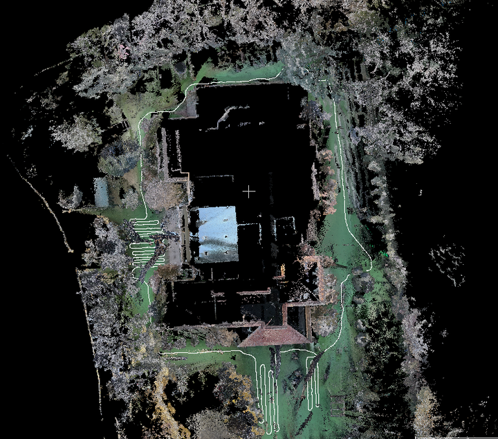 | 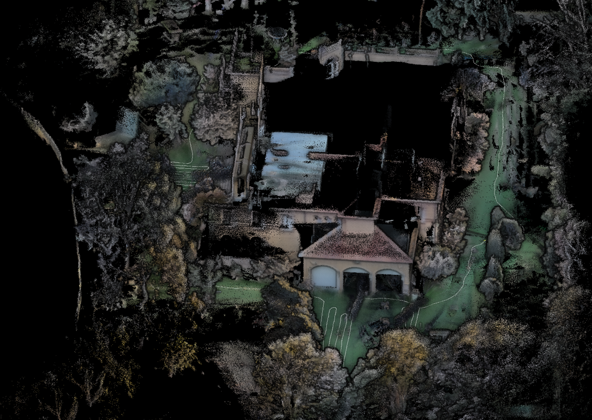 |
| 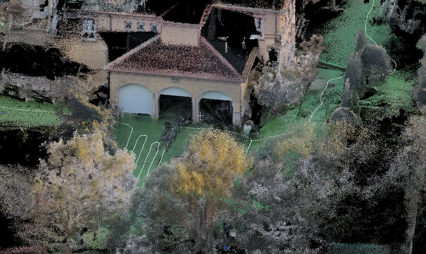 | 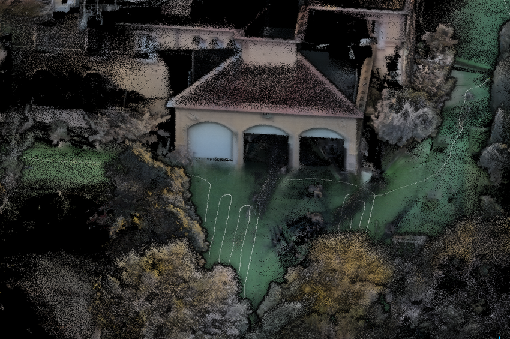 |
| 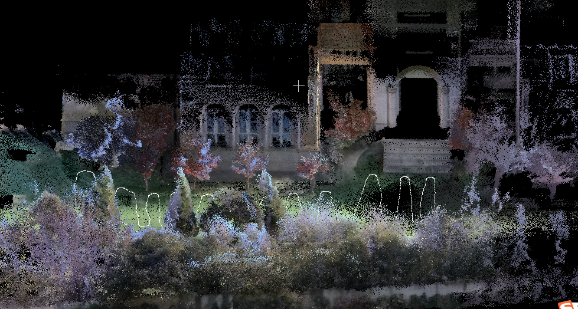 | 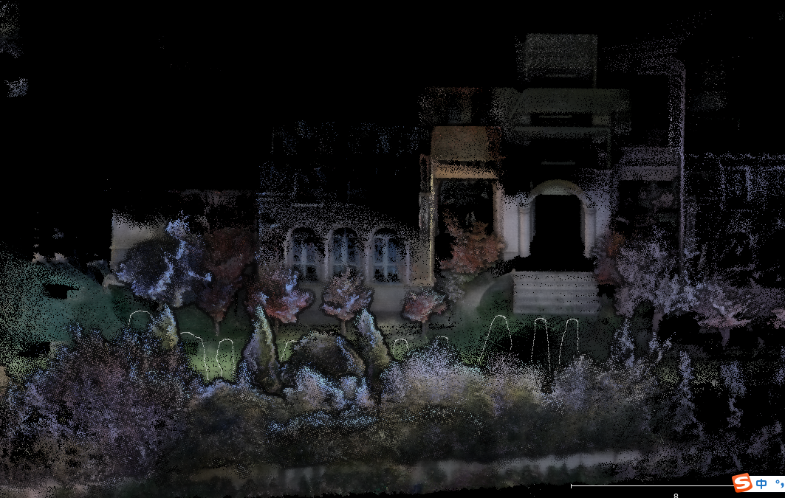 |
| 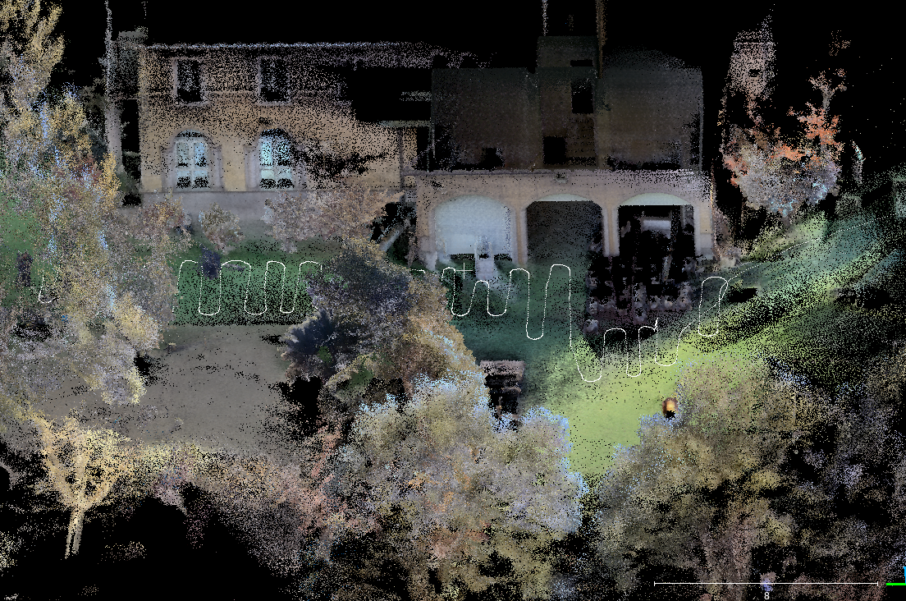 | 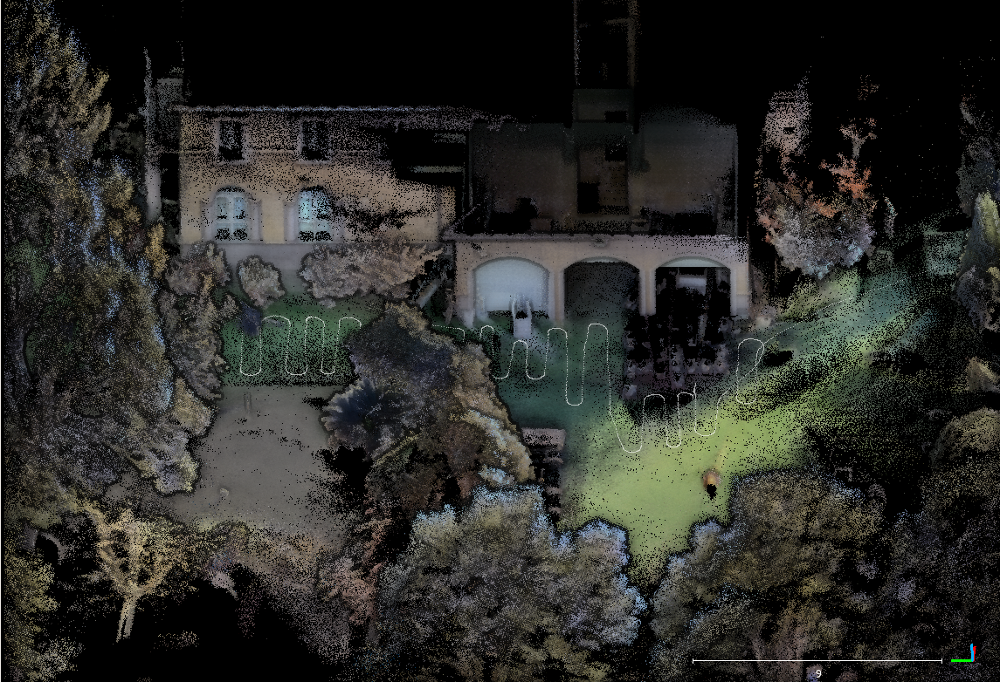 |

# 3. 开源项目

## 3.1 Android 项目

https://dev.luciad.com/portal/productDocumentation/LuciadCPillar/docs/reference/android/com/luciad/maps/effects/EyeDomeLightingEffect.html

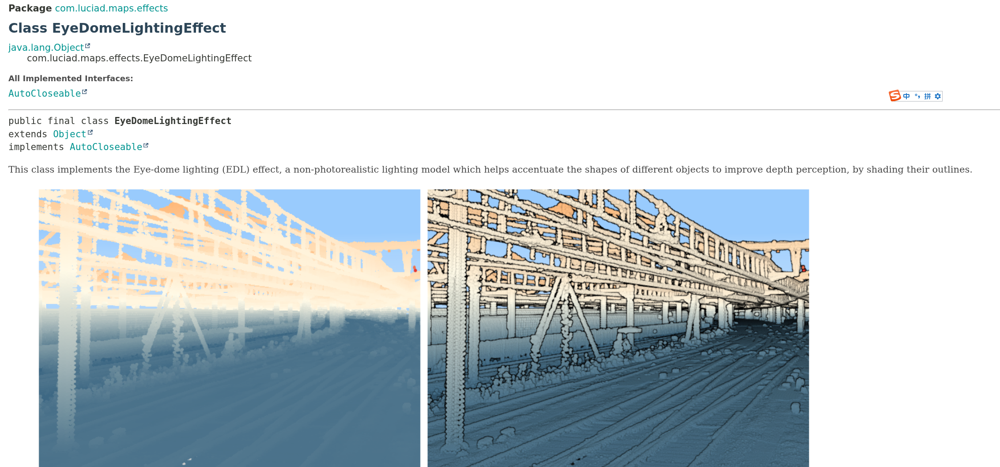

## 3.2 IOS项目

https://apps.apple.com/us/app/freefly-flow/id1522046404

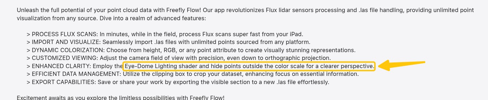

## 3.3 网页版 WebGL

| 平台              | WebGL 1.0 支持   | WebGL 2.0 支持                | 备注                         |
| --------------- | -------------- | --------------------------- | -------------------------- |
| iOS Safari​     | ✅ iOS 8+       | ⚠️ iOS 15+（实验性）             | 基于 Metal 后端                |
| iPadOS Safari​  | ✅ iPadOS 8+    | ✅ iPadOS 15+                | 同 iOS                      |
| Android Chrome​ | ✅ Android 4.4+ | ✅ Android 7.0+（Chrome 版本决定） | 依赖 GPU 驱动                  |
| Android 其他浏览器​  | 多数支持 1.0       | 部分支持 2.0                    | 如 Samsung Internet、Firefox |

* **Potree** — WebGL/Three.js 点云查看器，其源码中包含 EDL Shader ( `EyeDomeLightingMaterial / EDLRenderer.js` )。你可以参考 GLSL 版本，把它移植到 Android (OpenGL ES) 或 iOS (Metal) 上。[Babylon.js+1](https://forum.babylonjs.com/t/eye-dome-lighting-edl-for-point-clouds/21737?utm_source=chatgpt.com)

## 3.4 开源代码

| 代码                                                                                                             | 平台                                                                                                                                                                      |
| -------------------------------------------------------------------------------------------------------------- | ----------------------------------------------------------------------------------------------------------------------------------------------------------------------- |
| https://github.com/pnext/three-loader/blob/master/src/materials/shaders/edl.frag                               |  **GLSL Fragment Shader（片元着色器）代码**。（或许类似C++）这是一个 WebGL1 / OpenGL ES2 的 GLSL 片元着色器，能跑在 PC 浏览器、安卓 GPU、iOS Safari、Unity（自动转 Metal）等多个平台。不是专门针对某一平台，而是跨平台通用的。               |
| https://github.com/SFraissTU/BA\_PointCloud/blob/master/PointCloudRenderer/Assets/Resources/Shaders/EDL.shader |  Unity 的 ShaderLab + CG/HLSL Shader，主要用于 Unity 引擎中的点云 EDL（Eye-Dome Lighting）后处理。它不是给 WebGL 用的，也不是纯 GLSL，而是 Unity 专用的 HLSL/CG 格式。**PC / Android / iOS 都能用，但必须通过 Unity。** |
| https://github.com/potree/potree/issues/956https://github.com/potree/potree/issues/801                         | 看这俩issue说的，potree应该是直接能在IOS/Android上面跑。Potree包含EDL shader源码。完全开源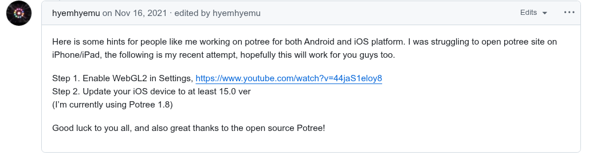                     |

其他参考：[Babylon.js+1](https://forum.babylonjs.com/t/eye-dome-lighting-edl-for-point-clouds/21737?utm_source=chatgpt.com)&#x20;

# 4. 结论

从目前的调研结果来看，在EDL shader安卓和IOS上跑完全可行。
