# FAST-LIVO2优化

# 1. CPU优化

## 1.1 背景

先前的代码中，CPU占用过高，75% - 90%，排查原因。

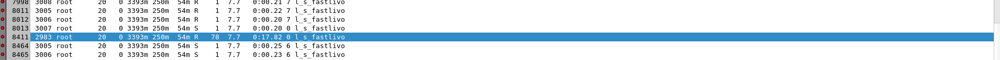

## 1.2 原因及解决

由于 plugins 侧传入的是 **YUV 格式图像**，若在接收阶段立即使用 OpenCV 的 `cvtColor` 将其转换为 **RGB 图像**，会产生显著的 **CPU 开销**；随后从 RGB 再转换为灰度图用于视觉追踪，同样会进一步占用计算资源。然而，在点云赋色阶段，我们又必须依赖 **RGB 颜色信息**，这就造成了实时性与算力之间的矛盾。

降低前端计算压力，采用入选策略：系统在接收到一帧 YUV 图像时，不再立即进行完整的 YUV→RGB 转换，而是 **直接提取 Y 通道作为灰度图**用于视觉追踪，从而显著降低实时阶段的 CPU 负载。在点云赋色环节，则 **暂时保存原始 YUV 值**，无需即时转成 RGB；待机器人停止运行或系统处于空闲状态时，再异步触发批量执行 **YUV→RGB 的后处理**，完成最终的彩色点云渲染。

CPU降下来了。


# 2. 乱开线程问题原因及优化

## 2.1 背景

代码里没有开线程的运算，但是从top上看貌似开了好多线程在算。

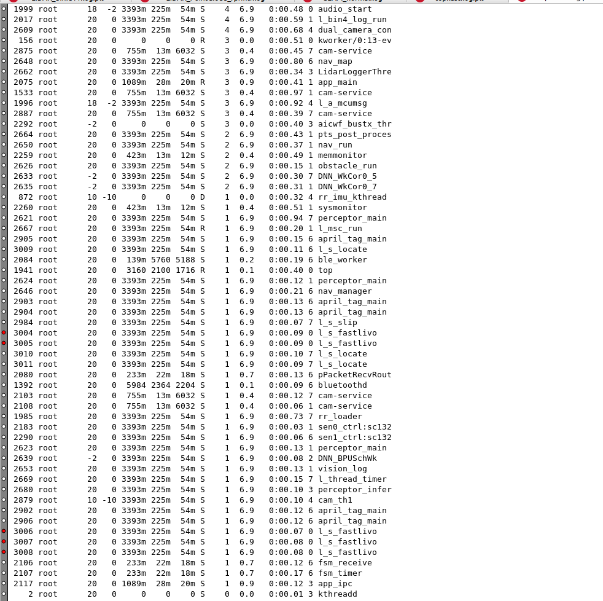

## 2.2 原因及解决

使用 gdb break pthread\_create在x86进行调试，x5验证。

A. 发现log\_parser开线程再算

```c++
Breakpoint 1, __pthread_create_2_1 (newthread=0x7fffffffd308, attr=0x0, start_routine=0x7ffff4201670, arg=0x55555566ac40) at pthread_create.c:625
625     pthread_create.c: 没有那个文件或目录.
(gdb) bt
#0  __pthread_create_2_1 (newthread=0x7fffffffd308, attr=0x0, start_routine=0x7ffff4201670, arg=0x55555566ac40) at pthread_create.c:625
#1  0x00007ffff4201a18 in std::thread::_M_start_thread(std::unique_ptr<std::thread::_State, std::default_delete<std::thread::_State> >, void (*)()) () from /usr/lib/x86_64-linux-gnu/libstdc++.so.6
#2  0x00005555555ec2fd in std::thread::thread<void (rock::log_parser::LogParser::FastLogParser::*)(), rock::log_parser::LogParser::FastLogParser*, void> (__f=<optimized out>, this=0x7fffffffd308)
    at /usr/include/c++/9/bits/unique_ptr.h:153
#3  rock::log_parser::LogParser::FastLogParser::FastLogParser (this=0x5555556956e0, logs=..., capacity=128) at /home/robo/fast-livo1009/Fast-livo2/log_parser/log_parser/src/LogParser.cpp:672
#4  0x00005555555ded2e in __gnu_cxx::new_allocator<rock::log_parser::LogParser::FastLogParser>::construct<rock::log_parser::LogParser::FastLogParser, std::vector<rock::log_parser::LogPath, std::allocator<rock::log_parser::LogPath> >&> (this=<optimized out>, __p=0x5555556956e0) at /usr/include/c++/9/new:174                                                                                                                               
#5  std::allocator_traits<std::allocator<rock::log_parser::LogParser::FastLogParser> >::construct<rock::log_parser::LogParser::FastLogParser, std::vector<rock::log_parser::LogPath, std::allocator<rock::log_parser::LogPath> >&> (__a=..., __p=0x5555556956e0) at /usr/include/c++/9/bits/alloc_traits.h:483                                                                                                                                    
#6  std::_Sp_counted_ptr_inplace<rock::log_parser::LogParser::FastLogParser, std::allocator<rock::log_parser::LogParser::FastLogParser>, (__gnu_cxx::_Lock_policy)2>::_Sp_counted_ptr_inplace<std::vector<rock::log_parser::LogPath, std::allocator<rock::log_parser::LogPath> >&> (__a=..., this=0x5555556956d0) at /usr/include/c++/9/bits/shared_ptr_base.h:548                                                                                
#7  std::__shared_count<(__gnu_cxx::_Lock_policy)2>::__shared_count<rock::log_parser::LogParser::FastLogParser, std::allocator<rock::log_parser::LogParser::FastLogParser>, std::vector<rock::log_parser::LogPath, std::allocator<rock::log_parser::LogPath> >&> (__a=..., __p=<optimized out>, this=<optimized out>) at /usr/include/c++/9/bits/shared_ptr_base.h:679                                                                            
#8  std::__shared_ptr<rock::log_parser::LogParser::FastLogParser, (__gnu_cxx::_Lock_policy)2>::__shared_ptr<std::allocator<rock::log_parser::LogParser::FastLogParser>, std::vector<rock::log_parser::LogPath, std::allocator<rock::log_parser::LogPath> >&> (__tag=..., this=<optimized out>) at /usr/include/c++/9/bits/shared_ptr_base.h:1344                                                                                                  
#9  std::shared_ptr<rock::log_parser::LogParser::FastLogParser>::shared_ptr<std::allocator<rock::log_parser::LogParser::FastLogParser>, std::vector<rock::log_parser::LogPath, std::allocator<rock::log_parser::LogPath> >&> (__tag=..., this=<optimized out>) at /usr/include/c++/9/bits/shared_ptr.h:359                                                                                                                                        
#10 std::allocate_shared<rock::log_parser::LogParser::FastLogParser, std::allocator<rock::log_parser::LogParser::FastLogParser>, std::vector<rock::log_parser::LogPath, std::allocator<rock::log_parser::LogPath> >&> (
    __a=...) at /usr/include/c++/9/bits/shared_ptr.h:702
#11 std::make_shared<rock::log_parser::LogParser::FastLogParser, std::vector<rock::log_parser::LogPath, std::allocator<rock::log_parser::LogPath> >&> () at /usr/include/c++/9/bits/shared_ptr.h:718
#12 rock::log_parser::LogParser::begin (this=0x55555566edd0) at /home/robo/fast-livo1009/Fast-livo2/log_parser/log_parser/src/LogParser.cpp:868
#13 0x0000555555568796 in main (argc=<optimized out>, argv=<optimized out>) at /home/robo/fast-livo1009/Fast-livo2/FAST-LIVO2/tests/src/SimpleTestSLAM.cpp:97
```

B. cvtColor 偷偷开线程算

```c++
(gdb) bt
#0  __pthread_create_2_1 (newthread=0x555555718280, attr=0x0, start_routine=0x7ffff4b30eb0 <cv::WorkerThread::thread_loop_wrapper(void*)>, arg=0x555555718270) at pthread_create.c:625
#1  0x00007ffff4b312e5 in cv::WorkerThread::WorkerThread(cv::ThreadPool&, unsigned int) () from /usr/local/Opencv3.4.2/lib/libopencv_core.so.3.4
#2  0x00007ffff4b32356 in cv::ThreadPool::reconfigure_(unsigned int) () from /usr/local/Opencv3.4.2/lib/libopencv_core.so.3.4
#3  0x00007ffff4b33210 in cv::parallel_for_pthreads(cv::Range const&, cv::ParallelLoopBody const&, double) () from /usr/local/Opencv3.4.2/lib/libopencv_core.so.3.4
#4  0x00007ffff4b30164 in cv::parallel_for_(cv::Range const&, cv::ParallelLoopBody const&, double) () from /usr/local/Opencv3.4.2/lib/libopencv_core.so.3.4
#5  0x00007ffff56d7772 in cv::hal::cvtBGRtoGray(unsigned char const*, unsigned long, unsigned char*, unsigned long, int, int, int, int, bool) () from /usr/local/Opencv3.4.2/lib/libopencv_imgproc.so.3.4
#6  0x00007ffff56df460 in cv::cvtColorBGR2Gray(cv::_InputArray const&, cv::_OutputArray const&, bool) () from /usr/local/Opencv3.4.2/lib/libopencv_imgproc.so.3.4
#7  0x00007ffff56a4a08 in cv::cvtColor(cv::_InputArray const&, cv::_OutputArray const&, int, int) () from /usr/local/Opencv3.4.2/lib/libopencv_imgproc.so.3.4
#8  0x00005555555aafe3 in VIOManager::processFrame (this=0x55555565f760, img=..., pg=std::vector of length 573, capacity 573 = {...}, Python Exception <class 'gdb.error'> No type named std::__detail::_Hash_node<struct std::pair<VOXEL_LOCATION const, std::unique_ptr<VoxelOctoTree, std::default_delete<VoxelOctoTree> > >, true>.: 
feat_map=std::unordered_map with 154 elements, img_time=<optimized out>)
    at /usr/local/Opencv3.4.2/include/opencv2/core/mat.inl.hpp:67
#9  0x000055555556cfb2 in LVIO_Manager::handleVIO (this=0x55555564fb20) at /usr/include/c++/9/bits/stl_deque.h:1500
#10 0x0000555555568933 in main (argc=<optimized out>, argv=<optimized out>) at /home/robo/fast-livo1009/Fast-livo2/FAST-LIVO2/tests/src/SimpleTestSLAM.cpp:136
```

C. cv::cvtColor 偷偷开线程 BGR → Gray 转换。

```c++
(gdb) c
Continuing.
[New Thread 0x7fffebfff700 (LWP 7745)]

Thread 1 "log_parser" hit Breakpoint 1, __pthread_create_2_1 (newthread=0x555555717fb0, attr=0x0, start_routine=0x7ffff4b30eb0 <cv::WorkerThread::thread_loop_wrapper(void*)>, arg=0x555555717fa0)
    at pthread_create.c:625
625     in pthread_create.c
(gdb) bt
#0  __pthread_create_2_1 (newthread=0x555555717fb0, attr=0x0, start_routine=0x7ffff4b30eb0 <cv::WorkerThread::thread_loop_wrapper(void*)>, arg=0x555555717fa0) at pthread_create.c:625
#1  0x00007ffff4b312e5 in cv::WorkerThread::WorkerThread(cv::ThreadPool&, unsigned int) () from /usr/local/Opencv3.4.2/lib/libopencv_core.so.3.4
#2  0x00007ffff4b32356 in cv::ThreadPool::reconfigure_(unsigned int) () from /usr/local/Opencv3.4.2/lib/libopencv_core.so.3.4
#3  0x00007ffff4b33210 in cv::parallel_for_pthreads(cv::Range const&, cv::ParallelLoopBody const&, double) () from /usr/local/Opencv3.4.2/lib/libopencv_core.so.3.4
#4  0x00007ffff4b30164 in cv::parallel_for_(cv::Range const&, cv::ParallelLoopBody const&, double) () from /usr/local/Opencv3.4.2/lib/libopencv_core.so.3.4
#5  0x00007ffff56d7772 in cv::hal::cvtBGRtoGray(unsigned char const*, unsigned long, unsigned char*, unsigned long, int, int, int, int, bool) () from /usr/local/Opencv3.4.2/lib/libopencv_imgproc.so.3.4
#6  0x00007ffff56df460 in cv::cvtColorBGR2Gray(cv::_InputArray const&, cv::_OutputArray const&, bool) () from /usr/local/Opencv3.4.2/lib/libopencv_imgproc.so.3.4
#7  0x00007ffff56a4a08 in cv::cvtColor(cv::_InputArray const&, cv::_OutputArray const&, int, int) () from /usr/local/Opencv3.4.2/lib/libopencv_imgproc.so.3.4
#8  0x00005555555aafe3 in VIOManager::processFrame (this=0x55555565f760, img=..., pg=std::vector of length 573, capacity 573 = {...}, Python Exception <class 'gdb.error'> No type named std::__detail::_Hash_node<struct std::pair<VOXEL_LOCATION const, std::unique_ptr<VoxelOctoTree, std::default_delete<VoxelOctoTree> > >, true>.: 
feat_map=std::unordered_map with 154 elements, img_time=<optimized out>)
    at /usr/local/Opencv3.4.2/include/opencv2/core/mat.inl.hpp:67
#9  0x000055555556cfb2 in LVIO_Manager::handleVIO (this=0x55555564fb20) at /usr/include/c++/9/bits/stl_deque.h:1500
#10 0x0000555555568933 in main (argc=<optimized out>, argv=<optimized out>) at /home/robo/fast-livo1009/Fast-livo2/FAST-LIVO2/tests/src/SimpleTestSLAM.cpp:136
```

## 2.3 结论

pc端opencv和log\_parser偷偷开线程计算。代码优化后，不使用 opencv 进行图像转换。上机检测，问题修复。

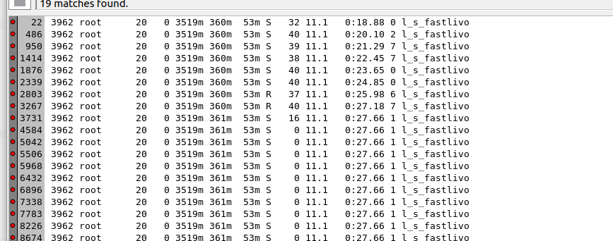

# 3. 仿真与机器上跑内存不符合

## 3.1 背景

在 x86 和 x5平台，内存使用量不符合，跑外场60栋 7200 平大数据时，pc占用内存 3G，x5板端内存占用 500MB，很奇怪，需要排查。

## 3.2 机器表现

算法每处理一帧 IMU 后打印内存消耗量，发现pc端有个很奇怪的现象：

由于原始算法并未支持 LVIO 与 LIO 模式动态切换，在实际上机过程中相机会频繁开启和关闭，导致系统在两种模式之间不断往返，因此需要在 LVIO→LIO 时执行视觉地图的重置。同时，为了降低视觉地图长期占用的内存设计了基于 LRU 的清理策略，希望在 reset VIO 模块或重置体素地图后能够释放大量空间。但在实际运行中可以观察到：即使对象被正确删除，进程的内存占用却并未下降，只是在一段时间内保持不再增长。这并不是内存泄漏，而是 glibc 默认的内存管理策略所致——释放的内存并不会立即归还给操作系统，而是进入 glibc 的内部 arena，当存在碎片化或块大小不合适时，RSS 会保持不变。尤其 SLAM 系统中存在大量小对象（Feature、Patch、VoxelPoints、Eigen 缓冲等），再加上多线程导致多个 arena，使得内存更难以自动收缩。为解决该现象，执行`malloc_trim()` 代码后，glibc 会强制尝试将未使用的连续空闲区域真正归还给操作系统，因此 RSS 会立即下降。最终证明：算法逻辑本身没有泄漏，只是 glibc 的内存池未主动释放，通过显式调用 `malloc_trim()` 即可有效回收内存。


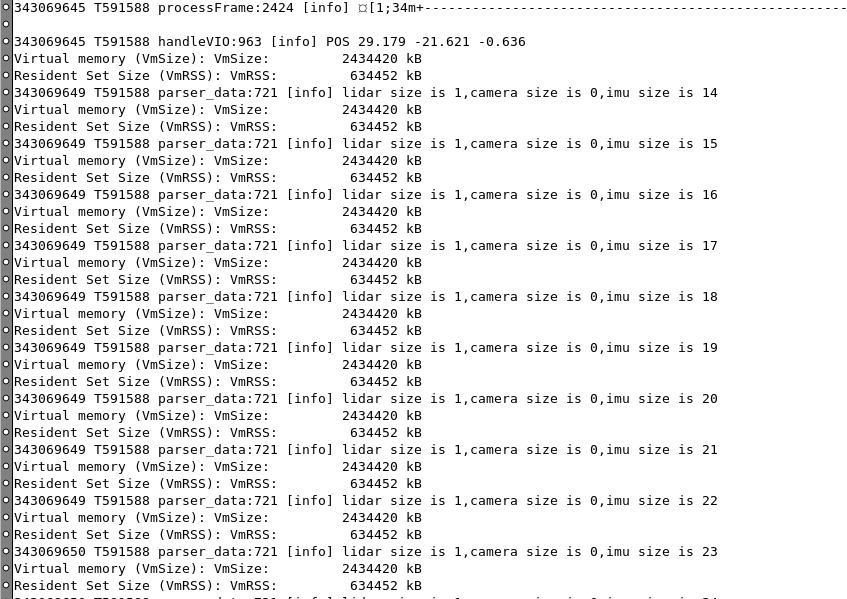

# 4. 算法效果优化

## 4.1 染色优化

让测试密集扫描，共采集数据两组，效果如下：

| 场景          | 整个外场60栋。                                                                                                                                                                                                                                                  |
| ----------- | --------------------------------------------------------------------------------------------------------------------------------------------------------------------------------------------------------------------------------------------------------- |
| 点云文件 & 轨迹文件 |                                                                                                                                                                                                                                                           |
| 走法          | 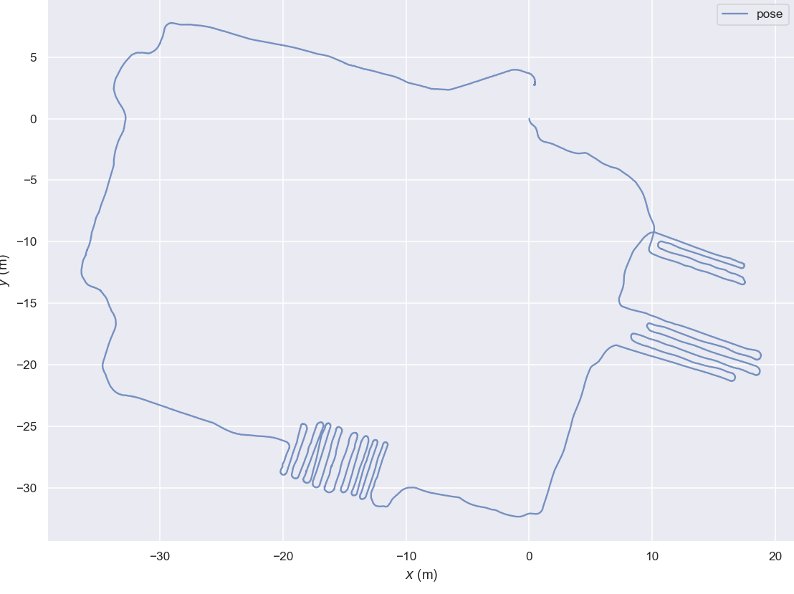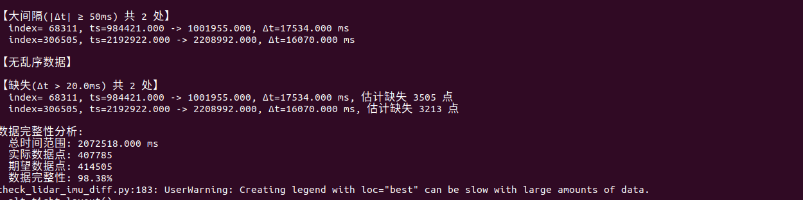IMU丢帧。无法走回终点。                                                                       |
| 点云染色效果      | 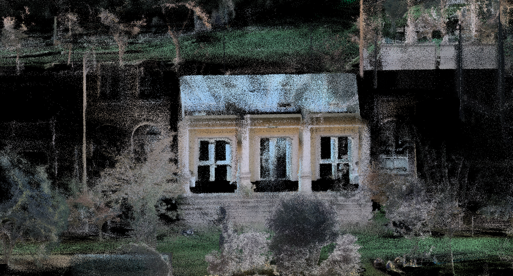 |
| 问题          | 人太多，有鬼影。                                                                                                                                                                                                                                                  |
| 内存占用        | 点云占了 440 兆，算法内存才占了 1.2GB。                                                                                                                                                                                                                                 |


| 场景     | 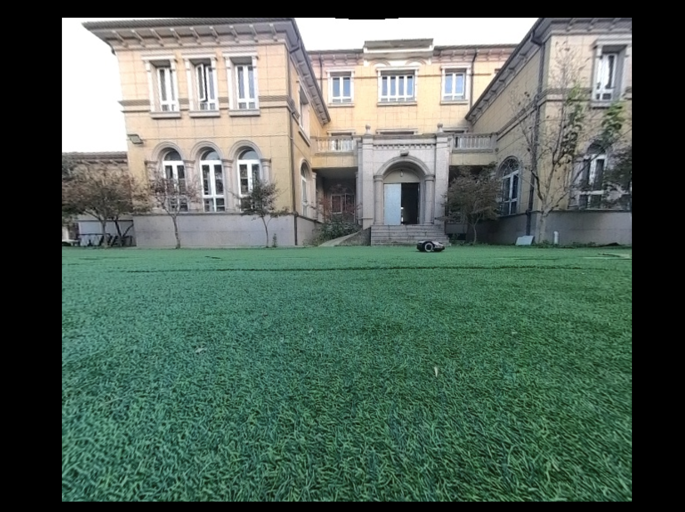                                                                                                                                                                       |
| ------ | --------------------------------------------------------------------------------------------------------------------------------------------------------------------------------------------------------------------------------------------------------- |
| 走法     |                                                                                                                                                                        |
| 点云染色效果 | 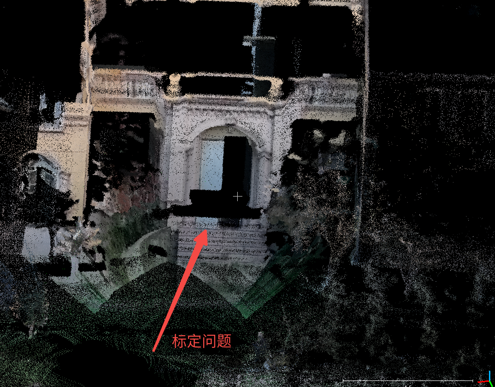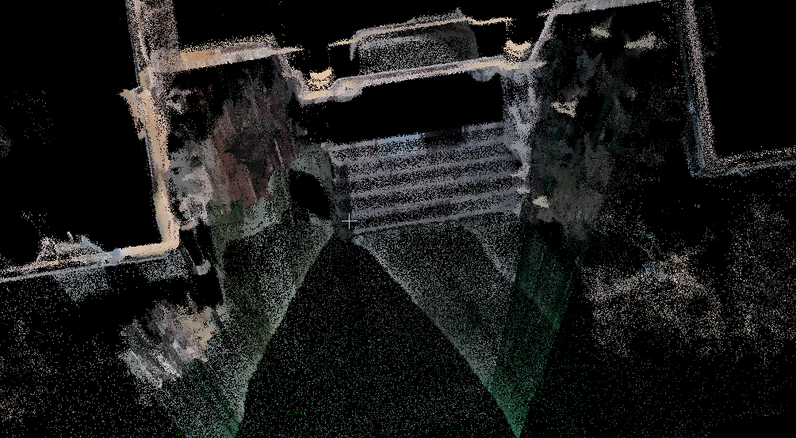 |
| 问题     | 貌似pitch角有问题。                                                                                                                                                                                                                                              |

| 场景   | 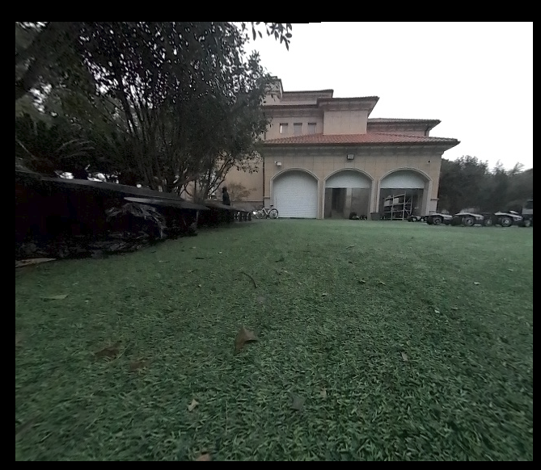外场60栋，傍晚，颜色不太鲜艳。                                                                                              |
| ---- | ------------------------------------------------------------------------------------------------------------------------------------------------------------------------------------------------ |
| 点云效果 | 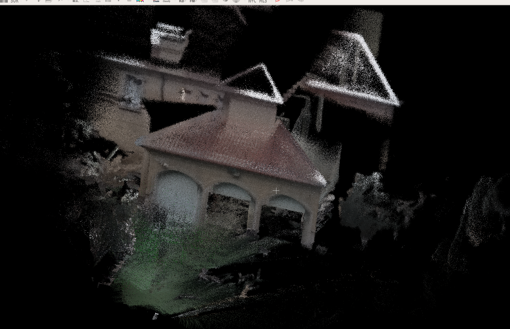                                                                                                              |
| 路线   | 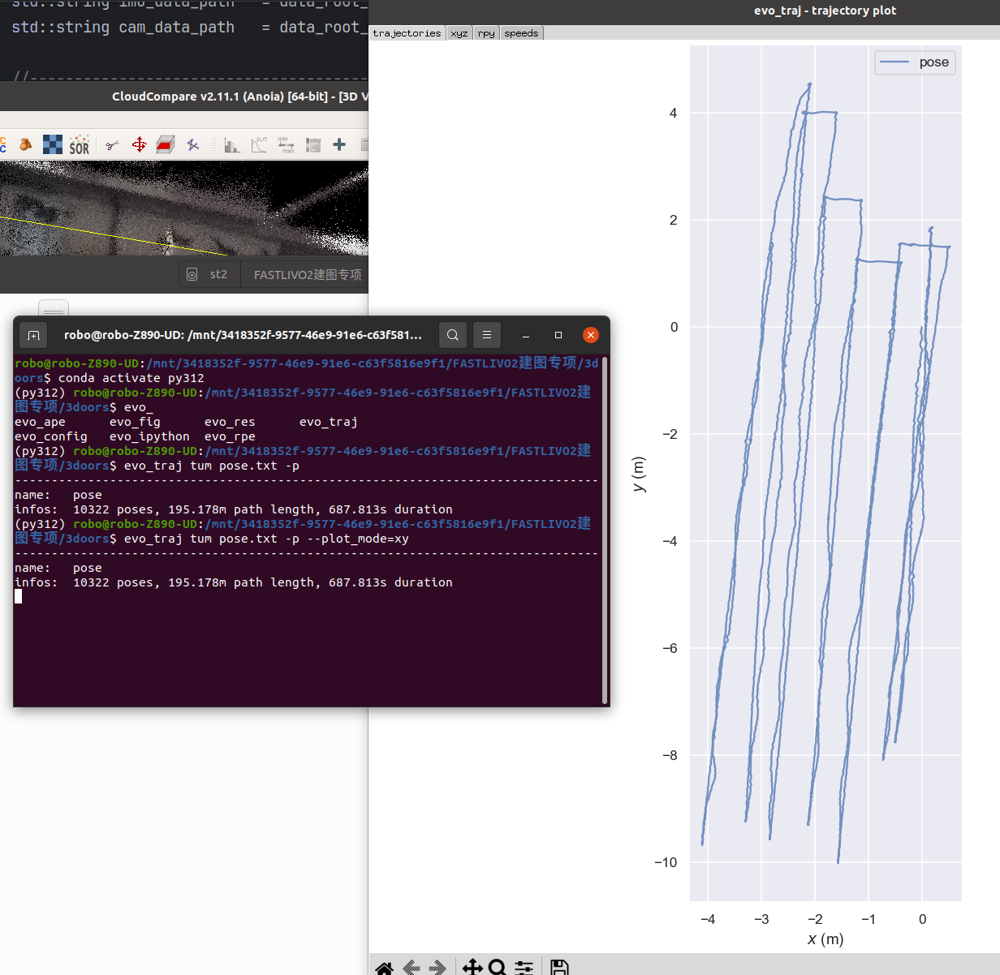                                                                                                              |
| 问题   | 标定还是有点小问题？？ yaw和pitch貌似有问题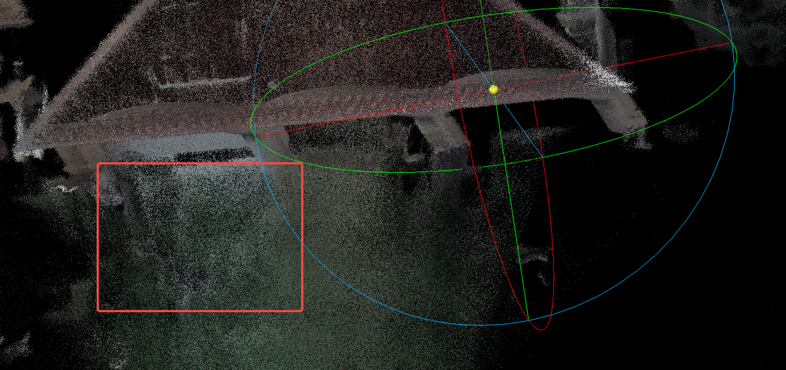 |

## 4.2 功能优化

原算法不支持 LVIO 和 LIO 模式切换，但是上机时相机会频繁开启关闭导致算法飘。

FIX。目前策略是相机关闭且LIO模块并 reset VIO模块，相机再次开启重新启动VIO。
