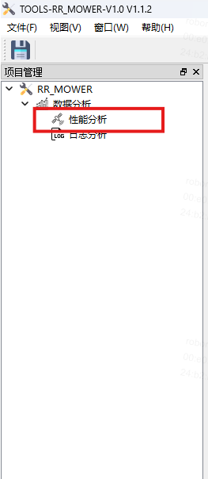
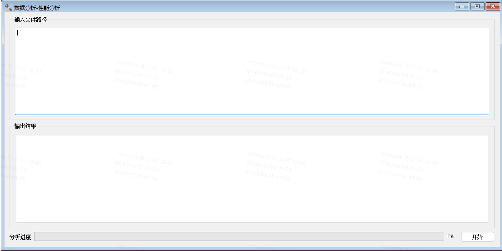
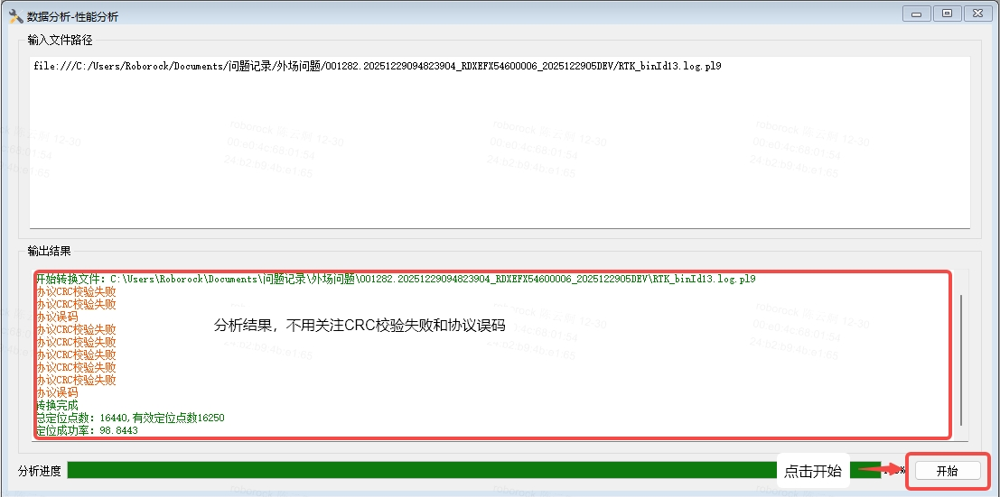
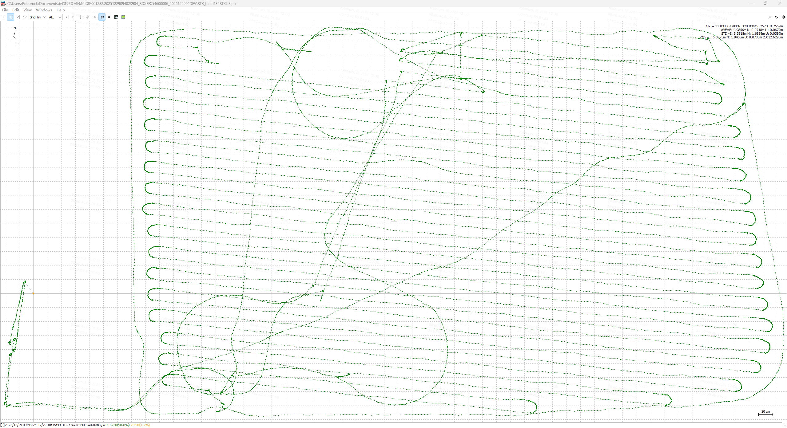
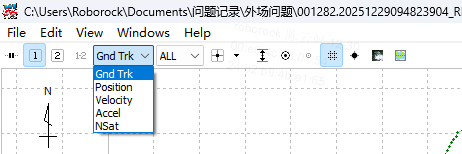
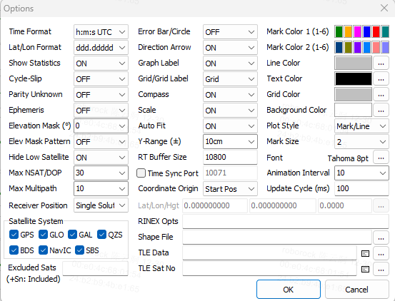
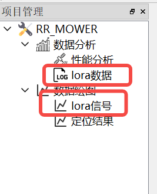
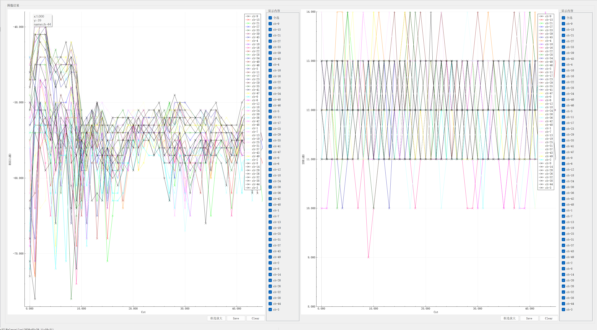

# RR_TOOL分析RTK数据使用方法

> RR\_TOOL工具目前支持RTK原始数据的分析；
>
> 目前支持功能：
>
> 1. RTK原始数据数据RTK\_BinId13数据初步分析；
>
> 2. RTK定位结果绘制定位曲线；
>
> 3. RTK定位差分龄期、参与定位卫星数统计曲线；
>
> 4. 海导M4协议解析绘制

# 1. 版本发布

| 版本号    | 功能介绍                           | 发布时间       |
| ------ | ------------------------------ | ---------- |
| V1.1.2 | 具备Unicore协议解析功能                | 2025.12.30 |
| V1.1.3 | 增加AGRICA协议的版本区分，增加真实差分龄期的使用    | 2026.3.19  |
| V1.1.4 | 增加差分龄期统计功能                     | 2026.3.20  |
| V1.1.5 | 实现LoRa协议解析功能，增加AGRIC二进制协议的版本识别 | 2026.3.29  |

# 2. 使用方法

## 2.1 运行RR-Mower-Tools.exe文件：

## 2.2 RTK日志分析

### 2.2.1 打开界面

结果如下：

### 2.2.2 将需要分析的文件直接拖入到输入文件路径中，点击开始即可

目前支持的文件格式包括如下格式：

1. RTK\_BinId13.logg.pl9代表的RTK二进制数据；

2. .ASC格式代表的RTK的ASCII数据；

3. 支持多文件依次分析，需要使用回车对不同文件进行分割；

### 2.2.3 点击开始按钮软件开始对输入文件路径所有数据进行分析

### 2.2.4 软件分析完成后自动打开绘图软件RTKPLOT

打开左上角的下拉选项，依次为轨迹曲线，各方向定位移动曲线，速度曲线，加速度曲线，参与定位卫星数和差分龄期曲线；

#### 2.2.4.1 对于RTKPLOT的简单配置

点击右上角的设置按钮：

出现Options选项后建议按照如下图的配置进行调整

## 2.3 LoRa日志分析（V1.1.5后版本支持）

### 2.3.1 打开界面

依次点击如下两个图标，分别为LoRa日志处理和LoRa数据曲线绘制。

### 2.3.2 与RTK日志分析一致，将数据拖放到文件路径中，点击开始即可

略

### 2.3.3 软件处理完成后自动会绘制LoRa信噪比曲线，并按照信道进行分割

可以通过左侧的选项，显示不同的折线。

# 3. 软件下载

[ Tools-RR-Mower-RevV1.1.2\_P20251221\_230409e105a3fb9dac82ec5dc1cca3bbec7ea8d653a99b.rar](https://roborock.feishu.cn/file/CoHAbseyoodQO3xJEKKcy8Ean3d)

[ Tools-RR-Mower-RevV1.1.3\_P20260319\_222842f506131f796e0d5073c5f2cb2036e5e7885359f5.rar](https://roborock.feishu.cn/file/P5bYbB0Byo825MxW50kcMlw2nk8)

[ Tools-RR-Mower-RevV1.1.4\_P20260321\_184609b3e2987c2b3f42f6b6ab08b6807c32042f224c7a.rar](https://roborock.feishu.cn/file/TW5ebCPtGoPn3ox9GSacmamWngg)

[ Tools-RR-Mower-RevV1.1.5\_P20260329\_114556de36e50188e33f0516cc1b51ea6908ff95a87441.rar](https://roborock.feishu.cn/file/LAmvbvydXoOCxSxORercA3s8nYc)

> 后续软件更新后，会对文档进行更新处理。可以 ，如果软件有运行问题可以&#x20;

