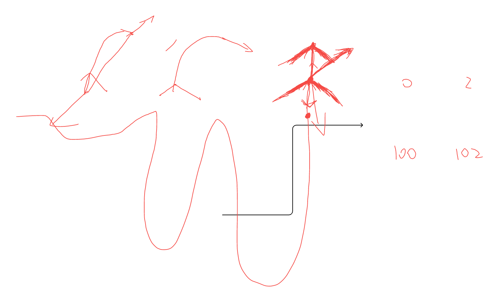

# 卡困检测细节逻辑

1. 基于odo与gyro的旋转打滑检测

   1. 核心逻辑

      1. 滑窗时间内，odo的累积角度与gyro的累积角度差异大于一定阈值则触发

   2. odo累积角度

      1. N秒内的数据，后轮差速计算角度，累加，随滑窗向前滑动

   3. gyro累积角度

      1. N秒内的数据，角速度积分计算角度，累加，随滑窗向前滑动

   4. 传感器滑窗时间同步

      1. 以gyro的时间为准，odo根据gyro的时间增减滑窗数据

      2. 两种传感器数据的时间均达到要求才完成初始化

   5. 误报防护

      1. odo积分角度绝对值大于设定的最小阈值（防护静止时gyro漂移）

      2. odo与gyro的角度差要大于正常旋转时打滑的角度差异

   6. 滑窗重启

      1. 任一传感器前后数据的时间gap大于阈值，积分结果不准确，重启滑窗数据

   7. 打滑方向

      1. odo积分角度为正则为1，为负则为-1

2. 基于odo与RTK固定解的前进/后退打滑检测

   1. 核心逻辑

      1. 滑窗时间内，odo的位移与RTK位移差异大于一定阈值则触发

   2. odo位移

      1. odo双轮差速累积odo世界系的角度，两轮均值为位移，不断累积并记录角度与位置，以滑动窗口首尾两端的坐标差绝对值的norm为位移指标。

   3. RTK位移

      1. 滑动窗口首尾两端的坐标差绝对值的norm

   4. 传感器滑窗时间同步

      1. 均对齐gyro滑窗的首尾时间

   5. 误报防护

      1. odo与RTK首尾时间戳差异小

      2. 滑窗内gyro角度小于阈值（防护U形轨迹）

      3. 滑窗内RTK移动小于阈值（防护正常移动打滑）

   6. 滑窗重启

      1. odo的前后时间gap重启，RTK无重启

   7. 打滑方向

      1. 滑窗内odo位移方向与当前最新时刻方向对比，同向则向前打滑，反向则向后打滑

      

V0.1

1. **基于odo与gyro的旋转打滑检测**

   1. 核心逻辑

      1. 滑窗时间N=9s内，odo的累积角度与gyro的累积角度差异大于一定阈值则触发

   2. odo累积角度

      1. N秒内的数据，后轮差速计算角度，累加，随滑窗向前滑动

   3. gyro累积角度

      1. N秒内的数据，角速度积分计算角度，累加，随滑窗向前滑动

   4. 传感器滑窗时间同步

      1. 以gyro的时间为准，odo根据gyro的时间增减滑窗数据

      2. 两种传感器数据的时间均达到要求才完成初始化

   5. 误报防护

      1. odo积分角度绝对值大于设定的最小阈值（防护静止时gyro漂移）

      2. odo与gyro的角度差要大于正常旋转时打滑的角度差异

   6. 滑窗重启

      1. 任一传感器前后数据的时间gap大于阈值，积分结果不准确，重启滑窗数据

   7. 打滑方向

      * ~~odo积分角度为正则为1，为负则为-1,~~  改为odo积分角度与gyro积分角度差，为正则为1，为负则为-1。

2. **基于odo与RTK固定解的前进/后退打滑检测**

   1. 核心逻辑

      1. ~~滑窗时间内，odo的位移与RTK位移差异绝对值大于一定阈值则触发~~，改为滑窗时间(N=9s)内,odo累积距离与rtk累积距离差值大于一定阈值则触发。

   2. ~~odo位移~~ odo累积距离

      1. ~~odo双轮差速累积odo世界系的角度，两轮均值为位移，不断累积并记录角度与位置，以滑动窗口首尾两端的坐标差绝对值的norm为位移指标。~~

      2. odo后轮差速模型递推轨迹，以滑动窗口内odo轨迹长度为odo累积距离，随滑窗向前滑动。

   3. ~~RTK位移~~ RTK累积距离

      1. ~~滑动窗口首尾两端的坐标差绝对值的norm~~

      2. 滑动窗口内RTK轨迹长度为RTK累积距离，随滑窗向前滑动。

   4. 传感器滑窗时间同步

      1. 均对齐gyro滑窗的首尾时间

   5. 误报防护

      1. ~~odo与RTK首尾时间戳差异小~~

      2. ~~滑窗内gyro角度小于阈值（防护U形轨迹）~~

      3. ~~滑窗内RTK移动小于阈值（防护正常移动打滑）~~

      4. odo与gyro首尾时间戳小于一定阈值

      5. rtk与gyro首尾时间戳小于一定阈值

      6. 滑窗内最近2N/3秒积分的gyro角度绝对值小于阈值

      7. 滑窗内最近2N/3秒累积的RTK长度小于阈值

      8. 滑窗内相邻固定解rtk时间间隔小于一定阈值(1s)

   6. 滑窗重启

      1. odo的前后时间gap重启，RTK无重启

   7. 打滑方向

      1. ~~滑窗内odo位移方向与当前最新时刻方向对比，同向则向前打滑，反向则向后打滑~~

      2. 滑窗内odo累加的位移为正，则为向前打滑，为负则为向后打滑。
