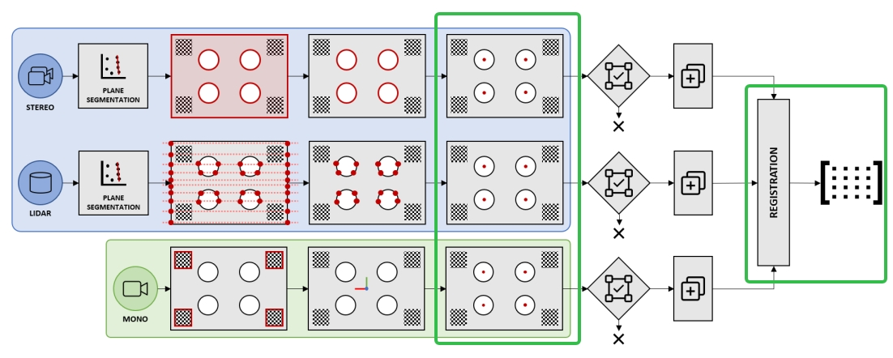
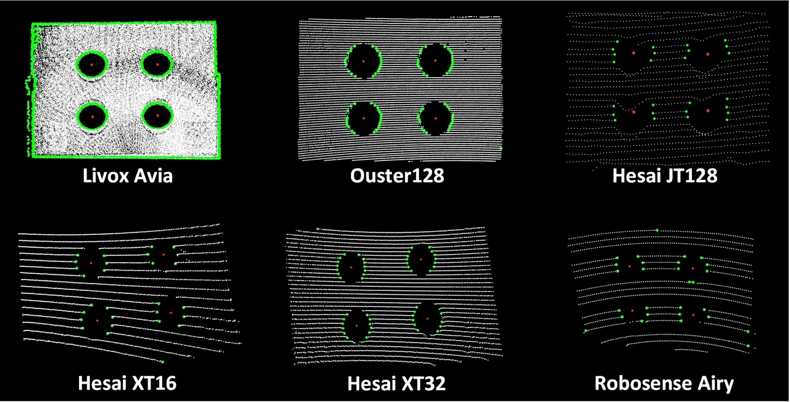

# 背景

割草机新项目使用新的激光雷达器件（ＡiryLite），为扫描式激光雷达．

在MCT工站，对于原有外参标定结果的评估方法不适用．

## 现有标定方案为

在一个３m\*３m\*１m的布满棋盘格场地，机器人在场地中间走１个８字型，分别得到lidar-odo的外参和camera-odo的外参，最终得到lidar-camera的外参．

### 现有MCT检测方案 简要介绍

在MCT机器自转阶段，识别场地最高一行的二维码，提取该区域中的点云，计算出高度。和真值对比，核对标定结果。

# 标定方案调研

目前常用的标定主要分为以下几类：静态有标定物体标定（工厂环境推荐），动态有标定物标定，动态无标定物标定．

单独对于lidar-camera外参的方法，比较有效或常用的做法是通过更高精度的设备，如高精度动捕或其他设备等，但有诸多限制．**因此考虑查找比较新的标定方法，从标定流程过程中选取评估变量．**

查找对于我们合适的**标定或外参评定方案主要基于以下方面**：

1. 能标定的传感器类型，必须包含扫描式激光lidar;

2. 操作方便;

3. 流程上更合理；

4. 成本可控；

5. 提出方案的时间相对比较新（因为可能结合前人的经验）；

6. 程序修改难度；

## 基本流程

**综合考虑以上因素，方案流程总结如下**：

１．使用固定格式且已知参数（如圆形半径，棋盘格大小，二者之间相对关系）的标定板，将标定板静止放在标定场地中，机器人正对着标定板**静止不动**即可．为提高标定精度或可靠性，可将机器人旋转４个角度进行多次标定（多帧累计方法可能产生畸变问题）；

２．在场地中获取相机和lidar的信息，并按照如下流程进行．

a.激光点云平面分割，获取激光雷达打在标定板上的点云．为准确区分，可将标定板后１m放置一个箱子或者墙面，直接通过距离过滤即可．

b.激光数据获取标定板点云中的边缘点，再选取圆形点，最终选取圆心；

c.图像数据进行特征点提取，并结合标定板已知参数，计算圆心；

d.如果用于外参标定，使用两组圆心点云，进行配准，得到外参即可，流程为a->b->c->d，配准结果就是外参结果;

e.如果用于外参结果评估，输入外参，然后进入e->a->b->c->d流程，评估标准为４个圆心的配准结果，如果标定结果非常理想，得到的应该是一个单位矩阵Ｒ和０位置向量．

３．对于上述流程可讨论的点

a.棋盘格与机器人静止时的相对距离可结合标定板孔的大小调整，在设计标定板尺寸时可事先计算．因为新雷达为扫描式激光雷达，垂直方向分辨率比较低，圆形确定至少需要４个点，一定要严格保证．

b.棋盘格的设计格式不固定．可以多几个圆孔，棋盘格也可以多一些．

c.两组圆心配准结果门限制阈值如何确定？个人认为需要测试．以原类型激光雷达通过外参标定的机器在实际场景中的跑测结果（从定位, 导航等方面评定）作为参考，调整阈值．　

## 参考资料

1.https://github.com/beltransen/velo2cam\_calibration
2021年提出

２．https://github.com/hku-mars/FAST-Calib　

文章中与vel2cam\_calibraton做了对比，精度稍微高一些．能进行静态的，机械式，无须初始外参的标定，且计算速度快，主要是给fast-livo２使用，３个月之前还有更新．

３．[github.com/mfxox/ILCC](https://link.zhihu.com/?target=https%3A//github.com/mfxox/ILCC)

[2017\_Remot  Sensing\_Reflectance Intensity Assisted Automatic and Accurate Extrinsic  Calibration of 3D LiDAR and Panoramic Camera Using a Printed Chessboard](https://link.zhihu.com/?target=https%3A//arxiv.org/pdf/1708.05514.pdf)
2017年提出，基于反光材料．

５．https://github.com/ankitdhall/lidar\_camera\_calibration　有反馈说标定误差大

４．https://zhuanlan.zhihu.com/p/404762012　　标定方法总结
