# 搬动重定位自测

算法设计流程图[ 搬动重定位融合模块](https://roborock.feishu.cn/wiki/OLkkweWBEik8UjkWzRjcELRJnIb)

当前阈值设置

| 条件                 | 变量              | 阈值        | 说明                                      |
| ------------------ | --------------- | --------- | --------------------------------------- |
| 检测是否有搬动            | MoveDistancreTh | 0.35(m)   | 检测是否有搬动的距离阈值                            |
|                    | MoveAngleTh     | 20(deg)   | 测是否有搬动的角度阈值                             |
| 检测到搬动后，是否可以不需要走重定位 | ForwardVelTh    | 0.4(m/s)  | 检测到有搬动后，判断是否需要触发重定位的速度阈值                |
|                    | PositionRes     | 0.05(m)   | 检测到有搬动后，判断是否需要触发重定位的位置残差阈值              |
|                    | AngleRes        | 5(deg)    | 检测到有搬动后，判断是否需要触发重定位的角度残差阈值              |
| 检测到搬动后，直接进入重定位     | RTKUpdateTimeTh | 0.25(s)   | 检测到有搬动后，判断是否有RTK固定解阈值                   |
|                    | CheckTimeoutTh  | 5(s)      | 检测到有搬动后，在有RTK固定解的条件下，判断是否需要触发重定位的最大延迟时间 |

| 暂停期间机器行为                    | 是否触发重定位 | 触发/未触发的原因          | 后续定位是否正常   | 仿真效果                                                                                                                                                                   | 备注                |
| --------------------------- | ------- | ------------------ | ---------- | ---------------------------------------------------------------------------------------------------------------------------------------------------------------------- | ----------------- |
| 机器直行时暂停，未做任何搬动              | 否       | 距离和角度不满足搬动阈值       | 是          | 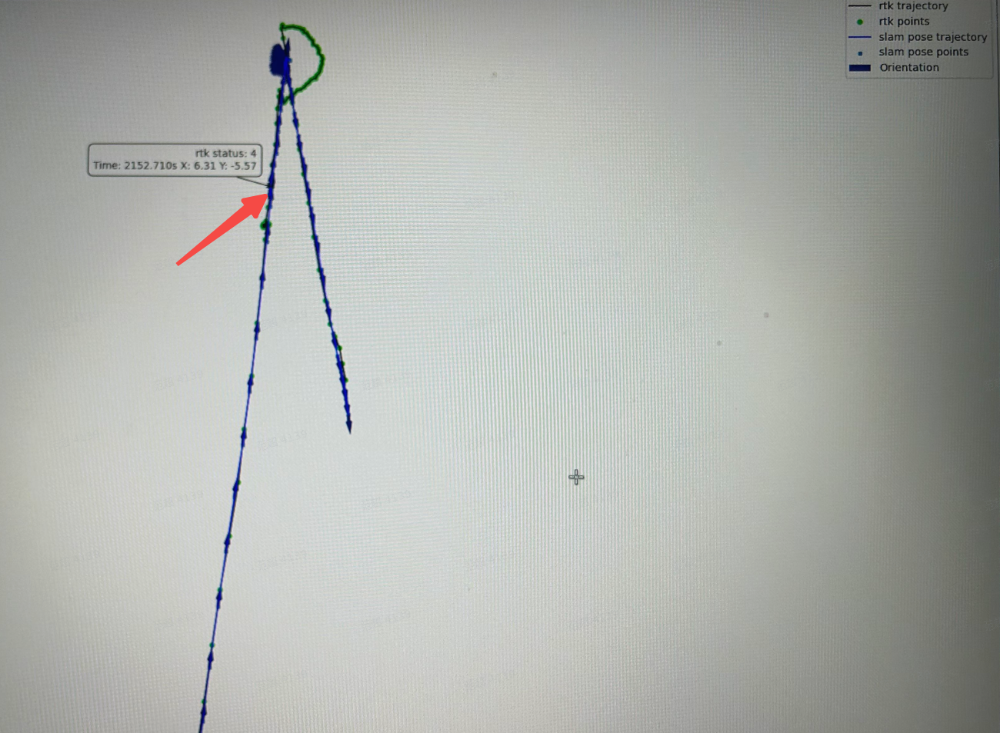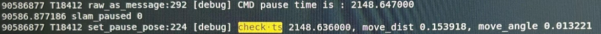 |                   |
| 机器转弯掉头时暂停，未做任何搬动            | 否       | 距离和角度不满足搬动阈值       | 是          | 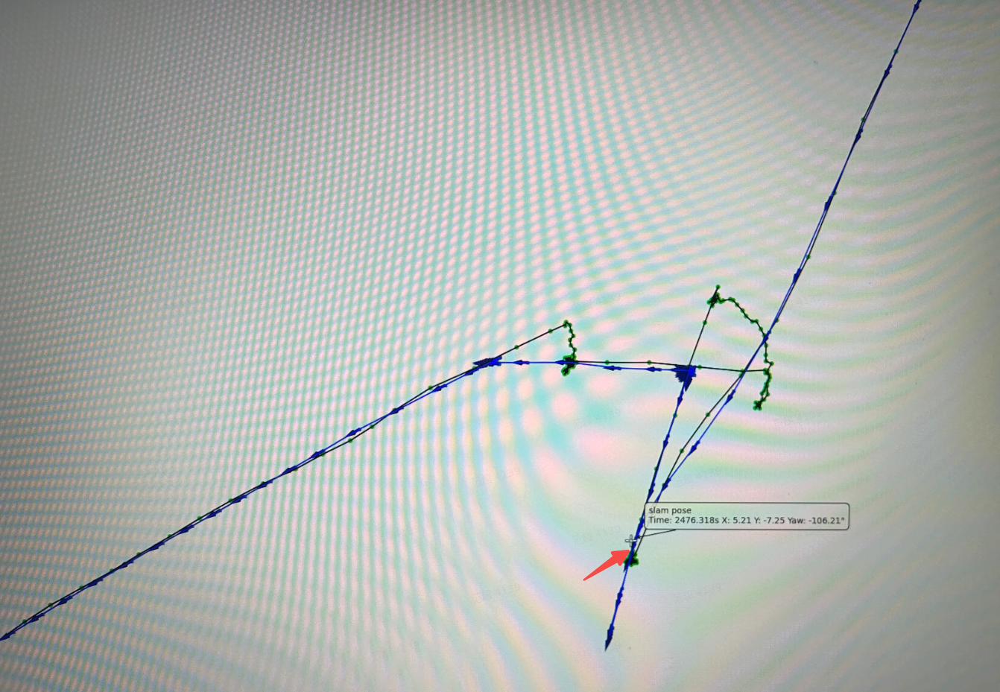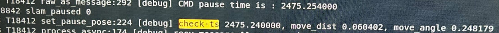 | 实测最大角度可达到23°，日志：  |
| 原地搬起机器再放下                   | 否       | 距离和角度不满足搬动阈值       | 是          | 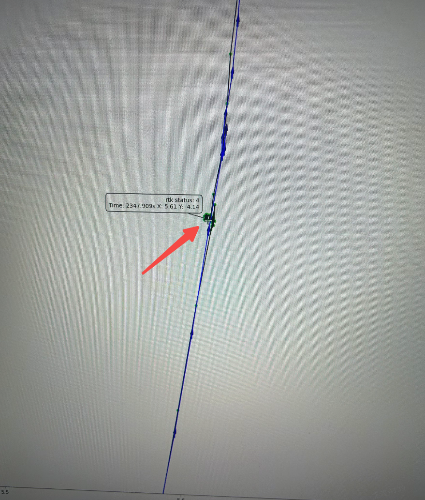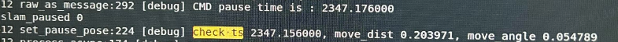 |                   |
| 原地搬起机器旋转再放下                 | 是       | 角度达到阈值，检测是否重定超时    | 重定位成功后定位正常 | 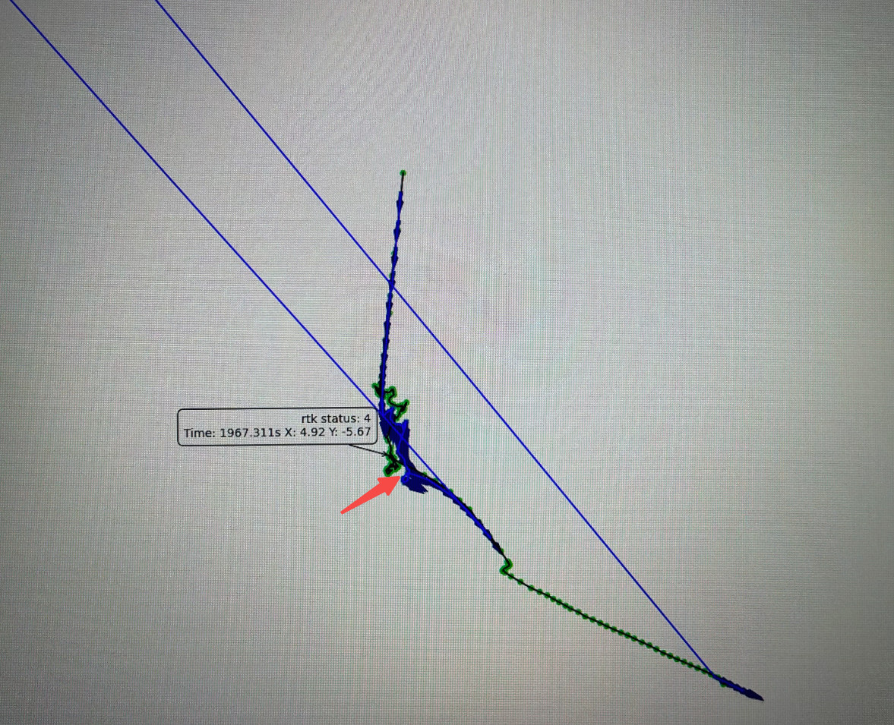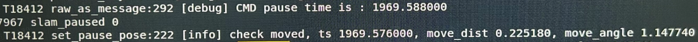 |                   |
| 直行拖动或搬动机器                   | 否       | 检测到yaw角收敛          | 是          | 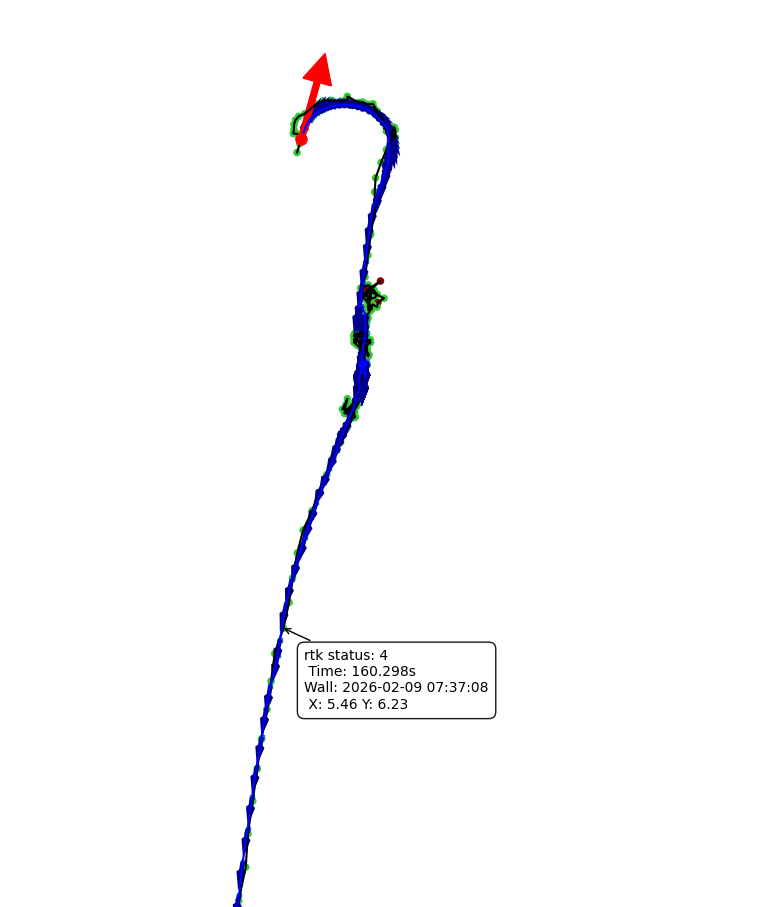yaw convergence detected , time: 160.198000, diff\_yaw -0.015302, dist, 0.036247    |                   |
| 搬动机器移动一段距离再放下               | 是       | 距离和角度达到阈值，检测是否重定超时 | 重定位成功后定位正常 | 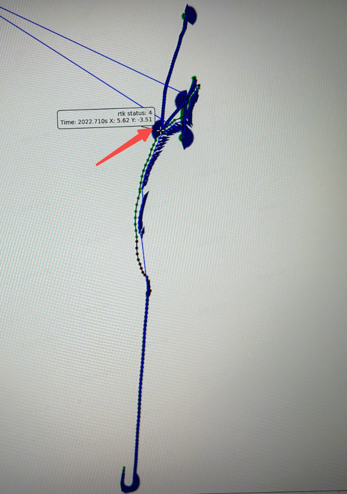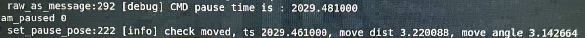 |                   |
| 拖拽机器                        | 是       | 距离和角度达到阈值，检测是否重定超时 | 重定位成功后定位正常 |                                                                                                                                                                        |                   |
| 机器弓字时搬出界，机器报出界后，在搬回地图内，点击割草 | 是       |                    | 重定位成功后定位正常 |                                                                                                                                                                        |                   |
| 原地静止12h                     |         |                    |            |                                                                                                                                                                        |                   |

| BUG                                                                                                                                          | 优化前                                                                                 | 优化后                                                                                  | 备注                                                                                                         |
| -------------------------------------------------------------------------------------------------------------------------------------------- | ----------------------------------------------------------------------------------- | ------------------------------------------------------------------------------------ | ---------------------------------------------------------------------------------------------------------- |
| Bug#468391 - 【V1机器】\[V1572]\[B3-258]\[外场-78栋]弓字割草时，轨迹出现偏移http://192.168.111.52/index.php?m=bug\&f=view\&t=html&=\&bugID=468391               | 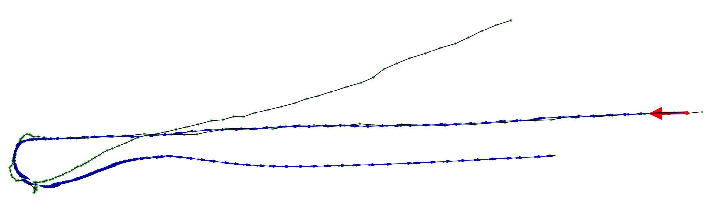 | 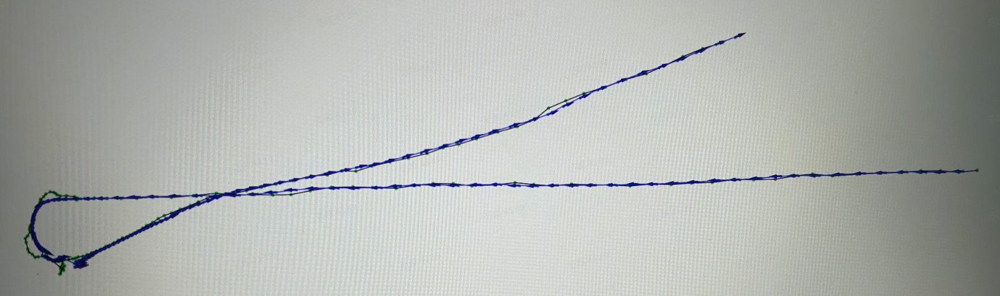  | 问题得以解决，暂停期间，位置会继续更新                                                                                        |
| Bug#474619 - \[v2332]\[B3-139]\[公园全流程] 机器人夜间进行弓子割草，机器人割出地图外（1/1)http://192.168.111.52/index.php?m=bug\&f=view\&t=html&=\&bugID=474619        | 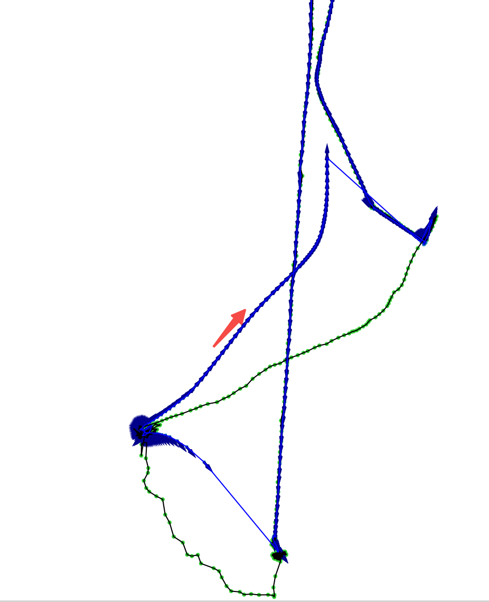 |  | 暂停时更新pose，会检测到搬动，触发重定位（原因：检查yaw收敛时间超阈值），重定位成功后定位正常                                                         |
| Bug#470610 - \[RC分支]\[v5470]\[外场78]机器弓字时搬出界，机器报出界后，在搬回地图内，点击割草，机器还是播报出界http://192.168.111.52/index.php?m=bug\&f=view\&t=html&=\&bugID=470610 | 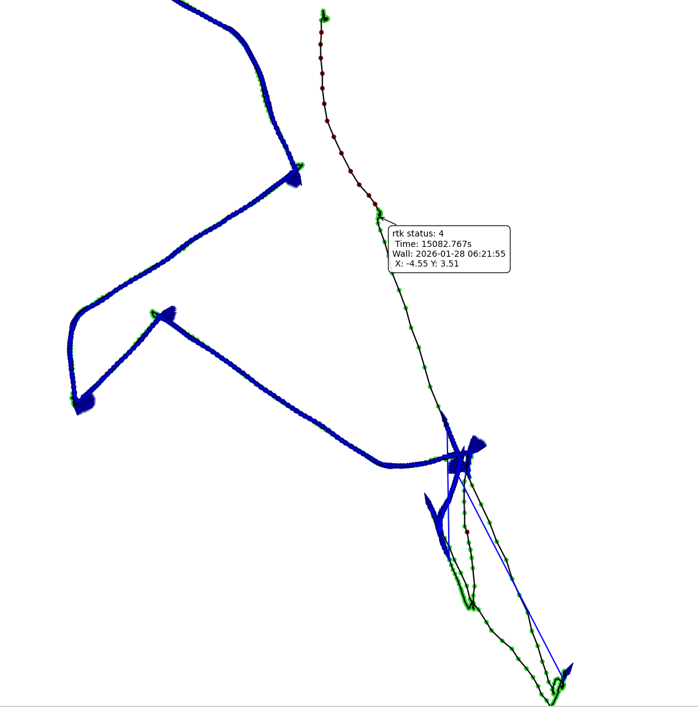 |   | 优化后，在暂停期间搬动机器，pose会随之更新，在搬回地图内，点割草，slam会检查到搬动，触发重定位。                                                       |
| Bug#464423 - 【产品自测】建禁区后点回充，不能回充，搬走之后再点，没有定位动作，也不能回充http://192.168.111.52/index.php?m=bug\&f=view\&t=html&=\&bugID=464423                     | 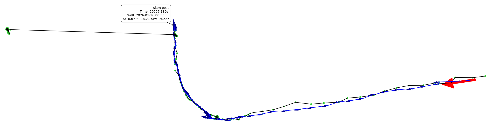 |                                                                                      | 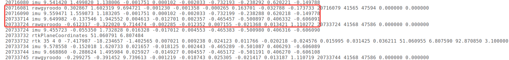发生问题的时间段内缺少原始传感器数据，无法仿真 |

测试用例：

| 测试动作                        | 测试次数/触发重定位次数                  |
| --------------------------- | ----------------------------- |
| 割草过程中，机器直行时暂停，未做任何搬动，再恢复    | 30/0                          |
| 割草过程中，机器转弯掉头时暂停，未做任何搬动，再恢复  | 50/0                          |
| 割草过程中，点暂停后，原地搬起机器再放下，再恢复    | 30/0                          |
| 割草过程中，点暂停后，原地搬起机器旋转再放下，再恢复  | 30/1                          |
| 割草过程中，点暂停后，直行拖动或搬动机器，再恢复    | 40/3                          |
| 割草过程中，搬动机器移动一段距离再放下，再恢复     | 30/2                          |
| 割草过程中，点暂停后，拖拽机器，再恢复         | 30/3                          |
| 机器弓字时搬出界，机器报出界后，在搬回地图内，点击割草 | 10/0                          |
| 回充中搬动机器，然后放下                |                 （搬动超过两秒）20/20 |

