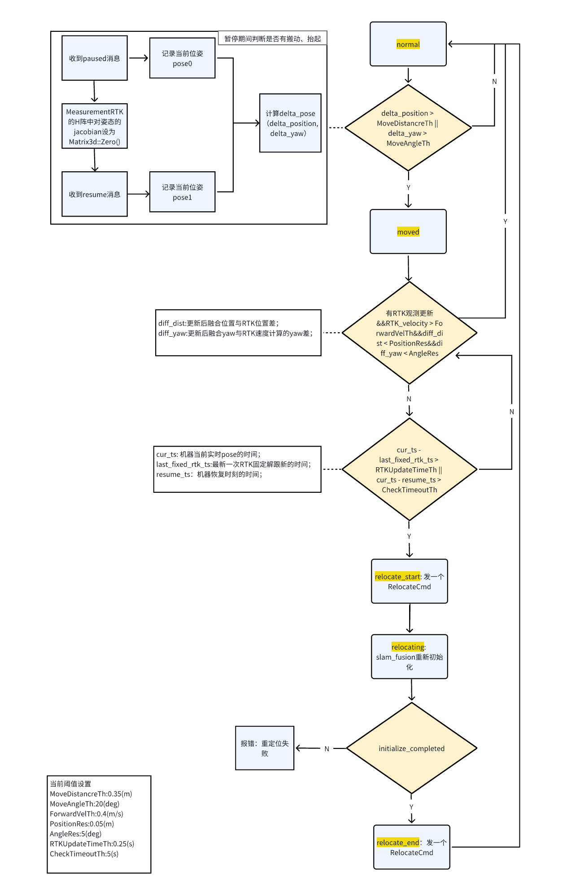

# 搬动重定位融合模块

| 条件                 | 变量              | 阈值        | 说明                                           |
| ------------------ | --------------- | --------- | -------------------------------------------- |
| 检测是否有搬动            | MoveDistancreTh | 0.35(m)   | 检测是否有搬动的距离阈值                                 |
|                    | MoveAngleTh     | 20(deg)   | 测是否有搬动的角度阈值                                  |
| 检测到搬动后，是否可以不需要走重定位 | ForwardVelTh    | 0.4(m/s)  | 检测到有搬动后，判断是否需要触发重定位的速度阈值                     |
|                    | PositionRes     | 0.05(m)   | 检测到有搬动后，判断是否需要触发重定位的位置残差阈值                   |
|                    | AngleRes        | 5(deg)    | 检测到有搬动后，判断是否需要触发重定位的角度残差阈值                   |
| 检测到搬动后，直接进入重定位     | RTKUpdateTimeTh | 0.25(s)   | 检测到有搬动后，判断是否有RTK固定解阈值                        |
|                    | CheckTimeoutTh  | 15(s)     | 检测到有搬动后，在有RTK固定解的条件下，判断是否需要触发重定位的最大延迟时间      |
|                    | CheckDistanceTh | 1.5(m)    | 检测到有搬动后，在有RTK固定解的条件下，判断是否需要触发重定位,机器行走的最大累积距离 |

