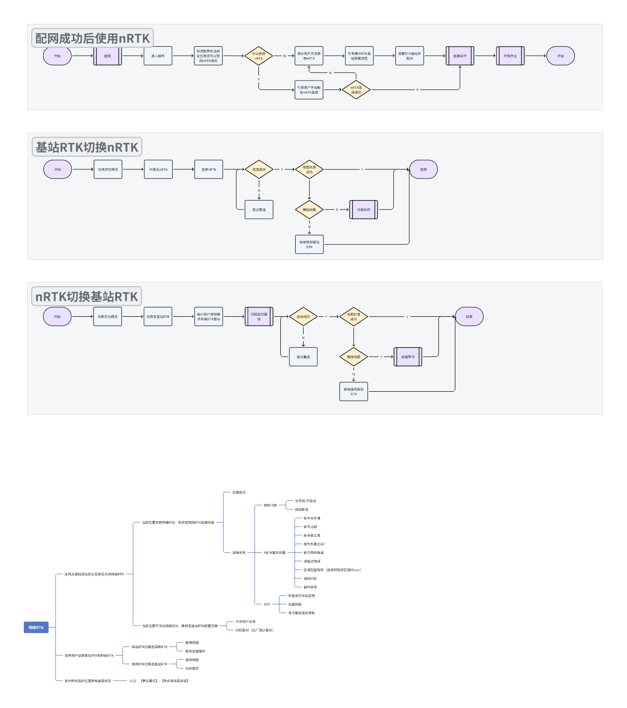
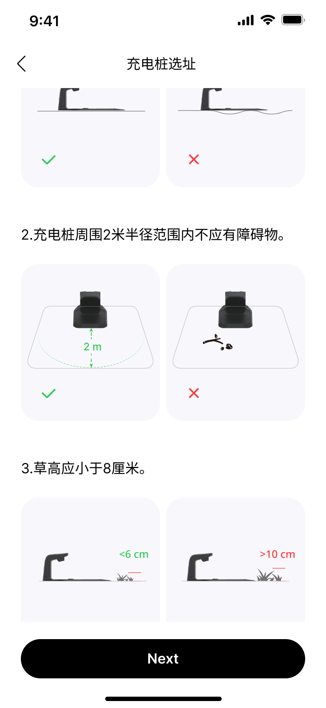
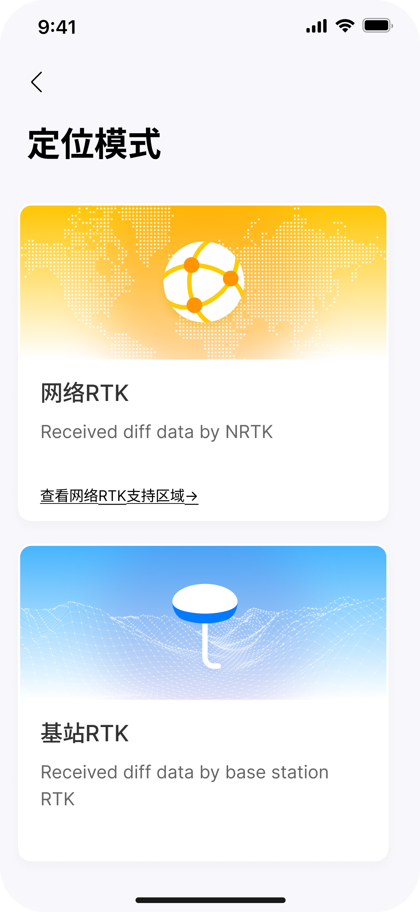
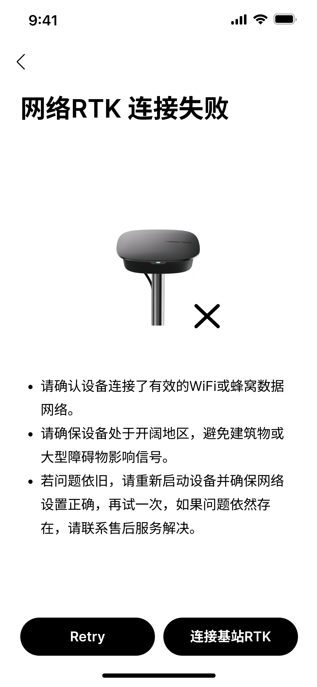
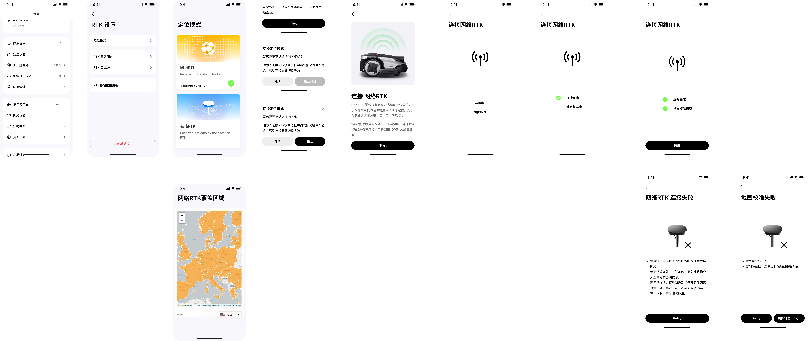
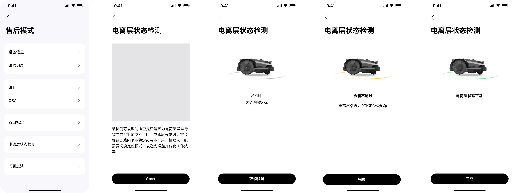
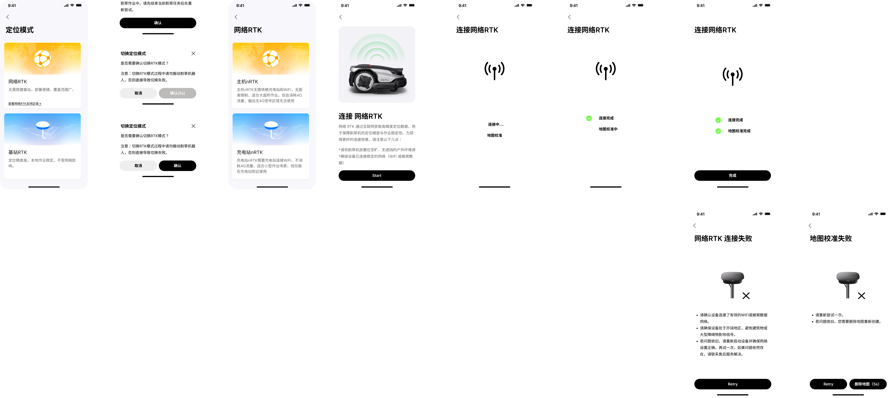
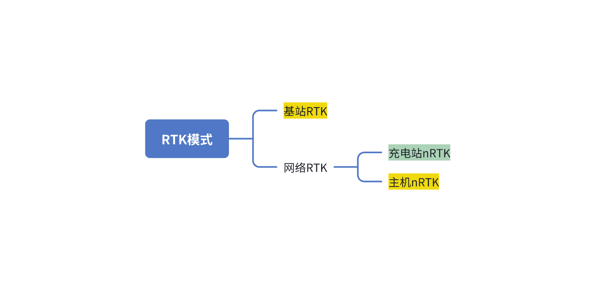

# 网络RTK

# 修订纪要

| 版本   | 变更时间     | 变更记录 | 变更人 |
| ---- | -------- | ---- | --- |
| V0.1 | 2026/1/9 |      |     |
| V0.2 | 2026/3/5 |      |     |

# 1. 需求概述

当前割草机器人高精度定位主要依赖本地 RTK 基站，但在部分使用场景中存在如下问题：

* 用户部署基站成本高、步骤复杂

* 基站位置受限，影响定位稳定性

* 部分用户希望即开即用，减少硬件依赖

为提升用户体验并降低使用门槛，引入 nRTK 网络差分定位服务，作为基站 RTK 的补充或替代方案。

# 2. 功能关联

1. 绑定RTK基站

# 3. 流程图

# 4. 功能设计

### 4.1 支持初次使用检测网络RTK是否可用

| **模块描述** | 通过一开始检测用户所在区域是否可以直接使用网络RTK，来提升用户安装部署的便携性，如果用户所在区域支持网络RTK则可以减少配置基站RTK的流程，提升部署安装效率；否则用户需要部署RTK基站来实现效果。 |                                                                                                                                                                                                                                                                                                                                                                                                                                                                                                                    |
| -------- | ---------------------------------------------------------------------------------------------------- | ------------------------------------------------------------------------------------------------------------------------------------------------------------------------------------------------------------------------------------------------------------------------------------------------------------------------------------------------------------------------------------------------------------------------------------------------------------------------------------------------------------------ |
| **前置条件** |                                                                                                      |                                                                                                                                                                                                                                                                                                                                                                                                                                                                                                                    |
| **操作路径** |                                                                                                      |                                                                                                                                                                                                                                                                                                                                                                                                                                                                                                                    |
| **需求说明** |                                                                                                      |  |
| **补充说明** |                                                                                                      |                                                                                                                                                                                                                                                                                                                                                                                                                                                                                                                    |

### 4.2 支持用户手动切换网络RTK和基站RTK

| **模块描述** | 为了提高产品应对不同复杂场景的能力，当用户当前所用的RTK模式不可用或者发生异常场景，支持用户手动切换至另外一种RTK模式，以此来提升用户的使用体验，降低机器因为RTK模式异常变砖的风险。 |                                                                                                                                                                        |
| -------- | ---------------------------------------------------------------------------------------------- | ---------------------------------------------------------------------------------------------------------------------------------------------------------------------- |
| **前置条件** |                                                                                                |                                                                                                                                                                        |
| **操作路径** | 【设置】-【RTK设置】-【RTK模式】                                                                           |                                                                                                                                                                        |
| **需求说明** | **【功能点】支持用户手动切换RTK模式**                                                                         |  |
| **补充说明** |                                                                                                |                                                                                                                                                                        |

### 4.3 支持售后服务检测当前位置电离层状态

| **模块描述** | 当用户端尝试了所有方式恢复网络RTK的连接还无法连接成功，反馈至售后时，售后处理问题时，其中一项是需要确认用户当前所处位置的电离层状态 |                                                                                      |
| -------- | ------------------------------------------------------------------- | ------------------------------------------------------------------------------------ |
| **前置条件** |                                                                     |                                                                                      |
| **操作路径** | 【设置】-【售后模式】-【检测电离层状态】                                               |                                                                                      |
| **需求说明** | **【功能点】支持检测设备当前所处位置的电离层状态**                                         |   |
| **补充说明** |                                                                     |                                                                                      |

### 4.4 网络RTK启用时间以及网络异常时处理逻辑

| **模块描述** |                                                                                                                                                                                                                                                                                                                                                                                                                   |   |
| -------- | ----------------------------------------------------------------------------------------------------------------------------------------------------------------------------------------------------------------------------------------------------------------------------------------------------------------------------------------------------------------------------------------------------------------- | - |
| **前置条件** |                                                                                                                                                                                                                                                                                                                                                                                                                   |   |
| **操作路径** |                                                                                                                                                                                                                                                                                                                                                                                                                   |   |
| **需求说明** | **【功能点】网络RTK账号请求时间**方案一（废弃）：同需求[ 网络RTK](https://roborock.feishu.cn/wiki/PQbnwpaCSitmzCkYuZwcnKMAnFe#share-XsM6dVumPo4eY5x1PqgcEeCBnqe)，在新手引导执行过后保持网络RTK账号使用，后续开机后默认请求网络RTK账号并进行初始化，关机时断开网络RTK账号使用优点：建图、割草等功能不需要执行初始化，触发上述功能时RTK能够收敛缺点：持续损耗流量，目前2.5M/hr省流量方案补充**方案二：****请求和返还时机：**&#x6869;出/非桩出场景可以参考Lidar预热，桩出可以参考退桩6s+预热4s，非桩出就需要原地等待。优点：非使用网络RTK场景可以节省部分流量缺点：割草、建图、售后模式使用时均需要从云端请求并进行初始化，最差场景预计耗时10s左右空旷场景：1-2s |   |
|          | **【功能点】网络波动时NRTK处理策略（待讨论）**                                                                                                                                                                                                                                                                                                                                                                                       |   |
| **补充说明** |                                                                                                                                                                                                                                                                                                                                                                                                                   |   |

### 4.5 网络RTK for Gaia

| **模块描述** | Gaia充电站支持Lora，因此充电站可以支持网络RTK并通过充电站给割草机器人发送定位数据，因此需要支持充电站网络RTK和割草机RTK的切换 |                                                                                     |
| -------- | ----------------------------------------------------------------------- | ----------------------------------------------------------------------------------- |
| **前置条件** |                                                                         |                                                                                     |
| **操作路径** | 【设置】-【RTK模式】-【网络RTK】                                                    |                                                                                     |
| **需求说明** | **【功能电】基站RTK配对方案变更**                                                    |                                                                                     |
|          | **【功能点】支持新手引导选择网络RTK类型默认使用主机nRTK**                                      |                                                                                     |
|          | **【功能点】支持用户在设置页面切换网络RTK时选择类型**                                          |  |
|          | **【功能点】支持割草机充电站nRTK和主机nRTK自动切换（无感切换）**                                  |                                                                                     |
| **补充说明** |                           |                                                                                     |

