# **2026-02-05**

## `@李岩`

1. RTK假固定解判断[ 假固定处理2.0](https://roborock.feishu.cn/wiki/CON8wZyytiuvLvkwFQfcIF55nRg)

   1. 回归一下测试采集的通道数据

   2. 接导航通道消息

      1. 在通道里使用更激进参数

   3. 版本：

      1. 在非通道内，版本2.0

      2. 区分在通道内的逻辑，版本3.0

      3. 测试2.0版本下，强穿是否有用

      4. 推给用户的版本是3.0

      5. 未来的版本：延边避障

      6. 让测试在非通道区域测试2.0版本

   4. RTK-odo align线程，只有在和滤波器yaw差距过大时使用

      1. `@范超`可以把此线程的阈值放大一些

2. imu递推，odo速度更新，RTK速度更新

   1. 尺度因子（静止时计算）/g加入状态量

   

   * 在有IMU+RTK更新的时候，roll角会发散

   * 互补滤波：[ ZYF176数据分析](https://roborock.feishu.cn/wiki/J6Gmw7UujideOGkNdzKcgpnvnBe) [ 互补滤波数据测试](https://roborock.feishu.cn/wiki/X3gKwFnz1ioXgwkzCyrcwhe0nXf)

   * pr

   * 割草机数据回归，比较后轴IMU，斜坡数据

3. rtk\_odo对齐+平滑优化：[ 自测结果优化：1211](https://roborock.feishu.cn/wiki/O0iNwNGRIidrG0klRZvcpo1GnUp)（无更新）

4. 速度更新航向：[ 航向角收敛测试](https://roborock.feishu.cn/wiki/ULMTwPVy9irtjykFtggcKv9Xnfb)

   1. odo速度递推

   2. 航向更新在速度更新下是否更快

   3. 调过bg之后，在RTK纯位置的情况下，航向的更新会加快

## `@范超`

1. RTK阴影区两段出桩（Done）

   1. 退桩过程中可以使用vio的结果[ RTK阴影区两段退桩定位-导航接口](https://roborock.feishu.cn/wiki/F02CwiiTbimDNrkpDfccmrAxntf?open_in_browser=true)

      1. pr&#x20;

   &#x20;[ RTK阴影区出桩初始化自测](https://roborock.feishu.cn/wiki/R4zWw8ix8iBYdAkheZdc4lnHnKc)

2. RTK-odo线程仿真 [ Rtk-odo align仿真](https://roborock.feishu.cn/wiki/T1jkwJurriX5EUkylAPcFDgynih)

3. Module fusion的计算部分移出dispatch，避免dispatch线程阻塞

   1. Pr

   2. 上机测试

4. 欧区云桌面配置（1.23）

   1. plot\_rtk, butchart\_convertor.py

   2. 22.04装了neotic的ROS，改一下仿真包的文件

   3. python3快捷键.py

   4. 集成到脚本中

5. 机器搬动处理（2.9联调，3.6合入） [ 搬动优化工作计划表](https://roborock.feishu.cn/wiki/T1mhwx6L9iv82tkwhnvc9wZAndd)

   1. 减少搬动重定位次数

      1. 需求：搬动出界之后不报出界

      2. 需求：搬动的时候是否显示轨迹

   2. 抬起之后换成新的更新方式

      1. 抬起之后，yaw角在一段时间之内是否能误差不大

   3. 看看是否检测抬起&#x20;

   4. 由slam决定是否进行重定位

6. odo积分与RTK比较，合入data\_toolkit&#x20;

   1. 代码pr&#x20;

      1. 用vio\_estimate\_3d和RTK比较

   2. 比较odo递推和RTK比较，odo递推和vslam结果

      1. [ Benchmark表格](https://roborock.feishu.cn/base/NkuabkuL5aD5EJsnQVZcd6AwnQh?table=tbl2Nx8Wv6PVFZHJ\&view=vewSSGrCzN)，用benchmark/放羊数据，Vslam reset有没有做处理

   3. 把gyro bias打印到日志

## `@刘宏伟`

1. fast-livo2

   1. 上机：

      1. Fast livo搞一个slam module&#x20;

         * pr

      2. plugins：接入点云数据，机器上的lidar, imu, odo的格式转换，接入gdc图片

         1. Pr

2. 本周进展

   1. 雷达割草机、RTK视觉割草机Bug分析（P0）

   2. FAST-LIVO2接入 SLAM\_WorkSpace（已合入，DONE）

   3. FAST-LIVO2接入 reset （PR，上机测没问题）

   4. FAST-LIVO2实现分批量IO保存点云，接入reset应对雷达断流回桩存图，机器上桩后拼好点云。（调试好了，PR）

   5. 和导航联调接入通道信息。等待导航代码写好，代码已PR

   6. 观测延迟到来导致融合位姿成波浪线的case  [ 观测延迟更新对融合输出位姿的影响](https://roborock.feishu.cn/wiki/BJwEw7838ilyspkv3Meci8dSnge)

   7. 反馈雷达IMU异常（DONE）

   8. 降本雷达使用slampose去拼点云（TODO）

3. 给售后出一个售后文档 （TODO）

## `@茹毅超`

1. RTK新字段看数据 （2.3）[ 960E标志位分析](https://roborock.feishu.cn/wiki/QpB9wuoemiUCjEkAfqRcqKOsncg?from=from_copylink)

   * 只有960私版和960E的RTK模组的机器有此字段，普通960版本还没有

     1. 在RTK差的环境下测试该RTK版本

     2. 新加阈值，对假固定解的影响

2. NRTK接入 `@李威`(2.6)

   1. 给出的坐标是经纬高的形式，用第一个固定解做原点

      1. 代码

         1. pr

         2. 把地图原点坐标发给导航

         3. 投影方式是否有影响

         4. 数据广播精度损失（小数点之后11位），时间延迟

   2. 降低RTK频率，对融合定位的影响 [ rtk降频对融合定位的影响](https://roborock.feishu.cn/wiki/AG7ywC3tNiwN6wk6vxucD2renoh)

      1. 与RTK频率相关的参数要做适配，确认一下Butchart/Monet进NRTK的时间点，hotfix时间 `@李威`

         1. Butchart/Monet是5月，Gaia是7月

3. versa项目融合模块代码

   1. 追查一下自测和软测测试的不同

   &#x20;   [ versa轨迹平滑](https://roborock.feishu.cn/wiki/KM4AwgojtiJbnckAJmscFBbrnt8?from=from_copylink)

4. 三维重建的开源算法调研&#x20;

   &#x20;初步[ 点云渲染调研](https://roborock.feishu.cn/wiki/RGj9wY4Qwi8oM6kni8BciPypn3d)

   &#x20;   [ 3dgs在 ubuntu20 配置手册](https://roborock.feishu.cn/wiki/FSS1wfJFHiJ4J6kmBgycA0SSnQg?from=from_copylink)

   1. 常见开源算法调研

      1. 3dgs-slam算法调研

   &#x20;       [ Slam和3dgs调研](https://roborock.feishu.cn/wiki/OoJ1wp5I9iQF2Mk0QS2cZqiknVf?from=from_copylink)

5. RTK基站坐标会从RRLDR\_fprintf.log改到RTK\_reference\_station\_info.log，适配logparser

   1. RTK基站坐标用0填充了

   2. 差分龄期数据有问题`@姚远`

6. [ 高温70度\_imu\_bias统计](https://roborock.feishu.cn/wiki/CufYwOTwdi8QgkkKTQccu92Vnic?from=from_copylink)

7. &#x20;慢速打滑，平滑操作对于位置恢复的影响

# **2026-01-29**

## `@李岩`

1. RTK假固定解判断[ 假固定处理2.0](https://roborock.feishu.cn/wiki/CON8wZyytiuvLvkwFQfcIF55nRg)

   1. 回归一下测试采集的通道数据

   2. 出个包给软测测试

   3. 接导航通道消息

      1. 在通道里才使用该方案

      2. 在通道里使用更激进参数

2. imu递推，odo速度更新，RTK速度更新

   1. 尺度因子（静止时计算）/g加入状态量

   

   * 在有IMU+RTK更新的时候，roll角会发散

   * 互补滤波：[ ZYF176数据分析](https://roborock.feishu.cn/wiki/J6Gmw7UujideOGkNdzKcgpnvnBe) [ 互补滤波数据测试](https://roborock.feishu.cn/wiki/X3gKwFnz1ioXgwkzCyrcwhe0nXf)

   * pr

   * 割草机数据回归，比较后轴IMU，斜坡数据

3. rtk\_odo对齐+平滑优化：[ 自测结果优化：1211](https://roborock.feishu.cn/wiki/O0iNwNGRIidrG0klRZvcpo1GnUp)（无更新）

4. 速度更新航向：[ 航向角收敛测试](https://roborock.feishu.cn/wiki/ULMTwPVy9irtjykFtggcKv9Xnfb)

   1. odo速度递推

   2. 航向更新在速度更新下是否更快

   3. 调过bg之后，在RTK纯位置的情况下，航向的更新会加快

## `@范超`

1. RTK阴影区两段出桩

   1. 退桩过程中可以使用vio的结果[ RTK阴影区两段退桩定位-导航接口](https://roborock.feishu.cn/wiki/F02CwiiTbimDNrkpDfccmrAxntf?open_in_browser=true)

      1. pr&#x20;

   &#x20;[ RTK阴影区出桩初始化自测](https://roborock.feishu.cn/wiki/R4zWw8ix8iBYdAkheZdc4lnHnKc)

2. RTK-odo线程仿真 [ Rtk-odo align仿真](https://roborock.feishu.cn/wiki/T1jkwJurriX5EUkylAPcFDgynih)

3. Module fusion的计算部分移出dispatch，避免dispatch线程阻塞

   1. Pr

   2. 上机测试

4. 欧区云桌面配置（1.23）

   1. plot\_rtk, butchart\_convertor.py （Done）

   2. 22.04装了neotic的ROS，改一下仿真包的文件（Done）

   3. python3快捷键.py

   4. 集成到脚本中

5. 机器搬动处理（2.9联调，3.6合入）

   1. 减少搬动重定位次数

      1. 需求：搬动出界之后不报出界

      2. 需求：搬动的时候是否显示轨迹

   2. 抬起之后换成新的更新方式

      1. 抬起之后，yaw角在一段时间之内是否能误差不大

   3. 看看是否检测抬起&#x20;

   4. 落下之后给导航的新的标志位，inited=2

   5. 由slam决定是否进行重定位

6. odo积分与RTK比较，合入data\_toolkit&#x20;

   1. 代码pr&#x20;

      1. 用vio\_estimate\_3d和RTK比较

   2. 比较odo递推和RTK比较，odo递推和vslam结果

      1. [ Benchmark表格](https://roborock.feishu.cn/base/NkuabkuL5aD5EJsnQVZcd6AwnQh?table=tbl2Nx8Wv6PVFZHJ\&view=vewSSGrCzN)，用benchmark/放羊数据，Vslam reset有没有做处理

   3. 把gyro bias打印到日志

## `@刘宏伟`

1. fast-livo2

   1. 上机：

      1. Fast livo搞一个slam module&#x20;

         * pr

      2. plugins：接入点云数据，机器上的lidar, imu, odo的格式转换，接入gdc图片

         1. Pr

2. 假固定解位置、速度标准差统计（1.23）

3. 本周进展

   1. 专利核稿（DONE）

   2. 融合BUG：多线BUG分析复现，已合入。（1.27） [ BUG #468220、#464633 复现分析](https://roborock.feishu.cn/wiki/JxCGwK9hSivrbkku5Uvcx3WjnGc)

   3. 多线仿真改进：由于多线没有初始化逻辑，仿真yaw角收敛较慢，针对这一现象对仿真进行改进，针对bug适配Set slam mode和set pose 3d逻辑，代码PR，已合入。（1.27）

   4. FAST-LIVO2：进slam-workspace 代码PR，已修改完，待合入。（1.26）

   5. 假固定解数据分析：分析假固定解数据，分析是否能找出一个速度标准差、位置标准差拒绝掉假固定解。[ RTK 假固定解判定方法研究与实验分析（基于标准差阈值与机器学习） -- 20260123v1](https://roborock.feishu.cn/wiki/M1TzwA4xEibGUdkMxpIcrQ0HnIe)（1.23）

   6. 融合bug分析（P0）

   7. Airy Lite雷达三维重建摸底：airy Lite数据采集，没有标定数据，用结构参数跑的。[ Flora &amp; VersaPro三维重建效果摸底 - 20260128](https://roborock.feishu.cn/wiki/OaURwWtKqirMuFkj8GxcAB8dnyh)（1.28）（DONE）

   8. FAST-LIVO2接入 reset （在测）

4. 给售后出一个售后文档 （TODO）

## `@茹毅超`

1. 单点解精度统计[ RTK单点解精度分析](https://roborock.feishu.cn/wiki/SMPSwqeyViHux8k8ENlcseKangf)（Done）

   1. 找一些RTK较差数据，看一下较差精度

   2. 单点解和固定解的位移差，是否会包含在单点解的k sigma之内

2. RTK新字段看数据 （2.3）[ 960E标志位分析](https://roborock.feishu.cn/wiki/QpB9wuoemiUCjEkAfqRcqKOsncg?from=from_copylink)

   * 只有960私版和960E的RTK模组的机器有此字段，普通960版本还没有

     1. 在RTK差的环境下测试该RTK版本

     2. 新加阈值，对假固定解的影响

3. NRTK接入 `@李威`(2.6)

   1. 给出的坐标是经纬高的形式，用第一个固定解做原点

      1. 地图维护原点经纬高

      2. 代码

         1. pr

         2. 把地图原点坐标发给导航

   2. 降低RTK频率，对融合定位的影响 [ rtk降频对融合定位的影响](https://roborock.feishu.cn/wiki/AG7ywC3tNiwN6wk6vxucD2renoh)

      1. 与RTK频率相关的参数要做适配，确认一下Butchart/Monet进NRTK的时间点，hotfix时间 `@李威`

4. versa项目融合模块代码

   1. 追查一下自测和软测测试的不同

   &#x20;   [ versa轨迹平滑](https://roborock.feishu.cn/wiki/KM4AwgojtiJbnckAJmscFBbrnt8?from=from_copylink)

5. 三维重建的开源算法调研&#x20;

   &#x20;初步[ 点云渲染调研](https://roborock.feishu.cn/wiki/RGj9wY4Qwi8oM6kni8BciPypn3d)

   &#x20;   [ 3dgs在 ubuntu20 配置手册](https://roborock.feishu.cn/wiki/FSS1wfJFHiJ4J6kmBgycA0SSnQg?from=from_copylink)

   1. 常见开源算法调研

      1. 3dgs-slam算法调研

   &#x20;       [ Slam和3dgs调研](https://roborock.feishu.cn/wiki/OoJ1wp5I9iQF2Mk0QS2cZqiknVf?from=from_copylink)

6. RTK假固定解在暂停的时候误判（在暂停中计算统一处理）

   1. 暂停之后清一下rtkfixchecker

   2. 仿真没复现

7. Gyro bias打印日志（Done）

8. RTK基站坐标会从RRLDR\_fprintf.log改到RTK\_reference\_station\_info.log，适配logparser

## `@林子越`

1. 测试用例：夜间割草

   1. RTK等效，RTK热力图

2. 适配一下plugins源码编译

   1. 能编译过，会安装多余的lib和cmake

# **2026-01-22**

## `@李岩`

1. imu递推，odo速度更新，RTK速度更新

   1. 尺度因子（静止时计算）/g加入状态量

   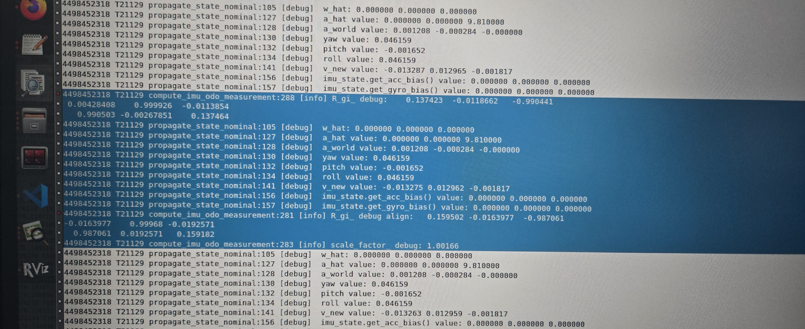

   * 在有IMU+RTK更新的时候，roll角会发散

   * 互补滤波：[ ZYF176数据分析](https://roborock.feishu.cn/wiki/J6Gmw7UujideOGkNdzKcgpnvnBe) [ 互补滤波数据测试](https://roborock.feishu.cn/wiki/X3gKwFnz1ioXgwkzCyrcwhe0nXf)

   * pr

   * 割草机数据回归，比较后轴IMU，斜坡数据

2. rtk\_odo对齐+平滑优化：[ 自测结果优化：1211](https://roborock.feishu.cn/wiki/O0iNwNGRIidrG0klRZvcpo1GnUp)（无更新）

3. 速度更新航向：[ 航向角收敛测试](https://roborock.feishu.cn/wiki/ULMTwPVy9irtjykFtggcKv9Xnfb)

   1. odo速度递推

   2. 航向更新在速度更新下是否更快

   3. 调过bg之后，在RTK纯位置的情况下，航向的更新会加快

## `@范超`

1. RTK阴影区两段出桩

   1. 退桩过程中可以使用vio的结果[ RTK阴影区两段退桩定位-导航接口](https://roborock.feishu.cn/wiki/F02CwiiTbimDNrkpDfccmrAxntf?open_in_browser=true)

      1. pr&#x20;

   2. 状态机自检改动：阴影区已经能出桩

   3. 联调时间同步`@周晓旭` [ RTK阴影区出桩初始化自测](https://roborock.feishu.cn/wiki/R4zWw8ix8iBYdAkheZdc4lnHnKc)

2. RTK-odo线程仿真 [ Rtk-odo align仿真](https://roborock.feishu.cn/wiki/T1jkwJurriX5EUkylAPcFDgynih)

3. Module fusion的计算部分移出dispatch，避免dispatch线程阻塞

   1. Pr

   2. 上机测试

4. 建图时RTK 1min无固定解，策略改为至少1min无固定解，且视觉移动距离超过20m（Done）

5. 搬动重定位打断了主动重定位（Done）

6. 欧区云桌面配置（1.23）

   1. plot\_rtk, butchart\_convertor.py

   2. 装一个18.04的docker，出包仿真也要能跑

7. 机器搬动处理

   1. 减少重定位

8. odo积分与RTK比较，合入data\_toolkit&#x20;

   1. 代码pr&#x20;

      1. 用vio\_estimate\_3d和RTK比较

   2. 比较odo递推和RTK比较，odo递推和vslam结果

      1. [ Benchmark表格](https://roborock.feishu.cn/base/NkuabkuL5aD5EJsnQVZcd6AwnQh?table=tbl2Nx8Wv6PVFZHJ\&view=vewSSGrCzN)，用benchmark/放羊数据，Vslam reset有没有做处理

   3. 把gyro bias打印到日志

## `@刘宏伟`

1. fast-livo2

   1. 上机：

      1. Fast livo搞一个slam module&#x20;

         * pr

      2. plugins：接入点云数据，机器上的lidar, imu, odo的格式转换，接入gdc图片

         1. Pr

2. 假固定解位置、速度标准差统计（1.23）

3. 本周进展

   1. 专利核稿（DONE）

   2. 融合BUG：多线BUG分析复现，已合入。（1.27） [ BUG #468220、#464633 复现分析](https://roborock.feishu.cn/wiki/JxCGwK9hSivrbkku5Uvcx3WjnGc)

   3. 多线仿真改进：由于多线没有初始化逻辑，仿真yaw角收敛较慢，针对这一现象对仿真进行改进，针对bug适配Set slam mode和set pose 3d逻辑，代码PR，已合入。（1.27）

   4. FAST-LIVO2：进slam-workspace 代码PR，已修改完，待合入。（1.26）

   5. 假固定解数据分析：分析假固定解数据，分析是否能找出一个速度标准差、位置标准差拒绝掉假固定解。[ RTK 假固定解判定方法研究与实验分析（基于标准差阈值与机器学习） -- 20260123v1](https://roborock.feishu.cn/wiki/M1TzwA4xEibGUdkMxpIcrQ0HnIe)（1.23）

   6. 融合bug分析（P0）

   7. Airy Lite雷达三维重建摸底：airy Lite数据采集，没有标定数据，用结构参数跑的。[ Flora  VersaPro三维重建摸底](https://roborock.feishu.cn/wiki/OaURwWtKqirMuFkj8GxcAB8dnyh)（1.28）（DONE）

   8. FAST-LIVO2接入 reset （在测）

4. 给售后出一个售后文档 （TODO）

## `@茹毅超`

1. 单点解精度统计[ RTK单点解精度分析](https://roborock.feishu.cn/wiki/SMPSwqeyViHux8k8ENlcseKangf)

   1. 找一些RTK较差数据，看一下较差精度

   2. 单点解和固定解的位移差，是否会包含在单点解的k sigma之内

2. RTK新字段看数据&#x20;

   * 只有960私版和960E的RTK模组的机器有此字段，普通960版本还没有

     1. 在RTK差的环境下测试该RTK版本

     2. 新加阈值，对假固定解的影响

3. NRTK接入 `@李威`

   1. 给出的坐标是经纬高的形式，用第一个固定解做原点

      1. 地图维护原点经纬高

      2. 代码在写

   2. 降低RTK频率，对融合定位的影响 [ rtk降频对融合定位的影响](https://roborock.feishu.cn/wiki/AG7ywC3tNiwN6wk6vxucD2renoh)

      1. 与RTK频率相关的参数要做适配

4. versa项目融合模块代码

   1. 追查一下自测和软测测试的不同

   &#x20;   [ versa轨迹平滑](https://roborock.feishu.cn/wiki/KM4AwgojtiJbnckAJmscFBbrnt8?from=from_copylink)

5. 三维重建的开源算法调研&#x20;

   &#x20;初步[ 点云渲染调研](https://roborock.feishu.cn/wiki/RGj9wY4Qwi8oM6kni8BciPypn3d)

   &#x20;   [ 3dgs在 ubuntu20 配置手册](https://roborock.feishu.cn/wiki/FSS1wfJFHiJ4J6kmBgycA0SSnQg?from=from_copylink)

   1. 常见开源算法调研

      1. 3dgs-slam算法调研

   &#x20;       [ Slam和3dgs调研](https://roborock.feishu.cn/wiki/OoJ1wp5I9iQF2Mk0QS2cZqiknVf?from=from_copylink)

## `@林子越`

1. 测试用例：夜间割草

   1. RTK等效，RTK热力图

2. 适配一下plugins源码编译

   1. 能编译过，会安装多余的lib和cmake

# **2026-01-15**

## `@李岩`

1. imu递推，odo速度更新，RTK速度更新

   1. 尺度因子（静止时计算）/g加入状态量

   

   * 在有IMU+RTK更新的时候，roll角会发散

   * 互补滤波：[ ZYF176数据分析](https://roborock.feishu.cn/wiki/J6Gmw7UujideOGkNdzKcgpnvnBe) [ 互补滤波数据测试](https://roborock.feishu.cn/wiki/X3gKwFnz1ioXgwkzCyrcwhe0nXf)

     1. pr

   * 割草机数据回归，比较后轴IMU，斜坡数据

2. rtk\_odo对齐+平滑优化：[ 自测结果优化：1211](https://roborock.feishu.cn/wiki/O0iNwNGRIidrG0klRZvcpo1GnUp)（无更新）

3. 速度更新航向：[ 航向角收敛测试](https://roborock.feishu.cn/wiki/ULMTwPVy9irtjykFtggcKv9Xnfb)

   1. odo速度递推

   2. 航向更新在速度更新下是否更快

   3. 调过bg之后，在RTK纯位置的情况下，航向的更新会加快

4. U型弯轨迹平滑

   1. pr

## `@范超`

1. RTKImageChecker内存泄漏（Done）

2. odo积分与RTK比较，合入data\_toolkit （P1）

   1. 代码pr&#x20;

      1. 用vio\_estimate\_3d和RTK比较

   2. 比较odo递推和RTK比较，odo递推和vslam结果

      1. [ Benchmark表格](https://roborock.feishu.cn/base/NkuabkuL5aD5EJsnQVZcd6AwnQh?table=tbl2Nx8Wv6PVFZHJ\&view=vewSSGrCzN)，用benchmark/放羊数据，Vslam reset有没有做处理

   3. 把gyro bias打印到日志

3. RTK阴影区两段出桩

   1. 退桩过程中可以使用vio的结果[ RTK阴影区两段退桩定位-导航接口](https://roborock.feishu.cn/wiki/F02CwiiTbimDNrkpDfccmrAxntf?open_in_browser=true)

      1. initailizer前后的逻辑：不要跨浮点解，调整距离阈值

      2. pr

   2. 状态机自检改动

   3. 联调时间同步`@周晓旭`

4. RTK-odo线程仿真 [ Rtk-odo align仿真](https://roborock.feishu.cn/wiki/T1jkwJurriX5EUkylAPcFDgynih)

5. Module fusion的计算部分移出dispatch，避免dispatch线程阻塞

   1. pr待提

## `@刘宏伟`

1. fast-livo2

   1. 上机：

      1. Fast livo搞一个slam module&#x20;

         * pr

      2. plugins：接入点云数据，机器上的lidar, imu, odo的格式转换，接入gdc图片

         1. pr

2. 本周进展

   1. 给 RTK + 视觉割草机 & 激光割草机 适配enable rtk 和 enable mlslam参数，和`@茹毅超`对接激光那面的活。[ 多线融合仿真](https://roborock.feishu.cn/wiki/JF1YwOm6biXAVWkZbbocIGtanHc)

   2. 几个bug分析 ： [ BUG # 461208 存档](https://roborock.feishu.cn/wiki/ACC9wYv0ViqAXSk7ponc1xslnsd)&#x20;

   3. Versa放羊日志看内存和cpu占用：[ Versa放羊统计](https://roborock.feishu.cn/wiki/OAzkwoNdWi5IwXkrqmecp7lxnWh) 看了最近放羊日志的可用内存大小，最小大约是 1297 MB，CPU idle最少大约是 21.90%。

   4. 专利核稿

## `@茹毅超`

1. 建图60s RTK浮点解报错（Done）

2. RTK新字段看数据&#x20;

   * 只有960私版和960E的RTK模组的机器有此字段，普通960版本还没有

     1. 在RTK差的环境下测试该RTK版本

     2. 新加阈值，对假固定解的影响

3. NRTK接入 `@李威`

   1. 给出的坐标是经纬高的形式，用第一个固定解做原点

      1. 地图维护原点经纬高

   2. 可以单测模组，数据格式含义的变化

   3. https://github.com/geographiclib/geographiclib（我现在用的就是这个库，vinsfusion应该是精简了）

      1. RTK\_normal，找移动站经纬高数据

   4. 采NRTK数据，进行代码开发`@李威`

      1. 用模组+AP板采集NRTK数据：丢包率大，精度再看下

   5. 半双工全双工硬件，丢包率过高&#x20;

   &#x20;     开debug日志丢包率在16%左右。不开debug日志也在6-7%。

   &#x20;    [ NRTK 半双工测试](https://roborock.feishu.cn/wiki/Mp1fwzaPUiw8CAkiaACczn72n1f?from=from_copylink)

4. versa项目融合模块代码

   1. 待pr，1.16

   &#x20;   [ versa轨迹平滑](https://roborock.feishu.cn/wiki/KM4AwgojtiJbnckAJmscFBbrnt8?from=from_copylink)

5. 三维重建的开源算法调研&#x20;

   &#x20;初步[ 点云渲染调研](https://roborock.feishu.cn/wiki/RGj9wY4Qwi8oM6kni8BciPypn3d)

   &#x20;   [ 3dgs在 ubuntu20 配置手册](https://roborock.feishu.cn/wiki/FSS1wfJFHiJ4J6kmBgycA0SSnQg?from=from_copylink)

   1. 常见开源算法调研

      1. 3dgs-slam算法调研

   &#x20;       [ Slam和3dgs调研](https://roborock.feishu.cn/wiki/OoJ1wp5I9iQF2Mk0QS2cZqiknVf?from=from_copylink)

6. 新的假固定解

## `@林子越`

1. l\_s\_run 找放羊数据，节后版本

https://auto.roborock.com/#/mower\_sheep/report?id=1015

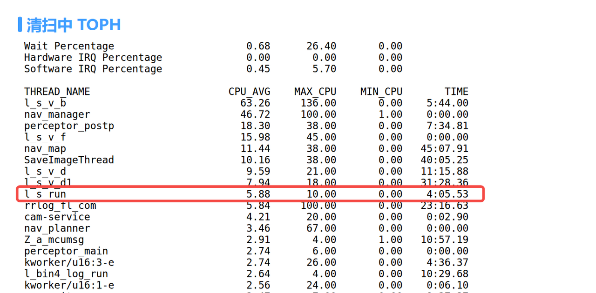

* 测试用例：夜间割草

  1. RTK等效，RTK热力图

* 适配一下plugins源码编译

  1. BUILD\_SLAM

* 数据集同步（Done）

# **2026-01-08**

## `@李岩`

1. imu递推，odo速度更新，RTK速度更新（P0）

   1. 尺度因子（静止时计算）/g加入状态量

   

   * 在有IMU+RTK更新的时候，roll角会发散

   * 互补滤波：[ ZYF176数据分析](https://roborock.feishu.cn/wiki/J6Gmw7UujideOGkNdzKcgpnvnBe) [ 互补滤波数据测试](https://roborock.feishu.cn/wiki/X3gKwFnz1ioXgwkzCyrcwhe0nXf)

   * pr

   * 割草机数据回归，比较后轴IMU，斜坡数据

2. rtk\_odo对齐+平滑优化（P1）：[ 自测结果优化：1211](https://roborock.feishu.cn/wiki/O0iNwNGRIidrG0klRZvcpo1GnUp)（无更新）

3. 速度更新航向（P2）：[ 航向角收敛测试](https://roborock.feishu.cn/wiki/ULMTwPVy9irtjykFtggcKv9Xnfb)

   1. odo速度递推

   2. 航向更新在速度更新下是否更快

   3. 调过bg之后，在RTK纯位置的情况下，航向的更新会加快

## `@范超`

1. odo积分与RTK比较，合入data\_toolkit （P1）

   1. 代码pr&#x20;

      1. 用vio\_estimate\_3d和RTK比较

   2. 比较odo递推和RTK比较，odo递推和vslam结果

      1. [ Benchmark表格](https://roborock.feishu.cn/base/NkuabkuL5aD5EJsnQVZcd6AwnQh?table=tbl2Nx8Wv6PVFZHJ\&view=vewSSGrCzN)，用benchmark/放羊数据，Vslam reset有没有做处理

   3. 把gyro bias打印到日志

2. 阴影区出桩

   1. Plugins: 开机启动，不需要等RTKStatus

      1. 和`@豆文礼`确认下同步时间，以防无效退桩

      2. pr

   2. 退桩过程中可以使用vio的结果

      1. initailizer前后的逻辑：不要跨浮点解，调整距离阈值

      2. 私版测试：先尝试遥控退1m，如果不行让导航出个特殊版本`@周晓旭`

3. RTK-odo线程仿真 [ Rtk-odo align仿真](https://roborock.feishu.cn/wiki/T1jkwJurriX5EUkylAPcFDgynih)

4. Module fusion的计算部分移出dispatch，避免dispatch线程阻塞

## `@刘宏伟`

1. fast-livo2

   1. 上机：

      1. Fast livo搞一个slam module&#x20;

         * pr

      2. plugins：接入点云数据，机器上的lidar, imu, odo的格式转换，接入gdc图片

         1. pr

   2. 使用mlslam结果

      1. 直接使用mlslam的定位结果，重建地图和赋色

      2. 将mlslam的结果作为观测或者初值

      3. 降低内存占用

2. 本周进展

   1. 测试采集78栋、105栋全景点云，跑出结果&降采样，给app端同事。（Done）

   2. [ FAST-LIVO2使用不同的策略去降低内存](https://roborock.feishu.cn/wiki/HtNwwdMwvi0qlEkfvvNckRuonIb) 使用mlslam去做pose。 （Done）

## `@茹毅超`

1. RTK新字段看数据&#x20;

   * 只有960私版和960E的RTK模组的机器有此字段，普通960版本还没有

     1. 在RTK差的环境下测试该RTK版本，已经有数据，待分析

2. NRTK接入 `@李威`

   [ nrtk经纬高转东北天](https://roborock.feishu.cn/wiki/APb9wK91ti1sQykoodtcEWkUnwe?from=from_copylink)

   [ nrtk启动会议内容](https://roborock.feishu.cn/wiki/IghFwEXBkigfN0kOExAc1I1lnxd?from=from_copylink)

   1 经纬高转东北天    ssh:// git@gitlab5.roborock.com:10022/ruyichao/llachangeenu.git

   2 linux 下实现nrtk小工具    ssh:// git@gitlab5.roborock.com:10022/ruyichao/nrtk_tool.git

   以前李圳列的测试计划[ nRTK测试计划](https://roborock.feishu.cn/wiki/BOyMwU5Bii0xE3klwbVc5KFknlg)

   1. 给出的坐标是经纬高的形式，用第一个固定解做原点

      1. 地图维护原点经纬高

   2. 可以单测模组，数据格式含义的变化

   3. https://github.com/geographiclib/geographiclib（我现在用的就是这个库，vinsfusion应该是精简了）

      1. RTK\_normal，找移动站经纬高数据

   4. 采NRTK数据，进行代码开发`@李威`

      1. 用模组+AP板采集NRTK数据，已经有数据，待分析

   5. 软件宏隔开

   6. https://gitee.com/liuhongwei-nb/fast-lio-opt

   数据集（不多）

3. 三维重建的开源算法调研&#x20;

   &#x20;初步[ 点云渲染调研](https://roborock.feishu.cn/wiki/RGj9wY4Qwi8oM6kni8BciPypn3d)

   &#x20;   [ 3dgs在 ubuntu20 配置手册](https://roborock.feishu.cn/wiki/FSS1wfJFHiJ4J6kmBgycA0SSnQg?from=from_copylink)

   1. 常见开源算法调研

      1. 3dgs-slam算法调研

   &#x20;       [ Slam和3dgs调研](https://roborock.feishu.cn/wiki/OoJ1wp5I9iQF2Mk0QS2cZqiknVf?from=from_copylink)

4. versa项目融合模块代码

5. 新项目适配 （Done）

6. 建图期间时间长报错&#x20;

## `@林子越`

1. l\_s\_run 找放羊数据，节后版本

2. 测试用例：夜间割草

   1. RTK的初始化，RTK等效，RTK热力图

3. 适配一下plugins源码编译

   1. BUILD\_SLAM

4. 数据集同步

# **2025-12-30**

## `@李岩`

1. imu递推，odo速度更新，RTK速度更新（P0）

   1. 尺度因子（静止时计算）/g加入状态量

   

   * 在有IMU+RTK更新的时候，roll角会发散

   * 互补滤波：[ ZYF176数据分析](https://roborock.feishu.cn/wiki/J6Gmw7UujideOGkNdzKcgpnvnBe) [ 互补滤波数据测试](https://roborock.feishu.cn/wiki/X3gKwFnz1ioXgwkzCyrcwhe0nXf)

   * pr

2. rtk\_odo对齐+平滑优化（P1）：[ 自测结果优化：1211](https://roborock.feishu.cn/wiki/O0iNwNGRIidrG0klRZvcpo1GnUp)（无更新）

3. 速度更新航向（P2）：[ 航向角收敛测试](https://roborock.feishu.cn/wiki/ULMTwPVy9irtjykFtggcKv9Xnfb)

   1. odo速度递推

   2. 航向更新在速度更新下是否更快

   3. 调过bg之后，在RTK纯位置的情况下，航向的更新会加快

## `@范超`

1. odo积分与RTK比较，合入data\_toolkit （P1）

   1. 代码pr&#x20;

      1. 用vio\_estimate\_3d和RTK比较

   2. 比较odo递推和RTK比较，odo递推和vslam结果

      1. [ Benchmark表格](https://roborock.feishu.cn/base/NkuabkuL5aD5EJsnQVZcd6AwnQh?table=tbl2Nx8Wv6PVFZHJ\&view=vewSSGrCzN)，用benchmark/放羊数据，Vslam reset有没有做处理

   3. 把gyro bias打印到日志

2. 阴影区出桩

   1. Plugins: 开机启动，不需要等RTKStatus

      1. 和`@豆文礼`确认下同步时间，以防无效退桩

      2. pr

   2. 退桩过程中可以使用vio的结果

      1. initailizer前后的逻辑：不要跨浮点解，调整距离阈值

      2. 私版测试：先尝试遥控退1m，如果不行让导航出个特殊版本`@周晓旭`

3. RTK-odo线程仿真 [ Rtk-odo align仿真](https://roborock.feishu.cn/wiki/T1jkwJurriX5EUkylAPcFDgynih)

4. Module fusion的计算部分移出dispatch，避免dispatch线程阻塞

## `@刘宏伟`

1. fast-livo2

   1. 上机：

      1. Fast livo搞一个slam module&#x20;

         * pr

      2. plugins：接入点云数据，机器上的lidar, imu, odo的格式转换，接入gdc图片

         1. pr

      3. 解决上机跑出现的一些coredump和bug。完善了 LIO LVIO 切换逻辑 （Done）

         1. 已pr

   2. 使用mlslam结果

      1. 直接使用mlslam的定位结果，重建地图和赋色

      2. 将mlslam的结果作为观测或者初值

      3. 降低内存占用

   3. APP

      1. 提供多个分辨率、多个场景的pcd地图（Done）（1.15）

2. 本周进展

   1. 和`@余一徽`对 lidar - cam 极限机的事情：[ B2极限机激光SLAM测试评估报告](https://roborock.feishu.cn/wiki/MtSKwRgfliTropktkfMcWvmlnDd)

   2. 给 APP 端同事 60 栋激光雷达点云：主要是算法内部体素地图是 0.01、0.02、0.03的基础上，再分别进行 0.02 - 0.05 的体素滤波。[ 外场60栋三维重建得到的原始点云及降采样后点云](https://roborock.feishu.cn/wiki/Yn7kwpSoLi1gwwkRkdbcnv7nngc)

   3. 三维重建降内存方案设计 [ FAST-LIVO2使用不同的策略去降低内存](https://roborock.feishu.cn/wiki/HtNwwdMwvi0qlEkfvvNckRuonIb)

## `@茹毅超`

1. RTK假固定解仿真

   1. pr

2. RTK推导解标志位接入，看数据 （Done）

   [ rtk添加fix\_pro和real\_time时间字段](https://roborock.feishu.cn/wiki/HFZdwI8tMi3sJFkfvsIcIjG3nKg?from=from_copylink)

   [ Rtk新版本测试需求](https://roborock.feishu.cn/wiki/TBSzwydhei9XmhkLBK7cEn7vngc?from=from_copylink)

   1. 现在的数据是固定解可信度（模糊度固定的卫星数/所有共视卫星数）

   2. 给出真实的timeout，功能替代当前的差分龄期 &#x20;

   3. Pr

   4. 只有960私版和960E的RTK模组的机器有此字段，普通960版本还没有

      1. 在RTK差的环境下测试该RTK版本，定阈值，找`@李威`安排测试

3. 自研RTK接入（P3）

   * &#x20;10.30[ 固定解分数测试结果](https://roborock.feishu.cn/wiki/QkhrwpnB9i6WlAkYKMVcdgfknPg?from=from_copylink)

   &#x20;    全面数据集

   &#x20;    https://roborock.feishu.cn/drive/folder/TD7XfdZe5l1FhQdDs0ncbw3pnUc

   统一测试点位和评价指标，输出结论

   模组厂家：凯芯    对接同事：赵一沣

4. NRTK接入 `@李威`

   [ nrtk经纬高转东北天](https://roborock.feishu.cn/wiki/APb9wK91ti1sQykoodtcEWkUnwe?from=from_copylink)

   [ nrtk启动会议内容](https://roborock.feishu.cn/wiki/IghFwEXBkigfN0kOExAc1I1lnxd?from=from_copylink)

   1 经纬高转东北天    ssh:// git@gitlab5.roborock.com:10022/ruyichao/llachangeenu.git

   2 linux 下实现nrtk小工具    ssh:// git@gitlab5.roborock.com:10022/ruyichao/nrtk_tool.git

   以前李圳列的测试计划[ nRTK测试计划](https://roborock.feishu.cn/wiki/BOyMwU5Bii0xE3klwbVc5KFknlg)

   1. 给出的坐标是经纬高的形式，用第一个固定解做原点

      1. 地图维护原点经纬高

   2. 可以单测模组，数据格式含义的变化

   3. https://github.com/geographiclib/geographiclib（我现在用的就是这个库，vinsfusion应该是精简了）

      1. RTK\_normal，找移动站经纬高数据

   4. 采NRTK数据，进行代码开发`@李威`

      1. 用模组+AP板采集NRTK数据（12.29-12.31）

   5. 软件宏隔开

   6. https://gitee.com/liuhongwei-nb/fast-lio-opt

   

   

   数据集（不多）

5. 三维重建的开源算法调研&#x20;

   &#x20;初步[ 点云渲染调研](https://roborock.feishu.cn/wiki/RGj9wY4Qwi8oM6kni8BciPypn3d)

   &#x20;   [ 3dgs在 ubuntu20 配置手册](https://roborock.feishu.cn/wiki/FSS1wfJFHiJ4J6kmBgycA0SSnQg?from=from_copylink)

   1. 常见开源算法调研

      1. 3dgs-slam算法调研

   &#x20;       [ Slam和3dgs调研](https://roborock.feishu.cn/wiki/OoJ1wp5I9iQF2Mk0QS2cZqiknVf?from=from_copylink)

6. versa项目融合模块代码

## `@林子越`

1. l\_s\_run

2. 测试用例：搬动重定位，相机遮挡，夜间割草

   1. RTK的初始化，RTK等效，RTK热力图

3. 适配一下plugins源码编译

   1. BUILD\_SLAM

# **2025-12-23**

## `@李岩`

1. imu递推，odo速度更新，RTK速度更新（P0）

   1. 尺度因子（静止时计算）/g加入状态量

   

   * 在有IMU+RTK更新的时候，roll角会发散

   * 互补滤波：[ ZYF176数据分析](https://roborock.feishu.cn/wiki/J6Gmw7UujideOGkNdzKcgpnvnBe) [ 互补滤波割草机数据测试](https://roborock.feishu.cn/wiki/X3gKwFnz1ioXgwkzCyrcwhe0nXf)

   * pr

2. rtk\_odo对齐+平滑优化（P1）：[ 自测结果优化：1211](https://roborock.feishu.cn/wiki/O0iNwNGRIidrG0klRZvcpo1GnUp)（无更新）

3. 速度更新航向（P2）：[ 航向角收敛测试](https://roborock.feishu.cn/wiki/ULMTwPVy9irtjykFtggcKv9Xnfb)

   1. odo速度递推

   2. 航向更新在速度更新下是否更快

   3. 调过bg之后，在RTK纯位置的情况下，航向的更新会加快

## `@范超`

1. odo积分与RTK比较，合入data\_toolkit （P1）

   1. 代码pr&#x20;

      1. 用vio\_estimate\_3d和RTK比较

   2. 比较odo递推和RTK比较，odo递推和vslam结果

      1. [ Benchmark表格](https://roborock.feishu.cn/base/NkuabkuL5aD5EJsnQVZcd6AwnQh?table=tbl2Nx8Wv6PVFZHJ\&view=vewSSGrCzN)，用benchmark/放羊数据，Vslam reset有没有做处理

   3. 把gyro bias打印到日志

2. 阴影区出桩

   1. Plugins: 开机启动，不需要等RTKStatus

      1. 和`@豆文礼`确认下同步时间，以防无效退桩

      2. pr

   2. 退桩过程中可以使用vio的结果

      1. initailizer前后的逻辑：不要跨浮点解，调整距离阈值

      2. 私版测试：先尝试遥控退1m，如果不行让导航出个特殊版本`@周晓旭`

3. RTK-odo线程仿真 [ Rtk-odo align仿真](https://roborock.feishu.cn/wiki/T1jkwJurriX5EUkylAPcFDgynih)

4. Module fusion的计算部分移出dispatch，避免dispatch线程阻塞

## `@刘宏伟`

1. fast-livo2

   1. 上机：

      1. Fast livo搞一个slam module&#x20;

         * pr

      2. plugins：接入点云数据，机器上的lidar, imu, odo的格式转换，接入gdc图片

         1. pr

      3. 解决上机跑出现的一些coredump和bug。完善了 LIO LVIO 切换逻辑

         1. 已pr

   2. 使用mlslam结果

      1. 直接使用mlslam的定位结果，重建地图和赋色

      2. 将mlslam的结果作为观测或者初值

      3. 降低内存占用

   3. APP

      1. 提供多个分辨率、多个场景的pcd地图（1.15）

2. 本周进展

   1. 和`@余一徽`对 lidar - cam 极限机的事情：[ B2极限机激光SLAM测试评估报告](https://roborock.feishu.cn/wiki/MtSKwRgfliTropktkfMcWvmlnDd)

   2. 给 APP 端同事 60 栋激光雷达点云：主要是算法内部体素地图是 0.01、0.02、0.03的基础上，再分别进行 0.02 - 0.05 的体素滤波。[ 外场60栋三维重建得到的原始点云及降采样后点云](https://roborock.feishu.cn/wiki/Yn7kwpSoLi1gwwkRkdbcnv7nngc)

   3. 三维重建降内存方案设计 [ FAST-LIVO2使用不同的策略去降低内存](https://roborock.feishu.cn/wiki/HtNwwdMwvi0qlEkfvvNckRuonIb)

## `@茹毅超`

1. RTK假固定解仿真

   1. pr

2. RTK推导解标志位接入，看数据

   [ rtk添加fix\_pro和real\_time时间字段](https://roborock.feishu.cn/wiki/HFZdwI8tMi3sJFkfvsIcIjG3nKg?from=from_copylink)

   [ Rtk新版本测试需求](https://roborock.feishu.cn/wiki/TBSzwydhei9XmhkLBK7cEn7vngc?from=from_copylink)

   1. 现在的数据是固定解可信度（模糊度固定的卫星数/所有共视卫星数）

   2. 给出真实的timeout，功能替代当前的差分龄期 &#x20;

   3. Pr

   4. 只有960私版和960E的RTK模组的机器有此字段，普通960版本还没有

      1. 在RTK差的环境下测试该RTK版本，定阈值，找`@李威`安排测试

3. 自研RTK接入（P3）

   * &#x20;10.30[ 固定解分数测试结果](https://roborock.feishu.cn/wiki/QkhrwpnB9i6WlAkYKMVcdgfknPg?from=from_copylink)

   &#x20;    全面数据集

   &#x20;    https://roborock.feishu.cn/drive/folder/TD7XfdZe5l1FhQdDs0ncbw3pnUc

   统一测试点位和评价指标，输出结论

   模组厂家：凯芯    对接同事：赵一沣

4. NRTK接入 `@李威`

   [ nrtk经纬高转东北天](https://roborock.feishu.cn/wiki/APb9wK91ti1sQykoodtcEWkUnwe?from=from_copylink)

   [ nrtk启动会议内容](https://roborock.feishu.cn/wiki/IghFwEXBkigfN0kOExAc1I1lnxd?from=from_copylink)

   1 经纬高转东北天    ssh:// git@gitlab5.roborock.com:10022/ruyichao/llachangeenu.git

   2 linux 下实现nrtk小工具    ssh:// git@gitlab5.roborock.com:10022/ruyichao/nrtk_tool.git

   以前李圳列的测试计划[ nRTK测试计划](https://roborock.feishu.cn/wiki/BOyMwU5Bii0xE3klwbVc5KFknlg)

   1. 给出的坐标是经纬高的形式，用第一个固定解做原点

      1. 地图维护原点经纬高

   2. 可以单测模组，数据格式含义的变化

   3. https://github.com/geographiclib/geographiclib（我现在用的就是这个库，vinsfusion应该是精简了）

      1. RTK\_normal，找移动站经纬高数据

   4. 采NRTK数据，进行代码开发`@李威`

      1. 用模组+AP板采集NRTK数据（12.29-12.31）

   5. 软件宏隔开

   6. https://gitee.com/liuhongwei-nb/fast-lio-opt

   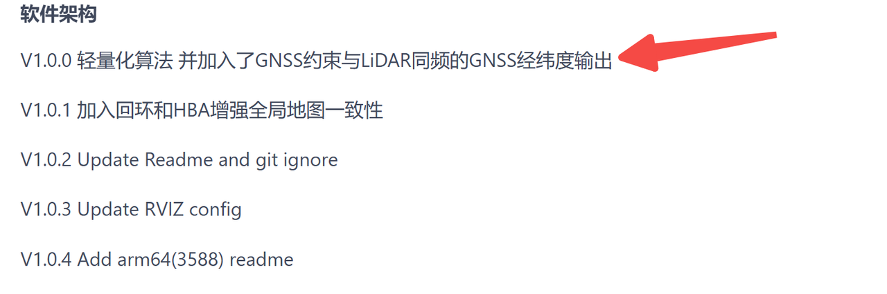

   

   数据集（不多）

5. 三维重建的开源算法调研&#x20;

   &#x20;初步[ 点云渲染调研](https://roborock.feishu.cn/wiki/RGj9wY4Qwi8oM6kni8BciPypn3d)

   &#x20;   [ 3dgs在 ubuntu20 配置手册](https://roborock.feishu.cn/wiki/FSS1wfJFHiJ4J6kmBgycA0SSnQg?from=from_copylink)

   1. 常见开源算法调研

      1. 3dgs-slam算法调研

   &#x20;       [ Slam和3dgs调研](https://roborock.feishu.cn/wiki/OoJ1wp5I9iQF2Mk0QS2cZqiknVf?from=from_copylink)

6. versa项目融合模块代码

## `@林子越`

1. l\_s\_run

2. 测试用例：搬动重定位，相机遮挡，夜间割草

   1. RTK的初始化，RTK等效，RTK热力图

3. 适配一下plugins源码编译

   1. BUILD\_SLAM

# **2025-12-18**

## `@李岩`

1. imu递推，odo速度更新，RTK速度更新（P0）

   1. 尺度因子（静止时计算）/g加入状态量

   

   * 在有IMU+RTK更新的时候，roll角会发散

   * 互补滤波：[ ZYF176数据分析](https://roborock.feishu.cn/wiki/J6Gmw7UujideOGkNdzKcgpnvnBe) [ 互补滤波测试](https://roborock.feishu.cn/wiki/X3gKwFnz1ioXgwkzCyrcwhe0nXf)

2. rtk\_odo对齐+平滑优化（P1）：[ 自测结果优化：1211](https://roborock.feishu.cn/wiki/O0iNwNGRIidrG0klRZvcpo1GnUp)（无更新）

3. 速度更新航向（P2）：[ 航线角收敛测试](https://roborock.feishu.cn/wiki/ULMTwPVy9irtjykFtggcKv9Xnfb)

   1. odo速度递推

   2. 航向更新在速度更新下是否更快

   3. 调过bg之后，在RTK纯位置的情况下，航向的更新会加快

## `@范超`

1. odo积分与RTK比较，合入data\_toolkit （P1）

   1. 代码pr&#x20;

      1. 非固定解情况下，odo递推

      2. 用vio\_estimate\_3d和RTK比较

   2. 比较odo递推和RTK比较，odo递推和vslam结果

      1. odo/RTK做比较

      2. [ Benchmark表格](https://roborock.feishu.cn/base/NkuabkuL5aD5EJsnQVZcd6AwnQh?table=tbl2Nx8Wv6PVFZHJ\&view=vewSSGrCzN)，用benchmark/放羊数据，Vslam reset有没有做处理

   3. 把gyro bias打印到日志

   4. 先提一个版本到tools里面 （Done）

      1. 支持项目名：butchart/monet

      2. 支持IMU和rawgyroodo的IMU

      3. 如果odo递推的太差，align有可能对不上&#x20;

2. 阴影区出桩

   1. Plugins: 开机启动，不需要等RTKStatus

      1. 和`@豆文礼`确认下同步时间，以防无效退桩

      2. pr

   2. 退桩过程中可以使用vio的结果

      1. initailizer前后的逻辑：不要跨浮点解，调整距离阈值

      2. 私版测试：先尝试遥控退1m，如果不行让导航出个特殊版本`@周晓旭`

3. RTK-odo线程仿真 [ Rtk-odo align仿真](https://roborock.feishu.cn/wiki/T1jkwJurriX5EUkylAPcFDgynih)

4. Module fusion的计算部分移出dispatch，避免dispatch线程阻塞

## `@刘宏伟`

1. fast-livo2

   1. 上机：

      1. Fast livo搞一个slam module&#x20;

         * pr

      2. plugins：接入外参、点云数据，机器上的lidar, imu, odo的格式转换，接入gdc图片和双目校正参数

         1. lidar2cam外参，双目极线校正矩阵（Done）

         2. pr

      3. 解决上机跑出现的一些coredump和bug。完善了 LIO LVIO 切换逻辑

         1. 已pr

   2. 使用mlslam结果

      1. 直接使用mlslam的定位结果，重建地图和赋色

      2. 将mlslam的结果作为观测或者初值

      3. 降低内存占用

   3. APP

      1. 提供多个分辨率、多个场景的pcd地图（1.15）

2. 本周进展

   1. Tof + IMU 在家徒四壁场景下跑飞的真实原因分析 + 改进策略分析 + IMU递推误差分析 [ Tof + IMU 跑家徒四壁场景问题及解决方案设计 20251217   持续更新ing](https://roborock.feishu.cn/wiki/KYe5wcfN1ihuw6k6wDxcCLEXnbd)

   2. plot_rtk 加入俩小功能：支持显示wall time + 支持输入收尾时间

   3. LiDAR - Cam 与 LiDAR - OdO 极限机验证 [ B2极限机激光SLAM测试评估报告](https://roborock.feishu.cn/wiki/MtSKwRgfliTropktkfMcWvmlnDd)

   4. 三维重建点云降采样，与增加ROI算法，以及效果变化  [ 三维重建 -- 彩色点云降采样方案 20251216](https://roborock.feishu.cn/wiki/KilxwRXrEisNe6kaWFVc9bYsnBg)

   5. 专利，与 `@姚臣益` 补充细节，已提交 

   6. 看多线的bug的时候偶然发现仿真用不了了，发现是sensor.yaml把enable\_rtk\_in\_slam设置成true了。这个需要改plugins和slamcommon一些东西，待改。

## `@茹毅超`

1. RTK假固定解判断，高度判断的bug (Done)

2. RTK假固定解仿真

   1. pr

3. RTK推导解标志位接入，看数据

   [ rtk添加fix\_pro和real\_time时间字段](https://roborock.feishu.cn/wiki/HFZdwI8tMi3sJFkfvsIcIjG3nKg?from=from_copylink)

   [ Rtk新版本测试需求](https://roborock.feishu.cn/wiki/TBSzwydhei9XmhkLBK7cEn7vngc?from=from_copylink)

   1. 现在的数据是固定解可信度（模糊度固定的卫星数/所有共视卫星数）

   2. 给出真实的timeout，功能替代当前的差分龄期 &#x20;

   3. pr，960测试通过，960E待测试

4. 自研RTK接入（P3）

   * [ 自研rtk同步跟进](https://roborock.feishu.cn/wiki/Hx3qwD24RisSOJkRLnDcq3rfnLb?from=from_copylink)

   * [ 10.18自研rtk测试结果](https://roborock.feishu.cn/wiki/J10Gw2ONkisf2ykBj2CcuO2Znwg?from=from_copylink\&sheet=4f137c) by赵一沣

   * &#x20;10.30[ 固定解分数测试结果](https://roborock.feishu.cn/wiki/QkhrwpnB9i6WlAkYKMVcdgfknPg?from=from_copylink)

   &#x20;    全面数据集

   &#x20;    https://roborock.feishu.cn/drive/folder/TD7XfdZe5l1FhQdDs0ncbw3pnUc

   统一测试点位和评价指标，输出结论

   模组厂家：凯芯    对接同事：赵一沣

5. NRTK接入 `@李威`

   [ nrtk经纬高转东北天](https://roborock.feishu.cn/wiki/APb9wK91ti1sQykoodtcEWkUnwe?from=from_copylink)

   [ nrtk启动会议内容](https://roborock.feishu.cn/wiki/IghFwEXBkigfN0kOExAc1I1lnxd?from=from_copylink)

   1 经纬高转东北天    ssh:// git@gitlab5.roborock.com:10022/ruyichao/llachangeenu.git

   2 linux 下实现nrtk小工具    ssh:// git@gitlab5.roborock.com:10022/ruyichao/nrtk_tool.git

   以前李圳列的测试计划[ nRTK测试计划](https://roborock.feishu.cn/wiki/BOyMwU5Bii0xE3klwbVc5KFknlg)

   1. 给出的坐标是经纬高的形式，用第一个固定解做原点

      1. 地图维护原点经纬高

   2. 可以单测模组，数据格式含义的变化

   3. https://github.com/geographiclib/geographiclib（我现在用的就是这个库，vinsfusion应该是精简了）

   4. 采NRTK数据，进行代码开发`@李威`

   

   数据集（不多）

6. 三维重建的开源算法调研&#x20;

   &#x20;初步[ 点云渲染调研](https://roborock.feishu.cn/wiki/RGj9wY4Qwi8oM6kni8BciPypn3d)

   &#x20;   [ 3dgs在 ubuntu20 配置手册](https://roborock.feishu.cn/wiki/FSS1wfJFHiJ4J6kmBgycA0SSnQg?from=from_copylink)

   1. 常见开源算法调研

      1. 3dgs-slam算法调研

   &#x20;       [ Slam和3dgs调研](https://roborock.feishu.cn/wiki/OoJ1wp5I9iQF2Mk0QS2cZqiknVf?from=from_copylink)

## `@林子越`

1. l\_s\_run

2. 测试用例：搬动重定位，相机遮挡，夜间割草

   1. RTK的初始化，RTK等效，RTK热力图

# **2025-12-11**

## `@李岩`

1. imu递推，odo速度更新，RTK速度更新（P0）：[ IMU递推](https://roborock.feishu.cn/wiki/OUSmwqEK1il1e1kf49cc0nMrnpe)

   1. 尺度因子（静止时计算）/g加入状态量

   

   * 在有IMU+RTK更新的时候，roll角会发散

   * 互补滤波

2. rtk\_odo对齐+平滑优化（P1）：[ 自测结果优化](https://roborock.feishu.cn/wiki/O0iNwNGRIidrG0klRZvcpo1GnUp)

3. 速度更新航向（P2）

   1. odo速度递推

   2. 航向更新在速度更新下是否更快

   3. 调过bg之后，在RTK纯位置的情况下，航向的更新会加快

## `@范超`

1. odo积分与RTK比较，合入data\_toolkit （P1）

   1. 代码pr&#x20;

      1. 非固定解情况下，odo递推

      2. 用vio\_estimate\_3d和RTK比较

   2. 比较odo递推和RTK比较，odo递推和vslam结果

      1. odo/RTK做比较

      2. [ Benchmark表格](https://roborock.feishu.cn/base/NkuabkuL5aD5EJsnQVZcd6AwnQh?table=tbl2Nx8Wv6PVFZHJ\&view=vewSSGrCzN)，用benchmark/放羊数据，Vslam reset有没有做处理

   3. 把gyro bias打印到日志

   4. 先提一个版本到tools里面

2. 阴影区出桩

   1. FusionInitializer需要调整距离阈值

   2. Plugins: 开机启动，不需要等RTKStatus

   3. 退桩过程中可以使用vio的结果

3. 日志精简 （12.10）

   1. 机器重启后，slam controller和状态机启动有时序问题，导致开机后slam可能收不到状态机的暂停、恢复，slam在桩上一直打日志（Done）

      1. 解决方案：slam controller init之后，给状态机发个消息，状态机再把暂停恢复发slam一次

   2. 把INFO及以上日志，不需要的删掉，需要看debug信息的改DEBUG

      1. Eskf, module\_fusion, slam\_workspace: SlipDetection

4. RTK-odo线程仿真

## `@刘宏伟`

1. fast-livo2

   1. Fast-livo2代码进入repo

      1. 效果验证（Done）

         1. 用tof数据跑一下效果试试 [ FAST-LIVO2跑 Tof + IMU 数据](https://roborock.feishu.cn/wiki/FQYywQT2VijRzKkPIqwcG81Vnch)

   2. 上机：

      1. Fast livo搞一个slam module&#x20;

         * pr

      2. plugins：接入外参、点云数据，机器上的lidar, imu, odo的格式转换，接入gdc图片和双目校正参数

         1. lidar2cam外参，双目极线校正矩阵（Done）

         2. pr

      3. 解决上机跑出现的一些coredump和bug。完善了 LIO LVIO 切换逻辑

         1. 已pr

   3. 显示效果：EDL Shader (Render)

      1. app使用可行性调研

      2. 点云传输

   4. lidar2cam外参极限机验证

2. 本周进展

   1. 尝试用 gicp 的策略嵌入算法解决原地旋转地图花 &amp; 观测受限地图花  [ FAST-LIVO2跑ToF + IMU](https://roborock.feishu.cn/wiki/IXsuwoWNriV0YckfM9ec3E8Ln9d) 

   2. EDL shader 调研 [ EDL shader 原理&amp;调研](https://roborock.feishu.cn/wiki/ZhtAwVlkhiiWuWkku8NcOPHXncc)

   3. 和 `@余一徽`对标定极限机，结果发现 pitch 始终差角度。[ B2极限机激光SLAM测试评估报告](https://roborock.feishu.cn/wiki/MtSKwRgfliTropktkfMcWvmlnDd)

   4. Plugins slam_workspace接入 lidar - cam 参数，本周二已合入。

   5. FAST-LIVO2改comments，主要是锁问题，locate_queue长度，赋色改为双边滤波及一些其他问题。

   6. 看多线的bug的时候偶然发现仿真用不了了，发现是sensor.yaml把enable_rtk_in_slam设置成true了。这个需要改plugins和slamcommon一些东西，待改。

## `@茹毅超`

1. 假固定解处理 （Done）

   [ rtk固定解过滤new](https://roborock.feishu.cn/wiki/Q0b1whI4jigXSWkBdE1cy22Mntg)

   [ rtk固定解跳变检测](https://roborock.feishu.cn/wiki/VAsxwda5DidB8RkzucocFvJRn9e)

   [ RTK假固定原始数据分析](https://roborock.feishu.cn/wiki/ZAo1wOkN7iOo4qkaDJacc0rHnne)

   [ RTK假固定解处理方案](https://roborock.feishu.cn/wiki/DJyQw02iFiopsmkhO6dczkVEntd)

2. RTK推导解标志位接入，看数据

   [ rtk添加fix\_pro和real\_time时间字段](https://roborock.feishu.cn/wiki/HFZdwI8tMi3sJFkfvsIcIjG3nKg?from=from_copylink)

   [ Rtk新版本测试需求](https://roborock.feishu.cn/wiki/TBSzwydhei9XmhkLBK7cEn7vngc?from=from_copylink)

   1. 现在的数据是固定解可信度（模糊度固定的卫星数/所有共视卫星数）

   2. 给出真实的timeout，功能替代当前的差分龄期 &#x20;

   3. pr

3. 降本的RTK模组：960E （P1）

   1. RTK效果数据  11月28日才有模组，十二月初大概会有机器

4. 自研RTK接入（P3）

   1. [ 自研rtk同步跟进](https://roborock.feishu.cn/wiki/Hx3qwD24RisSOJkRLnDcq3rfnLb?from=from_copylink)

   2. [ 10.18自研rtk测试结果](https://roborock.feishu.cn/wiki/J10Gw2ONkisf2ykBj2CcuO2Znwg?from=from_copylink\&sheet=4f137c) by赵一沣

   3. &#x20;10.30[ 固定解分数测试结果](https://roborock.feishu.cn/wiki/QkhrwpnB9i6WlAkYKMVcdgfknPg?from=from_copylink)

   &#x20;    全面数据集

   &#x20;    https://roborock.feishu.cn/drive/folder/TD7XfdZe5l1FhQdDs0ncbw3pnUc

   统一测试点位和评价指标，输出结论

   模组厂家：凯芯    对接同事：吉利 赵一沣

5. NRTK接入 (penging) `@李威`

   [ nrtk经纬高转东北天](https://roborock.feishu.cn/wiki/APb9wK91ti1sQykoodtcEWkUnwe?from=from_copylink)

   以前李圳列的测试计划[ nRTK测试计划](https://roborock.feishu.cn/wiki/BOyMwU5Bii0xE3klwbVc5KFknlg)

   1. 给出的坐标是经纬高的形式，用第一个固定解做原点

      1. 地图维护原点经纬高

   2. 可以单测模组，数据格式含义的变化

   3. 待kick off

   4. https://github.com/geographiclib/geographiclib

   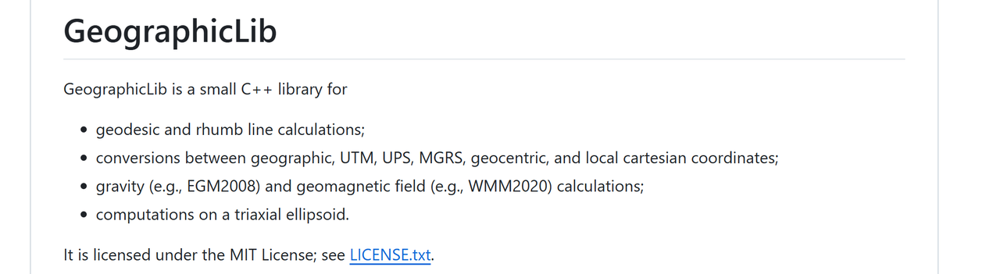

   数据集（不多）

6. 三维重建的开源算法调研&#x20;

   &#x20;初步[ 点云渲染调研](https://roborock.feishu.cn/wiki/RGj9wY4Qwi8oM6kni8BciPypn3d)

   &#x20;   [ 3dgs在 ubuntu20 配置手册](https://roborock.feishu.cn/wiki/FSS1wfJFHiJ4J6kmBgycA0SSnQg?from=from_copylink)

   1. 常见开源算法调研

      1. 3dgs-slam算法调研

   &#x20;       [ Slam和3dgs调研](https://roborock.feishu.cn/wiki/OoJ1wp5I9iQF2Mk0QS2cZqiknVf?from=from_copylink)

## `@林子越`

1. Module fusion的计算部分移出dispatch，避免dispatch线程阻塞

2. 在阴影区域出桩：

   1. 竞品阴影区走的距离和轨迹，`@杨倩`给出；安规冲突 `@周晓旭`

   2. 2月底之前完成

3. 测试用例：搬动重定位，相机遮挡，夜间割草

   1. RTK的初始化，RTK等效，RTK热力图

# **2025-12-04**

## `@李岩`

1. imu递推，odo速度更新，RTK速度更新

   1. imu 名义递推（仿真的假数据验证，Done）

   2. imu 计算jacobian，计算方差递推（公式写个文档 [ IMU Propagation Doc](https://roborock.feishu.cn/wiki/MLMjwwwzHiiCsRkiRS7cyQu8nSe)）

   3. 加计的坐标变换，重力对齐

   4. odo速度更新

   5. 航向更新在速度更新下是否更快

   6. 问题：纯imu递推，发散太快，是否数据源有问题

   7. 尺度因子

2. 降低轨迹横向抖动 [ 轨迹平滑策略](https://roborock.feishu.cn/wiki/SoTgwEbsQi2XIbkxn31c0qM9n1b)，完成自测和最新bug仿真 (Done)

   1. 限制res + 增大RTK观测噪声，pr

   2. [ 【机器人为操作，融合位姿变化】测试](https://roborock.feishu.cn/wiki/EA0NwnIfNiHjfdkCgUpcF8VKnPb): 噪音设置影响拖动时的姿态

3. [ 双IMU调研](https://roborock.feishu.cn/wiki/XIeZwXbe2i2bGfk6RF2cH3TknFe)

## `@范超`

1. rtk-odo线程优化

   1. 提高成功率，降低角度阈值，只排除纯旋转 (Done）

      1. RTK和odo轨迹改成滑窗形式，成功了清空滑窗

      2. 降低窗口长度的阈值

      3. 整理数据集（加入自测数据）看是否加快了yaw角优化  [ rtk-odo align改进自测](https://roborock.feishu.cn/wiki/SFYwwf9nAi2tFYkpPqvc7s2VnJf)

      4. odo traj路径计算有bug，修复

   2. 放宽对齐的条件，能够应对转s弯的情况：尝试使用标准ICP[ RTK初始对准](https://roborock.feishu.cn/wiki/RoGmwgrU7ipJoRkB3JdcPbn9nlb)

      1. ICP没有明显的计算优势

      2. 阻碍样本点的条件主要是odo样本点长度，与ICP无关

2. 四驱计算是否有问题 （Done）

   1. 左前轮+左后轮，右前轮+右后轮，内八模型[ odoparser测试优化](https://roborock.feishu.cn/wiki/HhuxwAhczinga1kuoZAcYw6jnDb) [ 四驱里程计问题分析](https://roborock.feishu.cn/wiki/IceQwZeQoiKcFBkikAFcugjFnuD) [ 四驱里程计正运动学模型推导](https://roborock.feishu.cn/wiki/AU8OwiBBriiN7dkOXEoc6dOZnEb)

   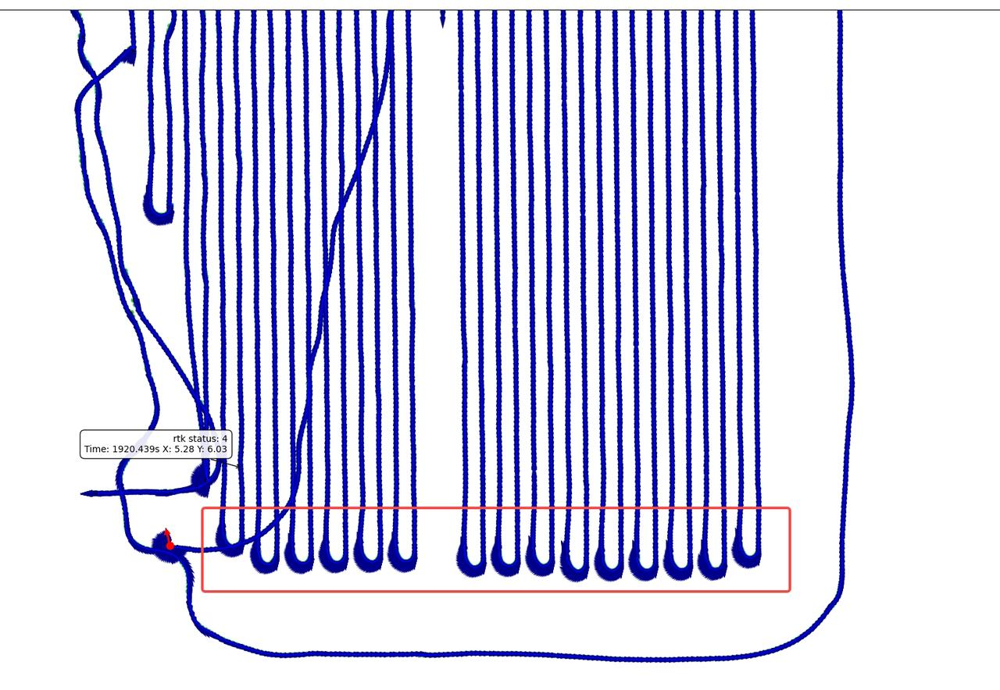

3. odo积分与RTK比较，合入data\_toolkit （P1）

   1. 代码pr&#x20;

      1. 非固定解情况下，odo递推

      2. 用vio\_estimate\_3d和RTK比较

   2. 比较odo递推和RTK比较，odo递推和vslam结果

      1. odo/RTK做比较

      2. [ Benchmark表格](https://roborock.feishu.cn/base/NkuabkuL5aD5EJsnQVZcd6AwnQh?table=tbl2Nx8Wv6PVFZHJ\&view=vewSSGrCzN)，用benchmark/放羊数据，Vslam reset有没有做处理

   3. 把gyro bias打印到日志

4. 人为移动机器数据采集分析（包含一组静止->直行->静止的数据）：`@范超`

   1. 期待通过RTK-odo对齐线程解决

   2. [ 【机器人为操作，融合位姿变化】测试](https://roborock.feishu.cn/wiki/EA0NwnIfNiHjfdkCgUpcF8VKnPb)

5. 阴影区出桩

   1. FusionInitializer需要调整距离阈值

## `@刘宏伟`

1. fast-livo2

   1. Fast-livo2代码进入repo

      1. 效果验证

         1. 用tof数据跑一下效果试试 [ FAST-LIVO2跑 Tof + IMU 数据](https://roborock.feishu.cn/wiki/FQYywQT2VijRzKkPIqwcG81Vnch)

   2. 上机：

      1. Fast livo搞一个slam module&#x20;

         1. 单独起一个计算线程 SLAMModuleVIO, SLAMModuleLIO

         2. pr

      2. plugins：接入外参、点云数据，机器上的lidar, imu, odo的格式转换，接入gdc图片和双目校正参数

         1. Pr

      3. 解决上机跑出现的一些coredump和bug。完善了 LIO LVIO 切换逻辑，将增强点云效果，addslammodule稳定版本提交PR。

   3. 显示效果：最终显示效果使用什么形式（例如mesh）

   4. 落地方案评估：

      1. 视觉部分嵌入mlslam，或者单独进入后台线程计算

## `@茹毅超`

1. 假固定解处理（P0）

   1. 改pr，测试

   2. 回归看一下正常的是否会误判

   3. 测试文档整理

      1. 比较一下加入和不加入假固定解处理的效果

      2. 以前的数据用新代码跑一下

   [ rtk固定解过滤new](https://roborock.feishu.cn/wiki/Q0b1whI4jigXSWkBdE1cy22Mntg)

   [ rtk固定解跳变检测](https://roborock.feishu.cn/wiki/VAsxwda5DidB8RkzucocFvJRn9e)

   [ RTK假固定原始数据分析](https://roborock.feishu.cn/wiki/ZAo1wOkN7iOo4qkaDJacc0rHnne)

   [ RTK假固定解处理方案](https://roborock.feishu.cn/wiki/DJyQw02iFiopsmkhO6dczkVEntd)

   TODO：

   &#x20; 1测试norm数据集

2. RTK推导解标志位接入，看数据 （P1）

   在12月初，monet的B3生产阶段，安排数个 960E，

   960E会有对应标志位，如果顺利，才会在960上添加标志位，

   rtk的ota升级和版本怕有风险

   [ rtk添加fix\_pro和real\_time时间字段](https://roborock.feishu.cn/wiki/HFZdwI8tMi3sJFkfvsIcIjG3nKg?from=from_copylink)

   [ Rtk新版本测试需求](https://roborock.feishu.cn/wiki/TBSzwydhei9XmhkLBK7cEn7vngc?from=from_copylink)

   1. 现在的数据是固定解可信度（模糊度固定的卫星数/所有共视卫星数）

   2. 给出真实的timeout，功能替代当前的差分龄期 &#x20;

   已经有测试数据，厂家和驱动可以合入，slam接入新数据，是否合入和`@李威`合入

3. 降本的RTK模组：960E （P1）

   1. RTK效果数据  11月28日才有模组，十二月初大概会有机器

4. 自研RTK接入（P3）

   1. [ 自研rtk同步跟进](https://roborock.feishu.cn/wiki/Hx3qwD24RisSOJkRLnDcq3rfnLb?from=from_copylink)

   2. [ 10.18自研rtk测试结果](https://roborock.feishu.cn/wiki/J10Gw2ONkisf2ykBj2CcuO2Znwg?from=from_copylink\&sheet=4f137c) by赵一沣

   3. &#x20;10.30[ 固定解分数测试结果](https://roborock.feishu.cn/wiki/QkhrwpnB9i6WlAkYKMVcdgfknPg?from=from_copylink)

   &#x20;    全面数据集

   &#x20;    https://roborock.feishu.cn/drive/folder/TD7XfdZe5l1FhQdDs0ncbw3pnUc

   统一测试点位和评价指标，输出结论

   模组厂家：凯芯    对接同事：吉利 赵一沣

5. NRTK接入 (penging) `@李威`

   以前李圳列的测试计划[ nRTK测试计划](https://roborock.feishu.cn/wiki/BOyMwU5Bii0xE3klwbVc5KFknlg)

   1. 给出的坐标是经纬高的形式，用第一个固定解做原点

      1. 地图维护原点经纬高

   2. 可以单测模组，数据格式含义的变化

   数据集（不多）

6. 放羊数据中差分龄期偏大 [ RTK差分龄期统计](https://roborock.feishu.cn/wiki/WP6qwyE9tiEf5BkLqEscpJ3Rn7g)（P3）

   1. 如果换了lora的新版本，可以监控放羊数据，做一个新统计，已有工作项 `@李威` `@陈云舸`

   2. [ Monet B1 RTK模组硬件测试报告](https://roborock.feishu.cn/sheets/Hl9MsooUihmHOytmFVpcYyYencH?from=from_copylink\&sheet=2UhYuU)

7. 三维重建的开源算法调研 （P2）

   &#x20;初步[ 点云渲染调研](https://roborock.feishu.cn/wiki/RGj9wY4Qwi8oM6kni8BciPypn3d)

       [ 3dgs在 ubuntu20 配置手册](https://roborock.feishu.cn/wiki/FSS1wfJFHiJ4J6kmBgycA0SSnQg?from=from_copylink)

   1. 常见开源算法调研

      1. 3dgs-slam算法调研

## `@林子越`

1. Module fusion的计算部分移出dispatch，避免dispatch线程阻塞

2. l\_s\_run cpu占用率：统计占用

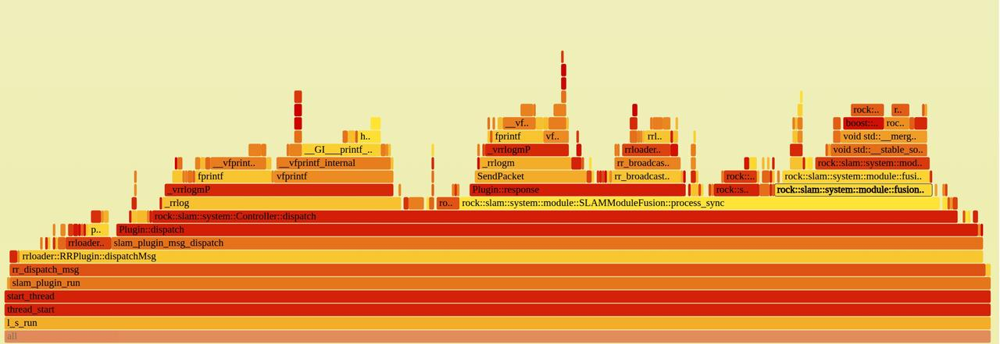

* 在阴影区域出桩：

  1. 竞品阴影区走的距离和轨迹，`@杨倩`给出；安规冲突 `@周晓旭`

  2. 2月底之前完成

* 测试用例：搬动重定位，相机遮挡，夜间割草

  1. RTK的初始化，RTK等效，RTK热力图

# **2025-11-27**

## `@李岩`

1. imu递推，odo速度更新，RTK速度更新（11.13）

   1. imu 名义递推（仿真的假数据验证，Done）

   2. imu 计算jacobian，计算方差递推（公式写个文档 [ IMU Propagation Doc](https://roborock.feishu.cn/wiki/MLMjwwwzHiiCsRkiRS7cyQu8nSe)）

   3. 加计的坐标变换，重力对齐

   4. odo速度更新

   5. 航向更新在速度更新下是否更快

   6. 问题：纯imu递推，发散太快，是否数据源有问题

   7. 尺度因子

   8. zupt：[ 滤波器更新问题分析](https://roborock.feishu.cn/wiki/NxqcwHX6ki2pqWkzBMhcp0x6nAd)（Done)

      1. 理论上res=0和不更新现象应该是一样的，但是方差在更新，实际差很大--> 观测不更新时，state\_队列里的entry的cov没有更新

      静止：1.递推+不更新 2.递推+更新+res=0；运动：递推+更新

      不更新的实现有bug

2. 降低轨迹横向抖动 [ 轨迹平滑策略](https://roborock.feishu.cn/wiki/SoTgwEbsQi2XIbkxn31c0qM9n1b)

   1. 限制res + 增大RTK观测噪声，pr

   2. [ 【机器人为操作，融合位姿变化】测试](https://roborock.feishu.cn/wiki/EA0NwnIfNiHjfdkCgUpcF8VKnPb)

## `@范超`

1. rtk-odo线程优化（P0）

   1. 提高成功率，降低角度阈值，只排除纯旋转

      1. RTK和odo轨迹改成滑窗形式，成功了清空滑窗

      2. 降低窗口长度的阈值

      3. 整理数据集（加入自测数据）看是否加快了yaw角优化  [ rtk-odo align改进自测](https://roborock.feishu.cn/wiki/SFYwwf9nAi2tFYkpPqvc7s2VnJf)

      4. odo traj路径计算有bug，修复

         1. pr

   2. 放宽对齐的条件，能够应对转s弯的情况：尝试使用标准ICP

2. 四驱计算是否有问题 （P1）

   1. 左前轮+左后轮，右前轮+右后轮，内八模型[ odoparser测试优化](https://roborock.feishu.cn/wiki/HhuxwAhczinga1kuoZAcYw6jnDb) [ 四驱里程计问题分析](https://roborock.feishu.cn/wiki/IceQwZeQoiKcFBkikAFcugjFnuD) [ 四驱里程计正运动学模型推导](https://roborock.feishu.cn/wiki/AU8OwiBBriiN7dkOXEoc6dOZnEb)

   2. 待pr

3. 脱困检测误检，导航解决

   1. 坡道上脱困误检：确定是否是坡道引起的，还是当时bug环境中的其他原因导致

   2. 四驱脱困检测：前轮空转、后轮不转检测

   Bug#430516 -  【硬测】【苏州外场】【1503】【Monet-16#】【B2-0025】绳索抵住左舵机正上方边缘，双目无法识别障碍物，主机卡困原地打滑，仅后退可以脱困

   http://pms.rockrobo.internal/index.php?m=bug\&f=view\&t=html&=\&bugID=430516

4. odo积分与RTK比较，合入data\_toolkit （P1）

   1. 代码pr&#x20;

      1. 非固定解情况下，odo递推

      2. 用vio\_estimate\_3d和RTK比较

   2. 比较odo递推和RTK比较，odo递推和vslam结果

      1. odo/RTK做比较

      2. [ Benchmark表格](https://roborock.feishu.cn/base/NkuabkuL5aD5EJsnQVZcd6AwnQh?table=tbl2Nx8Wv6PVFZHJ\&view=vewSSGrCzN)，用benchmark/放羊数据，Vslam reset有没有做处理

   3. 把gyro bias打印到日志

5. 人为移动机器数据采集分析（包含一组静止->直行->静止的数据）：`@范超`

   [ 【机器人为操作，融合位姿变化】测试](https://roborock.feishu.cn/wiki/EA0NwnIfNiHjfdkCgUpcF8VKnPb)

## `@刘宏伟`

1. fast-livo2

   1. Fast-livo2代码进入repo

      1. 去ROS化+Simulator （Done）

         1. Pr

      2. 效果验证

         1. 用tof数据跑一下效果试试

      3. Vio的地图没判收敛（Done）

      4. package拷贝错误（Done）

   2. 上机：

      1. Fast livo搞一个slam module&#x20;

         1. 单独起一个计算线程 SLAMModuleVIO, SLAMModuleLIO

         2. pr

      2. plugins：接入外参、点云数据，机器上的lidar, imu, odo的格式转换，接入gdc图片和双目校正参数

         1. Pr

      3. 上机的时候有情况不发图像，需要把vio稳定（Done）

         1. 单独跑lio

      4. 机器上结果和pc仿真结果一致（Done）

         1. 确认一下采集模式是否开slam，如果跑可以在采集模式下跑fast livo

      5. 统计内存和cpu（Done）

         1. nv12转rgb多占10\~20%的CPU，在算法内部用灰度图，只在赋色的时候用yuv，转给状态机的时候/save\_map的时候改成rgb

   3. 显示效果：最终显示效果使用什么形式（例如mesh）

   4. 落地方案评估：

      1. 视觉部分嵌入mlslam，或者单独进入后台线程计算

2. 本周进展

   a.解决上机跑出现的一些coredump和bug。完善了 LIO LVIO 切换逻辑，将增强点云效果，addslammodule稳定版本提交PR。

   b.激光雷达-相机在线标定及改进 [ 在线标定算法测试](https://roborock.feishu.cn/wiki/OIxFwQ0Y4iNr3kk1cwnc9SmCnNd)

   c.FAST-LIVO2出私分支支持双目Tof数据跑通及分析[ FAST-LIVO2跑tof数据](https://roborock.feishu.cn/wiki/FQYywQT2VijRzKkPIqwcG81Vnch)

   d.FAST-LIVO2火焰图。[ 火焰图分析](https://roborock.feishu.cn/wiki/WXeCwlfqDiYOhXkFQrpc8irknld)

## `@茹毅超`

1. 假固定解处理（P0）

   1. 改pr，测试

   2. 回归看一下正常的是否会误判

   3. 测试文档整理

      1. 比较一下加入和不加入假固定解处理的效果

      2. 以前的数据用新代码跑一下

   [ rtk固定解跳变检测](https://roborock.feishu.cn/wiki/VAsxwda5DidB8RkzucocFvJRn9e)

   [ RTK假固定原始数据分析](https://roborock.feishu.cn/wiki/ZAo1wOkN7iOo4qkaDJacc0rHnne)

   [ RTK假固定解处理方案](https://roborock.feishu.cn/wiki/DJyQw02iFiopsmkhO6dczkVEntd)

   TODO：

   &#x20; 1测试norm数据集

2. RTK推导解标志位接入，看数据 （P1）

   在12月初，monet的B3生产阶段，安排数个 960E，

   960E会有对应标志位，如果顺利，才会在960上添加标志位，

   rtk的ota升级和版本怕有风险

   [ rtk添加fix\_pro和real\_time时间字段](https://roborock.feishu.cn/wiki/HFZdwI8tMi3sJFkfvsIcIjG3nKg?from=from_copylink)

   [ Rtk新版本测试需求](https://roborock.feishu.cn/wiki/TBSzwydhei9XmhkLBK7cEn7vngc?from=from_copylink)

   1. 现在的数据是固定解可信度（模糊度固定的卫星数/所有共视卫星数）

   2. 给出真实的timeout，功能替代当前的差分龄期 &#x20;

   已经有测试数据，厂家和驱动可以合入，slam接入新数据，是否合入和`@李威`合入

3. 降本的RTK模组：960E （P1）

   1. RTK效果数据  11月28日才有模组，十二月初大概会有机器

4. 自研RTK接入（P3）

   1. [ 自研rtk同步跟进](https://roborock.feishu.cn/wiki/Hx3qwD24RisSOJkRLnDcq3rfnLb?from=from_copylink)

   2. [ 10.18自研rtk测试结果](https://roborock.feishu.cn/wiki/J10Gw2ONkisf2ykBj2CcuO2Znwg?from=from_copylink\&sheet=4f137c) by赵一沣

   3. &#x20;10.30[ 固定解分数测试结果](https://roborock.feishu.cn/wiki/QkhrwpnB9i6WlAkYKMVcdgfknPg?from=from_copylink)

   &#x20;    全面数据集

   &#x20;    https://roborock.feishu.cn/drive/folder/TD7XfdZe5l1FhQdDs0ncbw3pnUc

   统一测试点位和评价指标，输出结论

   模组厂家：凯芯    对接同事：吉利 赵一沣

5. NRTK接入 (penging) `@李威`

   以前李圳列的测试计划[ nRTK测试计划](https://roborock.feishu.cn/wiki/BOyMwU5Bii0xE3klwbVc5KFknlg)

   1. 给出的坐标是经纬高的形式，用第一个固定解做原点

      1. 地图维护原点经纬高

   2. 可以单测模组，数据格式含义的变化

   数据集（不多）

6. 放羊数据中差分龄期偏大 [ RTK差分龄期统计](https://roborock.feishu.cn/wiki/WP6qwyE9tiEf5BkLqEscpJ3Rn7g)（P3）

   1. 如果换了lora的新版本，可以监控放羊数据，做一个新统计，已有工作项 `@李威` `@陈云舸`

   2. [ Monet B1 RTK模组硬件测试报告](https://roborock.feishu.cn/sheets/Hl9MsooUihmHOytmFVpcYyYencH?from=from_copylink\&sheet=2UhYuU)

7. 三维重建的开源算法调研 （P2）

   &#x20;初步[ 点云渲染调研](https://roborock.feishu.cn/wiki/RGj9wY4Qwi8oM6kni8BciPypn3d)

       [ 3dgs在 ubuntu20 配置手册](https://roborock.feishu.cn/wiki/FSS1wfJFHiJ4J6kmBgycA0SSnQg?from=from_copylink)

   1. 常见开源算法调研

      1. 3dgs-slam算法调研

## `@林子越`

1. Module fusion的计算部分移出dispatch，避免dispatch线程阻塞

2. l\_s\_run cpu占用率：

最大：select\_odom\_readings; 第二大：Eigen::Matrix::transpose（合入）

* 在阴影区域出桩：

  1. 竞品阴影区走的距离和轨迹，`@杨倩`给出；安规冲突 `@周晓旭`

  2. 2月底之前完成

* 测试用例：搬动重定位，相机遮挡，夜间割草

  1. RTK的初始化，RTK等效，RTK热力图

# **2025-11-20**

## `@李岩`

1. imu递推，odo速度更新，RTK速度更新[~~ imu\_prop~~](https://roborock.feishu.cn/wiki/CKZLwu8htif7h0kNM9qcHf20nHd)（11.13）

   1. imu 名义递推（仿真的假数据验证，Done）

   2. imu 计算jacobian，计算方差递推（公式写个文档 [ IMU Propagation Doc](https://roborock.feishu.cn/wiki/MLMjwwwzHiiCsRkiRS7cyQu8nSe)）

   3. 加计的坐标变换，重力对齐

   4. odo速度更新

   5. 航向更新在速度更新下是否更快

   6. 问题：纯imu递推，发散太快，是否数据源有问题

   7. zupt：

      1. 理论上res=0和不更新现象应该是一样的，但是方差在更新，实际差很大--> 观测不更新时，state\_队列里的entry的cov没有更新

      静止：1.递推+不更新 2.递推+更新+res=0；运动：递推+更新

      不更新的实现有bug

2. 人为移动机器数据采集分析（包含一组静止->直行->静止的数据）：`@范超`

   [ 【机器人为操作，融合位姿变化】测试](https://roborock.feishu.cn/wiki/EA0NwnIfNiHjfdkCgUpcF8VKnPb)

3. 降低轨迹横向抖动`@郭明理`

   1. NHC 横向速度约束

## `@范超`

1. rtk-odo线程优化（P1）

   1. align结果反了，增加日志打印

   2. 提高成功率，降低角度阈值，只排除纯旋转

   3. RTK和odo轨迹改成滑窗形式，成功了清空滑窗

   4. 降低窗口长度的阈值，看一下会降低对齐的质量

   5. 整理数据集（加入自测数据）看是否加快了yaw角优化  [ rtk-odo align改进自测](https://roborock.feishu.cn/wiki/SFYwwf9nAi2tFYkpPqvc7s2VnJf)

      1. pr

2. odo积分与RTK比较，合入data\_toolkit （P1）

   1. 代码pr&#x20;

      1. 非固定解情况下，odo递推

      2. 用vio\_estimate\_3d和RTK比较

   2. 比较odo递推和RTK比较，odo递推和vslam结果

      1. odo/RTK做比较

      2. [ Benchmark表格](https://roborock.feishu.cn/base/NkuabkuL5aD5EJsnQVZcd6AwnQh?table=tbl2Nx8Wv6PVFZHJ\&view=vewSSGrCzN)，用benchmark/放羊数据，Vslam reset有没有做处理

   3. 把gyro bias打印到日志

3. 四驱计算是否有问题 （P3）[ odoparser测试优化](https://roborock.feishu.cn/wiki/HhuxwAhczinga1kuoZAcYw6jnDb)

   1. 左前轮+左后轮，右前轮+右后轮，速度和两后轮不一致

   2. 可能前轮odo时间戳和后轮不同步 `@唐帅帅`确认一下时间戳是主控mcu时间戳还是电机mcu时间戳

4. 激光卡困检测 （P0）（11.21）

   1. 激光计算的结果，替代RTK结果，激光的噪声可能比RTK大一些，看下阈值是否合适

   2. 有versa测试问题咨询`@周家宝` `@刘博`采数据测试

## `@刘宏伟`

1. fast-livo2

   1. Fast-livo2代码进入repo

      1. 去ROS化+Simulator

         1. Pr

      2. 效果验证

         1. 用tof数据跑一下效果试试

   2. 上机：

      1. Fast livo搞一个slam module&#x20;

         1. 单独起一个计算线程 SLAMModuleVIO, SLAMModuleLIO

         2. pr

      2. plugins：接入外参、点云数据，机器上的lidar, imu, odo的格式转换，接入gdc图片和双目校正参数

         1. Pr

      3. 上机的时候有情况不发图像，需要把vio稳定

         1. 单独跑lio

      4. 机器上结果和pc仿真结果一致

         1. 确认一下采集模式是否开slam，如果跑可以在采集模式下跑fast livo

      5. 统计内存和cpu

         1. nv12转rgb多占10\~20%的CPU，在算法内部用灰度图，只在赋色的时候用yuv，转给状态机的时候/save\_map的时候改成rgb

   3. 显示效果：最终显示效果使用什么形式（例如mesh）

   4. 落地方案评估：

      1. 视觉部分嵌入mlslam，或者单独进入后台线程计算

## `@茹毅超`

1. 假固定解处理（P0）

   1. 改pr，测试

   2. 回归看一下正常的是否会误判

   3. 测试文档整理

      1. 比较一下加入和不加入假固定解处理的效果

      2. 以前的数据用新代码跑一下

   [ rtk固定解跳变检测](https://roborock.feishu.cn/wiki/VAsxwda5DidB8RkzucocFvJRn9e)

   [ RTK假固定原始数据分析](https://roborock.feishu.cn/wiki/ZAo1wOkN7iOo4qkaDJacc0rHnne)

   [ RTK假固定解处理方案](https://roborock.feishu.cn/wiki/DJyQw02iFiopsmkhO6dczkVEntd)

   TODO：

   &#x20; 1测试norm数据集

2. RTK推导解标志位接入，看数据 （P1）

   在12月初，monet的B3生产阶段，安排数个 960E，

   960E会有对应标志位，如果顺利，才会在960上添加标志位，

   rtk的ota升级和版本怕有风险

   [ rtk添加fix\_pro和real\_time时间字段](https://roborock.feishu.cn/wiki/HFZdwI8tMi3sJFkfvsIcIjG3nKg?from=from_copylink)

   [ Rtk新版本测试需求](https://roborock.feishu.cn/wiki/TBSzwydhei9XmhkLBK7cEn7vngc?from=from_copylink)

   1. 现在的数据是固定解可信度（模糊度固定的卫星数/所有共视卫星数）

   2. 给出真实的timeout，功能替代当前的差分龄期 &#x20;

   3. 二供导入时间和给出数据是否一样 `@乔平平`

   已经有测试数据，厂家和驱动可以合入，slam接入新数据，是否合入和`@李威`合入

3. 降本的RTK模组：960E （P1）

   1. RTK效果数据  11月28日才有模组，十二月初大概会有机器

4. 自研RTK接入（P3）

   1. [ 自研rtk同步跟进](https://roborock.feishu.cn/wiki/Hx3qwD24RisSOJkRLnDcq3rfnLb?from=from_copylink)

   2. [ 10.18自研rtk测试结果](https://roborock.feishu.cn/wiki/J10Gw2ONkisf2ykBj2CcuO2Znwg?from=from_copylink\&sheet=4f137c) by赵一沣

   3. &#x20;10.30[ 固定解分数测试结果](https://roborock.feishu.cn/wiki/QkhrwpnB9i6WlAkYKMVcdgfknPg?from=from_copylink)

   &#x20;    全面数据集

   &#x20;    https://roborock.feishu.cn/drive/folder/TD7XfdZe5l1FhQdDs0ncbw3pnUc

   统一测试点位和评价指标，输出结论

   模组厂家：凯芯    对接同事：吉利 赵一沣

5. NRTK接入 (penging) `@李威`

   以前李圳列的测试计划[ nRTK测试计划](https://roborock.feishu.cn/wiki/BOyMwU5Bii0xE3klwbVc5KFknlg)

   1. 给出的坐标是经纬高的形式，用第一个固定解做原点

      1. 地图维护原点经纬高

   2. 可以单测模组，数据格式含义的变化

   数据集（不多）

6. 放羊数据中差分龄期偏大 [ RTK差分龄期统计](https://roborock.feishu.cn/wiki/WP6qwyE9tiEf5BkLqEscpJ3Rn7g)（P3）

   1. 如果换了lora的新版本，可以监控放羊数据，做一个新统计，已有工作项 `@李威` `@陈云舸`

   2. [ Monet B1 RTK模组硬件测试报告](https://roborock.feishu.cn/sheets/Hl9MsooUihmHOytmFVpcYyYencH?from=from_copylink\&sheet=2UhYuU)

7. 三维重建的开源算法调研 （P2）

   &#x20;初步[ 点云渲染调研](https://roborock.feishu.cn/wiki/RGj9wY4Qwi8oM6kni8BciPypn3d)

       [ 3dgs在 ubuntu20 配置手册](https://roborock.feishu.cn/wiki/FSS1wfJFHiJ4J6kmBgycA0SSnQg?from=from_copylink)

   1. 常见开源算法调研

      1. 3dgs-slam算法调研

## `@林子越`

1. Module fusion的计算部分移出dispatch，避免dispatch线程阻塞

2. l\_s\_run cpu占用率：

最大：select\_odom\_readings; 第二大：Eigen::Matrix::transpose

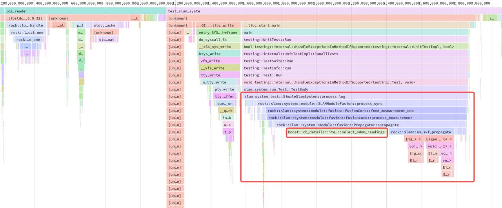

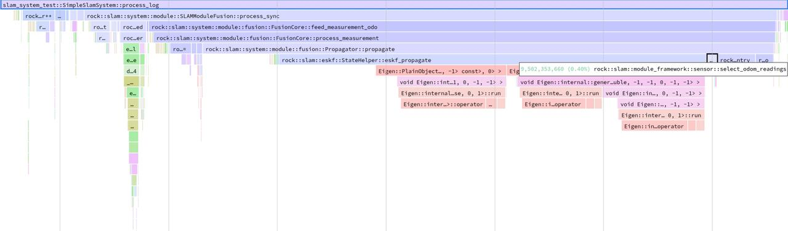

* 在阴影区域出桩：

  1. 竞品阴影区走的距离和轨迹，`@杨倩`给出；安规冲突 `@周晓旭`

  2. 2月底之前完成

* 坡上出桩建图

* 测试用例：搬动重定位，相机遮挡，夜间割草

  1. RTK的初始化，RTK等效，RTK热力图

# **2025-11-13**

## `@李岩`

1. imu递推，odo速度更新，RTK速度更新[~~ imu\_prop~~](https://roborock.feishu.cn/wiki/CKZLwu8htif7h0kNM9qcHf20nHd)（11.13）

   1. imu 名义递推（仿真的假数据验证）

   2. imu 计算jacobian，计算方差递推（公式写个文档 [ IMU Propagation Doc](https://roborock.feishu.cn/wiki/MLMjwwwzHiiCsRkiRS7cyQu8nSe)）

   3. 加计的坐标变换

   4. odo速度更新

   5. 航向更新在速度更新下是否更快

   6. zupt：[~~ bug418893~~](https://roborock.feishu.cn/wiki/Velewr8zhiqPqvk0rIKcg6DAnSd) [~~ Gyro bias测试~~](https://roborock.feishu.cn/wiki/S8wPwBjL0iMdcnk6dylcY4pbn3f) **[ 滤波器更新分析11-11](https://roborock.feishu.cn/wiki/DrHxw3PVriLaaSkb0vFcEoaknGd)（最新分析）**

      1. 理论上res=0和不更新现象应该是一样的，但是方差在更新，实际差很大

2. 人为移动机器数据采集分析（包含一组静止->直行->静止的数据）

3. 降低轨迹横向抖动`@郭明理`

   1. NHC 速度约束

## `@范超`

1. rtk-odo线程优化（P0）

   1. align结果反了，增加日志打印；重新梳理代码 `@林子越`

      1. 两个线程不能复现： RTK：sleep，odo: sleep

      2. i=0循环的问题可能是最大的

   2. 提高成功率，降低角度阈值，只排除纯旋转

   3. RTK和odo轨迹改成滑窗形式，成功了清空滑窗

   4. 降低窗口长度的阈值，看一下会降低对齐的质量

   5. 整理数据集（加入自测数据）看是否加快了yaw角优化  [ rtk-odo align改进自测](https://roborock.feishu.cn/wiki/SFYwwf9nAi2tFYkpPqvc7s2VnJf)

      1. pr

2. pause状态打断了重定位状态 （P0）（Done）

3. odo积分与RTK比较，合入data\_toolkit （P1）

   1. 代码pr&#x20;

      1. 非固定解情况下，odo递推

      2. 用vio\_estimate\_3d和RTK比较

   2. 比较odo递推和RTK比较，odo递推和vslam结果

      1. odo/RTK做比较

      2. [ Benchmark表格](https://roborock.feishu.cn/base/NkuabkuL5aD5EJsnQVZcd6AwnQh?table=tbl2Nx8Wv6PVFZHJ\&view=vewSSGrCzN)，用benchmark/放羊数据，Vslam reset有没有做处理

   3. 把gyro bias打印到日志

4. 四驱计算是否有问题 （P3）[ odoparser测试优化](https://roborock.feishu.cn/wiki/HhuxwAhczinga1kuoZAcYw6jnDb)

   1. 左前轮+左后轮，右前轮+右后轮，速度和两后轮不一致

   2. 可能前轮odo时间戳和后轮不同步 `@唐帅帅`确认一下时间戳是主控mcu时间戳还是电机mcu时间戳

5. 激光卡困检测（11.21）

   1. 激光计算的结果，替代RTK结果，测试`@周家宝`

## `@刘宏伟`

1. fast-livo2

   1. Fast-livo2代码进入repo

      1. 去ROS化+Simulator

         1. Pr

      2. 效果验证

         1. 用tof数据跑一下效果试试

   2. 上机：

      1. Fast livo搞一个slam module&#x20;

         1. 单独起一个计算线程 SLAMModuleVIO, SLAMModuleLIO

         2. pr

      2. plugins：接入外参、点云数据，机器上的lidar, imu, odo的格式转换，接入gdc图片和双目校正参数

         1. Pr

      3. 上机的时候有情况不发图像，需要把vio稳定

      4. 机器上结果和pc仿真结果一致

         1. 确认一下采集模式是否开slam，如果跑可以在采集模式下跑fast livo

      5. 统计内存和cpu

         1. nv12转rgb多占10\~20%的CPU，在算法内部用灰度图，只在赋色的时候用yuv，转给状态机的时候/save\_map的时候改成rgb

   3. 显示效果：最终显示效果使用什么形式（例如mesh）

   4. 落地方案评估：

      1. 视觉部分嵌入mlslam，或者单独进入后台线程计算

## `@茹毅超`

1. 假固定解处理（P0）

   1. 改pr，测试

   2. 回归看一下正常的是否会误判

   3. 测试文档整理

      1. 比较一下加入和不加入假固定解处理的效果

   [ rtk固定解跳变检测](https://roborock.feishu.cn/wiki/VAsxwda5DidB8RkzucocFvJRn9e)

   [ RTK假固定原始数据分析](https://roborock.feishu.cn/wiki/ZAo1wOkN7iOo4qkaDJacc0rHnne)

   [ RTK假固定解处理方案](https://roborock.feishu.cn/wiki/DJyQw02iFiopsmkhO6dczkVEntd)

   TODO：

   &#x20; 1测试norm数据集

2. 在建图过程中，主动重定位报错，重定位消息传给状态机（11.13）

   1. Pr&#x20;

3. RTK推导解标志位接入，看数据

   [ rtk添加fix_pro和real_time时间字段](https://roborock.feishu.cn/wiki/HFZdwI8tMi3sJFkfvsIcIjG3nKg?from=from_copylink)

   [ Rtk新版本测试需求](https://roborock.feishu.cn/wiki/TBSzwydhei9XmhkLBK7cEn7vngc?from=from_copylink)

   1. 现在的数据是固定解可信度（模糊度固定的卫星数/所有共视卫星数）

   2. 给出真实的timeout，功能替代当前的差分龄期 &#x20;

   3. 二供导入时间和给出数据是否一样 `@乔平平`

   已经有测试数据，厂家和驱动可以合入，slam接入新数据

4. 自研RTK接入（P3）

   1. [ 自研rtk同步跟进](https://roborock.feishu.cn/wiki/Hx3qwD24RisSOJkRLnDcq3rfnLb?from=from_copylink)

   2. [ 10.18自研rtk测试结果](https://roborock.feishu.cn/wiki/J10Gw2ONkisf2ykBj2CcuO2Znwg?from=from_copylink\&sheet=4f137c) by赵一沣

   3. &#x20;10.30[ 固定解分数测试结果](https://roborock.feishu.cn/wiki/QkhrwpnB9i6WlAkYKMVcdgfknPg?from=from_copylink)

   &#x20;    全面数据集

   &#x20;    https://roborock.feishu.cn/drive/folder/TD7XfdZe5l1FhQdDs0ncbw3pnUc

   统一测试点位和评价指标，输出结论

   模组厂家：凯芯    对接同事：吉利 赵一沣

5. NRTK接入 (penging) `@李威`

   以前李圳列的测试计划[ nRTK测试计划](https://roborock.feishu.cn/wiki/BOyMwU5Bii0xE3klwbVc5KFknlg)

   1. 给出的坐标是经纬高的形式，用第一个固定解做原点

      1. 地图维护原点经纬高

   2. 准备测试

   3. 5月，6月测试过，有数据。 &#x20;

   数据集（不多）

6. 放羊数据中差分龄期偏大 [ RTK差分龄期统计](https://roborock.feishu.cn/wiki/WP6qwyE9tiEf5BkLqEscpJ3Rn7g)（P3）

   1. 如果换了lora的新版本，可以监控放羊数据，做一个新统计 `@李威` `@陈云舸`

7. 三维重建的开源算法调研 （P2）

   &#x20;初步[ 点云渲染调研](https://roborock.feishu.cn/wiki/RGj9wY4Qwi8oM6kni8BciPypn3d)

       [ 3dgs在 ubuntu20 配置手册](https://roborock.feishu.cn/wiki/FSS1wfJFHiJ4J6kmBgycA0SSnQg?from=from_copylink)

   1. 常见开源算法调研

      1. 3dgs跑自采图片，看下室外效果

         1. 黑白图-有畸变-八参模型，gdc图-去畸变的-极线校正，数据集找`@刘宏伟`

      2. 3dgs-slam算法调研

## `@林子越`

1. Module fusion的计算部分移出dispatch，避免dispatch线程阻塞

2. l\_s\_run cpu占用率：

最大：select\_odom\_readings; 第二大：Eigen::Matrix::transpose

* 在阴影区域出桩：

  1. 竞品阴影区走的距离和轨迹，`@杨倩`给出；安规冲突 `@周晓旭`

  2. 2月底之前完成

* 建图过程中，cover: 拖拽，翻动，快速搬动，卡住扭动

  1. `@李岩`采数据看看

* 坡上出桩建图

* 测试用例：搬动重定位，相机遮挡，夜间割草

  1. RTK的初始化，RTK等效，RTK热力图

# **2025-11-06**

## `@李岩`

1. imu递推，odo速度更新，RTK速度更新[ imu\_prop](https://roborock.feishu.cn/wiki/CKZLwu8htif7h0kNM9qcHf20nHd)（11.13）

   1. imu 名义递推（仿真的假数据验证）

   2. imu 计算jacobian，计算方差递推（公式写个文档）

   3. 加计的坐标变换

   4. odo速度更新

   5. 航向更新在速度更新下是否更快

   6. zupt：[ bug418893](https://roborock.feishu.cn/wiki/Velewr8zhiqPqvk0rIKcg6DAnSd) [ Gyro bias测试](https://roborock.feishu.cn/wiki/S8wPwBjL0iMdcnk6dylcY4pbn3f)

      1. 理论上res=0和不更新现象应该是一样的，但是方差在更新，实际差很大

## `@范超`

1. RTK脱困检测[ 卡困检测算法进度](https://roborock.feishu.cn/wiki/Jfb8w2xRhiJwdJk7n1pcslJgnWg) （P0， 11.05）（合入）

   1. 本周进度

      1. 减少前向打滑的时间阈值（检测时间5\~6s）待导航同事确认`@郭明理`

      2. 数据集都可以检测出来

      3. 外场测试，待反馈结果

      4. 在沙坑和鹅软石下，能报出困住但是不能脱困

   2. 下周

      1. 四驱是否有特殊的需求（看下四驱是否有检测不出的情况）

         1. 四驱是否需要前轮加入判断

         2. 导航是否一定需要输出前轮打滑情况&#x20;

         3. 是否确实有后轮检测不出，需要加入前轮才能检测出的case

         4. 四驱里程计再看

2. 看看rtk-odo线程能不能降低角度要求[ rtk-odo align改进自测](https://roborock.feishu.cn/wiki/SFYwwf9nAi2tFYkpPqvc7s2VnJf)（P2）

   1. 降低角度阈值，只排除纯旋转，自测一个数据试试是否加快了

   2. 改成滑窗形式，成功了清空滑窗

      1. pr&#x20;

   3. align结果反了，多加一些日志看看，重新梳理一下代码

3. odo积分与RTK比较，合入data\_toolkit （P1）

   1. 代码pr&#x20;

      1. 非固定解情况下，odo递推

      2. 用vio\_estimate\_3d和RTK比较

   2. 比较odo递推和RTK比较，odo递推和vslam结果

      1. odo/RTK做比较

      2. [ Benchmark表格](https://roborock.feishu.cn/base/NkuabkuL5aD5EJsnQVZcd6AwnQh?table=tbl2Nx8Wv6PVFZHJ\&view=vewSSGrCzN)，用benchmark/放羊数据，Vslam reset有没有做处理

   3. 把gyro bias打印到日志

4. pause状态打断了重定位状态 （P2）

5. 四驱计算是否有问题 （P3）[ odoparser测试优化](https://roborock.feishu.cn/wiki/HhuxwAhczinga1kuoZAcYw6jnDb)

   1. 左后轮+左后轮，右前轮+右后轮

   2. 看画图、仿真的时候含义弄错了

6. 三维重建的开源算法调研

   1. 本周进展

      1. 看3dgs和nerf的文章

   2. 常见开源算法调研（9.3）

      1. 点云+图像，点云渲染

      以点云和图像为输入进行点云渲染的现有开源算法，比较各自文章的效果和算力

## `@刘宏伟`

1. fast-livo2

   1. Fast-livo2代码进入repo

      1. 开发分支：develop

      2. FAST\_LIVO2接入module&#x20;

         1. 去ROS化，为上机准备，仿真代码，做ROS （待改动）

            1. Pr

   2. 显示效果：从点云地图到mesh

   3. 上机：

      1. 效果验证

         1. 绕房子走一圈，看房子是否变形（没有变形）

         2. 分辨率比较低，同一个点着色是否平均值（Done）

         3. 用tof数据跑一下效果试试

      2. Fast livo在gitlab5的repo进内网（Done）

      3. Fast livo搞一个slam module&#x20;

         1. pr

         2. 接入外参、点云数据，机器上的lidar, imu, odo的格式转换(plugins)

         3. 单独起一个计算线程 SLAMModuleVIO, SLAMModuleLIO

   4. 落地方案评估：

      1. 嵌入mlslam，或者后台线程计算

2. 导航联调

   1. 接入mmt模式，状态同SlamMode一样（Done）

## `@茹毅超`

1. 假固定解处理（P0）

   1. 改pr，测试

   2. 机器静止

   3. 差分龄期、星数（Done）

   4. 回归看一下正常的是否会误判

   5. 测试文档整理

   [ rtk固定解跳变检测](https://roborock.feishu.cn/wiki/VAsxwda5DidB8RkzucocFvJRn9e)

   [ RTK假固定原始数据分析](https://roborock.feishu.cn/wiki/ZAo1wOkN7iOo4qkaDJacc0rHnne)

   [ RTK假固定解处理方案](https://roborock.feishu.cn/wiki/DJyQw02iFiopsmkhO6dczkVEntd)

   TODO：

   &#x20; 1测试norm数据集

2. RTK推导解标志位接入，看数据 （P1，11.06）

   1. [ rtk添加fix_pro和real_time时间字段](https://roborock.feishu.cn/wiki/HFZdwI8tMi3sJFkfvsIcIjG3nKg?from=from_copylink)

   [ Rtk新版本测试需求](https://roborock.feishu.cn/wiki/TBSzwydhei9XmhkLBK7cEn7vngc?from=from_copylink)

   1. 现在的数据是固定解可信度（模糊度固定的卫星数/所有共视卫星数）

   2. 给出真实的timeout，功能替代当前的差分龄期 &#x20;

   3. 二供导入时间和给出数据是否一样 `@乔平平`

   已经有测试数据，厂家和驱动可以合入，slam接入新数据

3. 自研RTK接入（P3）

   1. [ 自研rtk同步跟进](https://roborock.feishu.cn/wiki/Hx3qwD24RisSOJkRLnDcq3rfnLb?from=from_copylink)

   2. [ 10.18自研rtk测试结果](https://roborock.feishu.cn/wiki/J10Gw2ONkisf2ykBj2CcuO2Znwg?from=from_copylink\&sheet=4f137c) by赵一沣

   3. &#x20;10:30[ 固定解分数测试结果](https://roborock.feishu.cn/wiki/QkhrwpnB9i6WlAkYKMVcdgfknPg?from=from_copylink)

   &#x20;    全面数据集

   &#x20;    https://roborock.feishu.cn/drive/folder/TD7XfdZe5l1FhQdDs0ncbw3pnUc

   统一测试点位和评价指标，输出结论

   模组厂家：凯芯    对接同事：吉利 赵一沣

4. NRTK接入 (penging) `@李威`

   1. [ 手动配置nrtk示例](https://roborock.feishu.cn/wiki/Plicw8ZLniW3klkqTn1cqSOpnEh?from=from_copylink)

   以前李圳列的测试计划[ nRTK测试计划](https://roborock.feishu.cn/wiki/BOyMwU5Bii0xE3klwbVc5KFknlg)

   1. 给出的坐标是经纬高的形式，用第一个固定解做原点

      1. 地图维护原点经纬高

   2. 准备测试

   3. 5月，6月测试过，有数据。 &#x20;

   数据集（不多）

5. 放羊数据中差分龄期偏大 [ RTK差分龄期统计](https://roborock.feishu.cn/wiki/WP6qwyE9tiEf5BkLqEscpJ3Rn7g)（P3）

   1. 基站太多，新放羊数据 `@陈云舸` `@李威`

   2. 不全量ota

   &#x20;除了新版本的 lora ，跳频的序列由原来的固定序列改成随机序列，有改善，

6. 三维重建的开源算法调研 （P2）

   &#x20;初步[ 点云渲染调研](https://roborock.feishu.cn/wiki/RGj9wY4Qwi8oM6kni8BciPypn3d)

       [ 3dgs在 ubuntu20 配置手册](https://roborock.feishu.cn/wiki/FSS1wfJFHiJ4J6kmBgycA0SSnQg?from=from_copylink)

   1. 本周进展

      1. 看3dgs和nerf的文章

   2. 常见开源算法调研

      1. 3dgs跑自采图片，看下室外效果

         1. 黑白图-有畸变-八参模型，gdc图-去畸变的-极线校正，数据集找`@刘宏伟`

## `@林子越`

1. Module fusion的计算部分移出dispatch，避免dispatch线程阻塞

2. 测试用例：搬动重定位，相机遮挡，夜间割草

   1. RTK的初始化，RTK等效，RTK热力图

3. l\_s\_run: 40% 版本

https://auto.roborock.com/#/mower\_sheep/report?id=533

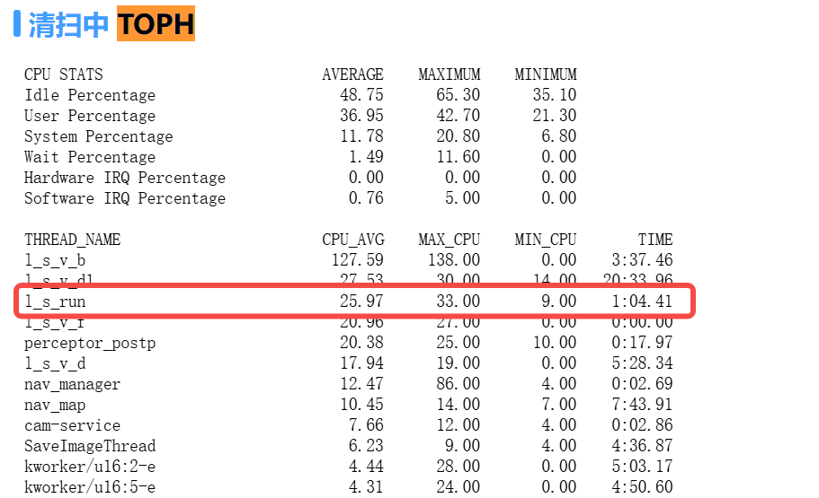

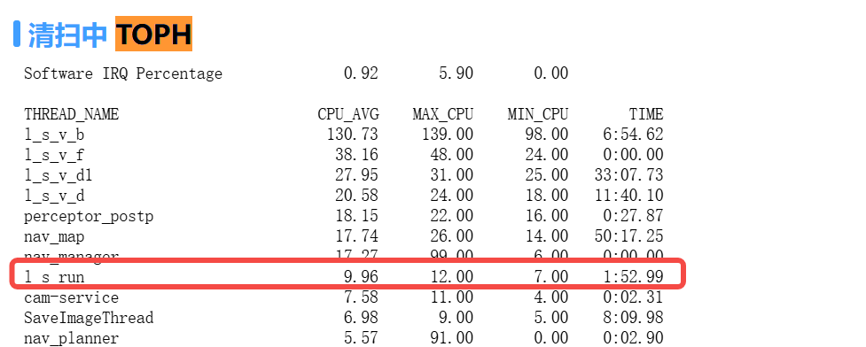

* 在阴影区域出桩：

  1. 竞品阴影区走的距离和轨迹，`@杨倩`给出；安规冲突 `@周晓旭`

# **2025-10-30**

## `@李岩`

1. Rework功能

   * 测试一下阈值时间的计算时间（手改时间戳/sleep）[ Rework](https://roborock.feishu.cn/wiki/XurXwkmUeiIrNEkUJm5cq9mSndc)

     1. 机器上，25个观测的计算时间为14ms，不会阻塞slam pose发送

2. imu递推，odo速度更新，RTK速度更新

   1. 航向更新在速度更新下是否更快

   2. zupt：[ bug418893](https://roborock.feishu.cn/wiki/Velewr8zhiqPqvk0rIKcg6DAnSd)

      1. 曾经的bug，加入数据集；深入分析

## `@范超`

1. RTK脱困检测[ 卡困检测算法进度](https://roborock.feishu.cn/wiki/Jfb8w2xRhiJwdJk7n1pcslJgnWg)

   1. 本周进度

      1. 减少前向打滑的时间阈值（检测时间5\~6s）待导航同事确认`@郭明理`

      2. 数据集都可以检测出来

      3. 外场测试，待反馈结果

      4. 在沙坑和鹅软石下，能报出困住但是不能脱困

   2. 下周

      1. 采集正常数据集，录制视频，看误检情况

      2. 四驱是否有特殊的需求

         1. 四驱是否需要前轮加入判断

         2. 导航是否一定需要输出前轮打滑情况&#x20;

         3. 是否确实有后轮检测不出，需要加入前轮才能检测出的case

         4. 四驱里程计再看

   3. Pr

   4. 合入是11.10

2. 看看rtk-odo线程能不能降低角度要求[ rtk-odo align改进自测](https://roborock.feishu.cn/wiki/SFYwwf9nAi2tFYkpPqvc7s2VnJf)

   1. 降低角度阈值，只排除纯旋转 Bug 412667

   2. 改成滑窗形式，成功了清空滑窗

      1. pr&#x20;

3. odo积分与RTK比较，合入data\_toolkit&#x20;

   1. 代码pr&#x20;

      1. 非固定解情况下，odo递推

   2. 比较odo递推和RTK比较，odo递推和vslam结果

      1. [ Benchmark表格](https://roborock.feishu.cn/base/NkuabkuL5aD5EJsnQVZcd6AwnQh?table=tbl2Nx8Wv6PVFZHJ\&view=vewSSGrCzN)，用benchmark/放羊数据，用vio\_estimate\_3d，和odo/RTK做比较，

      2. Vslam reset有没有做处理

   3. 把gyro bias打印到日志

4. 三维重建的开源算法调研

   1. 本周进展

      1. 看3dgs和nerf的文章

   2. 常见开源算法调研（9.3）

      1. 点云+图像，点云渲染

      以点云和图像为输入进行点云渲染的现有开源算法，比较各自文章的效果和算力

## `@刘宏伟`

1. fast-livo2

   1. Fast-livo2代码进入repo

      1. 开发分支：develop

      2. FAST\_LIVO2接入module&#x20;

         1. 去ROS化，为上机准备，仿真代码，做ROS （待改动）

            1. Pr

         2. 去pcl：只用了pcl的数据结构，换成自己的数据结构

            1. pr

         3. Fast livo2中原有的core dump解决

            1. Pr&#x20;

   2. 上机：

      1. 效果验证

         1. 绕房子走一圈，看房子是否变形

         2. 分辨率比较低，同一个点着色是否平均值

         3. 用tof数据跑一下效果试试

      2. Fast livo在gitlab5的repo进内网

      3. Fast livo搞一个slam module

      4. 接入外参、点云数据，机器上的lidar, imu, odo的格式转换&#x20;

      5. 单独起一个计算线程 SLAMModuleVIO, SLAMModuleLIO

   3. butchart\_convertor 加入解析激光数据的部分 (Lidar\_binId11, Lidar\_binId12)

2. 导航联调

   1. Slam pose加入global/local状态 (Done)

      1. Pr&#x20;

   2. 接入mmt模式，状态同SlamMode一样（10.30）

## `@茹毅超`

1. 搬动重定位 （Done）

   1. Pr&#x20;

   2. 等导航联调

   3. 搬动传感器的日志

2. 假固定解处理

   1. 改pr，测试

   2. 机器静止

   3. 差分龄期、星数（Done）

   4. 回归看一下正常的是否会误判

   [ rtk固定解跳变检测](https://roborock.feishu.cn/wiki/VAsxwda5DidB8RkzucocFvJRn9e)

   [ RTK假固定原始数据分析](https://roborock.feishu.cn/wiki/ZAo1wOkN7iOo4qkaDJacc0rHnne)

   [ RTK假固定解处理方案](https://roborock.feishu.cn/wiki/DJyQw02iFiopsmkhO6dczkVEntd)

   TODO：

     1测试norm数据集

3. RTK推导解标志位接入，看数据&#x20;

   1. [ rtk\_添加更多信息](https://roborock.feishu.cn/wiki/Oldjw8Alei6KNDktsC5cQOlKnEf?from=from_copylink)

   [ Rtk新版本测试需求](https://roborock.feishu.cn/wiki/TBSzwydhei9XmhkLBK7cEn7vngc?from=from_copylink)

   1. 现在的数据是固定解可信度（模糊度固定的卫星数/所有共视卫星数）

   2. 给出真实的timeout，功能替代当前的差分龄期 &#x20;

   rtk中间层，rtk和mcu版本都已经到位，李威在安排测试

4. 自研RTK接入

   1. [ 自研rtk同步跟进](https://roborock.feishu.cn/wiki/Hx3qwD24RisSOJkRLnDcq3rfnLb?from=from_copylink)

   2. [ 10.18自研rtk测试结果](https://roborock.feishu.cn/wiki/J10Gw2ONkisf2ykBj2CcuO2Znwg?from=from_copylink\&sheet=4f137c) by赵一沣

   3. &#x20;10:30[ 固定解分数测试结果](https://roborock.feishu.cn/wiki/QkhrwpnB9i6WlAkYKMVcdgfknPg?from=from_copylink)

   &#x20;    全面数据集

   &#x20;    https://roborock.feishu.cn/drive/folder/TD7XfdZe5l1FhQdDs0ncbw3pnUc

   统一测试点位和评价指标，输出结论

   模组厂家：凯芯    对接同事：吉利 赵一沣

5. NRTK接入 (penging) `@李威`

   1. [ 手动配置nrtk示例](https://roborock.feishu.cn/wiki/Plicw8ZLniW3klkqTn1cqSOpnEh?from=from_copylink)

   以前李圳列的测试计划[ nRTK测试计划](https://roborock.feishu.cn/wiki/BOyMwU5Bii0xE3klwbVc5KFknlg)

   1. 给出的坐标是经纬高的形式，用第一个固定解做原点

      1. 地图维护原点经纬高

   2. 准备测试

   3. 5月，6月测试过，有数据。  

   数据集（不多）

6. 放羊数据中差分龄期偏大 [ RTK差分龄期统计](https://roborock.feishu.cn/wiki/WP6qwyE9tiEf5BkLqEscpJ3Rn7g)

   1. 基站太多，新放羊数据 `@陈云舸` `@李威`

   2. 不全量ota

    除了新版本的 lora ，跳频的序列由原来的固定序列改成随机序列，有改善，

7. 三维重建的开源算法调研

    初步[ 点云渲染调研](https://roborock.feishu.cn/wiki/RGj9wY4Qwi8oM6kni8BciPypn3d)

   &#x20;   [ 3dgs在 ubuntu20 配置手册](https://roborock.feishu.cn/wiki/FSS1wfJFHiJ4J6kmBgycA0SSnQg?from=from_copylink)

   1. 本周进展

      1. 看3dgs和nerf的文章

   2. 常见开源算法调研

      1. 3dgs官方数据集和参数，跑通看下效果

## `@林子越`

1. Module fusion的计算部分移出dispatch，避免dispatch线程阻塞

2. 桩内重启+Set pose：

   1. versa&#x20;

3. 测试用例：搬动重定位，相机遮挡，夜间割草

   1. RTK的初始化，RTK等效，RTK热力图

4. l\_s\_run: 40%

https://auto.roborock.com/#/mower\_sheep/report?id=533

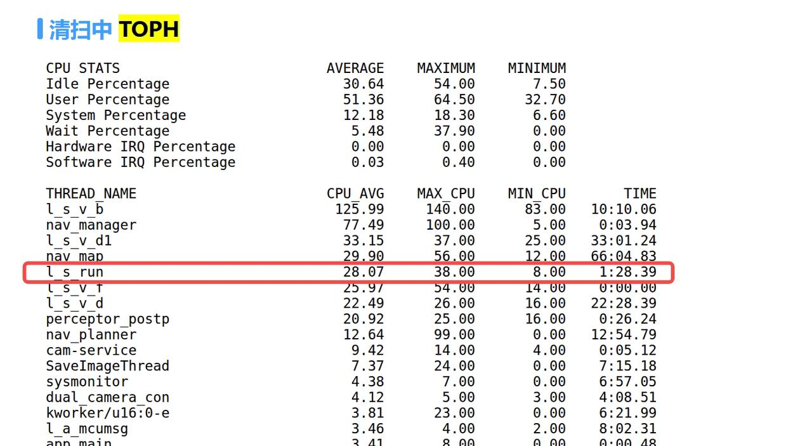

* 专利：四驱里程计，标定相关，三维重建

* 在阴影区域出桩：

  1. 竞品阴影区走的距离和轨迹，`@杨倩`给出；安规冲突

# **2025-10-23**

## `@李岩`

1. zupt的bug: 静止的时候不更新&#x20;

   1. 为什么不递推且不更新会有bug，继续分析（不再改动）

      1. Gyro bias还没有收敛，就进入计算

      2. 零速和零角速度更新

      3. 静止的时候，imu的角速度的噪声大

2. 时序问题，晚来的RTK会干扰之前的视觉 (Done)

   1. 分析：晚来的视觉观测会被RTK浮点解覆盖

      1. RTK浮点解不进入entry；新来的延迟的观测会更新之后所有的观测

   2. rework功能[ Rework](https://roborock.feishu.cn/wiki/XurXwkmUeiIrNEkUJm5cq9mSndc)

      1. rework和check\_insert放在一起

      2. 10.16 pr

   3. 测试一下阈值时间的计算时间（手改时间戳/sleep）

3. imu递推，odo速度更新，RTK速度更新

   1. 航向更新在速度更新下是否更快

   2. zupt

## `@范超`

1. RTK脱困检测[ 卡困检测算法进度](https://roborock.feishu.cn/wiki/Jfb8w2xRhiJwdJk7n1pcslJgnWg)

   1. 本周进度

      1. 减少前向打滑的时间阈值（检测时间5\~6s）待导航同事确认`@郭明理`

      2. 数据集都可以检测出来

      3. 外场测试，待反馈结果

      4. 在沙坑和鹅软石下，能报困住但是不能脱困

   2. 下周

      1. 采集正常数据集，录制视频，看误检情况

2. 看看rtk-odo线程能不能降低角度要求

   1. 排除纯选择

   2. 改成滑窗形式

3. odo积分与RTK比较，合入data\_toolkit&#x20;

   1. 代码pr&#x20;

      1. 非固定解情况下，odo递推

   2. 比较odo递推和RTK比较，odo递推和vslam结果

      1. [ Benchmark表格](https://roborock.feishu.cn/base/NkuabkuL5aD5EJsnQVZcd6AwnQh?table=tbl2Nx8Wv6PVFZHJ\&view=vewSSGrCzN)，用benchmark/放羊数据，用vio\_estimate\_3d，和odo/RTK做比较，

      2. Vslam reset有没有做处理

   3. 把gyro bias打印到日志

4. 三维重建的开源算法调研

   1. 本周进展

      1. 看3dgs和nerf的文章

   2. 常见开源算法调研（9.3）

      1. 点云+图像，点云渲染

      以点云和图像为输入进行点云渲染的现有开源算法，比较各自文章的效果和算力

## `@刘宏伟`

1. fast-livo2

   1. Fast-livo2代码进入repo

      1. 开发分支：develop

      2. FAST\_LIVO2接入module&#x20;

         1. CMakelist, 3rd party

            1. Pr&#x20;

         2. 去ROS化，为上机准备，仿真代码，做ROS （待改动）

            1. Pr

         3. 去pcl：只用了pcl的数据结构，换成自己的数据结构

            1. pr

         4. Fast livo2中原有的core dump解决

            1. Pr&#x20;

   2. 上机：

      1. 用test文件验证帧率 （Done）

         1. 内存问题 （Done）

         2. 树叶染成白色（Done)

         3. 绕房子走一圈，看房子是否变形

         4. 分辨率比较低，同一个点着色是否平均值

         5. 用tof数据跑一下效果试试

      2. Fast livo在gitlab5的repo进内网

      3. Fast livo搞一个slam module

      4. 接入外参、点云数据，机器上的lidar, imu, odo的格式转换&#x20;

      5. 单独起一个计算线程 SLAMModuleVIO, SLAMModuleLIO

   3. butchart\_convertor 加入解析激光数据的部分 (Lidar\_binId11, Lidar\_binId12)

2. 导航联调

   1. Slam pose加入global/local状态

      1. Pr&#x20;

   2. mmt模式和slam mode一样（10.30）

## `@茹毅超`

1. 搬动重定位

   1. Pr&#x20;

   2. 等导航联调

   3. 搬动传感器的日志

2. 假固定解处理

   1. 改pr，测试

   2. 机器静止

   3. 差分龄期、星数（Done）

   4. 回归看一下正常的是否会误判

   [ rtk固定解跳变检测](https://roborock.feishu.cn/wiki/VAsxwda5DidB8RkzucocFvJRn9e)

   [ RTK假固定原始数据分析](https://roborock.feishu.cn/wiki/ZAo1wOkN7iOo4qkaDJacc0rHnne)

   [ RTK假固定解处理方案](https://roborock.feishu.cn/wiki/DJyQw02iFiopsmkhO6dczkVEntd)

   TODO：

     1测试norm数据集

3. RTK推导解标志位接入，看数据&#x20;

   [ Rtk新版本测试需求](https://roborock.feishu.cn/wiki/TBSzwydhei9XmhkLBK7cEn7vngc?from=from_copylink)

   1. 现在的数据是固定解可信度（模糊度固定的卫星数/所有共视卫星数）

   2. 给出真实的timeout，功能替代当前的差分龄期 &#x20;

   rtk中间层，rtk和mcu版本都已经到位，李威在安排测试

4. 自研RTK接入

   1. [ 自研rtk同步跟进](https://roborock.feishu.cn/wiki/Hx3qwD24RisSOJkRLnDcq3rfnLb?from=from_copylink)

   2. [ 10.18自研rtk测试结果](https://roborock.feishu.cn/wiki/J10Gw2ONkisf2ykBj2CcuO2Znwg?from=from_copylink\&sheet=4f137c) by赵一沣

   &#x20;    全面数据集

   &#x20;    https://roborock.feishu.cn/drive/folder/TD7XfdZe5l1FhQdDs0ncbw3pnUc

   统一测试点位和评价指标，输出结论

   模组厂家：凯芯    对接同事：吉利 赵一沣

5. NRTK接入 (penging) `@李威`

   以前李圳列的测试计划[ nRTK测试计划](https://roborock.feishu.cn/wiki/BOyMwU5Bii0xE3klwbVc5KFknlg)

   1. 给出的坐标是经纬高的形式，用第一个固定解做原点

      1. 地图维护原点经纬高

   2. 准备测试

   3. 5月，6月测试过，有数据。  

   数据集（不多）

6. 放羊数据中差分龄期偏大 [ RTK差分龄期统计](https://roborock.feishu.cn/wiki/WP6qwyE9tiEf5BkLqEscpJ3Rn7g)

   1. 基站太多，新放羊数据 `@陈云舸` `@李威`

   2. 不全量ota

    除了新版本的 lora ，跳频的序列由原来的固定序列改成随机序列，有改善，

7. 三维重建的开源算法调研

    初步[ 点云渲染调研](https://roborock.feishu.cn/wiki/RGj9wY4Qwi8oM6kni8BciPypn3d)

   1. 本周进展

      1. 看3dgs和nerf的文章

   2. 常见开源算法调研

      1. 3dgs官方数据集和参数，跑通看下效果

## `@林子越`

1. Module fusion的计算部分移出dispatch，避免dispatch线程阻塞

2. 桩内重启+Set pose：

   1. versa&#x20;

3. 测试用例：搬动重定位，相机遮挡，夜间割草

   1. RTK的初始化，RTK等效，RTK热力图

4. l\_s\_run: 40%

   * odo扩容的原因

5. 专利：四驱里程计，标定相关，三维重建

6. 在阴影区域出桩：

   1. 竞品阴影区走的距离和轨迹，`@杨倩`给出；安规冲突

# **2025-10-16**

## `@李岩`

1. zupt的bug: 静止的时候不更新&#x20;

   1. 为什么不递推且不更新会有bug，继续分析

      1. Gyro bias还没有收敛，就进入计算

      2. 零速和零角速度更新

      3. 静止的时候，imu的角速度的噪声大

2. Pose align replay工具 (Done）

   1. Pr

   2. Plot rtk

3. 时序问题，晚来的RTK会干扰之前的视觉&#x20;

   1. 分析：晚来的视觉观测会被RTK浮点解覆盖

      1. RTK浮点解不进入entry；新来的延迟的观测会更新之后所有的观测

   2. rework功能[ Rework](https://roborock.feishu.cn/wiki/XurXwkmUeiIrNEkUJm5cq9mSndc)

      1. rework和check\_insert放在一起

      2. 10.16 pr

## `@范超`

1. odo积分与RTK比较，合入data\_toolkit&#x20;

   1. 代码pr&#x20;

      1. 非固定解情况下，odo递推

   2. 比较odo递推和RTK比较，odo递推和vslam结果

      1. [ Benchmark表格](https://roborock.feishu.cn/base/NkuabkuL5aD5EJsnQVZcd6AwnQh?table=tbl2Nx8Wv6PVFZHJ\&view=vewSSGrCzN)，用benchmark/放羊数据，用vio\_estimate\_3d，和odo/RTK做比较，

      2. Vslam reset有没有做处理

   3. 把gyro bias打印到日志

2. Slam pause/resume功能 (Done)

   1. plugins和状态机调通数据流，pause指令 （Done）

   2. pause传进fusion module （Done）

   3. pause期间发固定位姿（和导航约定），odo，RTK数据照常更新，odo align和RTKImageCheck线程暂停（Done）

   4. 暂停期间不要发重定位消息（Done）

   5. resume之后从原来位置继续计算 （Done）

   6. 暂停期间，位姿处理，如果搬动需要额外处理`@李欢`

3. RTK打滑检测[ 卡困检测算法进度](https://roborock.feishu.cn/wiki/Jfb8w2xRhiJwdJk7n1pcslJgnWg)

   1. 已有的数据，检出比例，回归验证

   2. 和导航联调

4. 三维重建的开源算法调研

   1. 本周进展

      1. 看3dgs和nerf的文章

   2. 常见开源算法调研（9.3）

      1. 点云+图像，点云渲染

      以点云和图像为输入进行点云渲染的现有开源算法，比较各自文章的效果和算力

5. imu递推，odo速度更新，RTK速度更新

   1. 航向更新在速度更新下是否更快

   2. zupt

## `@刘宏伟`

1. Versa

   1. Set\_mode+set\_pose 适配 （Done）

   2. Enable lidar

2. fast-livo2

   1. Fast-livo2代码进入repo

      1. 开发分支：develop

      2. FAST\_LIVO2接入module&#x20;

         1. 核心代码，去ROS化，为上机准备

            1. Pr&#x20;

         2. 仿真代码，做ROS

            1. Pr

         3. 去pcl：只用了pcl的数据结构，换成自己的数据结构

            1. pr

         4. Fast livo2中原有的core dump解决

            1. asan版本在x86上可以运行

            2. Pr&#x20;

      3. 采图小车，收激光+图像的数据

         1. `@汪浩然`的测试

   2. 上机：

      1. 用test文件验证帧率 （Done）

         1. 内存问题

         2. 树叶染成白色

      2. Fast livo在gitlab5的repo进内网

      3. Fast livo搞一个slam module

      4. 接入外参、点云数据，机器上的lidar, imu, odo的格式转换&#x20;

      5. 单独起一个计算线程 SLAMModuleVIO, SLAMModuleLIO

   3. butchart\_convertor 加入解析激光数据的部分 (Lidar\_binId11, Lidar\_binId12)

## `@茹毅超`

1. 搬动重定位

   1. 周一联调

2. 假固定解处理

   * Pr 10.13 `@李岩`

   * 机器静止

   * 差分龄期、星数（Done）

   * 回归看一下正常的是否会误判

   [ rtk固定解跳变检测](https://roborock.feishu.cn/wiki/VAsxwda5DidB8RkzucocFvJRn9e)

   [ RTK假固定原始数据分析](https://roborock.feishu.cn/wiki/ZAo1wOkN7iOo4qkaDJacc0rHnne)

   [ RTK假固定解处理方案](https://roborock.feishu.cn/wiki/DJyQw02iFiopsmkhO6dczkVEntd)

   TODO：

     1测试norm数据集

3. RTK推导解标志位接入，看数据&#x20;

   1. 现在的数据是固定解可信度（模糊度固定的卫星数/所有共视卫星数）

   2. 给出真实的timeout，功能替代当前的差分龄期 &#x20;

   3. 9.26给出版本`@乔平平` 10.9现在是版本，还没测起来

   &#x20;    10.16 中间层

   rtk过点的时候写的TODO，有版本，在测试，还没来得及跟

4. 自研RTK接入

   1. [ 自研rtk同步跟进](https://roborock.feishu.cn/wiki/Hx3qwD24RisSOJkRLnDcq3rfnLb?from=from_copylink)

    马上出首版

   模组厂家：凯芯    对接同事：吉利 赵一沣

   进度 ：自研模组调通，动态测试九月初做。

   1. 接口协议是否满足需求 [ 协议定义](https://roborock.feishu.cn/sheets/Igx8ss487hBo08tUlFIcl185nYg?from=from_copylink)&#x20;

   2. 已有单点静态数据，字段都正常，时间太短，看不出效果

   3. 滑轨动态数据测试`@李圳`来看，`@茹毅超`看下最后定位效果

   4. 还没有给出滑轨数据，`@李圳`圆形轨道有数据，直线还没测

   5. 在和和芯/司南测试相同的RTK点位测试

5. NRTK接入

   以前李圳列的测试计划[ nRTK测试计划](https://roborock.feishu.cn/wiki/BOyMwU5Bii0xE3klwbVc5KFknlg)

   1. 给出的坐标是经纬高的形式，用第一个固定解做原点

      1. 地图维护原点经纬高

   2. 准备测试

   3. 5月，6月测试过，有数据。  

   数据集（不多）

6. 放羊数据中差分龄期偏大 [ RTK差分龄期统计](https://roborock.feishu.cn/wiki/WP6qwyE9tiEf5BkLqEscpJ3Rn7g)

   1. 基站太多，新放羊数据 `@陈云舸` `@李威`

   2. 不全量ota

    除了新版本的 lora ，跳频的序列由原来的固定序列改成随机序列，有改善，

7. 三维重建的开源算法调研

    初步[ 点云渲染调研](https://roborock.feishu.cn/wiki/RGj9wY4Qwi8oM6kni8BciPypn3d)

   1. 本周进展

      1. 看3dgs和nerf的文章

   2. 常见开源算法调研（9.3）

      1. 点云+图像，点云渲染

      以点云和图像为输入进行点云渲染的现有开源算法，比较各自文章的效果和算力

## `@林子越`

1. Fusion module: 从最后的measurement开始递推不太合理 （Rework之后）

2. Module fusion的计算部分移出dispatch，避免dispatch线程阻塞

3. 桩内重启+Set pose：

   1. versa&#x20;

4. 搬动重定位

5. 测试用例：搬动重定位，相机遮挡，夜间割草

   1. RTK的初始化，RTK等效，RTK热力图

6. l\_s\_run: 40%

   * 可能是odo扩容的原因

7. 专利：四驱里程计，标定相关，三维重建

# **2025-10-09**

## `@李岩`

1. zupt的bug: 静止的时候不更新&#x20;

   1. TODO：

      1. 为什么不递推且不更新会有bug，继续分析

         1. Gyro bias还没有收敛，就进入计算

         2. 零速和零角速度更新

2. Pose align replay工具

   1. pr

3. 时序问题，晚来的RTK会干扰之前的视觉 （9.22）

   1. 分析：晚来的视觉观测会被RTK浮点解覆盖

      1. RTK浮点解不进入entry；新来的延迟的观测会更新之后所有的观测

   2. rework功能（9.24 pr)[ Rework](https://roborock.feishu.cn/wiki/XurXwkmUeiIrNEkUJm5cq9mSndc)

      1. rework和check\_insert放在一起

## `@范超`

1. odo积分与RTK比较，合入data\_toolkit&#x20;

   1. 代码pr&#x20;

      1. 非固定解情况下，odo递推

   2. 比较odo递推和RTK比较，odo递推和vslam结果

      1. [ Benchmark表格](https://roborock.feishu.cn/base/NkuabkuL5aD5EJsnQVZcd6AwnQh?table=tbl2Nx8Wv6PVFZHJ\&view=vewSSGrCzN)，用benchmark/放羊数据，用vio\_estimate\_3d，和odo/RTK做比较，

      2. Vslam reset有没有做处理

   3. 把gyro bias打印到日志

2. Slam pause/resume功能（9.26）

   1. plugins和状态机调通数据流，pause指令 （Done）

   2. pause传进fusion module （Done）

   3. pause期间发固定位姿（和导航约定），odo，RTK数据照常更新，odo align和RTKImageCheck线程暂停（Done）

   4. 暂停期间不要发重定位消息（Done）

   5. resume之后从原来位置继续计算 （Done）

   6. 暂停期间，位姿处理，如果搬动需要额外处理`@李欢`

3. RTK打滑检测

   1. imu/odo打滑检测 by `@郭科`&#x20;

   2. RTK和odo比较的打滑检测

   3. 代码交接 `@郭科`

4. 三维重建的开源算法调研

   1. 本周进展

      1. 看3dgs和nerf的文章

   2. 常见开源算法调研（9.3）

      1. 点云+图像，点云渲染

      以点云和图像为输入进行点云渲染的现有开源算法，比较各自文章的效果和算力

5. imu递推，odo速度更新，RTK速度更新

   1. 航向更新在速度更新下是否更快

   2. zupt

## `@刘宏伟`

1. Versa

   1. Set\_mode+set\_pose 适配

2. fast-livo2

   * 研究GPU加速的可能性  （低优先级，问了GPT VIO部分可以使用，但是感觉没必要，现在VIO大概更新时间是 5ms(X86)）

   * tof数据+图像 `@王双双` `@林子越`

     1. 能接入，用双目避障预研的tof+图像数据+外参（Done)

3.

   1. 融合模块修改代码支持传感器异步运行

      1. jenkins触发加宏，ENABLE\_RAW\_ORDER `@林子越`

   2. Fast-livo2代码进入repo

      1. 开发分支：develop

      2. FAST\_LIVO2接入module&#x20;

         1. 核心代码，去ROS化，为上机准备

            1. Pr&#x20;

         2. 仿真代码，做ROS

            1. Pr

         3. 去pcl：只用了pcl的数据结构，换成自己的数据结构

            1. pr

         4. Fast livo2中原有的core dump解决

            1. asan版本在x86上可以运行

            2. Pr&#x20;

         5. 存彩色图片`@汪浩然`（Done）

      3. 采图小车，收激光+图像的数据

   3. 上机：

      1. 用test文件验证帧率

      2. Fast livo在gitlab5的repo进内网

      3. Fast livo搞一个slam module

      4. 接入外参、点云数据，机器上的lidar, imu, odo的格式转换

      5. 单独起一个计算线程 SLAMModuleVIO, SLAMModuleLIO

   4. butchart\_convertor 加入解析激光数据的部分 (Lidar\_binId11, Lidar\_binId12)

## `@茹毅超`

1. 假固定解处理

   * 框架（9.12）（修改）

   * 机器静止

   * 差分龄期、星数（Done）

   * 马氏距离 `@李岩`

   * 回归看一下正常的是否会误判

   [ rtk固定解跳变检测](https://roborock.feishu.cn/wiki/VAsxwda5DidB8RkzucocFvJRn9e)

   [ RTK假固定原始数据分析](https://roborock.feishu.cn/wiki/ZAo1wOkN7iOo4qkaDJacc0rHnne)

   [ RTK假固定解处理方案](https://roborock.feishu.cn/wiki/DJyQw02iFiopsmkhO6dczkVEntd)

   TODO：

     1测试norm数据集

2. RTK推导解标志位接入，看数据&#x20;

   1. 现在的数据是固定解可信度（模糊度固定的卫星数/所有共视卫星数）

   2. 给出真实的timeout，功能替代当前的差分龄期 &#x20;

   3. 9.26给出版本`@乔平平` 10.9现在是版本，还没测起来

   rtk过点的时候写的TODO，有版本，在测试，还没来得及跟

3. 自研RTK接入

   1. [ 自研rtk同步跟进](https://roborock.feishu.cn/wiki/Hx3qwD24RisSOJkRLnDcq3rfnLb?from=from_copylink)

    马上出首版

   模组厂家：凯芯    对接同事：吉利 赵一沣

   进度 ：自研模组调通，动态测试九月初做。

   1. 接口协议是否满足需求 [ 协议定义](https://roborock.feishu.cn/sheets/Igx8ss487hBo08tUlFIcl185nYg?from=from_copylink)&#x20;

   2. 已有单点静态数据，字段都正常，时间太短，看不出效果

   3. 滑轨动态数据测试`@李圳`来看，`@茹毅超`看下最后定位效果

   4. 还没有给出滑轨数据，`@李圳`圆形轨道有数据，直线还没测

   5. 在和和芯/司南测试相同的RTK点位测试

4. NRTK接入

   以前李圳列的测试计划[ nRTK测试计划](https://roborock.feishu.cn/wiki/BOyMwU5Bii0xE3klwbVc5KFknlg)

   1. 给出的坐标是经纬高的形式，用第一个固定解做原点

      1. 地图维护原点经纬高

   2. 准备测试

   3. 5月，6月测试过，有数据。   

   数据集（不多）

5. 放羊数据中差分龄期偏大 [ RTK差分龄期统计](https://roborock.feishu.cn/wiki/WP6qwyE9tiEf5BkLqEscpJ3Rn7g)

   1. 基站太多，新放羊数据 `@陈云舸` `@李威`

   2. 不全量ota

    除了新版本的 lora ，跳频的序列由原来的固定序列改成随机序列，有改善，

6. 三维重建的开源算法调研

    初步[ 点云渲染调研](https://roborock.feishu.cn/wiki/RGj9wY4Qwi8oM6kni8BciPypn3d)

   1. 本周进展

      1. 看3dgs和nerf的文章

   2. 常见开源算法调研（9.3）

      1. 点云+图像，点云渲染

      以点云和图像为输入进行点云渲染的现有开源算法，比较各自文章的效果和算力

## `@林子越`

1. Fusion module: 从最后的measurement开始递推不太合理 （Rework之后）

2. Module fusion的计算部分移出dispatch，避免dispatch线程阻塞

3. 外网仿真包北京-苏州同步`@董丹丹`（Done）

4. Set pose：versa;&#x20;

5. 搬动重定位

6. 测试用例：搬动重定位，相机遮挡，夜间割草

   1. RTK的初始化，RTK等效，RTK热力图

# **2025-09-25**

## `@李岩`

1. zupt的bug: 静止的时候不更新&#x20;

   1. TODO：

      1. 为什么不递推且不更新会有bug，继续分析

2. replay工具

   1. TODO：

      1. rviz显示未完成

3. 时序问题，晚来的RTK会干扰之前的视觉 （9.22）

   1. 分析：晚来的视觉观测会被RTK浮点解覆盖

   2. rework功能（9.24 pr)[ Rework](https://roborock.feishu.cn/wiki/XurXwkmUeiIrNEkUJm5cq9mSndc)

      1. RTK浮点解不进入entry；新来的延迟的观测会更新之后所有的观测

      2. rework和check\_insert放在一起

## `@范超`

1. IMU参数&#x20;

   * 标定一个IMU参数看看 acc/gyro 白噪声、零偏噪声，需要采数据，规格书只有白噪声

     1. allan方差标定问题待排查：加长使用数据的时间 [ IMU噪声标定](https://roborock.feishu.cn/wiki/RT4Tw060viMh1jk9TiscaVubnPd)

2. odo积分与RTK比较，合入data\_toolkit&#x20;

   1. 代码pr&#x20;

      1. 非固定解情况下，odo递推

   2. 比较odo递推和RTK比较，odo递推和vslam结果

      1. [ Benchmark表格](https://roborock.feishu.cn/base/NkuabkuL5aD5EJsnQVZcd6AwnQh?table=tbl2Nx8Wv6PVFZHJ\&view=vewSSGrCzN)，用benchmark/放羊数据，用vio\_estimate\_3d，和odo/RTK做比较，

      2. Vslam reset有没有做处理

   3. 把gyro bias打印到日志

3. Slam pause/resume功能（9.26）

   1. plugins和状态机调通数据流，pause指令 （Done）

   2. pause传进fusion module （Done）

   3. pause期间发固定位姿（和导航约定），odo，RTK数据照常更新，odo align和RTKImageCheck线程暂停

   4. resume之后从原来位置继续计算&#x20;

   5. 暂停期间，位姿处理，如果搬动需要额外处理`@李欢`

4. 三维重建的开源算法调研

   1. 本周进展

      1. 看3dgs和nerf的文章

   2. 常见开源算法调研（9.3）

      1. 点云+图像，点云渲染

      以点云和图像为输入进行点云渲染的现有开源算法，比较各自文章的效果和算力

5. imu递推，odo速度更新，RTK速度更新

## `@刘宏伟`

1. 调通和激光模块的接口&#x20;

   1. 激光和融合仿真打通，lio\_estimate\_3d仿照vio\_estimate\_3d

   2. Pr

   3. 测试：odo和IMU时间戳同步，用AP的时间戳，加一个项目宏

2. fast-livo2

   * 研究GPU加速的可能性  （低优先级，问了GPT VIO部分可以使用，但是感觉没必要，现在VIO大概更新时间是 5ms(X86)）

   * tof数据+图像 `@王双双` `@林子越`

     1. 能接入，用双目避障预研的tof+图像数据+外参

3.

   1. 融合模块修改代码支持传感器异步运行（8.29）（Done）

      1. 复现机器上时间延迟的效果

      2. 待合入（9.12）

      3. jenkins触发加宏，ENABLE\_RAW\_ORDER `@林子越`

   2. Fast-livo2代码进入repo

      1. 开发分支：develop

      2. FAST\_LIVO2接入module&#x20;

         1. 核心代码，去ROS化，为上机准备

            1. Pr&#x20;

         2. 仿真代码，做ROS

            1. Pr

         3. 去pcl：只用了pcl的数据结构，换成自己的数据结构

            1. pr

         4. Fast livo2中原有的core dump解决

            1. asan版本在x86上可以运行

            2. Pr&#x20;

         5. 存彩色图片`@汪浩然`（Done）

   3. 上机：

      1. Fast livo在gitlab5的repo进内网

      2. Fast livo搞一个slam module

      3. 接入外参、点云数据，机器上的lidar, imu, odo的格式转换

      4. 单独起一个计算线程 SLAMModuleVIO, SLAMModuleLIO

      5. 用test文件验证帧率

   4. butchart\_convertor 加入解析激光数据的部分 (Lidar\_binId11, Lidar\_binId12)

   5. 中间层发lidar-cam外参（Done）

      1. plugins接入，slam common

## `@茹毅超`

1. 假固定解处理

   * 框架（9.12）（修改）

   * 机器静止

   * 差分龄期、星数（Done）

   * 马氏距离 `@李岩`

   [ rtk固定解跳变检测](https://roborock.feishu.cn/wiki/VAsxwda5DidB8RkzucocFvJRn9e)

   [ RTK假固定原始数据分析](https://roborock.feishu.cn/wiki/ZAo1wOkN7iOo4qkaDJacc0rHnne)

   [ RTK假固定解处理方案](https://roborock.feishu.cn/wiki/DJyQw02iFiopsmkhO6dczkVEntd)

2. RTK推导解标志位接入，看数据&#x20;

   1. 现在的数据是固定解可信度（模糊度固定的卫星数/所有共视卫星数）

   2. 给出真实的timeout，功能替代当前的差分龄期 &#x20;

   3. 9.26给出版本`@乔平平` 现在是版本，还没测起来

3. RTK基站评分，降低评分的阈值，数据待采 （pending) [ 整机基站打分对比测试结果](https://roborock.feishu.cn/wiki/DFQBwgmXoijZXMkMtdAc8s35nSf?from=from_copylink)&#x20;

   1. 75分以上可以接受

   2. 通过流动站接收RTK信号的质量，评估基站的信号质量

4. 自研RTK接入

   1. [ 自研rtk同步跟进](https://roborock.feishu.cn/wiki/Hx3qwD24RisSOJkRLnDcq3rfnLb?from=from_copylink)

   模组厂家：凯芯    对接同事：吉利 赵一沣

   进度 ：自研模组调通，动态测试九月初做。

   1. 接口协议是否满足需求 [ 协议定义](https://roborock.feishu.cn/sheets/Igx8ss487hBo08tUlFIcl185nYg?from=from_copylink)&#x20;

   2. 已有单点静态数据，字段都正常，时间太短，看不出效果

   3. 滑轨动态数据测试`@李圳`来看，`@茹毅超`看下最后定位效果

   4. 还没有给出滑轨数据，`@李圳`圆形轨道有数据，直线还没测

5. NRTK接入

   1. 给出的坐标是经纬高的形式，用第一个固定解做原点

   2. 5月，6月测试过，有数据。

6. 放羊数据中差分龄期偏大 [ RTK差分龄期统计](https://roborock.feishu.cn/wiki/WP6qwyE9tiEf5BkLqEscpJ3Rn7g)

   1. 基站太多，新放羊数据

## `@林子越`

1. Fusion module: 从最后的measurement开始递推不太合理

2. Module fusion的计算部分移出dispatch，避免dispatch线程阻塞

3. 外网仿真包北京-苏州同步`@董丹丹`

4. Set pose，搬动重定位

5. 测试用例：搬动重定位，相机遮挡，夜间割草

   1. RTK的初始化，RTK等效，RTK热力图

6. RTK打滑检测：用于导航脱困

# **2025-09-17**

## `@李岩`

1. 接入视觉（9.11）

   1. 给视觉开一个get\_pose的接口，在视觉初始化的时候视觉自己调用 (q,p,v) （Done)

   2. TODO：

      1. 看`@李宝玉`的新需求

2. zupt的bug: 静止的时候不更新&#x20;

   1. TODO：

      1. 为什么不递推且不更新会有bug，继续分析

3. replay工具

   1. TODO：

      1. rviz显示未完成

4. 时序问题，晚来的RTK会干扰之前的视觉 （9.22）

   1. 分析：晚来的视觉观测会被RTK浮点解覆盖

   2. TODO：rework功能 [ Rework](https://roborock.feishu.cn/wiki/XurXwkmUeiIrNEkUJm5cq9mSndc)

      1. RTK浮点解进入entry，没有update，影响视觉位姿的更新

      2. RTK浮点解不进入entry

## `@范超`

1. IMU参数&#x20;

   * 标定一个IMU参数看看 acc/gyro 白噪声、零偏噪声，需要采数据，规格书只有白噪声

     1. 采集24小时（9.2）`@茹毅超`（Done）

     2. allan方差标定问题待排查

2. Monet odo处理策略（9.2） [ 四驱里程计方案](https://roborock.feishu.cn/wiki/FUjyw5u1qigfmAkqMHickKPAnBb) [ 四驱里程计验证(二)](https://roborock.feishu.cn/wiki/FAdXw5f0QiwLQLkXKvscIFHRn7v) （Done）

   1. 本周进展

      1. 电机到主控，后轮Odo丢包严重。Butchart上也存在。（驱动解决）

      2. 实现四驱的运动模型 `@范超`

      3. 四驱数据plugin接入

         1. Pr&#x20;

         2. 上机测试数据能正常收到

      4. 打滑数据采集，验证打滑的时候有效

   2. Action

      1. 实现四驱的运动模型 `@范超` `@李宝玉`

         1. 加一个功能：输入$$t_1-t_2$$时刻，输出odo纯积分值

3. odo积分与RTK比较，合入data\_toolkit&#x20;

   1. 代码pr&#x20;

   2. 比较odo递推和RTK比较，odo递推和vslam结果

      1. [ Benchmark表格](https://roborock.feishu.cn/base/NkuabkuL5aD5EJsnQVZcd6AwnQh?table=tbl2Nx8Wv6PVFZHJ\&view=vewSSGrCzN)，用benchmark/放羊数据，用vio\_estimate\_3d，和odo/RTK做比较，

      2. Vslam reset有没有做处理

4. Slam pause/resume功能

   1. 和状态机调通数据流，pause指令

   2. pause传进fusion module

   3. pause期间发固定位姿（和导航约定），odo，RTK数据照常更新，odo align和RTKImageCheck线程暂停

   4. resume之后从原来位置继续计算

   5. 暂停期间，位姿处理，如果搬动需要额外处理`@李欢`

5. 三维重建的开源算法调研

   1. 本周进展

      1. 看3dgs和nerf的文章

   2. 常见开源算法调研（9.3）

      1. 点云+图像，点云渲染

      以点云和图像为输入进行点云渲染的现有开源算法，比较各自文章的效果和算力

6. imu递推，odo速度更新，RTK速度更新

## `@周行`

## `@刘宏伟`

1. 调通和激光模块的接口&#x20;

   1. Pr&#x20;

   2. 测试：odo和IMU时间戳同步

2. fast-livo2，lvi-sam代码流程梳理 0815（DONE）

   1. 采集的数据在x86上（DONE）

   2. FAST\_LIVO2接入log\_parser完成，随时可以测试

   3. 研究GPU加速的可能性  （低优先级，问了GPT VIO部分可以使用，但是感觉没必要，现在VIO大概更新时间是 5ms(X86)）

   4. tof数据+图像 `@王双双` `@林子越`

3. 0828 - 0904 Action

   1. 融合模块修改代码支持传感器异步运行（8.29）

      1. 复现机器上时间延迟的效果

      2. 待合入（9.12）

   2. Fast-livo2代码进入repo

      1. 开发分支：develop

      2. FAST\_LIVO2接入module&#x20;

         1. 核心代码，去ROS化，为上机准备

            1. Pr&#x20;

         2. 仿真代码，做ROS

            1. Pr

         3. 去pcl：只用了pcl的数据结构，换成自己的数据结构

         4. 存彩色图片`@汪浩然`

   3. butchart\_convertor 加入解析激光数据的部分 (Lidar\_binId11, Lidar\_binId12)

   4. 中间层发lidar-cam外参

      1. plugins接入，slam common

   5. 扫地机双目避障预研，双目图像+tof，问下`@李永`

      1. Logparser 在单独分支

## `@茹毅超`

1. 标定工作对接，留存文档`@邱冰冰`（9月12日文档，下周把所有代码交接）[ IQC交接文档](https://roborock.feishu.cn/wiki/B6NowREM3icgb5kubcbcHipHnwb?from=from_copylink) （Done）

2. 提mr的流程打通（Done）

3. 假固定解处理

   1. `@李岩`提供数据，如果有时间点可以附上 （Done) 开一个共享云盘

   2. 框架（9.12）（修改）

   [ rtk固定解跳变检测](https://roborock.feishu.cn/wiki/VAsxwda5DidB8RkzucocFvJRn9e)

   [ RTK假固定原始数据分析](https://roborock.feishu.cn/wiki/ZAo1wOkN7iOo4qkaDJacc0rHnne)

   [ RTK假固定解处理方案](https://roborock.feishu.cn/wiki/DJyQw02iFiopsmkhO6dczkVEntd)

4. RTK推导解标志位接入，看数据

   1. 和芯把推导解放在agric的预留字段，出一个私包 `@李威`

      1. 无法给出推导解标志位

   2. 现在的数据是固定解可信度（模糊度固定的卫星数/所有共视卫星数）

   3. 给出真实的timeout，功能替代当前的差分龄期

5. RTK基站评分，降低评分的阈值，数据待采 （pending) [ 整机基站打分对比测试结果](https://roborock.feishu.cn/wiki/DFQBwgmXoijZXMkMtdAc8s35nSf?from=from_copylink)&#x20;

   1. 75分以上可以接受

   2. 通过流动站接收RTK信号的质量，评估基站的信号质量

6. 关闭北二卫星&#x20;

   1. 略微变差，但是可以接受。

   2. 对于欧美用户无影响，对于国内会少搜一批卫星

   3. 关闭之后国内RTK数据会有明显变差

      1. 无法确定变差的原因是不是因为关了北二卫星

7. 自研RTK接入

   1. [ 自研rtk同步跟进](https://roborock.feishu.cn/wiki/Hx3qwD24RisSOJkRLnDcq3rfnLb?from=from_copylink)

   模组厂家：凯芯    对接同事：吉利 赵一沣

   进度 ：自研模组调通，动态测试九月初做。

   1. 接口协议是否满足需求 [ 协议定义](https://roborock.feishu.cn/sheets/Igx8ss487hBo08tUlFIcl185nYg?from=from_copylink)

   2. 已有单点静态数据，字段都正常，时间太短，看不出效果

   3. 滑轨动态数据测试`@李圳`来看，`@茹毅超`看下最后定位效果

8. NRTK接入

   1. 给出的坐标是经纬高的形式，用第一个固定解做原点

9. 相机模组极限机排查 （Done）

10. 熟悉bug分析方法 （Done）

11. 放羊数据中差分龄期偏大[ RTK差分龄期统计](https://roborock.feishu.cn/wiki/WP6qwyE9tiEf5BkLqEscpJ3Rn7g)

## `@林子越`

1. 编archive包的脚本，远端分支编译 `@李宝玉`

2. Fusion module: 从最后的measurement开始递推不太合理

3. Module fusion的计算部分移出dispatch，避免dispatch线程阻塞

4. 外网仿真包北京-苏州同步`@董丹丹`

5. Set pose，搬动重定位

6. 测试用例：搬动重定位，相机遮挡，夜间割草

   1. RTK的初始化，RTK等效，RTK热力图

7. RTK打滑检测：用于导航脱困

# **2025-09-11**

## `@李岩`

1. 接入视觉（9.11）

   1. TODO：

      1. 给视觉开一个get\_pose的接口，在视觉初始化的时候视觉自己调用 (q,p,v)

2. zupt的bug: 静止的时候不更新&#x20;

   1. 已完成：

      1. zupt策略：静止的时候不递推但是正常更新 （9.2合入，9.5修复）

   2. TODO：

      1. 为什么不递推且不更新会有bug，继续分析

3. replay工具

   1. 已完成：

      1. 加上pose\_aligned：写和读都可以

   2. TODO：

      1. rviz显示未完成

4. Bug: dispatch阻塞-> 用了std::cout打印日志（9月5号合入，9月8号修复）（Done）

5. 时序问题，晚来的RTK会干扰之前的视觉 （9.22）

   1. 分析：晚来的视觉观测会被RTK浮点解覆盖

   2. TODO：rework功能

6. imu递推，odo更新

## `@范超`

1. slam初始对准的bug （8.29）（Done）

2. IMU参数&#x20;

   * 标定一个IMU参数看看 acc/gyro 白噪声、零偏噪声，需要采数据，规格书只有白噪声

     1. 采集24小时（9.2）`@茹毅超`（Done）

3. Monet odo处理策略（9.2） [ 四驱里程计方案](https://roborock.feishu.cn/wiki/FUjyw5u1qigfmAkqMHickKPAnBb) [ 四驱里程计验证(二)](https://roborock.feishu.cn/wiki/FAdXw5f0QiwLQLkXKvscIFHRn7v)

   1. 本周进展

      1. 电机到主控，后轮Odo丢包严重。Butchart上也存在。（驱动解决）

      2. 实现四驱的运动模型 `@范超`

      3. 四驱数据plugin接入

         1. Pr&#x20;

         2. 上机测试数据能正常收到

      4. 打滑数据采集，验证打滑的时候有效

   2. Action

      1. 实现四驱的运动模型 `@范超`

         1. odo积分与RTK比较，合入data\_toolkit `@李宝玉`

         2. 加一个功能：输入$$t_1-t_2$$时刻，输出odo纯积分值

4. 三维重建的开源算法调研

   1. 本周进展

      1. 看3dgs和nerf的文章

   2. 常见开源算法调研（9.3）

      1. 点云+图像，点云渲染

      以点云和图像为输入进行点云渲染的现有开源算法，比较各自文章的效果和算力

## `@周行`

## `@刘宏伟`

1. 调通和激光模块的接口&#x20;

   1. 需要做一个测试，测试有问题

2. 激光-视觉融合，先走松耦合方案 &#x20;

   * fast-livo2，lvi-sam代码流程梳理 0815（DONE）

     1. 采集的数据在x86上（DONE）

     2. FAST\_LIVO2接入log\_parser完成，随时可以测试

     3. 研究GPU加速的可能性  （低优先级，问了GPT VIO部分可以使用，但是感觉没必要，现在VIO大概更新时间是 5ms(X86)）

     4. tof数据+图像 `@王双双` `@林子越`

3. 0828 - 0904 Action

   1. 融合模块修改代码支持传感器异步运行（8.29）

      1. 复现机器上时间延迟的效果

      2. 待合入（9.12）

   2. Fast-livo2代码进入repo

      1. 开发分支：develop

      2. FAST\_LIVO2接入log\_parser

         1. 核心代码，去ROS化，为上机准备

            1. Pr&#x20;

         2. 仿真代码，做ROS

            1. 确认改变代码以后，运行效果不变

   3. butchart\_convertor 加入解析激光数据的部分 (Lidar\_binId11, Lidar\_binId12)

   4. FAST\_LIVO2接入log\_parser、去pcl

   5. 相机和激光的时间同步，

      1. 要一组标定数据（`@余一徽`) （Done）

4. bug分析

   [ 本周处理过的融合 BUG 一览](https://roborock.feishu.cn/wiki/UMz1w333Gi9mRokuunYcJtQ3nBd)

   1. 在有RTK的时候，视觉也会做递推

   2. propator的imu/odo队列太短，缺少观测的时候丢gyroodo

      1. 5s -> 500s

## `@茹毅超`

1. 标定工作对接，留存文档`@邱冰冰`（9月12日文档，下周把所有代码交接）

2. 提mr的流程打通

3. 假固定解处理

   1. `@李岩`提供数据，如果有时间点可以附上；开一个共享云盘

   2. 框架（9.12）

   [ rtk固定解跳变检测](https://roborock.feishu.cn/wiki/VAsxwda5DidB8RkzucocFvJRn9e)

   [ RTK假固定原始数据分析](https://roborock.feishu.cn/wiki/ZAo1wOkN7iOo4qkaDJacc0rHnne)

   [ RTK假固定解处理方案](https://roborock.feishu.cn/wiki/DJyQw02iFiopsmkhO6dczkVEntd)

4. RTK推导解标志位接入，看数据

   1. 和芯把推导解放在agric的预留字段，出一个私包 `@李威`

   2. 现在的数据是固定解可信度（可视卫星/所有卫星数），不是原先约定的推导解标志位

5. RTK基站评分，降低评分的阈值，数据待采

   1. 没数据

6. 关闭北二卫星

   1. 对于欧美用户无影响，对于国内会少搜一批卫星

   2. 有数据，关闭之后国内RTK数据会有明显变差

7. 自研RTK接入

   模组厂家：凯芯    对接同事：吉利 赵一沣

   进度 ：自研模组调通，动态测试九月初做。

   1. 接口协议是否满足需求 [ 协议定义](https://roborock.feishu.cn/sheets/Igx8ss487hBo08tUlFIcl185nYg?from=from_copylink)

   2. 已有单点静态数据，字段都正常，时间太短，看不出效果

   3. 滑轨动态数据测试，看下新增字段是否正常`@李圳`

8. NRTK接入

   1. 给出的坐标可能是经纬高的形式，用第一个固定解做原点

9. 相机模组极限机排查

10. 熟悉bug分析方法

## `@林子越`

1. 在合入代码的地方加入CI

RRLDR\_binId2 ->(BinToText，中间层) Sensor\_fprintf.log -> (butchart\_convertor.py) RRLDR\_fprintf.log

NAV\_binId3 -> (BinToText，中间层) Status\_fprintf （导航的日志）

sensor.yaml.tv -> sensor.yaml

* 编archive包的脚本，远端分支编译

* Fusion module: 从最后的measurement开始递推不太合理

  1. RTK延迟为什么会导致轨迹呈s形抖动

* Module fusion的计算部分移出dispatch，避免dispatch线程阻塞

* 外网仿真包北京-苏州同步

# **2025-09-04**

## `@李岩`

1. RTK从非固定解到固定解的策略（8.29）[ 融合速度处理](https://roborock.feishu.cn/wiki/KEoFwWra7i0L9FkoOMHcVCTpn1e) （Done）

   1. 航迹速度作为头朝向速度的初值，考虑轮速信息确定正向或反向运动

   2. 是否可以作为快速初始化的一部分

   3. Pr: bug上仿真的结果和自测结果贴在文档里面；强制更新的yaw打印到SLAM\_fprintf

   4. 整理数据集

2. 接入视觉（9.2）

   1. 给视觉开一个get\_pose的接口，在视觉初始化的时候视觉自己调用 (q,p,v)

3. zupt的bug: 静止的时候不更新 （Done）

   1. odo的插值是int，是否改成float：没有改，加了一个判断

4. 机器上estimate\_3d和仿真不符，pose\_aligned和estimate差距大

   1. zupt的问题

5. replay工具

   1. 加上pose\_aligned

## `@范超`

1. slam初始对准的bug （8.29）（Done）

2. IMU参数&#x20;

   * 标定一个IMU参数看看 acc/gyro 白噪声、零偏噪声，需要采数据，规格书只有白噪声

     1. 采集24小时（9.2）`@茹毅超`

3. Monet odo处理策略（9.2） [ 四驱里程计方案](https://roborock.feishu.cn/wiki/FUjyw5u1qigfmAkqMHickKPAnBb) [ 四驱里程计验证(二)](https://roborock.feishu.cn/wiki/FAdXw5f0QiwLQLkXKvscIFHRn7v)

   1. 本周进展

      1. 电机到主控，后轮Odo丢包严重。Butchart上也存在。（驱动解决）

      2. 实现四驱的运动模型 `@范超`

      3. 四驱数据plugin接入

         1. Pr&#x20;

         2. 上机测试数据能正常收到

      4. 打滑数据采集，验证打滑的时候有效

   2. Action

      1. 实现四驱的运动模型 `@范超`

         1. odo积分与RTK比较，合入data\_toolkit `@李宝玉`

         2. 加一个功能：输入$$t_1-t_2$$时刻，输出odo纯积分值

4. 三维重建的开源算法调研

   1. 本周进展

      1. 看3dgs和nerf的文章

   2. 常见开源算法调研（9.3）

      1. 点云+图像，点云渲染

      以点云和图像为输入进行点云渲染的现有开源算法，比较各自文章的效果和算力

## `@周行`

1. bug的复现脚本

   1. 日志需要把分析需要的关键信息打印完全，replay脚本方便分析bug

      1. 前后拖动

      2. 显卡驱动

2. Slam暂停（pause/resume)

## `@刘宏伟`

1. 调通和激光模块的接口&#x20;

   1. 代码完成

   2. 标定完成

   3. 需要做一个测试，测试有问题`@李欢`

2. 激光-视觉融合，先走松耦合方案 &#x20;

   * fast-livo2，lvi-sam代码流程梳理 0815（DONE）

     1. 采集的数据在x86上（DONE）

     2. FAST\_LIVO2接入log\_parser完成，随时可以测试

     3. 研究GPU加速的可能性  （低优先级，问了GPT VIO部分可以使用，但是感觉没必要，现在VIO大概更新时间是 5ms(X86)）

     4. tof数据+图像 `@王双双` `@林子越`

3. 0828 - 0904 Action

   1. 融合模块修改代码支持传感器异步运行（8.29）

      1. 复现机器上时间延迟的效果

   2. Fast-livo2代码进入repo

      1. logparser

      2. 相机畸变模型

   3. butchart\_convertor 加入解析激光数据的部分 (Lidar\_binId11, Lidar\_binId12)

   4. FAST\_LIVO2接入log\_parser、去ROS化（完成50%）

   5. FAST\_LIVO2接入log\_parser、去pcl（完成50%）

   6. 继续排查 FAST-LIVO2 中存在的问题（残差是否正常，地图是否正常，定位是否正常，催标定，检查数据的传感器同步问题）。

   7. BUG #397435 #399063&#x20;

   8. 相机和激光的时间同步，要一组标定数据（`@余一徽`)

4. 0828 - 0904 Done

   1. 融合模块修改代码支持传感器异步运行，复现机器上时间延迟的效果（DONE，解决RVIZ频闪问题）

      1. jenkins仿真包

   2. Fast-livo2代码进入repo（init代码已进repo）

   3. FAST\_LIVO2接入log\_parser、rock\_log、去ROS化（已完成50%）

   4. 继续排查 FAST-LIVO2 中存在的问题（标定问题排查完毕，建图正常，系统资源占用排查）。[ 视觉激光融合 -- 标定问题检测 & 系统性能评估](https://roborock.feishu.cn/wiki/AdQfwaK01isPYzkPkGjcfc9Mnkd)

      1. 和`@余一徽`确认一下是不是原始图的结果

   5. 融合 BUG ： #394712 #393965 #395110 #397435 #399063 #386524，排查位置跳变问题 [ 融合位置跳变 & 机器行为异常分析](https://roborock.feishu.cn/wiki/HtrmwtOMtis6wPkUYlJcxogOnjc)

## `@茹毅超`

1. 标定工作对接，留存文档（催`@李波`)`@邱冰冰`

2. 读fusion代码 （9.1）（Done)

3. 假固定解处理`@李岩`提供数据

   `@茹毅超`

   [ rtk固定解跳变检测](https://roborock.feishu.cn/wiki/VAsxwda5DidB8RkzucocFvJRn9e)

   [ RTK假固定原始数据分析](https://roborock.feishu.cn/wiki/ZAo1wOkN7iOo4qkaDJacc0rHnne)

   [ RTK假固定解处理方案](https://roborock.feishu.cn/wiki/DJyQw02iFiopsmkhO6dczkVEntd)

4. RTK推导解标志位接入，看数据

   1. 和芯把推导解放在agric的预留字段，出一个私包 `@李威`重新采数据

   2. 中间层记日志

5. RTK基站评分，降低评分的阈值，数据待采

6. 自研RTK接入

   模组厂家：凯芯    对接同事：吉利 赵一沣

   进度 ：自研模组调通，静态测试完成（已经有数据），动态测试九月初做。

   1. 接口协议是否满足需求 [ 协议定义](https://roborock.feishu.cn/sheets/Igx8ss487hBo08tUlFIcl185nYg?from=from_copylink)

   2. 看一下数据

7. NRTK接入

## `@林子越`

1. 在合入代码的地方加入CI

RRLDR\_binId2 ->(BinToText，中间层) Sensor\_fprintf.log -> (butchart\_convertor.py) RRLDR\_fprintf.log

NAV\_binId3 -> (BinToText，中间层) Status\_fprintf （导航的日志）

sensor.yaml.tv -> sensor.yaml

* 编archive包的脚本，远端分支编译

* Fusion module: 从最后的measurement开始递推不太合理

  1. RTK延迟为什么会导致轨迹呈s形抖动

# **2025-08-28**

## `@李岩`

1. RTK从非固定解到固定解的策略（8.29）[ 融合速度处理](https://roborock.feishu.cn/wiki/KEoFwWra7i0L9FkoOMHcVCTpn1e)

   1. 航迹速度作为头朝向速度的初值，考虑轮速信息确定正向或反向运动

   2. 是否可以作为快速初始化的一部分

   3. Pr: bug上仿真的结果和自测结果贴在文档里面；强制更新的yaw打印到SLAM\_fprintf

2. 接入视觉（9.2）

   1. 给视觉开一个get\_pose的接口，在视觉初始化的时候视觉自己调用 (q,p,v)

3. zupt的bug: 静止的时候不更新

   1. odo的插值是int，是否改成float

## `@范超`

1. slam初始对准的bug （8.29）

2. IMU参数&#x20;

   * 标定一个IMU参数看看 acc/gyro 白噪声、零偏噪声，需要采数据，规格书只有白噪声

     1. 采集24小时（9.2）`@茹毅超`

3. Monet odo处理策略（9.2） [ 四驱里程计方案](https://roborock.feishu.cn/wiki/FUjyw5u1qigfmAkqMHickKPAnBb) [ 四驱里程计验证(二)](https://roborock.feishu.cn/wiki/FAdXw5f0QiwLQLkXKvscIFHRn7v)

   1. 本周进展

      1. 电机到主控，后轮Odo丢包严重。Butchart上也存在。（驱动解决）

      2. 实现四驱的运动模型 `@范超`

      3. 四驱数据plugin接入

         1. Pr&#x20;

         2. 上机测试数据能正常收到

      4. 打滑数据采集，验证打滑的时候有效

   2. Action

      1. 实现四驱的运动模型 `@范超`

         1. odo积分与RTK比较，合入data\_toolkit `@李宝玉`

         2. 加一个功能：输入$$t_1-t_2$$时刻，输出odo纯积分值

4. 三维重建的开源算法调研

   1. 本周进展

      1. 看3dgs和nerf的文章

   2. 常见开源算法调研（9.3）

      1. 点云+图像，点云渲染

      以点云和图像为输入进行点云渲染的现有开源算法，比较各自文章的效果和算力

## `@周行`

1. bug的复现脚本

   1. 日志需要把分析需要的关键信息打印完全

## `@刘宏伟`

1. 调通和激光模块的接口&#x20;

   1. 代码完成

   2. 标定完成

   3. 需要做一个测试

2. 激光-视觉融合，先走松耦合方案 &#x20;

   * fast-livo2，lvi-sam代码流程梳理 0815（DONE）

     1. 采集的数据在x86上（DONE）

     2. FAST\_LIVO2接入log\_parser完成，随时可以测试

     3. 研究GPU加速的可能性  （低优先级，问了GPT VIO部分可以使用，但是感觉没必要，现在VIO大概更新时间是 5ms(X86)）

     4. tof数据+图像 `@王双双` `@林子越`

3. 0821 - 0828 完成

   1. BUG #395110 #397456 #395618 #394712 #396037

   2. Versa 打通了数据采集的流程，并完成 log 数据向 ROS bag 格式的转换。[ Versa项目视觉激光数据转换成rosbag形式](https://roborock.feishu.cn/wiki/MXREwmcHBi3gqWkPhfrcJzFwnJf)

   3. 在 FAST-LIVO2 框架中新增了对公司激光雷达数据的适配，并扩展支持 RadialTangentialDistortion8 畸变模型。

   4. FAST\_LIVO2接入log\_parser、去ROS化（完成50%）

   5. 对比 FAST-LIVO2 和 mlslam 的 LIO 部分，继续在Fast-livo2上做开发

   6. FAST-LIVO2跑通 Versa 数据，支持跑 LIO 和 LVIO模式，跑包定位效果正常，但是存在问题，经检测存在标定问题。[ 跑FAST-LIVO2遇到了问题](https://roborock.feishu.cn/wiki/WGGmwSJp3ic6tnkgDWhctJZAnHg)  （已解决：加入RadialTangentialDistortion8畸变模型，加入标定检测部分代码，软同步）

4. 0828 - 0904 Action

   1. 融合模块修改代码支持传感器异步运行（8.29）

      1. 复现机器上时间延迟的效果

   2. Fast-livo2代码进入repo

   3. butchart\_convertor 加入解析激光数据的部分 (Lidar\_binId11, Lidar\_binId12)

   4. FAST\_LIVO2接入log\_parser、去ROS化（完成50%）

   5. FAST\_LIVO2接入log\_parser、去pcl（完成50%）

   6. 继续排查 FAST-LIVO2 中存在的问题（残差是否正常，地图是否正常，定位是否正常，催标定，检查数据的传感器同步问题）。

   7. BUG #397435 #399063&#x20;

   8. 相机和激光的时间同步，要一组标定数据（`@余一徽`)

## `@茹毅超`

1. 标定工作对接，留存文档`@邱冰冰`

2. 读fusion代码 （9.1）

3. 假固定解处理`@李岩` `@茹毅超`

   [ RTK假固定原始数据分析](https://roborock.feishu.cn/wiki/ZAo1wOkN7iOo4qkaDJacc0rHnne)

   [ RTK假固定解处理方案](https://roborock.feishu.cn/wiki/DJyQw02iFiopsmkhO6dczkVEntd)

4. RTK推导解标志位接入，看数据

   1. 和芯把推导解放在agric的预留字段，出一个私包 `@李威`出了版本，已经在测试，没出结果。

   2. 中间层记日志

5. RTK基站评分，降低评分的阈值

6. 自研RTK接入

   模组厂家：凯芯    对接同事：吉利 赵一沣

   进度 ：自研模组调通，静态测试完成，动态测试九月初做。

   1. 接口协议是否满足需求 [ 协议定义](https://roborock.feishu.cn/sheets/Igx8ss487hBo08tUlFIcl185nYg?from=from_copylink)

   2. 看一下数据

## `@林子越`

1. 在合入代码的地方加入CI

RRLDR\_binId2 ->(BinToText，中间层) Sensor\_fprintf.log -> (butchart\_convertor.py) RRLDR\_fprintf.log

NAV\_binId3 -> (BinToText，中间层) Status\_fprintf （导航的日志）

sensor.yaml.tv -> sensor.yaml

* 编archive包的脚本，远端分支编译

# **2025-08-21**

## `@李岩`

1. 接入视觉 （8.22）

   1. 给视觉开一个get\_pose的接口，在视觉初始化的时候视觉自己调用 (q,p,v)

2. RTK从非固定解到固定解的策略[ 融合速度处理](https://roborock.feishu.cn/wiki/KEoFwWra7i0L9FkoOMHcVCTpn1e)

   1. 航迹速度作为头朝向速度的初值，考虑轮速信息确定正向或反向运动

   2. 是否可以作为快速初始化的一部分

3. 假固定解处理`@李岩` `@茹毅超`

   [ RTK假固定原始数据分析](https://roborock.feishu.cn/wiki/ZAo1wOkN7iOo4qkaDJacc0rHnne)

   [ RTK假固定解处理方案](https://roborock.feishu.cn/wiki/DJyQw02iFiopsmkhO6dczkVEntd)

   1. 和芯沟通：

      1. timeout 建议设置成10，李圳测试确认

      2. agrica报文增加上一次正常结算RTK的时间、共视卫星数，下周三前出临时版本测试

      3. 静止跳变问题，和芯新sdk会大幅度改善，待后续确认是否要升级新版本

      4. 部分指标，比如std、共视星数等，厂家会提供测试报告供我们参考，目的在于固定率小幅（5-10%）下降的情况下，提升整体稳定度（降低60%以上假固定率）

      5. 改了共视卫星数和推导解标志位，用新的RTK版本采集数据，分析

4. zupt的bug: 静止的时候不更新

## `@范超`

1. IMU参数 `@范超`

   1. 厂家的固定零偏，尺度因子和正交耦合系数

      [ imu\_jiaoyan ](https://roborock.feishu.cn/wiki/LzbOwfnxOisf3MkjrqycvtQEnGc?sheet=IrbKH2)

      1. 中间层会减掉这个固定零偏，加上尺度因子和正交耦合系数

      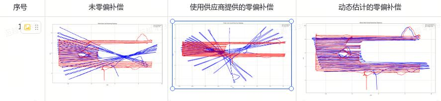

   2. 标定一个IMU参数看看 acc/gyro 白噪声、零偏噪声，需要采数据，规格书只有白噪声

      1. 采集24小时&#x20;

2. Monet odo处理策略 [ 四驱里程计方案](https://roborock.feishu.cn/wiki/FUjyw5u1qigfmAkqMHickKPAnBb)

   1. 本周进展

      1. 电机到主控，后轮Odo丢包严重。Butchart上也存在。（驱动解决）

      2. 实现四驱的运动模型 `@范超`

   2. Action

      1. 实现四驱的运动模型 `@范超`

         1. odo积分与RTK比较，合入data\_toolkit `@李宝玉`

      2. 四驱数据plugin接入

         1. Pr&#x20;

         2. 上机测试数据能正常收到

      3. 打滑数据采集，验证打滑的时候有效

3. 初始化 (Done) `@范超` `@李欢`

   1. 初始化长度从2m->1m，配合导航回充动作[ 上/下桩策略（持续更新中）](https://roborock.feishu.cn/wiki/AmWfwXiOMi8H8Gkv67QcmeIXnEb)

      1. pr完成

      2. 确认退桩过程一共1m`@陈勇生`

4. 三维重建的开源算法调研

   1. 常见开源算法调研（08.26）

      1. 点云+图像，点云渲染

## `@周行`

1. bug的复现脚本

   1. 日志需要把分析需要的关键信息打印完全

## `@王颖`

1. odo递推速度没有算 `@王颖`

   1. RTK更新时计算速度res的公式有点问题；速度坐标系变换问题

   2. 递推的时候速度计算

   3. 考虑改成IMU递推，odo的速度和RTK速度作为两次速度观测

2. 实现机器上结果的回放功能，包括视觉位姿

   1. reinit打在日志里，能回放 `@王颖`

   2. Pr，待测试

## `@刘宏伟`

1. 激光-视觉融合，先走松耦合方案  [ 视觉激光融合方案初版方案分析](https://roborock.feishu.cn/wiki/BmuPwJTNDixHJekSK7scnXDQnId) `@刘宏伟`

   1. 已经完成

      1\. 激光视觉融合初步方案制定：[ 视觉-激光融合方案 V1.0 ](https://roborock.feishu.cn/wiki/WpXFwUNt1iiC4gkyV6JckUqLnOd)

   &#x20;      2\. 结合项目硬件配置与预期融合策略，对LVI-SAM的视觉-激光融合机制展开调研，通过文献阅读与代码分析，评估其整体流程在割草机应用场景中的适配性与可行性。[ LVI-SAM 算法流程&融合原理&方案分析](https://roborock.feishu.cn/wiki/LBZdwybOfiOiZsk82bhcyBKDn3g)

   &#x20;      3.结合项目硬件配置与预期融合策略，对 FAST-LIVO2 的视觉-激光融合机制展开调研，通过文献阅读与代码分析，评估其整体流程在割草机应用场景中的适配性与可行性。[ FAST-LIVO2 算法流程&融合原理&方案分析](https://roborock.feishu.cn/wiki/Qr6bwvOVVi1BUokCxhRcD3W6nNg)

   * fast-livo2，lvi-sam代码流程梳理 0815

     1. 采集的数据在x86上

     2. tof数据+图像 `@王双双`

     3. 研究GPU加速的可能性 &#x20;

2. 本周进展（8.14 - 8.21）

   1. 梳理 FAST-LIVO2，并跟大家做分享会，以及如何在非硬件同步设备跑通 [ FAST-LIVO2](https://roborock.feishu.cn/wiki/Tzshw314xixA0vklLuLcfOsRnrf) （DONE）

   2. BUG #396037 #394712 #395618 （DONE）

   3. 转换公司的日志 --> rosbag，使其能跑rosbag数据  [ 视觉激光融合数据转换成bag形式](https://roborock.feishu.cn/wiki/MXREwmcHBi3gqWkPhfrcJzFwnJf) （DONE）

   4. 修改FAST-LIVO2代码，接入接口适配公司的激光雷达数据，并只支持LIO运行，代码已完成并测试。 [ FAST-LIVO2激光数据集适配与纯LIO模式运行说明](https://roborock.feishu.cn/wiki/RXjswXFpAi5xXAk0SZrciGEOndb) （DONE）

   5. 催versa机器标定 --> 貌似今天能给我结果 （DOING）

   

3. 8.13联调：调通和激光模块的接口 `@王颖`

# `@茹毅超`

1. 标定工作对接`@邱冰冰`

2. 读fusion代码 （08.29）

3. RTK推导解标志位接入，看数据

   1. 和芯把推导解放在agric的预留字段，出一个私包 `@李威`出了版本，已经在测试，没出结果。

   2. 中间层记日志

4. 自研RTK接入

   模组厂家：凯芯    对接同事：吉利 赵一沣

   进度 ：自研模组调通，静态测试完成，动态测试九月初做。

   1. 接口协议是否满足需求 [ 协议定义](https://roborock.feishu.cn/sheets/Igx8ss487hBo08tUlFIcl185nYg?from=from_copylink)

   2. 看一下数据

# **2025-08-15**

## `@李岩`

1. Zupt （Done）

   [ 基于数据（imu v.s. odom）一致性的机器状态判断](https://roborock.feishu.cn/wiki/XvlJwbDFli4jMmkviN7c4K6Knje)

   Zupt : 静止估计gyro的零偏

   1. 静止检测方案：odo cnt+acc norm

   2. 代码完成，待测试，测试方法：比较原始odo积分和去掉odo积分的轨迹，和RTK比较；把roll pitch积分打开，原地正常

   3. 加入bias打印

2. 接入视觉 （8.25）

   1. 给视觉开一个get\_pose的接口，在视觉初始化的时候视觉自己调用 (q,p,v)

3. 假固定解判断（8.20）

   [ RTK假固定原始数据分析](https://roborock.feishu.cn/wiki/ZAo1wOkN7iOo4qkaDJacc0rHnne)

   [ RTK假固定解处理方案](https://roborock.feishu.cn/wiki/DJyQw02iFiopsmkhO6dczkVEntd)

   1. 差分龄期数据和使用&#x20;

      1. RTK解状态0,1,2没发&#x20;

      2. 打点统计，差分龄期+卫星数（ 放羊监控 `@汪浩然`）

   2. 和芯沟通：

      1. timeout 建议设置成10，李圳测试确认

      2. agrica报文增加上一次正常结算RTK的时间、共视卫星数，下周三前出临时版本测试

      3. 静止跳变问题，和芯新sdk会大幅度改善，待后续确认是否要升级新版本

      4. 部分指标，比如std、共视星数等，厂家会提供测试报告供我们参考，目的在于固定率小幅（5-10%）下降的情况下，提升整体稳定度（降低60%以上假固定率）

      5. 改了共视卫星数和推导解标志位，用新的RTK版本采集数据，分析

4. RTK从非固定解到固定解的策略

   1. 航迹速度作为头朝向速度的初值，考虑轮速信息确定正向或反向运动

   2. 是否可以作为快速初始化的一部分

## `@范超`

* IMU参数 `@范超`

  1. 厂家的固定零偏，尺度因子和正交耦合系数

     [ imu\_jiaoyan ](https://roborock.feishu.cn/wiki/LzbOwfnxOisf3MkjrqycvtQEnGc?sheet=IrbKH2)

     1. 中间层会减掉这个固定零偏，加上尺度因子和正交耦合系数

     

  2. 标定一个IMU参数看看 acc/gyro 白噪声、零偏噪声，需要采数据，规格书只有白噪声

     1. 采集24小时&#x20;

* Monet odo处理策略 [ 四驱里程计方案](https://roborock.feishu.cn/wiki/FUjyw5u1qigfmAkqMHickKPAnBb)

  1. 本周进展

     1. 电机到主控，后轮Odo丢包严重。Butchart上也存在。

     2. 实现四驱的运动模型 `@范超`

        1. 仿真代码初步完成，review中

  2. Action

     1. 实现四驱的运动模型 `@范超`

        1. 分析模型可行性

        2. 打滑数据采集

        3. odo积分与RTK比较，合入data\_toolkit `@李宝玉`

     2. 四驱数据plugin接入：改成前轮和后轮两包，如何同步到一起

     3. 分析：和RTK对比，效果不是很明显，采一组打滑数据做对比

* 初始化 `@范超` `@李欢`

  1. 初始化长度从2m->1m，配合导航回充动作[ 上/下桩策略（持续更新中）](https://roborock.feishu.cn/wiki/AmWfwXiOMi8H8Gkv67QcmeIXnEb)

     1. pr完成

  2. 1m长度的计算用RTK计算，`@李欢`

## `@周行`

* 错误码(Done)

  VSLAM上报错误码PR，研发自测`@周行`

  

* 视觉结果评估

  1. 保持RTK固定解，有真值，仿真的时候改一下数据，仿真对比

  2. 机器上原始vslam结果的精度、帧率

  [ Benchmark表格](https://roborock.feishu.cn/base/NkuabkuL5aD5EJsnQVZcd6AwnQh?table=tblc9mB0pphoQR8z\&view=vewrTQL0Gb)

  * 批量测试脚本 (done)`@周行`

* bug的复现脚本

  1. 日志需要把分析必须的关键信息打印完全

* plugins的项目宏 (Done)

  1. set\_param从vslam.cpp放到controller里面 (Done)

  2. 增加RTK硬件宏 `@周晓旭`（项目宏决定硬件宏，硬件宏决定功能）

## `@王颖`

* odo递推速度没有算 `@王颖`

  1. RTK更新时计算速度res的公式有点问题；速度坐标系变换问题

  2. 递推的时候速度计算

  3. 考虑改成IMU递推，odo的速度和RTK速度作为两次速度观测

* 从视觉恢复rtk的时候，影响姿态

* 实现机器上结果的回放功能，包括视觉位姿

  1. reinit打在日志里，能回放 `@王颖`

  2. Pr，待测试

* 激光-视觉融合

  1. 8.13联调：调通和激光模块的接口 `@王颖`

  2. 激光-视觉的数据 `@王颖` `@刘宏伟`

## `@刘宏伟`

* 激光-视觉融合，先走松耦合方案  [ 视觉激光融合方案初版方案分析](https://roborock.feishu.cn/wiki/BmuPwJTNDixHJekSK7scnXDQnId) `@刘宏伟`

  1. 已经完成

     1\. 激光视觉融合初步方案制定：[ 视觉-激光融合方案 V1.0 ](https://roborock.feishu.cn/wiki/WpXFwUNt1iiC4gkyV6JckUqLnOd)

  &#x20;      2\. 结合项目硬件配置与预期融合策略，对LVI-SAM的视觉-激光融合机制展开调研，通过文献阅读与代码分析，评估其整体流程在割草机应用场景中的适配性与可行性。[ LVI-SAM 算法流程&融合原理&方案分析](https://roborock.feishu.cn/wiki/LBZdwybOfiOiZsk82bhcyBKDn3g)

  &#x20;      3.结合项目硬件配置与预期融合策略，对 FAST-LIVO2 的视觉-激光融合机制展开调研，通过文献阅读与代码分析，评估其整体流程在割草机应用场景中的适配性与可行性。[ FAST-LIVO2 算法流程&融合原理&方案分析](https://roborock.feishu.cn/wiki/Qr6bwvOVVi1BUokCxhRcD3W6nNg)

  * fast-livo2，lvi-sam代码流程梳理 0815

    1. 采集的数据在x86上

    2. tof数据+图像 `@王双双`

    3. 研究GPU加速的可能性

* 预研方案

  1. 视觉方案调

# `@茹毅超`

# **2025-07-31**

1. Zupt

   [ 基于数据（imu v.s. odom）一致性的机器状态判断](https://roborock.feishu.cn/wiki/XvlJwbDFli4jMmkviN7c4K6Knje)

   Zupt : 静止估计gyro的零偏

   1. 静止检测方案：odo cnt+acc norm

   2. 代码完成，待测试，测试方法：比较原始odo积分和去掉odo积分的轨迹，和RTK比较

   3. 提pr

   标定一个IMU参数看看

2. 视觉接口

   1. okvis合入slam\_workspace，上机部署

      1. 本周进展

         1. VSLAM上报错误码PR，研发自测`@郭科` `@李宝玉`

            1. 自测Pending（RTK导致)

      2. Action

         * VSLAM上报错误码PR，研发自测`@郭科` `@李宝玉`

           1. 本周再自测

3. 视觉结果评估

   1. 保持RTK固定解，有真值，仿真的时候改一下数据，仿真对比

   2. 机器上原始vslam结果的精度、帧率

   3. 批量测试脚本

4. 差分龄期数据和使用 `@李岩`

   1. 报文中是否有其他的有用字段

   2. RTK解状态0,1,2没发

   打点统计，差分龄期+卫星数

5. odo递推速度没有算&#x20;

   1. RTK更新时计算速度res的公式有点问题

   2. 递推的时候速度计算

   3. 考虑改成IMU递推，odo的速度和RTK速度作为两次速度观测

6. 接入视觉 `@李岩`

   1. 给视觉开一个get\_pose的接口，在视觉初始化的时候视觉自己调用

   2. 实现机器上结果的回放功能，包括视觉位姿：reinit打在日志里，能回放

7. 初始化&#x20;

   1. 初始化长度从2m->1m，配合导航回充动作

   2. 1m长度的计算用RTK计算

   3. （下一阶段）桩在RTK阴影区

8. 重定位方案实现[ 导航-slam重定位接口](https://roborock.feishu.cn/wiki/WIv4wDCv7i9yBMkxH2ecJadEnEb?from=auth_notice\&hash=2cfcdc86bd380580499546919be20a65)

   1. 本周进展

   2. Action

      1. 融合模块接vslam的状态，判断RTK状态，发布重定位消息`@周行`

      2. 仿真上调试通过（module\_fusion) -> plugins接收 -> 导航接收

      3. 重定位仿真实现

9. Monet odo处理策略 `@林子越`[ 四驱里程计方案](https://roborock.feishu.cn/wiki/FUjyw5u1qigfmAkqMHickKPAnBb)

   1. 本周进展

      1. 电机到主控，后轮Odo丢包严重。Butchart上也存在。

      2. 实现四驱的运动模型 `@范超`

         1. 仿真代码初步完成，review中

   2. Action

      1. 实现四驱的运动模型 `@范超`

         1. 分析模型可行性

         2. 打滑数据采集

         3. odo积分与RTK比较，合入data\_toolkit `@李宝玉`

      2. 四驱数据plugin接入：改成前轮和后轮两包，如何同步到一起

      3. 分析：和RTK对比，效果不是很明显，采一组打滑数据做对比

10. 激光-视觉融合

    1. 8.8联调：调通和激光模块的接口 `@王颖`

    2. 激光-视觉的数据 `@王颖`

11. 激光-视觉融合，先走松耦合方案  [ 视觉激光融合方案初版方案分析](https://roborock.feishu.cn/wiki/BmuPwJTNDixHJekSK7scnXDQnId) `@刘宏伟`

    1. 本周进展

    &#x20;      1\. 激光视觉融合初步方案制定：[ 视觉-激光融合方案 V1.0 ](https://roborock.feishu.cn/wiki/WpXFwUNt1iiC4gkyV6JckUqLnOd)

    &#x20;      2\. 结合项目硬件配置与预期融合策略，对LVI-SAM的视觉-激光融合机制展开调研，通过文献阅读与代码分析，评估其整体流程在割草机应用场景中的适配性与可行性。[ LVI-SAM 算法流程&融合原理&方案分析](https://roborock.feishu.cn/wiki/LBZdwybOfiOiZsk82bhcyBKDn3g)

    &#x20;      3.结合项目硬件配置与预期融合策略，对 FAST-LIVO2 的视觉-激光融合机制展开调研，通过文献阅读与代码分析，评估其整体流程在割草机应用场景中的适配性与可行性。[ FAST-LIVO2 算法流程&融合原理&方案分析](https://roborock.feishu.cn/wiki/Qr6bwvOVVi1BUokCxhRcD3W6nNg)

    * 视觉-激光数据已经有一组

# **2025-07-24**

1. Imu-odo递推

   1. Zupt : 静止估计gyro的零偏

      1. 静止检测方案：odo cnt+acc norm

      2. 代码完成，待测试，测试方法：比较原始odo积分和去掉odo积分的轨迹，和RTK比较

   2. AHRS

2. 视觉接口

   1. okvis合入slam\_workspace，上机部署

      1. 本周进展

         1. VSLAM上报错误码PR，研发自测`@郭科` `@李宝玉`

            1. 自测Pending（RTK导致)

      2. Action

         * VSLAM上报错误码PR，研发自测`@郭科` `@李宝玉`

           1. 本周再自测

         * 融合的权重设计，Vio status 调整vio的相对权重

           1. okvis上报quality完成，SLAMModuleVIO进一步发布vslam状态`@郭科`

3. 视觉结果评估

   1. 保持RTK固定解，有真值，仿真的时候改一下数据，仿真对比

   2. 机器上原始vslam结果的精度、帧率

   3. 批量测试脚本

4. 差分龄期数据和使用

   1. 报文中是否有其他的有用字段

   2. RTK解状态0,1,2没发

5. odo递推速度没有算

   1. RTK更新时计算速度res的公式有点问题

   2. 递推的时候速度计算

   3. 考虑改成IMU递推，odo的速度和RTK速度作为两次速度观测

6. 接入视觉

   1. 给视觉开一个get\_pose的接口，在视觉初始化的时候视觉自己调用

   2. 实现机器上结果的回放功能，包括视觉位姿：reinit打在日志里，能回放

7. 初始化

   1. 初始化长度从2m->1m，配合导航回充动作

   2. 1m长度的计算用RTK计算

   3. （下一阶段）桩在RTK阴影区

8. 重定位方案实现[ 导航-slam重定位接口](https://roborock.feishu.cn/wiki/WIv4wDCv7i9yBMkxH2ecJadEnEb?from=auth_notice\&hash=2cfcdc86bd380580499546919be20a65)

   1. 本周进展

   2. Action

      1. 融合模块接vslam的状态，判断RTK状态，发布重定位消息`@周行`

      2. 仿真上调试通过（module\_fusion) -> plugins接收 -> 导航接收

9. Monet odo处理策略 `@林子越`[ 四驱里程计方案](https://roborock.feishu.cn/wiki/FUjyw5u1qigfmAkqMHickKPAnBb)

   1. 本周进展

      1. 电机到主控，后轮Odo丢包严重。Butchart上也存在。

      2. 实现四驱的运动模型 `@范超`

         1. 仿真代码初步完成，review中

   2. Action

      1. 实现四驱的运动模型 `@范超`

         1. 分析模型可行性

         2. 打滑数据采集

         3. odo积分与RTK比较，合入data\_toolkit `@李宝玉`

      2. 四驱数据plugin接入：改成前轮和后轮两包，如何同步到一起

      3. 分析：和RTK对比，效果不是很明显，采一组打滑数据做对比

10. 激光-视觉融合

    1. 8.8联调：调通和激光模块的接口 `@王颖`

    2. 激光-视觉的数据 `@王颖`

11. 激光-视觉融合，先走松耦合方案  [ 视觉激光融合方案初版方案分析](https://roborock.feishu.cn/wiki/BmuPwJTNDixHJekSK7scnXDQnId) `@刘宏伟`

    1. 本周进展

    &#x20;      1\. 激光视觉融合初步方案制定：[ 视觉-激光融合方案 V1.0 ](https://roborock.feishu.cn/wiki/WpXFwUNt1iiC4gkyV6JckUqLnOd)

    &#x20;      2\. 结合项目硬件配置与预期融合策略，对LVI-SAM的视觉-激光融合机制展开调研，通过文献阅读与代码分析，评估其整体流程在割草机应用场景中的适配性与可行性。[ LVI-SAM 算法流程&融合原理&方案分析](https://roborock.feishu.cn/wiki/LBZdwybOfiOiZsk82bhcyBKDn3g)

    &#x20;      3.结合项目硬件配置与预期融合策略，对 FAST-LIVO2 的视觉-激光融合机制展开调研，通过文献阅读与代码分析，评估其整体流程在割草机应用场景中的适配性与可行性。[ FAST-LIVO2 算法流程&融合原理&方案分析](https://roborock.feishu.cn/wiki/Qr6bwvOVVi1BUokCxhRcD3W6nNg)

    * 视觉-激光数据已经有一组
