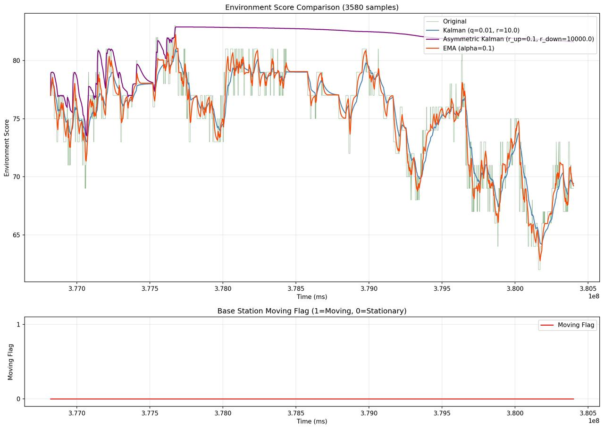
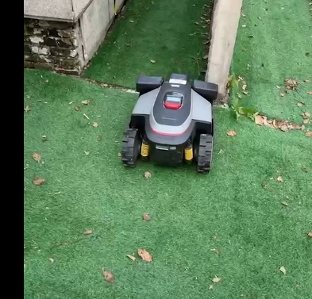
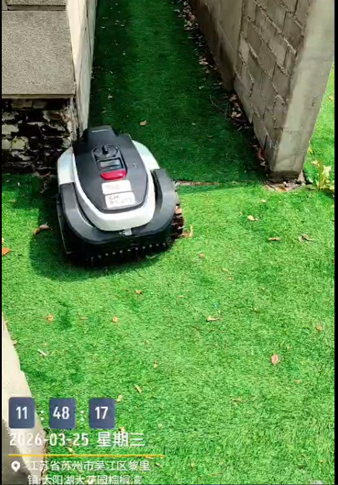
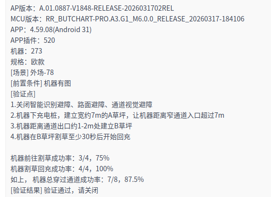
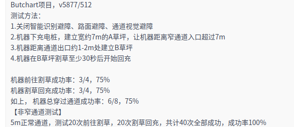

# **2026-04-09**

## `@李岩`

1. imu递推，odo速度更新，RTK速度更新

   1. 尺度因子（静止时计算）/g加入状态量

   

   * 在有IMU+RTK更新的时候，roll角会发散

   * 互补滤波：[ ZYF176数据分析](https://roborock.feishu.cn/wiki/J6Gmw7UujideOGkNdzKcgpnvnBe) [ 互补滤波数据测试](https://roborock.feishu.cn/wiki/X3gKwFnz1ioXgwkzCyrcwhe0nXf)

   * pr

   * 割草机数据回归，比较后轴IMU，斜坡数据

2. rtk\_odo对齐+平滑优化：[ 自测结果优化：1211](https://roborock.feishu.cn/wiki/O0iNwNGRIidrG0klRZvcpo1GnUp)（无更新）

3. 速度更新航向：[ 航向角收敛测试](https://roborock.feishu.cn/wiki/ULMTwPVy9irtjykFtggcKv9Xnfb)

   1. odo速度递推

   2. 航向更新在速度更新下是否更快

   3. 调过bg之后，在RTK纯位置的情况下，航向的更新会加快

4. 通道外RTK假固定解方案:  [ 通道外假固定判断](https://roborock.feishu.cn/wiki/LMzVwFLuGinsa6k58TCcxv5onrh)树下和屋檐下都测过，代码已合入。     0402 [ 假固定处理5.0](https://roborock.feishu.cn/wiki/J4FXwrgZeieaWckzDSvcqwz8nIc)

5. 通道内方案：目前整体成功率已经达标

   1. 张天佑Butchart测试通过

   2. 朱进杰Butchart测试通过

   3. 张家旺ButchartPro测试通过（没通过的一次提了一个bug）

   4. 卢巨有Monet测试失败：看视频是建图时定位偏向一侧，log丢失，重新测试。持续跟进&#x20;

   

   * 祁特、付新强Butchart测试通过，但回充成功率低：建图时桩离通道口太近，累计误差偏向一侧，重新建图测试。**过了**

     

   * 走通道，导航向外延伸通道点

   * 整理通道bug `@林子越`

     1. 通道消息自动化配置

6. 真值评测：[ 轨迹好坏量化评价v1.0](https://roborock.feishu.cn/wiki/OLDowfwLOirn7Bkih3QczcCgnqc)

## `@范超`

1. RTK-odo线程仿真 [ Rtk-odo align仿真](https://roborock.feishu.cn/wiki/T1jkwJurriX5EUkylAPcFDgynih)

2. Module fusion的计算部分移出dispatch，避免dispatch线程阻塞&#x20;

   1. Pr

   2. 上机测试

3. 阴影区判断重定位

   1. 加入gyro的角度判断

4. vslam建图，融合模块适配[ 阴影区出桩V2.0-融合模块](https://roborock.feishu.cn/wiki/YZUMwEqAkiDua2kWkv8cEctTnMg)

   1. logparser需要完成，通过日志仿真

5. odo积分与RTK比较，合入data\_toolkit&#x20;

   1. 代码pr&#x20;

      1. 用vio\_estimate\_3d和RTK比较

   2. 比较odo递推和RTK比较，odo递推和vslam结果

      1. [ Benchmark表格](https://roborock.feishu.cn/base/NkuabkuL5aD5EJsnQVZcd6AwnQh?table=tbl2Nx8Wv6PVFZHJ\&view=vewSSGrCzN)，用benchmark/放羊数据，Vslam reset有没有做处理

   3. 把gyro bias打印到日志

## `@刘宏伟`

1. 融合代码：

   1. 使用单帧对齐时，信任尾部的 fusion\_path，不跳过 2 m 的 ignore，避免单帧对齐带来的累积误差。（DONE）

      1. http://chandao.roborock.com/index.php?m=bug\&f=view\&t=html\&id=497186

      2. http://chandao.roborock.com/index.php?m=bug\&f=view\&bugID=496509

   2. 修复了单帧对齐影响多帧对齐的bug。

   3. 发给李岩一个多帧对齐完成的标志位，在你无法完成多帧对齐前，相信所有固定解。 已完成

   4. 紧急BUG分析：

      1. 清明Bug ：[ 欧区禅道3469、3470 bug分析归档](https://roborock.feishu.cn/wiki/NI1EwoxbViJNU5kf72HcpMyUnWb)

      2. 整体定位漂移Bug ：[ 群话题BUG分析 ](https://roborock.feishu.cn/wiki/MgZLwflx7iO3UQkliPbcofC5nEc)

      3. 多线重定位Bug ： [ 多线重定位Bug分析归档 -- 20260410](https://roborock.feishu.cn/wiki/XU7owdQ8LigQh5k24HzcLK6SnPh)

2. BUG 485479 --> 多帧对齐优化

   1. 方案： [ BUG 478697 & 多帧对齐优化回归](https://roborock.feishu.cn/wiki/AD8Nw1XeHipgghkpVFccXET3nIh)

   2. 代码：已合入（DONE）

3. 减少建图搬动重定位方案设计代码：

   1. 方案： [ 减少建图重定位1.0 ](https://roborock.feishu.cn/wiki/KTPuwqzrmie1makTZ55cvcq6njM)

   2. 代码：pr

4. 分享会 [ AI在SLAM工作中用法分享](https://roborock.feishu.cn/wiki/Hq0yw4wKsiQpxEkDY7BcaZKfnkg)（DONE）

5. 割草机 扫地机 IMU 对比： [ IMU 递推和 lidar pose比较](https://roborock.feishu.cn/wiki/UkcuwghdTi2rVwkxdGncjoA5nhc)  [ 割草机 IMU 递推和 lidar pose比较（欠科学版）](https://roborock.feishu.cn/wiki/MaCfwzTlYigfmzk1kExc7Q78n9F) （DONE）

6. 多帧对齐代码及测试：

   * 1m/2m对齐是不是会比单帧对齐更好  [ 1米、2米对齐、单帧对齐对比评估](https://roborock.feishu.cn/wiki/HOzCwmCSfiKJ9okJ7sVcXM4mnnm)

   * 结论：1m / 2m 对齐不可用 （DONE）

7. 雷达割草机三维重建 ：

   1. [ Flora 5.2mm雷达罩是否影响融合三维重建 20260402](https://roborock.feishu.cn/wiki/XH77wGL0FiVHAUkMPeucBwfanQb) （DONE）

   2. 实现在机器上存点云 ，代码已pr （DONE）

   3. 跑放羊测试，看结果，是否符合预期，跑300平米没问题，1000平存在oom，原因是 刀盘电机异常/脏污/缠绕后 oom，待排查。跑了几天，偶尔会core，但每次都core在了不同的地方，问郭老师貌似是Eigen对齐的问题。

      1. 命令处理与传感器数据处理异步出现问题，代码已修改。

   4. 和 `@黄亮`联调，pcd可以上传日志平台了（DONE）

   5. [ FAST-LIVO2 硬件加速](https://roborock.feishu.cn/wiki/DEdlw2gmTils8ikoTzPcydnSnud)&#x20;

   6. 地图拼接：续割时把地图到一起

   7. 确认正常割草不会阻塞io：点云地图先存到/dev/shm （DONE）

8. 三维重建：降本雷达使用slampose去拼点云（TODO）

9. 三维重建：rebase代码之后，放羊测试，稳定之后进dev

   1. 自动化平台看点云

10. 给售后出一个售后文档 （TODO）

## `@茹毅超`

1. NRTK接入 `@李威`(2.6) （P0）

   * 给出的坐标是经纬高的形式，用第一个固定解做原点

     1. 代码

        1. pr

        2. 把地图原点坐标发给导航[ NRTK定位导航对接需求](https://roborock.feishu.cn/wiki/L9DKw6ym9iCO9xkKQI8cbcOjnAe?from=from_copylink)，经纬度绑定地图，

        3. 总结一下测试结果[ nrtk测试结果](https://roborock.feishu.cn/wiki/WYfwwPXLFicqV9kZ7kqccaMPnub?from=from_copylink)         &#x20;

        4. 新项目能否全都使用960E: Gaia都是960E（Done）

2. 给用户定向推新的RTK固件，使用新字段（固定模糊度卫星占比，真实差分龄期）做判断

   * 软测大量采集数据：在跑

3. 慢速打滑，平滑操作对于位置恢复的影响 [ 平滑操作对位置恢复的影响](https://roborock.feishu.cn/wiki/NjPxwYPJNiXDTjkXmvKclthVnUc?from=from_copylink)（P2）

   1. 平滑操作对脱困检测无影响

   2. 接一下slip info pr

   3. 在打滑的情况下，RTK更新位置、不更新姿态，不要加大RTK方差

4. 视觉黑夜dark（Done）

   1. 用odo一直走可能出界，加一个报错

5. Set pose之后重定位，多线set pose (Done)  &#x20;

&#x20;      解决 ： 消息错序导致 fusion 先 setpose，后reset的问题。后来消息增加了延时，fusion这边也

&#x20;                 添加了保护（同宏伟）

* 基站分数从75降到70

  1. 提供影响  &#x20;

  

  * 换基站位置，动态场景测试，看固定解率下降情况 `@乔平平`

  * 看基站重启之后是否改了

* [ 高温70度\_imu\_bias统计](https://roborock.feishu.cn/wiki/CufYwOTwdi8QgkkKTQccu92Vnic?from=from_copylink)

* rtkfixcheck和`@李岩`合在一起

* 三维重建的开源算法调研&#x20;

  &#x20;初步[ 点云渲染调研](https://roborock.feishu.cn/wiki/RGj9wY4Qwi8oM6kni8BciPypn3d)

  &#x20;   [ 3dgs在 ubuntu20 配置手册](https://roborock.feishu.cn/wiki/FSS1wfJFHiJ4J6kmBgycA0SSnQg?from=from_copylink)

  1. 常见开源算法调研

     1. 3dgs-slam算法调研

  &#x20;       [ Slam和3dgs调研](https://roborock.feishu.cn/wiki/OoJ1wp5I9iQF2Mk0QS2cZqiknVf?from=from_copylink)

## `@孙新`

1. 融合模块bug

   1. 本周分析的bug

      1. [ bug分析记录](https://roborock.feishu.cn/wiki/XcpVwZtfri2gtckr8ntcSTcinOf?from=from_copylink)

   2. 待确认bug

      1. 49152，长通道问题，使用evo工具再验证下

2. 尝试pose graph方法的融合

   1. Pose graph在两端RTK都是真固定解的情况下，能不能纠正视觉漂移

      1. 放羊日志仿真;

      2. [ vio对齐rtk方案](https://roborock.feishu.cn/wiki/GNhLw62IeiBy1ukF85Zc5SCxnKb?from=from_copylink)

3. log\_parser添加dark信息

   1. 已提pr。

## `@林子越`

1. 真值评估和回归验证

   1. 融合轨迹和RTK的近似程度和平滑程度，做比较

2. 仿真工具统一

3. bug培训

4. Evo rte工具使用

# **2026-04-02**

## `@李岩`

1. imu递推，odo速度更新，RTK速度更新

   1. 尺度因子（静止时计算）/g加入状态量

   

   * 在有IMU+RTK更新的时候，roll角会发散

   * 互补滤波：[ ZYF176数据分析](https://roborock.feishu.cn/wiki/J6Gmw7UujideOGkNdzKcgpnvnBe) [ 互补滤波数据测试](https://roborock.feishu.cn/wiki/X3gKwFnz1ioXgwkzCyrcwhe0nXf)

   * pr

   * 割草机数据回归，比较后轴IMU，斜坡数据

2. rtk\_odo对齐+平滑优化：[ 自测结果优化：1211](https://roborock.feishu.cn/wiki/O0iNwNGRIidrG0klRZvcpo1GnUp)（无更新）

3. 速度更新航向：[ 航向角收敛测试](https://roborock.feishu.cn/wiki/ULMTwPVy9irtjykFtggcKv9Xnfb)

   1. odo速度递推

   2. 航向更新在速度更新下是否更快

   3. 调过bg之后，在RTK纯位置的情况下，航向的更新会加快

4. 通道外RTK假固定解方案:  [ 通道外假固定判断](https://roborock.feishu.cn/wiki/LMzVwFLuGinsa6k58TCcxv5onrh)树下和屋檐下都测过，代码已合入。     0402 [ 假固定处理5.0](https://roborock.feishu.cn/wiki/J4FXwrgZeieaWckzDSvcqwz8nIc)

5. 通道内方案：目前整体成功率已经达标

   1. 张天佑Butchart测试通过

   2. 朱进杰Butchart测试通过

   3. 张家旺ButchartPro测试通过（没通过的一次提了一个bug）

   4. 卢巨有Monet测试失败：看视频是建图时定位偏向一侧，log丢失，重新测试。持续跟进&#x20;

   

   * 祁特、付新强Butchart测试通过，但回充成功率低：建图时桩离通道口太近，累计误差偏向一侧，重新建图测试。**过了**

     

   * 走通道，导航向外延伸通道点

   * 整理通道bug `@林子越`

     1. 通道消息自动化配置

6. 真值评测：[ 轨迹好坏量化评价v1.0](https://roborock.feishu.cn/wiki/OLDowfwLOirn7Bkih3QczcCgnqc)

## `@范超`

1. RTK-odo线程仿真 [ Rtk-odo align仿真](https://roborock.feishu.cn/wiki/T1jkwJurriX5EUkylAPcFDgynih)

2. Module fusion的计算部分移出dispatch，避免dispatch线程阻塞&#x20;

   1. Pr

   2. 上机测试

3. 阴影区判断重定位

   1. 加入gyro的角度判断

4. vslam建图，融合模块适配[ 阴影区出桩V2.0-融合模块](https://roborock.feishu.cn/wiki/YZUMwEqAkiDua2kWkv8cEctTnMg)

   1. logparser需要完成，通过日志仿真

5. odo积分与RTK比较，合入data\_toolkit&#x20;

   1. 代码pr&#x20;

      1. 用vio\_estimate\_3d和RTK比较

   2. 比较odo递推和RTK比较，odo递推和vslam结果

      1. [ Benchmark表格](https://roborock.feishu.cn/base/NkuabkuL5aD5EJsnQVZcd6AwnQh?table=tbl2Nx8Wv6PVFZHJ\&view=vewSSGrCzN)，用benchmark/放羊数据，Vslam reset有没有做处理

   3. 把gyro bias打印到日志

## `@刘宏伟`

1. 融合BUG P0：

   1. [ 近期 BUG 汇总](https://roborock.feishu.cn/wiki/IXDFwP2A1iz8NWkjTNEcoPqen4c)

   2. 代码 pr （3.26已合入，DONE）

2. BUG 485479 --> 多帧对齐优化

   1. 方案： [ BUG 478697 & 多帧对齐优化回归](https://roborock.feishu.cn/wiki/AD8Nw1XeHipgghkpVFccXET3nIh)

   2. 代码：已合入（DONE）

3. 减少建图搬动重定位方案设计代码：

   1. 方案： [ 减少建图重定位1.0 ](https://roborock.feishu.cn/wiki/KTPuwqzrmie1makTZ55cvcq6njM)

   2. 代码：pr

4. 分享会 [ AI在SLAM工作中用法分享](https://roborock.feishu.cn/wiki/Hq0yw4wKsiQpxEkDY7BcaZKfnkg)（DONE）

5. 割草机 扫地机 IMU 对比： [ IMU 递推和 lidar pose比较](https://roborock.feishu.cn/wiki/UkcuwghdTi2rVwkxdGncjoA5nhc)  [ 割草机 IMU 递推和 lidar pose比较（欠科学版）](https://roborock.feishu.cn/wiki/MaCfwzTlYigfmzk1kExc7Q78n9F) （DONE）

6. 多帧对齐代码及测试：

   * 1m/2m对齐是不是会比单帧对齐更好  [ 1米、2米对齐、单帧对齐对比评估](https://roborock.feishu.cn/wiki/HOzCwmCSfiKJ9okJ7sVcXM4mnnm)

   * 结论：1m / 2m 对齐不可用 （DONE）

7. 雷达割草机三维重建 ：

   1. [ Flora -- 5.2mm雷达罩是否影响融合彩色建图](https://roborock.feishu.cn/wiki/XH77wGL0FiVHAUkMPeucBwfanQb) （DONE）

   2. 实现在机器上存点云 ，代码已pr （DONE）

   3. 跑放羊测试，看结果，是否符合预期，跑300平米没问题，1000平存在oom，原因是 刀盘电机异常/脏污/缠绕后 oom，待排查。跑了几天，偶尔会core，但每次都core在了不同的地方，问郭老师貌似是Eigen对齐的问题。

   4. 和 `@黄亮`联调，pcd可以上传日志平台了（DONE）

   5. [ FAST-LIVO2 硬件加速](https://roborock.feishu.cn/wiki/DEdlw2gmTils8ikoTzPcydnSnud)&#x20;

   6. 地图拼接：续割时把地图到一起

   7. 确认正常割草不会阻塞io：点云地图先存到/dev/shm （DONE）

8. 三维重建：降本雷达使用slampose去拼点云（TODO）

9. 三维重建：rebase代码之后，放羊测试，稳定之后进dev

   1. 自动化平台看点云

10. 给售后出一个售后文档 （TODO）

## `@茹毅超`

1. NRTK接入 `@李威`(2.6) （P0）

   * 给出的坐标是经纬高的形式，用第一个固定解做原点

     1. 代码

        1. pr

        2. 把地图原点坐标发给导航[ NRTK定位导航对接需求](https://roborock.feishu.cn/wiki/L9DKw6ym9iCO9xkKQI8cbcOjnAe?from=from_copylink)，经纬度绑定地图

        3. 总结一下测试结果[ nrtk测试结果](https://roborock.feishu.cn/wiki/WYfwwPXLFicqV9kZ7kqccaMPnub?from=from_copylink)         &#x20;

        4. 新项目能否全都使用960E: Gaia都是960E

2. 给用户定向推新的RTK固件，使用新字段（固定模糊度卫星占比，真实差分龄期）做判断

   * 软测大量采集数据：在跑

3. 慢速打滑，平滑操作对于位置恢复的影响 [ 平滑操作对位置恢复的影响](https://roborock.feishu.cn/wiki/NjPxwYPJNiXDTjkXmvKclthVnUc?from=from_copylink)（P1）

   1. 平滑操作对脱困检测无影响

   2. 接一下slip info pr

   3. 在打滑的情况下，RTK更新位置、不更新姿态，不要加大RTK方差

4. 视觉黑夜dark（Done）

   1. 用odo一直走可能出界，加一个报错

5. Set pose之后重定位，多线set pose (Done)  &#x20;

6. 基站分数从75降到70

   1. 提供影响

   2. 换基站位置，动态场景测试，看固定解率下降情况 `@乔平平`

7. [ 高温70度\_imu\_bias统计](https://roborock.feishu.cn/wiki/CufYwOTwdi8QgkkKTQccu92Vnic?from=from_copylink)

8. rtkfixcheck和`@李岩`合在一起

9. 三维重建的开源算法调研&#x20;

   &#x20;初步[ 点云渲染调研](https://roborock.feishu.cn/wiki/RGj9wY4Qwi8oM6kni8BciPypn3d)

   &#x20;   [ 3dgs在 ubuntu20 配置手册](https://roborock.feishu.cn/wiki/FSS1wfJFHiJ4J6kmBgycA0SSnQg?from=from_copylink)

   1. 常见开源算法调研

      1. 3dgs-slam算法调研

   &#x20;       [ Slam和3dgs调研](https://roborock.feishu.cn/wiki/OoJ1wp5I9iQF2Mk0QS2cZqiknVf?from=from_copylink)

## `@孙新`

1. 融合模块bug

   1. 本周分析的bug

   | bug号   | 原因                                                                                                                                                             | 备注                                                          |
   | ------ | -------------------------------------------------------------------------------------------------------------------------------------------------------------- | ----------------------------------------------------------- |
   | 485726 | rtk的lora配对失败                                                                                                                                              | http://192.168.111.52/index.php?m=bug\&f=view\&bugID=485726 |
   | 492954 | 建图期间搬起重定位，建图失败，当前为设计如此状态（范超帮忙确认）                                                                                                                               | http://192.168.111.52/index.php?m=bug\&f=view\&bugID=492954 |
   | 492803 | vio侧向位移，**重复Bug** [#493641](http://192.168.111.52/index.php?m=bug\&f=view\&id=493641)                                                                     | http://192.168.111.52/index.php?m=bug\&f=view\&bugID=492803 |
   | 488881 | 定位正常，导航脱困逻辑问题， **重复Bug** [#492734](http://192.168.111.52/index.php?m=bug\&f=view\&id=492734)                                                                   | http://192.168.111.52/index.php?m=bug\&f=view\&bugID=488881 |
   | 493824 | 夜晚vio定位偏差大，  **重复Bug** [#491537](http://192.168.111.52/index.php?m=bug\&f=view\&id=491537)                                                                | http://192.168.111.52/index.php?m=bug\&f=view\&bugID=493824 |
   | 493265 | 开始认为是rtk非固定解时odo还打滑动，实际问题为轨迹对齐，dev可优化（宏伟帮忙确认）                                                                                                                  | http://192.168.111.52/index.php?m=bug\&f=view\&bugID=493265 |
   | 494840 | vio横向偏移                                                                                                                                                        | http://192.168.111.52/index.php?m=bug\&f=view\&bugID=494840 |
   | 492798 | 夜晚vio定位偏差大，**重复Bug** [#486827](http://192.168.111.52/index.php?m=bug\&f=view\&id=486827) | http://192.168.111.52/index.php?m=bug\&f=view\&bugID=492798 |
   | 487664 | 长通道rtk和vio偏差导致（岩哥在看）                                                                                                                                           | http://192.168.111.52/index.php?m=bug\&f=view\&bugID=487664 |

   * 待确认bug

     1. 494100，Bintotext工具有修改

     2. 490505，长通道问题，使用evo工具再验证下

     3. 49152，长通道问题，使用evo工具再验证下

2. 尝试pose graph方法的融合

   1. Pose graph在两端RTK都是真固定解的情况下，能不能纠正视觉漂移

      1. 主要流程代码已完成，调整细节中;

      2. [ vio对齐rtk方案](https://roborock.feishu.cn/wiki/GNhLw62IeiBy1ukF85Zc5SCxnKb?from=from_copylink)

3. 优化archive文件编译流程

   1. 已提交pr

4. log\_parser添加dark信息

   1. 代码已经写完，需要带dark信息的日志验证下提pr。

## `@林子越`

1. 真值评估和回归验证

   1. 融合轨迹和RTK的近似程度和平滑程度，做比较

# **2026-03-26**

## `@李岩`

1. imu递推，odo速度更新，RTK速度更新

   1. 尺度因子（静止时计算）/g加入状态量

   

   * 在有IMU+RTK更新的时候，roll角会发散

   * 互补滤波：[ ZYF176数据分析](https://roborock.feishu.cn/wiki/J6Gmw7UujideOGkNdzKcgpnvnBe) [ 互补滤波数据测试](https://roborock.feishu.cn/wiki/X3gKwFnz1ioXgwkzCyrcwhe0nXf)

   * pr

   * 割草机数据回归，比较后轴IMU，斜坡数据

2. rtk\_odo对齐+平滑优化：[ 自测结果优化：1211](https://roborock.feishu.cn/wiki/O0iNwNGRIidrG0klRZvcpo1GnUp)（无更新）

3. 速度更新航向：[ 航向角收敛测试](https://roborock.feishu.cn/wiki/ULMTwPVy9irtjykFtggcKv9Xnfb)

   1. odo速度递推

   2. 航向更新在速度更新下是否更快

   3. 调过bg之后，在RTK纯位置的情况下，航向的更新会加快

4. 通道外RTK假固定解方案:  [ 通道外假固定判断](https://roborock.feishu.cn/wiki/LMzVwFLuGinsa6k58TCcxv5onrh)树下和屋檐下都测过，代码已合入

5. 通道内方案：目前整体成功率已经达标

   1. 张天佑Butchart测试通过

   2. 朱进杰Butchart测试通过

   3. 张家旺ButchartPro测试通过（没通过的一次提了一个bug）

   4. 卢巨有Monet测试失败：看视频是建图时定位偏向一侧，log丢失，重新测试。持续跟进&#x20;

   

   * 祁特、付新强Butchart测试通过，但回充成功率低：建图时桩离通道口太近，累计误差偏向一侧，重新建图测试。持续跟进&#x20;

   * 走通道，导航向外延伸通道点

   * 整理通道bug `@林子越`

   

## `@范超`

1. RTK-odo线程仿真 [ Rtk-odo align仿真](https://roborock.feishu.cn/wiki/T1jkwJurriX5EUkylAPcFDgynih)

2. Module fusion的计算部分移出dispatch，避免dispatch线程阻塞&#x20;

   1. Pr

   2. 上机测试

3. 阴影区判断重定位

   1. 加入gyro的角度判断

4. vslam建图，融合模块适配[ 阴影区出桩V2.0-融合模块](https://roborock.feishu.cn/wiki/YZUMwEqAkiDua2kWkv8cEctTnMg)

   1. logparser需要完成，通过日志仿真

5. odo积分与RTK比较，合入data\_toolkit&#x20;

   1. 代码pr&#x20;

      1. 用vio\_estimate\_3d和RTK比较

   2. 比较odo递推和RTK比较，odo递推和vslam结果

      1. [ Benchmark表格](https://roborock.feishu.cn/base/NkuabkuL5aD5EJsnQVZcd6AwnQh?table=tbl2Nx8Wv6PVFZHJ\&view=vewSSGrCzN)，用benchmark/放羊数据，Vslam reset有没有做处理

   3. 把gyro bias打印到日志

## `@刘宏伟`

1. 融合BUG P0：

   1. [ 近期 BUG 汇总](https://roborock.feishu.cn/wiki/IXDFwP2A1iz8NWkjTNEcoPqen4c)

   2. 代码 pr

2. BUG 485479 --> 多帧对齐优化

   1. 方案： [ BUG 478697 & 多帧对齐优化回归](https://roborock.feishu.cn/wiki/AD8Nw1XeHipgghkpVFccXET3nIh)

   2. 代码：已合入

3. 减少建图搬动重定位方案设计代码：

   1. 方案： [ 减少建图重定位1.0 ](https://roborock.feishu.cn/wiki/KTPuwqzrmie1makTZ55cvcq6njM)

   2. 代码：pr

4. 多帧对齐代码及测试：

   * 1m/2m对齐是不是会比单帧对齐更好  [ 1米、2米对齐、单帧对齐对比评估](https://roborock.feishu.cn/wiki/HOzCwmCSfiKJ9okJ7sVcXM4mnnm)

   * 结论：1m / 2m 对齐不可用

5. 雷达割草机三维重建 ：

   1. 实现在机器上存点云 ，代码已pr

   2. 跑放羊测试，看结果，是否符合预期，跑300平米没问题，1000平存在oom，原因是 刀盘电机异常/脏污/缠绕后 oom，待排查。

   3. 和 `@黄亮`联调，pcd可以上传日志平台了

   4. [ FAST-LIVO2 硬件加速](https://roborock.feishu.cn/wiki/DEdlw2gmTils8ikoTzPcydnSnud)&#x20;

   5. 地图拼接：续割时把地图到一起

   6. 确认正常割草不会阻塞io：点云地图先存到/dev/shm

6. 三维重建：降本雷达使用slampose去拼点云（TODO）

7. 三维重建：rebase代码之后，放羊测试，稳定之后进dev

   1. 自动化平台看点云

8. 给售后出一个售后文档 （TODO）

## `@茹毅超`

1. NRTK接入 `@李威`(2.6) （P0）

   * 给出的坐标是经纬高的形式，用第一个固定解做原点

     1. 代码

        1. pr

        2. 把地图原点坐标发给导航[ NRTK定位导航对接需求](https://roborock.feishu.cn/wiki/L9DKw6ym9iCO9xkKQI8cbcOjnAe?from=from_copylink)，经纬度绑定地图

        3. 总结一下测试结果[ nrtk测试结果](https://roborock.feishu.cn/wiki/WYfwwPXLFicqV9kZ7kqccaMPnub?from=from_copylink)         &#x20;

        4. 新项目能否全都使用960E

2. 给用户定向推新的RTK固件，使用新字段（固定模糊度卫星占比，真实差分龄期）做判断

   * 软测大量采集数据：已经能采集

3. 慢速打滑，平滑操作对于位置恢复的影响 [ 平滑操作对位置恢复的影响](https://roborock.feishu.cn/wiki/NjPxwYPJNiXDTjkXmvKclthVnUc?from=from_copylink)（P1）

   1. 平滑操作对脱困检测无影响

   2. 接一下slip info pr

4. 视觉黑夜dark （P1）

   1. Pr，测试 &#x20;

5. 多线取消重定位消息接入

   1. Pr, (3.13)

6. [ 高温70度\_imu\_bias统计](https://roborock.feishu.cn/wiki/CufYwOTwdi8QgkkKTQccu92Vnic?from=from_copylink)

7. 481907

   1. rtk假固定解跳变；

   2. 检查出来假固定解，fusion仍然跳变；(中间有一帧假固定解，没检查出来，62220.239)

   &#x20;          原因是固定解非固定解反复跳的情况，过滤失效，7秒队列里面有30秒前的rtk数据

   * rtkfixcheck和`@李岩`合在一起

8. 三维重建的开源算法调研&#x20;

   &#x20;初步[ 点云渲染调研](https://roborock.feishu.cn/wiki/RGj9wY4Qwi8oM6kni8BciPypn3d)

   &#x20;   [ 3dgs在 ubuntu20 配置手册](https://roborock.feishu.cn/wiki/FSS1wfJFHiJ4J6kmBgycA0SSnQg?from=from_copylink)

   1. 常见开源算法调研

      1. 3dgs-slam算法调研

   &#x20;       [ Slam和3dgs调研](https://roborock.feishu.cn/wiki/OoJ1wp5I9iQF2Mk0QS2cZqiknVf?from=from_copylink)

## `@孙新`

1. 融合模块bug

   1. 本周分析的bug

   | bug号    | 原因                                   | 备注                                                          |
   | ------- | ------------------------------------ | ----------------------------------------------------------- |
   | 488309  | 非融合bug，rtk数据良好                       | http://192.168.111.52/index.php?m=bug\&f=view\&bugID=488309 |
   | 470159  | 多帧对齐问题，改进后的多帧对齐可以解决（宏伟帮忙看的）          | http://192.168.111.52/index.php?m=bug\&f=view\&bugID=470159 |
   | 486534  | rtk跳变问题                              | http://192.168.111.52/index.php?m=bug\&f=view\&bugID=486534 |
   | 489942  | 多帧对齐会优化&#xA;重复Bug #490456            | http://192.168.111.52/index.php?m=bug\&f=view\&bugID=489942 |
   | 4851988 | 机器人搬动问题                              | http://192.168.111.52/index.php?m=bug\&f=view\&bugID=485198 |
   | 486512  | 通道问题，引入通道的优化后能解 &#xA;重复Bug #482085   | http://192.168.111.52/index.php?m=bug\&f=view\&bugID=486512 |
   | 490948  | 通道入口处vio横向漂移问题，通道出口rtk和fusion轨迹有距离偏差 | http://192.168.111.52/index.php?m=bug\&f=view\&bugID=490948 |

   * 待确认bug

     1. 488881，有旋转打滑

     2. 490505，使用evo工具再验证下

     3. 49152，使用evo工具再验证下

2. 尝试pose graph方法的融合

   1. Pose graph在两端RTK都是真固定解的情况下，能不能纠正视觉漂移

      1. 主要流程代码已完成，调整细节中;

      2. [ vio对齐rtk方案](https://roborock.feishu.cn/wiki/GNhLw62IeiBy1ukF85Zc5SCxnKb?from=from_copylink)

3. 优化archive文件编译流程

## `@林子越`

1. 真值评估和回归验证

   1. 融合轨迹和RTK的近似程度和平滑程度，做比较

# **2026-03-19**

## `@李岩`

1. imu递推，odo速度更新，RTK速度更新

   1. 尺度因子（静止时计算）/g加入状态量

   

   * 在有IMU+RTK更新的时候，roll角会发散

   * 互补滤波：[ ZYF176数据分析](https://roborock.feishu.cn/wiki/J6Gmw7UujideOGkNdzKcgpnvnBe) [ 互补滤波数据测试](https://roborock.feishu.cn/wiki/X3gKwFnz1ioXgwkzCyrcwhe0nXf)

   * pr

   * 割草机数据回归，比较后轴IMU，斜坡数据

2. rtk\_odo对齐+平滑优化：[ 自测结果优化：1211](https://roborock.feishu.cn/wiki/O0iNwNGRIidrG0klRZvcpo1GnUp)（无更新）

3. 速度更新航向：[ 航向角收敛测试](https://roborock.feishu.cn/wiki/ULMTwPVy9irtjykFtggcKv9Xnfb)

   1. odo速度递推

   2. 航向更新在速度更新下是否更快

   3. 调过bg之后，在RTK纯位置的情况下，航向的更新会加快

4. 通道内RTK假固定测试结果:  [ 0311-0313测试](https://roborock.feishu.cn/wiki/SLiVwJeROiQgmfkPUUMc80gCnqh)

* 通道外RTK假固定解方案:  [ 通道外假固定判断](https://roborock.feishu.cn/wiki/LMzVwFLuGinsa6k58TCcxv5onrh)

## `@范超`

1. RTK-odo线程仿真 [ Rtk-odo align仿真](https://roborock.feishu.cn/wiki/T1jkwJurriX5EUkylAPcFDgynih)

2. Module fusion的计算部分移出dispatch，避免dispatch线程阻塞&#x20;

   1. Pr

   2. 上机测试

3. 初始化判打滑 (Done)

   1. 在正常数据上看成功下降率

   2. Pr

4. vslam建图，融合模块适配

5. odo积分与RTK比较，合入data\_toolkit&#x20;

   1. 代码pr&#x20;

      1. 用vio\_estimate\_3d和RTK比较

   2. 比较odo递推和RTK比较，odo递推和vslam结果

      1. [ Benchmark表格](https://roborock.feishu.cn/base/NkuabkuL5aD5EJsnQVZcd6AwnQh?table=tbl2Nx8Wv6PVFZHJ\&view=vewSSGrCzN)，用benchmark/放羊数据，Vslam reset有没有做处理

   3. 把gyro bias打印到日志

## `@刘宏伟`

1. 雷达割草机三维重建 ：

   1. 实现在机器上存点云 ，代码已pr

   2. 跑放羊测试，看结果，是否符合预期  [ FAST-LIVO2 存图及使用时机](https://roborock.feishu.cn/wiki/WYaFwJqa0iH0vwkXxuPc8MQMnbe)

   3. 给自动化平台点云转图片的脚本  [ PCD转图片](https://roborock.feishu.cn/wiki/PE4kw1ypPidAmTkAzegcW6NcnXf)&#x20;

   4. 输出 Airy Lite 结论给产品

2. BUG 485479 --> 多帧对齐优化

   1. 方案： [ BUG 478697 & 多帧对齐优化回归](https://roborock.feishu.cn/wiki/AD8Nw1XeHipgghkpVFccXET3nIh)

   2. 代码：pr

3. 减少建图搬动重定位方案设计代码：

   1. 方案： [ 减少建图重定位1.0 ](https://roborock.feishu.cn/wiki/KTPuwqzrmie1makTZ55cvcq6njM)

   2. 代码：pr

4. 多帧对齐代码及测试：

   * 1m/2m对齐是不是会比单帧对齐更好

5. 三维重建：降本雷达使用slampose去拼点云（TODO）

6. 三维重建：rebase代码之后，放羊测试，稳定之后进dev

   1. 自动化平台看点云

7. 给售后出一个售后文档 （TODO）

## `@茹毅超`

1. NRTK接入 `@李威`(2.6) （P0）

   1. 讲解三种rtk模式。[ GAIA三种rtk模式](https://roborock.feishu.cn/wiki/UC6gwUFbPiydrZkbBlwcoSX9nQg?from=from_copylink)

   2. 给出的坐标是经纬高的形式，用第一个固定解做原点

      1. 代码

         1. pr

         2. 把地图原点坐标发给导航[ NRTK定位导航对接需求](https://roborock.feishu.cn/wiki/L9DKw6ym9iCO9xkKQI8cbcOjnAe?from=from_copylink)，经纬度绑定地图

         3. 总结一下测试结果[ nrtk测试结果](https://roborock.feishu.cn/wiki/WYfwwPXLFicqV9kZ7kqccaMPnub?from=from_copylink)

         4. 桩上无NRTK固定解方案，兼容1+1 RTK方案

         &#x20;           兼容1+1 的情况。没必要非要桩上有固定解，有固定解之后再做经纬高转东北天的映射，同时              输出

         * 基准点是第一个NRTK固定解，还是退桩之后的第一个NRTK固定解

         &#x20;          推桩之后fusion收到开始建图的消息。所以是推桩后的固定解

         * 第一个NRTK固定解是否有可能是假固定解

         &#x20;            没必要非要第一个，固定解的情况下，添加一些条件判断。保证设置的地图经纬度原点可靠。

         &#x20;        &#x20;

2. 给用户定向推新的RTK固件，使用新字段（固定模糊度卫星占比，真实差分龄期）做判断

   1. 静态点位测试，加上新字段分析（2cm/5cm圈子里面固定模糊度卫星占比）[ 960E标志位测试专项](https://roborock.feishu.cn/wiki/HlGHwgiwCiSakLkH2E2cuwqlnuh?from=from_copylink) [ 960e场景采集](https://roborock.feishu.cn/wiki/For0wS97Ni8cvskqVnhc7liMnq2?from=from_copylink)

   2. 在机器上区别RTK版本：960固定件，有新字段版本和无新字段版本 `@赵一沣`

   &#x20;       如果没有意义的值，就直接使用 -1，在0~100 是有意义的

   * 软测大量采集数据

3. 慢速打滑，平滑操作对于位置恢复的影响 [ 平滑操作对位置恢复的影响](https://roborock.feishu.cn/wiki/NjPxwYPJNiXDTjkXmvKclthVnUc?from=from_copylink)（P1）

   1. 接一下slip info pr

4. 视觉黑夜dark （P1）

   1. Pr，测试 &#x20;

5. 多线取消重定位消息接入

   1. Pr, (3.13)

6. [ 高温70度\_imu\_bias统计](https://roborock.feishu.cn/wiki/CufYwOTwdi8QgkkKTQccu92Vnic?from=from_copylink)

7. 481907

   1. rtk假固定解跳变；

   2. 检查出来假固定解，fusion仍然跳变；(中间有一帧假固定解，没检查出来，62220.239)

   &#x20;          原因是固定解非固定解反复跳的情况，过滤失效，7秒队列里面有30秒前的rtk数据

   * rtkfixcheck和`@李岩`合在一起

8. 三维重建的开源算法调研&#x20;

   &#x20;初步[ 点云渲染调研](https://roborock.feishu.cn/wiki/RGj9wY4Qwi8oM6kni8BciPypn3d)

   &#x20;   [ 3dgs在 ubuntu20 配置手册](https://roborock.feishu.cn/wiki/FSS1wfJFHiJ4J6kmBgycA0SSnQg?from=from_copylink)

   1. 常见开源算法调研

      1. 3dgs-slam算法调研

   &#x20;       [ Slam和3dgs调研](https://roborock.feishu.cn/wiki/OoJ1wp5I9iQF2Mk0QS2cZqiknVf?from=from_copylink)

## `@孙新`

1. 融合模块bug

   1. 本周分析的bug

   | bug号   | 原因                                              | 备注 |
   | ------ | ----------------------------------------------- | -- |
   | 487694 | rtk浮点解报错                                        |    |
   | 484951 | RTK阴影区重定位失败                                     |    |
   | 480672 | rtk数据很不稳定，基本都是非固定解，多帧对齐会有优化，可能有打滑现象，以及视觉方差可能比较大 |    |
   | 486827 | rtk为非固定解，使用vio\_pose输出融合后的path，夜晚视觉观测差，容易出现位姿偏差 |    |
   | 483849 | paused前后fusion未对齐，位姿态差别大，最近dev分支优化有，会有改善        |    |
   | 485726 | rtk信号差，camera nor ready                         |    |

   * 470159

     1. 分析中，并验证pose graph对齐效果

2. 尝试pose graph方法的融合

   1. Pose graph在两端RTK都是真固定解的情况下，能不能纠正视觉漂移

      1. 主要流程代码已完成，调整细节中;

      2. [ vio对齐rtk方案](https://roborock.feishu.cn/wiki/GNhLw62IeiBy1ukF85Zc5SCxnKb?from=from_copylink)

## `@林子越`

1. 真值评估和回归验证

   1. 融合轨迹和RTK的近似程度和平滑程度，做比较

#

# **2026-03-12**

## `@李岩`

1. RTK假固定解判断[ 假固定处理4.0](https://roborock.feishu.cn/wiki/CON8wZyytiuvLvkwFQfcIF55nRg) [ 0312测试](https://roborock.feishu.cn/wiki/SLiVwJeROiQgmfkPUUMc80gCnqh?pre_pathname=/drive/home/) [ 窄通道建图回充测试 20260306 ](https://roborock.feishu.cn/wiki/B2KWwVn1KihuijkPAhncEIghnad)

   1. 回归一下测试采集的通道数据

   2. 接导航通道消息

      1. 在通道里使用更激进参数

   3. 版本：

      1. 3.0版本回归，看结果

2. imu递推，odo速度更新，RTK速度更新

   1. 尺度因子（静止时计算）/g加入状态量

   

   * 在有IMU+RTK更新的时候，roll角会发散

   * 互补滤波：[ ZYF176数据分析](https://roborock.feishu.cn/wiki/J6Gmw7UujideOGkNdzKcgpnvnBe) [ 互补滤波数据测试](https://roborock.feishu.cn/wiki/X3gKwFnz1ioXgwkzCyrcwhe0nXf)

   * pr

   * 割草机数据回归，比较后轴IMU，斜坡数据

3. rtk\_odo对齐+平滑优化：[ 自测结果优化：1211](https://roborock.feishu.cn/wiki/O0iNwNGRIidrG0klRZvcpo1GnUp)（无更新）

4. 速度更新航向：[ 航向角收敛测试](https://roborock.feishu.cn/wiki/ULMTwPVy9irtjykFtggcKv9Xnfb)

   1. odo速度递推

   2. 航向更新在速度更新下是否更快

   3. 调过bg之后，在RTK纯位置的情况下，航向的更新会加快

5. 通道外RTK假固定解方案

## `@范超`

1. RTK-odo线程仿真 [ Rtk-odo align仿真](https://roborock.feishu.cn/wiki/T1jkwJurriX5EUkylAPcFDgynih)

2. RTK-odo align线程，只有在和滤波器yaw差距过大时使用 （Done）

   1. `@范超`可以把此线程的阈值放大一些

3. Module fusion的计算部分移出dispatch，避免dispatch线程阻塞&#x20;

   1. Pr

   2. 上机测试

4. 初始化判打滑

   1. 在正常数据上看成功下降率

   2. pr

5. odo积分与RTK比较，合入data\_toolkit&#x20;

   1. 代码pr&#x20;

      1. 用vio\_estimate\_3d和RTK比较

   2. 比较odo递推和RTK比较，odo递推和vslam结果

      1. [ Benchmark表格](https://roborock.feishu.cn/base/NkuabkuL5aD5EJsnQVZcd6AwnQh?table=tbl2Nx8Wv6PVFZHJ\&view=vewSSGrCzN)，用benchmark/放羊数据，Vslam reset有没有做处理

   3. 把gyro bias打印到日志

6. T736平台编译（Done）

## `@刘宏伟`

1. 本周进展

   1. Flora融合定位问题排查：0308，@李鹏飞 反映融合模块未跟随多线激光雷达的位姿输出。经排查，定位为 odo数据为静止，但多线在移动，融合触发zupt逻辑不动，非融合问题。

   2. Flora雷达罩是否影响三维重建的结果分析 [ 雷达罩是否影响融合彩色建图 -- 20260311](https://roborock.feishu.cn/wiki/CskFwTMkGiZ0olkMl5kcJBCrnEe)

   3. 通道结果分析。[ 窄通道建图回充测试 20260306 ](https://roborock.feishu.cn/wiki/B2KWwVn1KihuijkPAhncEIghnad) [ 0312测试](https://roborock.feishu.cn/wiki/SLiVwJeROiQgmfkPUUMc80gCnqh)

   4. 多帧对齐代码合入及问题分析。在 VIO reset 触发时，reset count 未能及时更新，而是推迟至下一次进入多帧对齐流程前才进行同步。这一问题导致每次 VIO reset 后，首次执行多帧对齐时必然会因 reset count 不一致而错误地清空 vision\_path，从而强制回退至单帧对齐模式。代码已合入。发现了视觉的bug。

   5. BUG 485479 --> 多帧对齐无法解决，正在尝试加权重去解。

2. 多帧对齐代码及测试：

   * 1m/2m对齐是不是会比单帧对齐更好

3. 三维重建：降本雷达使用slampose去拼点云（TODO）

4. 三维重建：rebase代码之后，放羊测试，稳定之后进dev

   1. 自动化平台看点云

5. 给售后出一个售后文档 （TODO）

## `@茹毅超`

1. NRTK接入 `@李威`(2.6) （P0）

   1. 给出的坐标是经纬高的形式，用第一个固定解做原点

      1. 代码

         1. pr

         2. 把地图原点坐标发给导航[ NRTK定位导航对接需求](https://roborock.feishu.cn/wiki/L9DKw6ym9iCO9xkKQI8cbcOjnAe?from=from_copylink)，经纬度绑定地图

         3. 总结一下测试结果[ nrtk测试结果](https://roborock.feishu.cn/wiki/WYfwwPXLFicqV9kZ7kqccaMPnub?from=from_copylink)

         4. 桩上无NRTK固定解方案，兼容1+1 RTK方案

         5. 基准点是第一个NRTK固定解，还是退桩之后的第一个NRTK固定解

         6. 第一个NRTK固定解是否有可能是假固定解

2. 给用户定向推新的RTK固件，使用新字段（固定模糊度卫星占比，真实差分龄期）做判断

   1. 静态点位测试，加上新字段分析（2cm/5cm圈子里面固定模糊度卫星占比）[ 960E标志位测试专项](https://roborock.feishu.cn/wiki/HlGHwgiwCiSakLkH2E2cuwqlnuh?from=from_copylink)

   2. 在机器上区别RTK版本：960固定件，有新字段版本和无新字段版本 `@赵一沣`

   3. 软测大量采集数据

3. 慢速打滑，平滑操作对于位置恢复的影响 [ 平滑操作对位置恢复的影响](https://roborock.feishu.cn/wiki/NjPxwYPJNiXDTjkXmvKclthVnUc?from=from_copylink)（P1）

   1. 接一下slip info

4. 视觉黑夜dark （P1）

   1. Pr，测试

5. 多线取消重定位消息接入

   1. Pr, (3.13)

   2. Slam module之间的通用接口

   slam\_common PR 144

   slam\_workspace PR 104

   分支为 private/lby/subscribers

6. [ 高温70度\_imu\_bias统计](https://roborock.feishu.cn/wiki/CufYwOTwdi8QgkkKTQccu92Vnic?from=from_copylink)

7. 481907

   1. rtk假固定解跳变；

   2. 检查出来假固定解，fusion仍然跳变；(中间有一帧假固定解，没检查出来，62220.239)

   3. rtkfixcheck和`@李岩`合在一起

8. 三维重建的开源算法调研&#x20;

   &#x20;初步[ 点云渲染调研](https://roborock.feishu.cn/wiki/RGj9wY4Qwi8oM6kni8BciPypn3d)

   &#x20;   [ 3dgs在 ubuntu20 配置手册](https://roborock.feishu.cn/wiki/FSS1wfJFHiJ4J6kmBgycA0SSnQg?from=from_copylink)

   1. 常见开源算法调研

      1. 3dgs-slam算法调研

   &#x20;       [ Slam和3dgs调研](https://roborock.feishu.cn/wiki/OoJ1wp5I9iQF2Mk0QS2cZqiknVf?from=from_copylink)

## `@孙新`

1. slam\_workspace下增加build\_and\_deploy.py脚本

   1. 同时编译不同项目的archive文件，并拷贝到指定prebuild目录下;

2. 融合模块bug

   1. 484207，484678，484821，480896．

      1. 报错E38，与重定位无关，中间层lora报错.

   2. 470159，483849

      1. 分析中

3. Camera  lidar标定方法调研

   1. 原有标定方法不变，调研标定结果评估方法；（换扫描lidar后，原有评估方法不行）

      1. 新项目lidar向下有5度的倾角，能保证足够线数来提取地面，原评估方案可用;

   2. 新标定方法调研；

      1. [ 扫描式多线lidar与camera标定调研总结](https://roborock.feishu.cn/wiki/Lhiow9AuvitpeVkU9sSc5cPenNb)

4. 尝试pose graph方法的融合

   1. Pose graph在两端RTK都是真固定解的情况下，能不能纠正视觉漂移

## `@林子越`

1. 真值评估和回归验证

   1. 融合轨迹和RTK的近似程度和平滑程度，做比较

# **2026-03-12**

## `@李岩`

1. RTK假固定解判断[ 假固定处理4.0](https://roborock.feishu.cn/wiki/CON8wZyytiuvLvkwFQfcIF55nRg)

   1. 回归一下测试采集的通道数据

   2. 接导航通道消息

      1. 在通道里使用更激进参数

   3. 版本：

      1. 3.0版本回归，看结果

2. imu递推，odo速度更新，RTK速度更新

   1. 尺度因子（静止时计算）/g加入状态量

   

   * 在有IMU+RTK更新的时候，roll角会发散

   * 互补滤波：[ ZYF176数据分析](https://roborock.feishu.cn/wiki/J6Gmw7UujideOGkNdzKcgpnvnBe) [ 互补滤波数据测试](https://roborock.feishu.cn/wiki/X3gKwFnz1ioXgwkzCyrcwhe0nXf)

   * pr

   * 割草机数据回归，比较后轴IMU，斜坡数据

3. rtk\_odo对齐+平滑优化：[ 自测结果优化：1211](https://roborock.feishu.cn/wiki/O0iNwNGRIidrG0klRZvcpo1GnUp)（无更新）

4. 速度更新航向：[ 航向角收敛测试](https://roborock.feishu.cn/wiki/ULMTwPVy9irtjykFtggcKv9Xnfb)

   1. odo速度递推

   2. 航向更新在速度更新下是否更快

   3. 调过bg之后，在RTK纯位置的情况下，航向的更新会加快

## `@范超`

1. RTK-odo线程仿真 [ Rtk-odo align仿真](https://roborock.feishu.cn/wiki/T1jkwJurriX5EUkylAPcFDgynih)

2. RTK-odo align线程，只有在和滤波器yaw差距过大时使用

   1. `@范超`可以把此线程的阈值放大一些

3. Module fusion的计算部分移出dispatch，避免dispatch线程阻塞

   1. Pr

   2. 上机测试

4. 初始化判打滑

5. odo积分与RTK比较，合入data\_toolkit&#x20;

   1. 代码pr&#x20;

      1. 用vio\_estimate\_3d和RTK比较

   2. 比较odo递推和RTK比较，odo递推和vslam结果

      1. [ Benchmark表格](https://roborock.feishu.cn/base/NkuabkuL5aD5EJsnQVZcd6AwnQh?table=tbl2Nx8Wv6PVFZHJ\&view=vewSSGrCzN)，用benchmark/放羊数据，Vslam reset有没有做处理

   3. 把gyro bias打印到日志

6. T736平台编译

## `@刘宏伟`

1. 本周进展

   1. Flora雷达罩三维重建摸底：新项雷达新项目戴上雷达罩采集三维重建的数据  [ 三维重建雷达数据和双目gdc彩图采集需求](https://roborock.feishu.cn/wiki/KfwSwJ5QFisjuBk8pm4cSjkLngf) 需求已输出，0305 `@冯林珊`反馈机器都还跑不起来喔 遥控都有问题。

   2. 多帧对齐代码及测试：多帧对齐BUG回归 [ 多帧对齐数据BUG回归](https://roborock.feishu.cn/wiki/Xft3wcBRHiiagiky4u5c4Khznpc) 多帧对齐基本都能解，代码已PR。多帧对齐问题梳理 [ 多帧对齐问题](https://roborock.feishu.cn/wiki/IojpwZIxYiPxSSkBtfQcvszznSb)。

      1. 和视觉同事拉齐评估方法

      2. 1m/2m对齐是不是会比单帧对齐更好，evo工具：max\_diff+endpoint\_dist

   3. Flora项目排查问题：0309 融合位姿输出为0排查。

   4. 0307 通道通过率测试与分析总结。

   5. 三维重建：降本雷达使用slampose去拼点云（TODO）

2. 给售后出一个售后文档 （TODO）

## `@茹毅超`

1. NRTK接入 `@李威`(2.6) （P0）

   1. 给出的坐标是经纬高的形式，用第一个固定解做原点

      1. 代码

         1. pr

         2. 把地图原点坐标发给导航[ NRTK定位导航对接需求](https://roborock.feishu.cn/wiki/L9DKw6ym9iCO9xkKQI8cbcOjnAe?from=from_copylink)，经纬度绑定地图

         3. 投影方式是否有影响

         4. 总结一下测试结果[ nrtk测试结果](https://roborock.feishu.cn/wiki/WYfwwPXLFicqV9kZ7kqccaMPnub?from=from_copylink)

         5. 桩上无NRTK固定解方案，兼容1+1 RTK方案

         6. 基准点是第一个NRTK固定解，还是退桩之后的第一个NRTK固定解

2. 给用户定向推新的RTK固件，使用新字段（固定模糊度卫星占比，真实差分龄期）做判断

   1. 静态点位测试，加上新字段分析（2cm/5cm圈子里面固定模糊度卫星占比）[ 960E标志位测试专项](https://roborock.feishu.cn/wiki/HlGHwgiwCiSakLkH2E2cuwqlnuh?from=from_copylink)

   2. 在机器上区别RTK版本，是960/960E（是否有RTK新字段）`@李威`

3. 慢速打滑，平滑操作对于位置恢复的影响 [ 平滑操作对位置恢复的影响](https://roborock.feishu.cn/wiki/NjPxwYPJNiXDTjkXmvKclthVnUc?from=from_copylink)（P1）

   1. 接一下slip info

4. 视觉黑夜dark （P1）

5. [ 高温70度\_imu\_bias统计](https://roborock.feishu.cn/wiki/CufYwOTwdi8QgkkKTQccu92Vnic?from=from_copylink)

6. 481907

   1. rtk假固定解跳变；

   2. 检查出来假固定解，fusion仍然跳变；(中间有一帧假固定解，没检查出来，62220.239)

7. 三维重建的开源算法调研&#x20;

   &#x20;初步[ 点云渲染调研](https://roborock.feishu.cn/wiki/RGj9wY4Qwi8oM6kni8BciPypn3d)

   &#x20;   [ 3dgs在 ubuntu20 配置手册](https://roborock.feishu.cn/wiki/FSS1wfJFHiJ4J6kmBgycA0SSnQg?from=from_copylink)

   1. 常见开源算法调研

      1. 3dgs-slam算法调研

   &#x20;       [ Slam和3dgs调研](https://roborock.feishu.cn/wiki/OoJ1wp5I9iQF2Mk0QS2cZqiknVf?from=from_copylink)

## `@孙新`

1. 熟悉仿真工具和fusion代码

   1. butchart日志解析工具和plot\_rtk工具能正常使用，内网机能仿真，archive能正常编译；

   2. 优化了plot\_rtk工具当前fusion pose跟随滑动窗口功能，增加时间微调功能；

   3. 代码梳理，汇报；

2. 融合模块bug

   1. 470159

      1. 分析中，与轨迹平滑有关

3. Camera  lidar标定方法调研

   1. 原有标定方法不变，调研标定结果评估方法；（换扫描lidar后，原有评估方法不行）

   2. 新标定方法调研；

## `@林子越`

1. 真值评估和回归验证

   1. 融合轨迹和RTK的近似程度和平滑程度，做比较

# **2026-03-05**

## `@李岩`

1. RTK假固定解判断[ 假固定处理4.0](https://roborock.feishu.cn/wiki/CON8wZyytiuvLvkwFQfcIF55nRg)

   1. 回归一下测试采集的通道数据

   2. 接导航通道消息

      1. 在通道里使用更激进参数

   3. 版本：

      1. 3.0版本回归，看结果

2. imu递推，odo速度更新，RTK速度更新

   1. 尺度因子（静止时计算）/g加入状态量

   

   * 在有IMU+RTK更新的时候，roll角会发散

   * 互补滤波：[ ZYF176数据分析](https://roborock.feishu.cn/wiki/J6Gmw7UujideOGkNdzKcgpnvnBe) [ 互补滤波数据测试](https://roborock.feishu.cn/wiki/X3gKwFnz1ioXgwkzCyrcwhe0nXf)

   * pr

   * 割草机数据回归，比较后轴IMU，斜坡数据

3. rtk\_odo对齐+平滑优化：[ 自测结果优化：1211](https://roborock.feishu.cn/wiki/O0iNwNGRIidrG0klRZvcpo1GnUp)（无更新）

4. 速度更新航向：[ 航向角收敛测试](https://roborock.feishu.cn/wiki/ULMTwPVy9irtjykFtggcKv9Xnfb)

   1. odo速度递推

   2. 航向更新在速度更新下是否更快

   3. 调过bg之后，在RTK纯位置的情况下，航向的更新会加快

## `@范超`

1. RTK-odo线程仿真 [ Rtk-odo align仿真](https://roborock.feishu.cn/wiki/T1jkwJurriX5EUkylAPcFDgynih)

2. RTK-odo align线程，只有在和滤波器yaw差距过大时使用

   1. `@范超`可以把此线程的阈值放大一些

3. Module fusion的计算部分移出dispatch，避免dispatch线程阻塞

   1. Pr

   2. 上机测试

4. 机器搬动处理（2.9联调，3.6合入） [ 搬动重定位自测](https://roborock.feishu.cn/wiki/DtpQw66E5iMa02kM5h9cZJo5nAf)（Done）

   1. 减少搬动重定位次数

      1. 需求：搬动出界之后不报出界

      2. 需求：搬动的时候是否显示轨迹

   2. 抬起之后换成新的更新方式

      1. 抬起之后，yaw角在一段时间之内是否能误差不大

   3. 看看是否检测抬起&#x20;

   4. 由slam决定是否进行重定位

   5. 和状态机发消息，确定在桩上还是桩外

      1. 发大状态就行 `@王新`

   6. 遥控需要特别处理

      1. 建图+lift消息

5. 初始化判打滑

6. odo积分与RTK比较，合入data\_toolkit&#x20;

   1. 代码pr&#x20;

      1. 用vio\_estimate\_3d和RTK比较

   2. 比较odo递推和RTK比较，odo递推和vslam结果

      1. [ Benchmark表格](https://roborock.feishu.cn/base/NkuabkuL5aD5EJsnQVZcd6AwnQh?table=tbl2Nx8Wv6PVFZHJ\&view=vewSSGrCzN)，用benchmark/放羊数据，Vslam reset有没有做处理

   3. 把gyro bias打印到日志

7. T736平台编译 （Done）

## `@刘宏伟`

1. 本周进展

   1. 融合BUG & 多线BUG （P0）

   2. Flora无法出桩建图问题排查：问题定位至导航，没有发给SLAM set\_slam\_mode。(Done)

   3. Flora雷达罩三维重建摸底：新项雷达新项目戴上雷达罩采集三维重建的数据  [ 三维重建雷达数据和双目gdc彩图采集需求](https://roborock.feishu.cn/wiki/KfwSwJ5QFisjuBk8pm4cSjkLngf) 需求已输出，0305 `@冯林珊`反馈机器都还跑不起来喔 遥控都有问题。

   4. 多帧对齐代码及测试：多帧对齐BUG回归 [ 多帧对齐数据BUG回归](https://roborock.feishu.cn/wiki/Xft3wcBRHiiagiky4u5c4Khznpc) 多帧对齐基本都能解，代码已PR。多帧对齐问题梳理 [ 多帧对齐问题](https://roborock.feishu.cn/wiki/IojpwZIxYiPxSSkBtfQcvszznSb)。

      1. 和视觉同事拉齐评估方法

      2. 1m/2m对齐是不是会比单帧对齐更好，evo工具：max\_diff+endpoint\_dist

   5. 窄通道测试：窄通道测试结果分析 [ 窄通道测试结果与分析 -- 20260302 ](https://roborock.feishu.cn/wiki/AekGwrNKViAgV3keY2lcO4Man4f)(Done)

   6. 通道信息代码：和导航联调接入通道信息，加入新标志位和导航联调。代码已PR。(Done)

   7. 三维重建：降本雷达使用slampose去拼点云（TODO）

2. 给售后出一个售后文档 （TODO）

## `@茹毅超`

&#x20;0  补充双面墙的 新标志位的效果。[ 960E标志位分析](https://roborock.feishu.cn/wiki/QpB9wuoemiUCjEkAfqRcqKOsncg?from=from_copylink) (Done)

1. NRTK接入 `@李威`(2.6) （P0）

   1. 给出的坐标是经纬高的形式，用第一个固定解做原点

      1. 代码

         1. pr

         2. 把地图原点坐标发给导航[ NRTK定位导航对接需求](https://roborock.feishu.cn/wiki/L9DKw6ym9iCO9xkKQI8cbcOjnAe?from=from_copylink)，经纬度绑定地图

         3. 投影方式是否有影响

         4. 总结一下测试结果[ nrtk测试结果](https://roborock.feishu.cn/wiki/WYfwwPXLFicqV9kZ7kqccaMPnub?from=from_copylink)

         5. 桩上无NRTK固定解方案，兼容1+1 RTK方案

         6. 基准点是第一个NRTK固定解，还是退桩之后的第一个NRTK固定解

2. 给用户定向推新的RTK固件，使用新字段（固定模糊度卫星占比，真实差分龄期）做判断

   1. 静态点位测试，加上新字段分析（2cm/5cm圈子里面固定模糊度卫星占比）

   2. 在机器上区别RTK版本，是960/960E（是否有RTK新字段）`@李威`

3. versa项目融合模块代码 （P0）(Done)

   1. 追查一下自测和软测测试的不同：fusion编包的时候用错了commit

4. RTK基站坐标会从RRLDR\_fprintf.log改到RTK\_reference\_station\_info.log，适配logparser（Done）

   1. tools/BinToText

5. 慢速打滑，平滑操作对于位置恢复的影响 [ 平滑操作对位置恢复的影响](https://roborock.feishu.cn/wiki/NjPxwYPJNiXDTjkXmvKclthVnUc?from=from_copylink)（P1）

   1. 接一下slip info

6. 视觉黑夜dark （P1）

7. [ 高温70度\_imu\_bias统计](https://roborock.feishu.cn/wiki/CufYwOTwdi8QgkkKTQccu92Vnic?from=from_copylink)

8. 481907

   1. rtk假固定解跳变；

   2. 检查出来假固定解，fusion仍然跳变；(中间有一帧假固定解，没检查出来，62220.239)

9. 三维重建的开源算法调研&#x20;

   &#x20;初步[ 点云渲染调研](https://roborock.feishu.cn/wiki/RGj9wY4Qwi8oM6kni8BciPypn3d)

   &#x20;   [ 3dgs在 ubuntu20 配置手册](https://roborock.feishu.cn/wiki/FSS1wfJFHiJ4J6kmBgycA0SSnQg?from=from_copylink)

   1. 常见开源算法调研

      1. 3dgs-slam算法调研

   &#x20;       [ Slam和3dgs调研](https://roborock.feishu.cn/wiki/OoJ1wp5I9iQF2Mk0QS2cZqiknVf?from=from_copylink)

## `@孙新`

1. 熟悉仿真工具和fusion代码

   1. butchart日志解析工具和plot\_rtk工具能正常使用，内网机能仿真，archive能正常编译；

   2. 优化了plot\_rtk工具当前fusion pose跟随滑动窗口功能，增加时间微调功能；

   3. 代码梳理，汇报；

2. 融合模块bug

   1. 470159

      1. 分析中，与轨迹平滑有关

3. Camera  lidar标定方法调研

   1. 原有标定方法不变，调研标定结果评估方法；（换扫描lidar后，原有评估方法不行）

   2. 新标定方法调研；

## `@林子越`

1. 真值评估和回归验证

   1. 融合轨迹和RTK的近似程度和平滑程度，做比较

# **2026-02-26**

## `@李岩`

1. RTK假固定解判断[ 假固定处理2.0](https://roborock.feishu.cn/wiki/CON8wZyytiuvLvkwFQfcIF55nRg)

   1. 回归一下测试采集的通道数据

   2. 接导航通道消息

      1. 在通道里使用更激进参数

   3. 版本：

      1. 3.0版本回归，看结果

   4. RTK-odo align线程，只有在和滤波器yaw差距过大时使用

      1. `@范超`可以把此线程的阈值放大一些

2. imu递推，odo速度更新，RTK速度更新

   1. 尺度因子（静止时计算）/g加入状态量

   

   * 在有IMU+RTK更新的时候，roll角会发散

   * 互补滤波：[ ZYF176数据分析](https://roborock.feishu.cn/wiki/J6Gmw7UujideOGkNdzKcgpnvnBe) [ 互补滤波数据测试](https://roborock.feishu.cn/wiki/X3gKwFnz1ioXgwkzCyrcwhe0nXf)

   * pr

   * 割草机数据回归，比较后轴IMU，斜坡数据

3. rtk\_odo对齐+平滑优化：[ 自测结果优化：1211](https://roborock.feishu.cn/wiki/O0iNwNGRIidrG0klRZvcpo1GnUp)（无更新）

4. 速度更新航向：[ 航向角收敛测试](https://roborock.feishu.cn/wiki/ULMTwPVy9irtjykFtggcKv9Xnfb)

   1. odo速度递推

   2. 航向更新在速度更新下是否更快

   3. 调过bg之后，在RTK纯位置的情况下，航向的更新会加快

## `@范超`

1. RTK-odo线程仿真 [ Rtk-odo align仿真](https://roborock.feishu.cn/wiki/T1jkwJurriX5EUkylAPcFDgynih)

2. Module fusion的计算部分移出dispatch，避免dispatch线程阻塞

   1. Pr

   2. 上机测试

3. 机器搬动处理（2.9联调，3.6合入） [ 搬动重定位自测](https://roborock.feishu.cn/wiki/DtpQw66E5iMa02kM5h9cZJo5nAf)

   1. 减少搬动重定位次数

      1. 需求：搬动出界之后不报出界

      2. 需求：搬动的时候是否显示轨迹

   2. 抬起之后换成新的更新方式

      1. 抬起之后，yaw角在一段时间之内是否能误差不大

   3. 看看是否检测抬起&#x20;

   4. 由slam决定是否进行重定位

   5. 和状态机发消息，确定在桩上还是桩外

      1. 发大状态就行 `@王新`

   6. 遥控需要特别处理

      1. 建图+lift消息

4. 初始化判打滑

5. odo积分与RTK比较，合入data\_toolkit&#x20;

   1. 代码pr&#x20;

      1. 用vio\_estimate\_3d和RTK比较

   2. 比较odo递推和RTK比较，odo递推和vslam结果

      1. [ Benchmark表格](https://roborock.feishu.cn/base/NkuabkuL5aD5EJsnQVZcd6AwnQh?table=tbl2Nx8Wv6PVFZHJ\&view=vewSSGrCzN)，用benchmark/放羊数据，Vslam reset有没有做处理

   3. 把gyro bias打印到日志

## `@刘宏伟`

1. 本周进展

   1. 融合BUG & 多线BUG （P0）

   2. 逻辑混乱bug [ BUG 470958](https://roborock.feishu.cn/wiki/E6SLwFNKtiJl6ckqAAMcfiwynHd)

   3. 多帧对齐策略 [ 多帧对齐回归数据测试](https://roborock.feishu.cn/wiki/HOevwsvVliMGmykrzZdcRi7Knxc)

   4. 降本雷达使用slampose去拼点云（TODO）

2. 给售后出一个售后文档 （TODO）

## `@茹毅超`

&#x20;0  补充双面墙的 新标志位的效果。[ 960E标志位分析](https://roborock.feishu.cn/wiki/QpB9wuoemiUCjEkAfqRcqKOsncg?from=from_copylink)

1. NRTK接入 `@李威`(2.6) （P0）

   1. 给出的坐标是经纬高的形式，用第一个固定解做原点

      1. 代码

         1. pr

         2. 把地图原点坐标发给导航[ NRTK定位导航对接需求](https://roborock.feishu.cn/wiki/L9DKw6ym9iCO9xkKQI8cbcOjnAe?from=from_copylink)rr

         3. 投影方式是否有影响

         4. 数据广播精度损失（小数点之后11位）

         5. 总结一下测试结果[ nrtk测试结果](https://roborock.feishu.cn/wiki/WYfwwPXLFicqV9kZ7kqccaMPnub?from=from_copylink)

2. versa项目融合模块代码  （P0）

   1. 追查一下自测和软测测试的不同

   &#x20;   [ versa轨迹平滑](https://roborock.feishu.cn/wiki/KM4AwgojtiJbnckAJmscFBbrnt8?from=from_copylink)

3. RTK基站坐标会从RRLDR\_fprintf.log改到RTK\_reference\_station\_info.log，适配logparser

   1. 差分龄期数据有问题`@姚远`

4. 慢速打滑，平滑操作对于位置恢复的影响 （P1）

5. 视觉黑夜dark （P1）

6. [ 高温70度\_imu\_bias统计](https://roborock.feishu.cn/wiki/CufYwOTwdi8QgkkKTQccu92Vnic?from=from_copylink)

   1. 有数据，待统计

7. 三维重建的开源算法调研&#x20;

   &#x20;初步[ 点云渲染调研](https://roborock.feishu.cn/wiki/RGj9wY4Qwi8oM6kni8BciPypn3d)

   &#x20;   [ 3dgs在 ubuntu20 配置手册](https://roborock.feishu.cn/wiki/FSS1wfJFHiJ4J6kmBgycA0SSnQg?from=from_copylink)

   1. 常见开源算法调研

      1. 3dgs-slam算法调研

   &#x20;       [ Slam和3dgs调研](https://roborock.feishu.cn/wiki/OoJ1wp5I9iQF2Mk0QS2cZqiknVf?from=from_copylink)

## `@孙新`

1. 申请代码权限，share文件权限;

2. 熟悉仿真工具，fusion代码;

## `@林子越`

1. 真值评估和回归验证

   1. 融合轨迹和RTK的近似程度和平滑程度，做比较

***

[ 融合组开发进展（2025-07-24\~2026-02-05）](https://roborock.feishu.cn/wiki/A6zLweX7Ri92tPk5RwNcXPbhniR?from=from_copylink)
