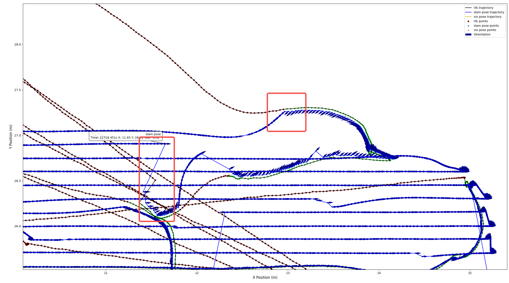
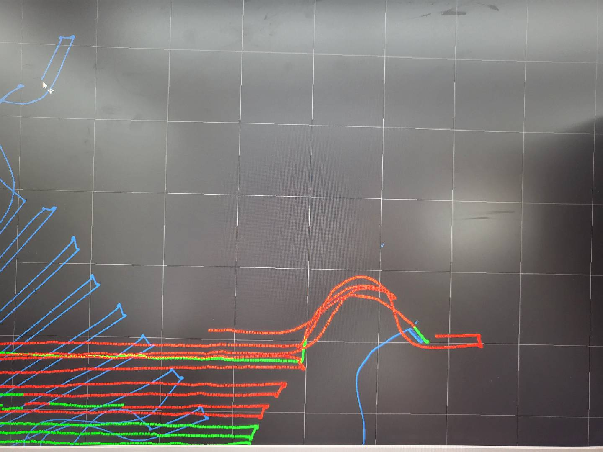
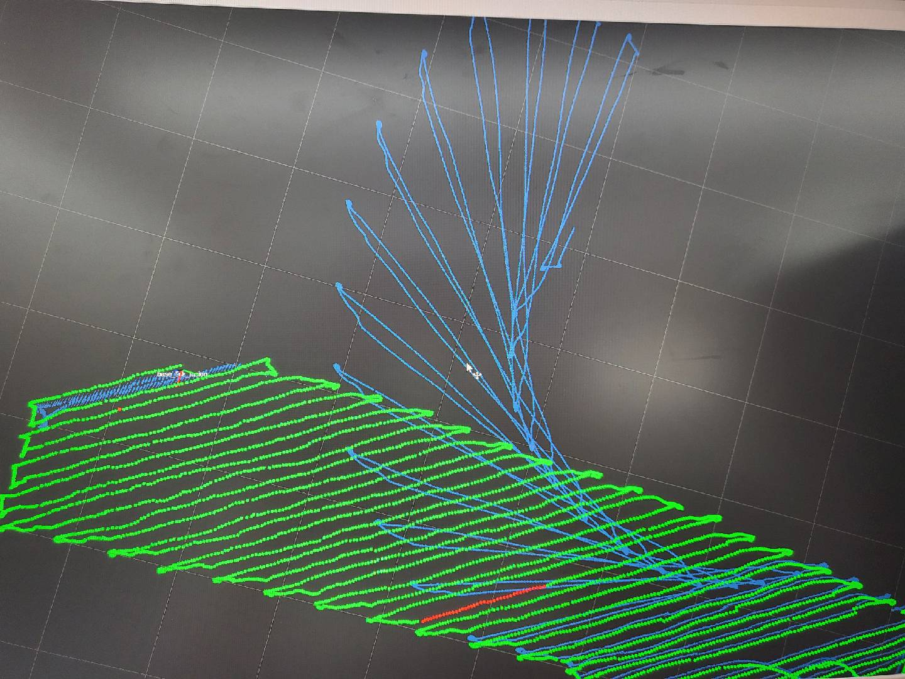
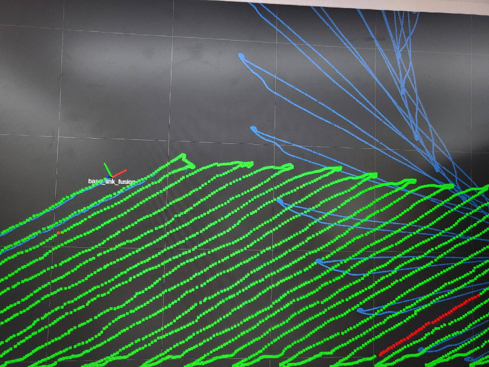
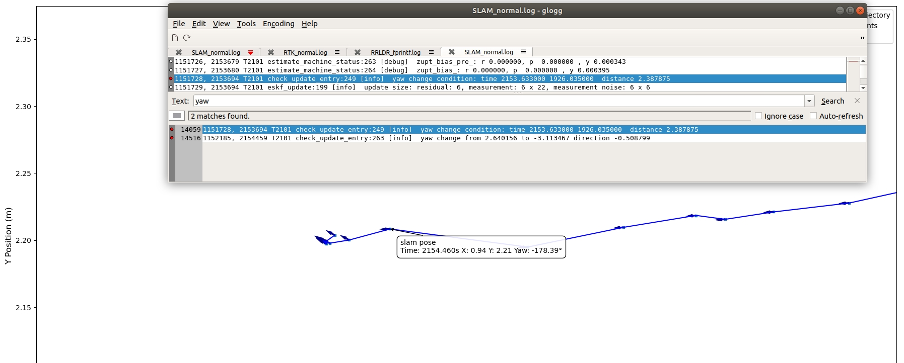
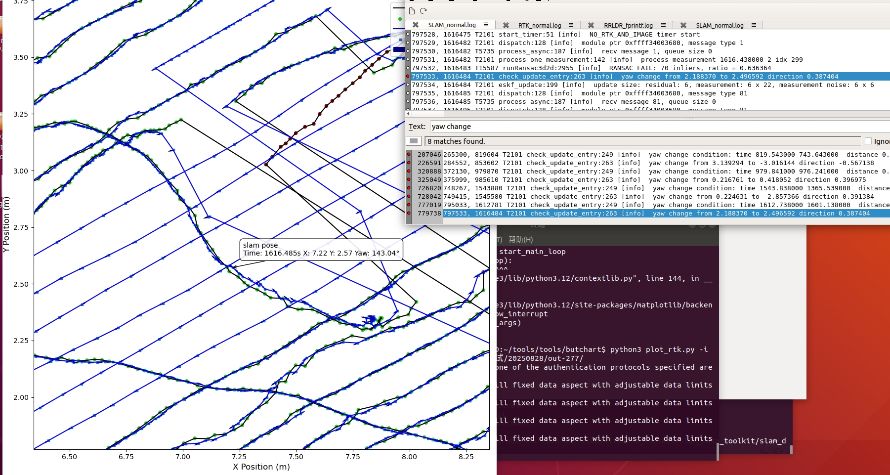
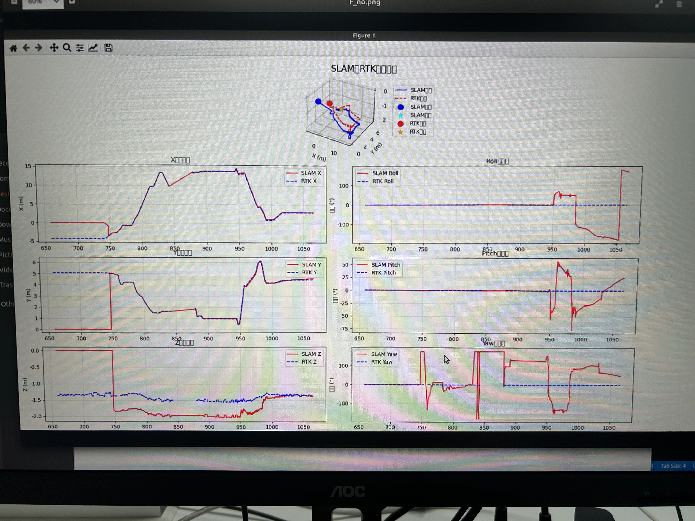
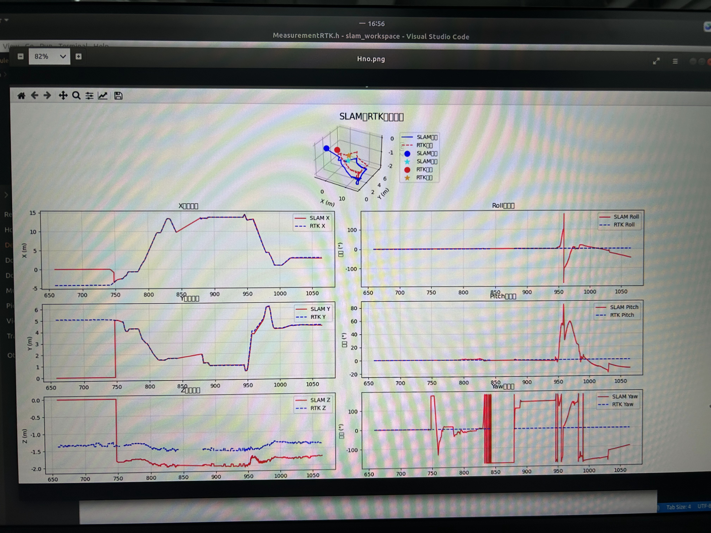
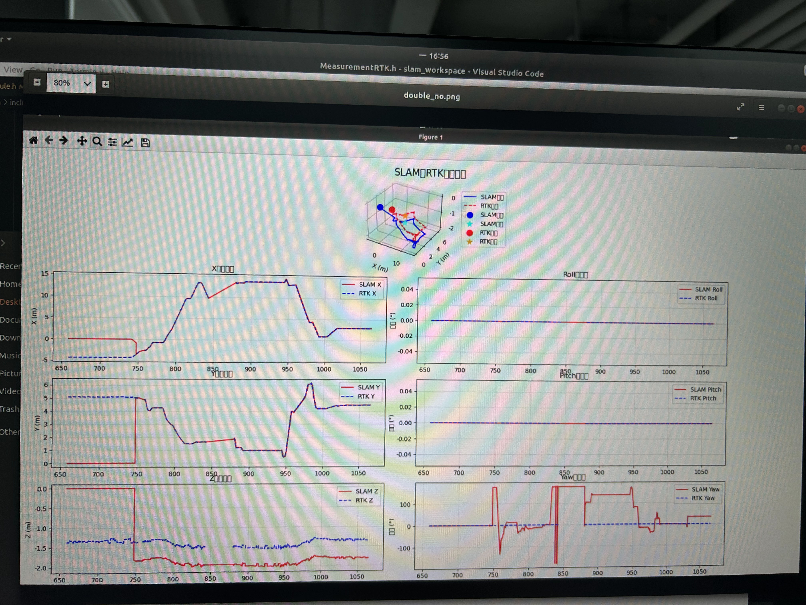
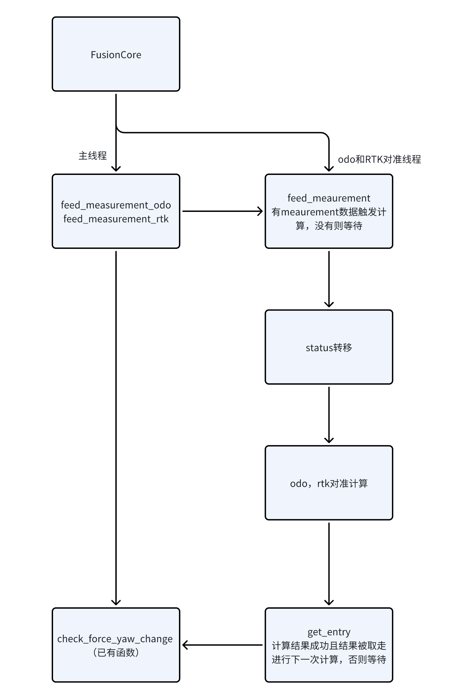

# 融合速度处理

# 1. 问题描述

Bug#391664 - \[2793]\[B1]\[外场78]400平地图机器弓子避障出界

http://pms.rockrobo.internal/index.php?m=bug\&f=view\&t=html&=\&bugID=391664

从RTK非固定解（使用视觉）恢复到RTK固定解的时候，姿态不能快速收敛。

# 2. 可行方案

方案一：更改递推/更新方程，利用odo速度和rtk速度，加快姿态收敛。这时即使姿态初始值不正确也可以快速收敛。

方案二：更改递推/更新方程，利用imu递推速度，odo和rtk速度作为速度观测。

方案三：抛弃之前的姿态，将航向设置为rtk固定解的速度方向。（综合考虑轮速方向）

方案四：重新进行slam初始对准。

方案五：轨迹对齐：odo和RTK一直对齐，开一个线程一直做，odo打滑是否有负面影响

# 3. 理论分析

## 原有递推和观测模型

状态变量$$x = [q,p,b_g]^T$$

递推：具体推导见 https://cinderella.yuque.com/unxgtt/yzvmqo/ai0l6p9exfcf482u

$$\begin{bmatrix}\delta\theta_{k+1}\\\delta p_{k+1}\\\delta b_{g, k+1}\end{bmatrix} =\underbrace{\begin{bmatrix}Exp(-[\omega_m-\hat{b}_{g,k}]_\times\Delta t)  &  0 & -I\Delta t \\- \hat{R}_k[d_m]_{\times}  & I & 0  \\ 0 & 0& I\end{bmatrix}}_{F} \begin{bmatrix}\delta\theta_{k}\\\delta p_{k}\\\delta b_{g, k}\end{bmatrix} + \underbrace{ \begin{bmatrix}-I\Delta t&0&0\\0&-\hat{R}_k&0\\0&0&I\end{bmatrix}}_{G}\begin{bmatrix}n_g\\n_v\\n_{bg}\end{bmatrix} $$

观测更新：

$$\begin{aligned}
P_{wr} = R_{wb}P_{br} + P_{wb}
\end{aligned}$$

$$H =\begin{bmatrix}  - R_{wb}[P_{br}]_{\times} & I & 0
\end{bmatrix}$$

## 方案一

增加观测

$$\begin{aligned}
{}^wv_r &=R_{wb}{}^bv_r+[\omega_{wb}]_{\times}(R_{wb}{}^bP_{r}) \\
{}^bv_r &= {}^bv_{o}=[v_x, 0, 0]^T
\end{aligned}$$

车体速度是用位移积分出来的，在ENU系下，因此：

$${}^wv_r ={}^wv_{o}+[\omega_{wb}]_{\times}(R_{wb}{}^bP_{r})$$

$$H = [-R_{wb}[w_{wb} \times P_{br}]_{\times}    0    I ]$$

效果不好：

速度使用odo速度：

$$H = [-R_{wb}[{}^wv_{o}.norm()*[1,0,0] + w_{wb} \times P_{br}]_{\times}    0    I ]$$

## 方案二

使用完整的imu递推方程，并加入方案一中的观测 &#x20;

## 方案三

RTK的速度是否可信

自测结果：

倒车

前进

# 4. 定性分析

（ 比较去掉F/H矩阵的结果，把图贴在此处）

第一张是F中位置误差对姿态误差偏导置零的结果

第二张是H中位置误差对姿态误差偏导置零的结果

第三张是F和H中位置误差对姿态误差偏导均置零的结果

# 5. 轨迹对齐（方案五）

单独开一个后台线程，一直做odo和RTK的对准，计算yaw。当从非固定解（视觉）到固定解时，实时航向由rtk速度方向作为初值，而后台计算odo和RTK的对准，计算完之后，以此yaw角替代状态中的yaw。

