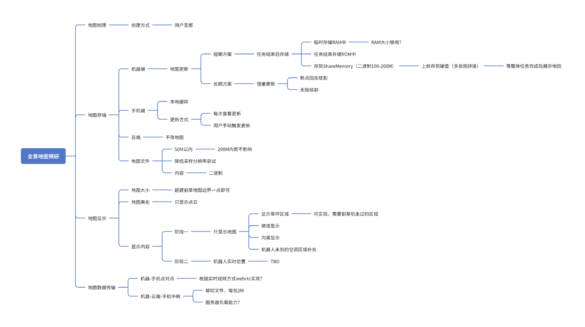
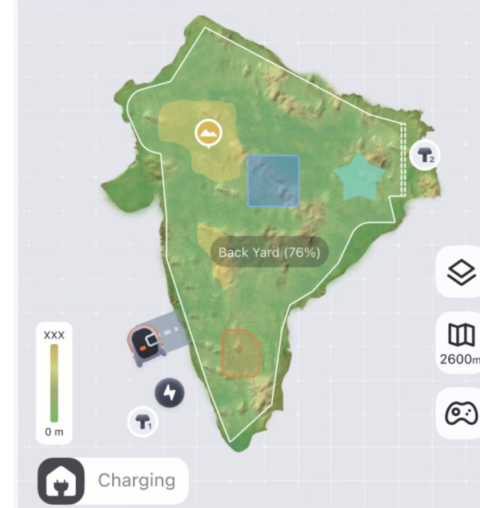

# 全景地图讨论纪要

# 2026/4/14

* [ ] 跑完整的割草流程，把点云地图文件导出来  &#x20;

  * [ ] 105，划分5个区域，前4个区域10mx10m，最后一个区域20mx20m

  * [ ] 割完一个区域手动回桩一次

* [ ] 考虑补充坑洞点云数据 &#x20;

* [ ] 测试地图数据传输及显示  &#x20;

## 2026/3/31

1. 采集点云、机器图片

   1. 说明采集方法

   2. 草地、坡道、**沟渠、枯草**、**泥地**、路面

2. 采集地图

   1. 说明测试方法 &#x20;

   2. 找 &#x20;

## 2026/3/24

1. 产品需求

   1. 全景地图是否每次更新？

      1. 不需要

      2. 考虑增量更新方案，作为长期方案

         1. 断点回充续割、无限续割场景等

   2. 地图文件过大，如何更流畅的交互

      1. 点云数据希望50M以下，以提高流畅度

      2. 降低采样分辨率尝试

      3. 考虑加载方式的方案

   3. 割草/建图完成后可在插件查看全景地图，超边界一点即可，不需要超太大→技术可行

   4. 割草过程中全景地图实时显示机器人位置等信息？必要性？→需要再考虑方案

      1. 全景地图临时存储在内存中（大小？1600㎡=100M），待任务结束后存储到Memory中

      2. 分阶段：阶段一只显示地图；阶段二再议（显示机器人位置等信息需要同步两种地图坐标系）

         1. 用户无感建立实景地图，开发进行数据过滤

         2. 导航定位算法与实景地图显示算法为单独两套

   5. 如何在UI方面做得更美观

      1. 只能是点数据，不要贴图，突出雷达功能

   6. 坡道、沟渠能否显示

      1. 待确认

   7. 地面显示草坪区域

   8. 下次采集枯草、泥地、路面等数据

   9. 如何补充机器人未经过区域空洞部分

      

下一步动作

1. 考虑数据传输方案
