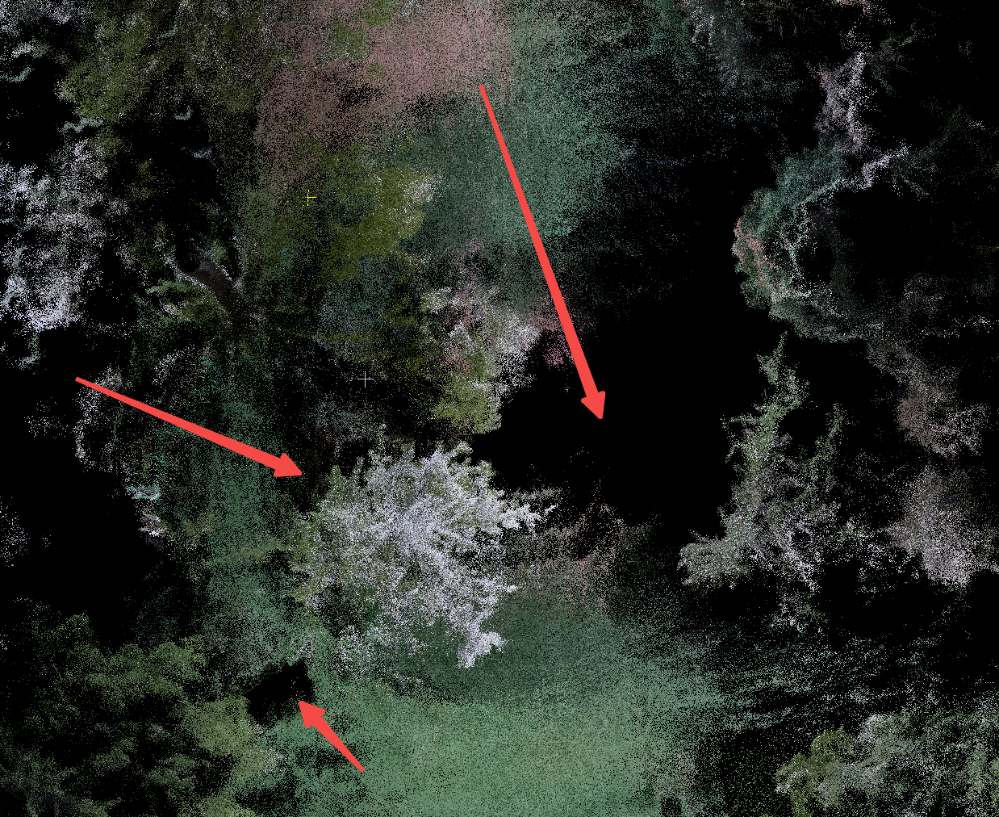

# 三维彩色建图补充地图空洞 V1.0 -- 20260421

# 1. 背景

当前坡道建图完成后，地面和坡道区域仍存在一定空洞，影响整体效果，需要进一步设计补偿方案进行优化。

[ 三维重建数据采集需求及结果分析](https://roborock.feishu.cn/wiki/RrZqwTzxQihU3ckOmQccvuOLnGe)

***

# 2. 结论

目前策略可以补全地面与坡道区域，并且对坡道的物理结构和色彩复原效果较好。

| 点云类型    | GIF                                                                                                                                                                    | PCD File |
| ------- | ---------------------------------------------------------------------------------------------------------------------------------------------------------------------- | -------- |
| 原始点     |  |          |
| 补全点白色表示 |  |          |
| 补全点彩色表示 |  |          |

***

# 3. 方法

填充方案可分为两类：地面点云补全和墙面点云补全。

对于墙面点云，由于墙面颜色和纹理差异较大，直接通过邻域颜色扩散或插值方式进行补全并不现实，容易造成墙面发花、发糊，反而带来负面效果。一旦出现明显上错色，用户通常难以接受。

相比之下，地面颜色整体更统一，更适合尝试做点云补全。

地面补全方法流程：沿轨迹在二维平面上先构造一个带宽走廊，只在走廊范围内补地面；已有点里每个栅格取最低点作为已有地面；对空洞栅格优先根据轨迹高度减去传感器到地面的高度偏置来补 z；最后对新增地面点做颜色赋值，先取最近原始点颜色，再做中值滤波，并把连通填充区域统一颜色。

| 从 PCD 头部解析 # VIO\_POSE 轨迹                    | 无                                      |
| -------------------------------------------- | -------------------------------------- |
| （轨迹周围需要考虑补地面的区域）                             | 以轨迹为中心，在 XY 平面内构造半径为 `radius` 的候选补全区域。 |
| （区分哪些网格已经存在地面，哪些网格缺失地面，从而决定后续是否需要补点。）        |                                        |
| （`ground_z = pose.z - sensor_ground_offset`） |                                        |
|                                              |                                        |
|                                              |                                        |

| 参数                     | 参数解释                                                               |
| ---------------------- | ------------------------------------------------------------------ |
| radius                 | 表示以轨迹为中心，在 XY 平面上生成半径 radius 米的走廊，只补这条走廊范围内的地面。这个参数越大，补全范围越宽，补点越多。 |
| grid                   | 补点网格分辨率，单位米。表示以 5cm 的间隔生成地面补点网格。                                   |
| sensor\_ground\_offset |   地面高度估计时搜索已有地面点的半径，单位米。                                           |
| color\_radius          |   颜色中值滤波半径，单位米。                                                    |

