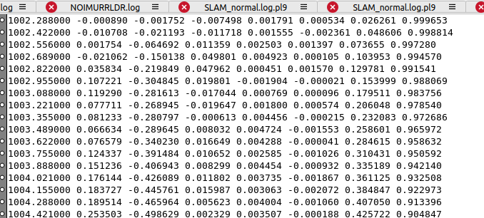
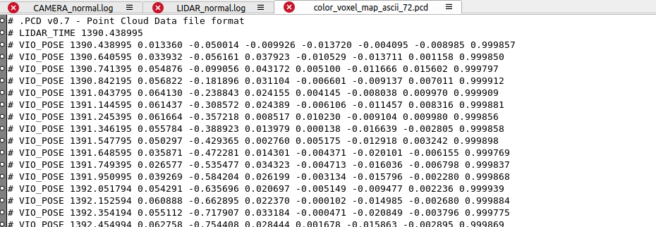

# 实景三维地图拼接方案 -- 20260416

# 1. 背景：目前三维重建的设计

系统启动后，在收到 `SET_SLAM_MODE` 后开始工作。`/mnt/data/rockrobo/index` 目录下存在一个 `index` 文件，用于记录全景地图编号。

每次运行过程中，系统会在 `/dev/shm` 下写入本次生成的 PCD 文件、PCD头包含**任务起始时间，以及从开始到结束的 pose 信息**，文件命名格式为 `temp_X.pcd`，其中 `X` 为当前 `index` 值。

当 FastLIVO 系统发生 reset 时（如 `PAUSE`  `LiDAR Dropout` `CHARGE`），会将 `index` 文件中的值加 1，用于区分新的全景地图片段。

当接收到状态机的充电状态 `FSM_CHARGE` 后，系统会对 `/dev/shm` 下所有 PCD 文件 （文件格式 color\_ascii\_voxel\_map\_`X`.pcd，`X` temp文件的 `index` 值）进落盘到 `/mnt/data/rockrobo/color_map_save`给上层做展示，同时再硬链接一份到 `/mnt/data/rockrobo/color_map`，供 后续打包上传使用。

# 2. 拼接策略

## 2.1 每次任务（桩出/非桩出 割草作业到回桩上电）

| 步骤 | 图示                                                                                                                                                                     |
| -- | ---------------------------------------------------------------------------------------------------------------------------------------------------------------------- |
|    |                                                                                     |
|    |                                                                                     |
|    |  |

## 2.2 合并PCD

贪心策略

| 步骤                                                                                                                                                                                                                                                                                         | 图示                                                                                                                                                                     |
| ------------------------------------------------------------------------------------------------------------------------------------------------------------------------------------------------------------------------------------------------------------------------------------------ | ---------------------------------------------------------------------------------------------------------------------------------------------------------------------- |
| 目的                                                                                                                                                                                                                                                                                         | 输入：输出：                                                                                                                                                                 |
| process\_1 处理后的 PCD 目录          \|  扫描所有 .pcd          \|  逐个读取 PCD 头    - WORLD\_FRAME\_POSE    - WORLD\_FRAME\_DISTANCE\_TO\_ORIGIN          \|  加载每张图的点云，并做降采样 0.3 \* 0.3 \* 0.3          \|  从所有图里选锚点  离 (0,0,0) 最近，大部分工作时桩出          \|  **锚点**先作为当前大图（锚点先直接变换到世界坐标里，形成当前 merged 大图。） | Input directory: /home/robo/CLionProjects/projecttest/output1Found processed clouds: 10Anchor cloud: color\_voxel\_map\_ascii\_68 distance\_to\_origin=0.0288449       |
|  如果某个点在当前大图里能找到最近邻，并且距离小于阈值：那就认为这个点是“重合点”。计算重合度，即候选图和当前图有多少重合度。（匹配成功点 / 大图点）                                                                                                                                                                                                               |  |

