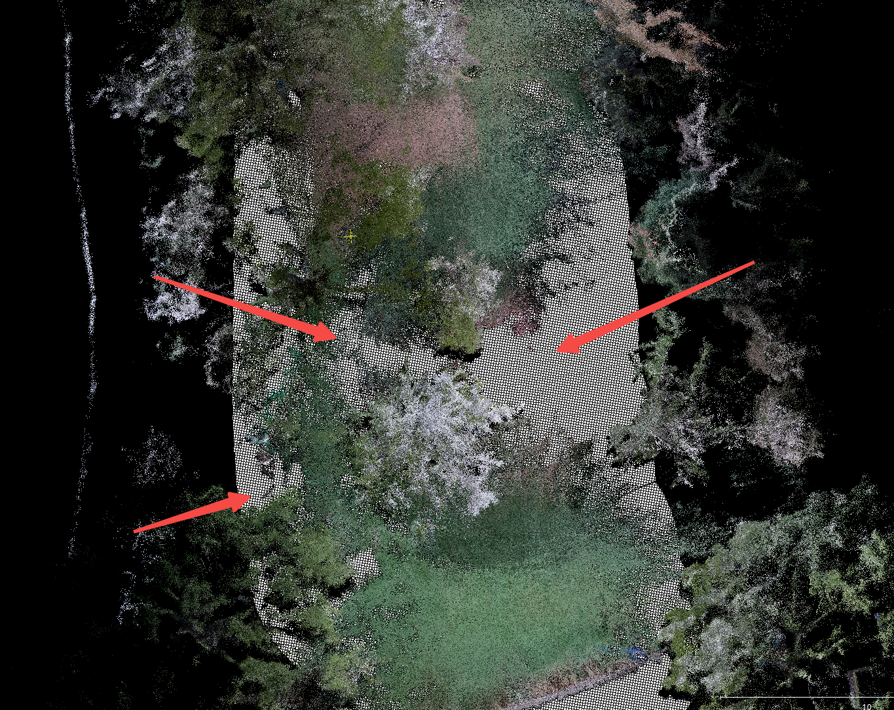
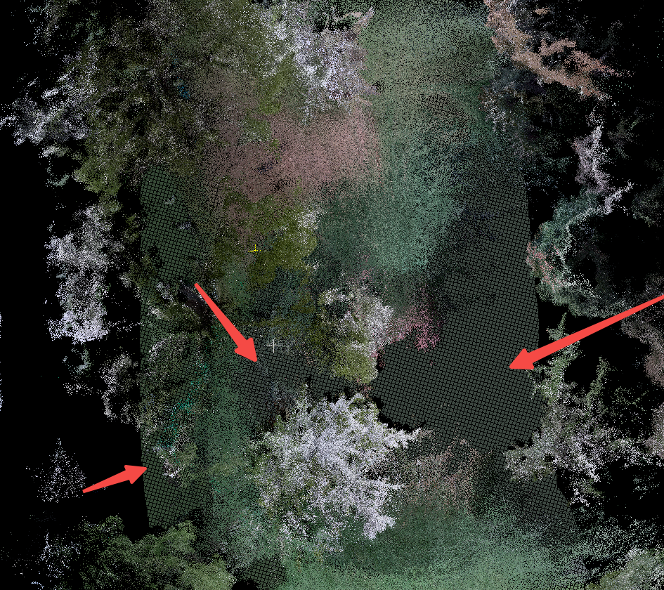
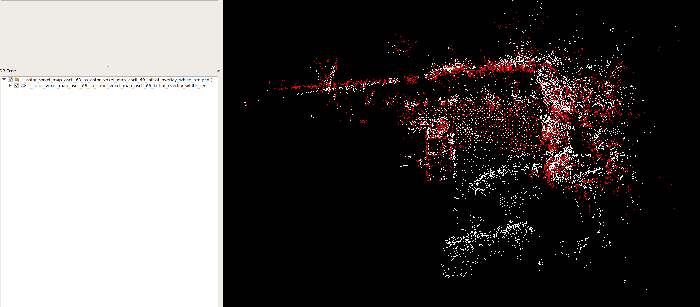
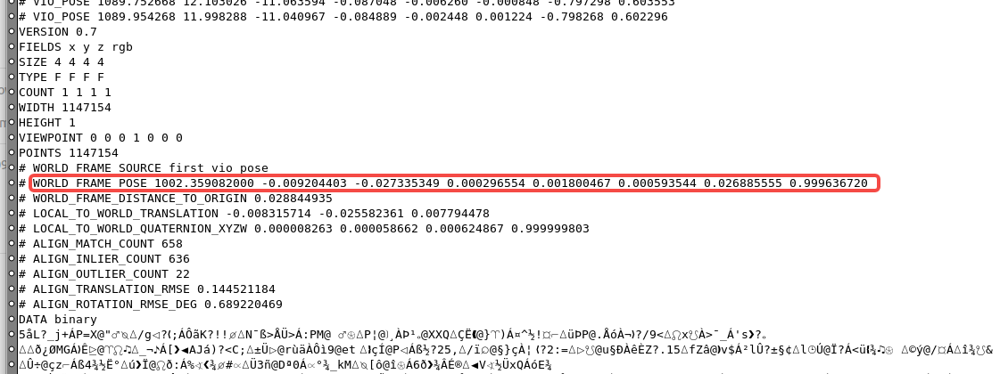
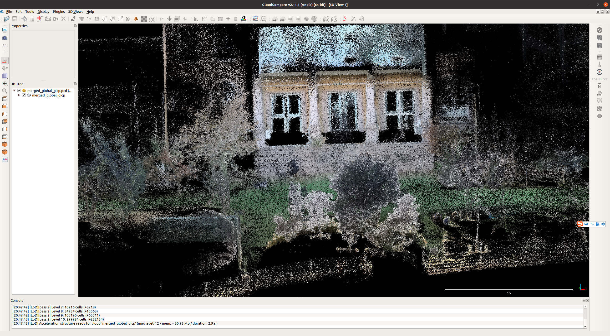

# Fast-LIVO2 全景地图预研 — Decisions

> 模块：`teams/fusion/modules/fastlivo/`
> 来源 inbox：`teams/fusion/inbox/004_融合定位/002_算法文档/011_Fast-livo`

---

## D-001 Fast-LIVO2 全景地图预研功能范围【已定案（预研阶段）】

**背景**
割草机激光项目（Versa）需要提升用户地图交互体验，传统平面 2D 地图不直观

**选定方案**
三核心功能：

1. **3D 地图**：激光点云三维重建，替代平面 2D 地图
2. **点云赋色**：为点云赋予场景颜色信息（相机 YUV→RGB）
3. **点云增强**：EDL/SSAO 渲染（增强深度效果）

**已完成工作**

- 雷达-相机标定（已完成）
- CPU 优化（75-90% → 60%）
- 染色调优（过曝/天空/灰白色过滤）
- 外场 60 栋验证（20251203）

**风险项**

- App 渲染难度（丝滑与清晰兼顾）
- 地图大（452.3MB pcd，内存 1.2G）
- 激光线数低时效果差
- 建图时（只走一圈）效果差；割草时（来回视角丰富）效果好

**未来工作**

- App 支持 EDL 渲染器（手机端开源代码：EDL shader 原理&调研）
- 地图传输功能
- 改为使用 SLAM 定位 pose 后处理（减少 CPU，保持一致性）

**来源** | 004_割草机全景地图预研功能简介

Demo 实际场景
Demo 3D 地图效果

---

## D-002 FAST-LIVO2 CPU 优化方案【已定案】

**背景**
YUV 即时转 RGB 造成 CPU 75-90% 占用，严重影响实时性

**选定方案**
接收 YUV 帧时直接提取 Y 通道作灰度图用于视觉追踪（避免即时 YUV→RGB）；
保存原始 YUV 值；机器停止/空闲时异步批量执行 YUV→RGB 完成彩色点云渲染

**放弃方案**
即时 YUV→RGB（CPU 开销过大）

**来源** | 002_FAST-LIVO2优化

---

## D-003 Fast-LIVO2 存图策略【已定案（含临时方案）】

**背景**
需要在割草过程中构建彩色点云地图并持久化存储

**选定方案**

- 存图路径：`/mnt/data/rockrobo/devtest/color_voxel_map_ascii.pcd`
- 触发：临时方案使用 `SET_SLAM_MODE` 作为开始触发（正式应为 `SLAM_FSM_MOW`，因 controller 初始化前消息已发送而无法使用）
- 停止：`SLAM_FSM_DOCK`（回充时停止建图）
- 启动时处理：`SLAM_FSM_CHARGE`（上电时开始处理彩色点云）
- 写入：单文件追加分块，16KB/chunk（约 1024 点），每次建图/割草清空旧文件

**来源** | 005_FAST-LIVO2 存图及使用时机

---

## D-004 点云染色过滤策略【已定案】

**背景**
原始点云染色效果差（过曝、天空蓝、灰白色点污染）

**选定方案**
三层过滤：

1. 过曝过滤：`brightness = (R+G+B)/3 > 180` 跳过
2. 天空过滤：B 通道高（>150）且明显高于 G/R，亮度中高
3. 灰白色过滤：`cmax - cmin < 20` 跳过（色彩饱和度低的点）

**来源** | 001_点云染色调优

---

## D-005 LVIO/LIO 模式切换策略【已定案】

**背景**
上机时相机频繁开启/关闭，导致 LVIO 算法飘移；原算法不支持 LVIO/LIO 动态切换

**选定方案**
相机关闭时：关闭 LIO 模块并 reset VIO 模块；
相机重新开启时：重新启动 VIO 模块

**来源** | 002_FAST-LIVO2优化

---

## D-006 EDL Shader 点云渲染增强技术调研【已定案】

**背景**
为在客户端向用户展示 FAST-LIVO2 生成的彩色点云，需要 EDL（Eye Dome Lighting）Shader 增强效果，提升点云立体感和清晰度。

**EDL 原理**
EDL 不修改点云本身，而是对渲染产生的深度图进行屏幕空间后处理：`点云 → 深度图 → EDL 增强图像`，属于图像级增强，本质是边界增强（让点云轮廓更清晰）。

**渲染效果对比**

EDL 渲染前（原始点云）

EDL 渲染后（增强效果）

**结论：Android / iOS 均可行**


| 方案                                                | 平台                                         | 可用性                         |
| ------------------------------------------------- | ------------------------------------------ | --------------------------- |
| GLSL Fragment Shader（pnext/three-loader EDL.frag） | WebGL1/OpenGL ES2，Android/iOS Safari/Unity | **推荐**：跨平台通用                |
| Potree（EDLRenderer.js）                            | WebGL，含 EDL Shader 完整开源实现                  | 可移植到 Android/iOS（OpenGL ES） |
| Unity ShaderLab/HLSL（BA_PointCloud EDL.shader）    | Unity，PC/Android/iOS                       | 需接入 Unity 引擎                |
| LuciadCPillar Android SDK                         | 原生 Android                                 | 商业库                         |


**来源** | `inbox/0412新增/EDL shader 原理&调研_2026-04-12-20-02-18/EDL shader 原理&调研.md`

---

## D-007 多帧对齐策略结论：单帧对齐最优【已定案】

**结论**：1m 对齐和 2m 对齐均不可用；单帧对齐效果最优。

**验证过程**

- 刘宏伟：系统性对比 1m / 2m / 单帧三种对齐策略（2026-03~2026-04 测试验证）
- 1m 和 2m 对齐：存在累积误差，长通道场景下偏移明显
- 单帧对齐：误差最小，但需配合 fusion_path 尾部信任机制避免跳过 2m ignore 区域（见 P-012 修复）

**当前实现**

- 使用单帧对齐时，信任 fusion_path 尾部，不跳过 2m 的 ignore 区域（2026-04-09 合入）
- 向 RTK 模块发送多帧对齐完成标志位，多帧对齐未完成前相信所有固定解（2026-04-09 合入）

**来源** | 周报 2026-04-02 @刘宏伟；周报 2026-04-09 @刘宏伟

---

## D-008 AiryLite 扫描式激光 lidar-camera 外参标定方案选型【调研完成，待定案】

**背景**

割草机新项目（AiryLite）使用扫描式激光雷达，现有 MCT 工站的外参标定/评估方案基于旋转式 lidar 设计，不适用于扫描式器件。需要新的 lidar-camera 外参标定方案及对应 MCT 检测方案。

**选定方案**

静态棋盘格 + 圆孔标定板，机器静止，多角度（建议 4 个方向）采集：

1. 将已知参数（圆形半径、棋盘格大小）的标定板静止放置，机器正对标定板静止不动
2. 激光点云平面分割 → 提取标定板圆心点云
3. 图像特征点提取 → 计算圆心坐标
4. 两组圆心点云配准 → 得到外参；或输入外参 → 评估配准残差（理想：R≈I，t≈0）

标定板设计图

标定场地布置图

标定流程图

**推荐参考实现：FAST-Calib**（见 G-004）

- 精度优于 velo2cam_calibration
- 支持扫描式激光 lidar，无须初始外参，计算速度快
- 主要配合 FAST-LIVO2 使用，3 个月前仍有活跃更新

FAST-Calib 精度对比

**关键约束**

- 扫描式激光垂直分辨率低：圆形确定至少需要 4 个点，标定板圆孔尺寸须严格匹配激光分辨率，设计前需预先计算
- 标定板后 1m 放置遮挡物（箱子/墙面），通过距离过滤分离标定板点云
- 评估阈值需通过实测（以现有外参标定的机器定位/导航跑测结果为参考）确定

**来源** | `inbox/0412新增/扫描式多线lidar与camera标定调研总结/扫描式多线lidar与camera标定调研总结.md`

---

## D-010 全景地图分阶段显示策略【已定案（阶段一）；阶段二待议】

**背景**
全景地图割草过程中是否需要实时显示机器人位置，涉及两套坐标系同步，复杂度高

**选定方案**

- **阶段一**：只显示地图（建图/割草完成后在插件查看），不显示实时机器位置
- **阶段二**：显示机器人实时位置 → TBD（需同步导航定位坐标系与实景地图坐标系）

**细节**

- 地图大小：超建到某地图边界一点即可，不需要超太大
- 地图美化：只显示点云，不贴图，突出雷达功能特性
- 显示割草区域（已走过的区域）：技术可行
- 机器人未到达的区域空洞：需补充方案（见 Q-007）

**来源** | 全景地图讨论纪要 2026-03-24 / 2026-04-14

---

## D-011 全景地图存储与更新架构【核心逻辑已定案；接口待对接】

**背景**
全景地图 pcd 约 452MB（原始），需设计机器端存储、更新触发、手机端缓存策略

**选定方案**

机器端存图触发：

- **回桩时存一次**（每次出桩→回桩为一块，对应一个区域片段）
- 整体任务全部完成后：做一次整体地图拼接展示
- 每块地图以"区域百分百覆盖完成"为终止更新条件（需向导航获取覆盖率接口，见 Q-011）
- 新增区域触发对应区域更新；老区域百分百完成后不再更新

固件与 App 更新解耦：

- 固件可多次自行更新地图，App 单独触发下载（固件更新多次，App 只同步一次）
- App 页面提供**手动更新按钮** + 最后更新时间展示（参考竞品）
- 流量限制：eSIM 场景不允许自动更新，Wifi 场景可自动或提示

手机端：

- 本地缓存
- 用户可手动删除重建

云端：

- **不存地图**（云端不持久化全景地图文件）

**来源** | 全景地图讨论纪要 2026-03-24；全景地图预研周会 2026-04-14（林子越、丛一鸣、林宇）

---

## D-012 全景地图文件格式与大小目标【已定案方向；参数待验证】

**背景**
原始 pcd 452MB，App 流畅度要求文件尽量小

**选定方案**

- 格式：**二进制**（非 ASCII pcd）
- 大小目标：**50M 以内**（200M 内都不影响，但 50M 以下体验最佳）
- 压缩手段：降低采样分辨率（具体分辨率待测试确认）

**来源** | 全景地图讨论纪要 2026-03-24

---

## D-013 全景地图数据传输方案【已明确，基于 IoT 平台】

**背景**
机器端地图需传输到手机端展示，评估两条路线

**结论**
不需要额外开发独立传输模块，**直接复用 IoT 平台现有能力**：

- 同局域网（Wifi）：握手后自动走 P2P 点对点
- 非局域网：经 IoT 平台服务器中转（App/插件侧无需感知区别）

**分块传输方案**

- 文件按固定大小分块，App 侧自行请求并拼装二进制文件
- App（黄子洋）只负责显示，不负责点云空间拼接（坐标对齐由固件侧处理）
- 大文件传输提示：eSIM 场景不允许自动下载，Wifi 下可提示或自动

**当前状态**

- 王新侧 PCD 上传接口 profile bug 已修复（2026-04-14）
- 黄子洋本周内联调测试

**来源** | 全景地图预研周会 2026-04-14（黄子洋、王新、林宇）

---

## D-014 多次割草点云拼接策略【先实验，后决策】

**背景**
用户多次割草（多次出桩/回桩），每次存一块点云。多块拼接时存在：

- 同一区域多次扫描产生重叠点云
- 两次扫描坐标系若有偏差，会出现重影/分层

**当前结论（李哲 2026-04-14）**
先不在理论层面纠结，**先采实验数据，跑 60/75/105 场地多次清扫，看实际拼接效果**：

- 若效果可接受（大草坪尺度下轻微重叠不可见）：按现有方案推进
- 若坐标错位明显：考虑加重定位/回环模块确保多块坐标一致

**宋姝补充**
重定位的作用是让坐标更准，使重叠点云不分层；在大尺度草坪场景下，坐标准的情况下轻微重叠用户基本看不出来。

**App 侧约束（黄子洋确认）**
App 端无法对两个不同模型的点云做空间拼接，只能显示；坐标对齐须在固件侧处理完成后传输。

**进展（2026-04-16）**：V1.0 拼接方案输出，采用「机器端 index 切片落盘 + 离线贪心 + 重合度阈值」（详见 D-017）。当前实现**不引入回环/重定位**，等价于隐式假设 SLAM 全局位姿足够准；该假设的实测依据待补。

**来源** | 全景地图预研周会 2026-04-14（李哲、黄子洋、林子越、宋姝）；inbox/0421新增/实景三维地图拼接方案 -- 20260416

---

## D-015 坡道点云空洞根因确认【已定位；补充方案待定】

**背景**
坡道场景点云出现明显空洞，补采后仍有缺口

**根因（刘宏伟 2026-04-14 确认）**
雷达和相机的 FOV 在坡道上**没有重叠**：

- 机器已在坡面上时，雷达点投影到像素坐标系后几乎不落在坡道区域
- 从远处平地方向平视坡面时，两者 FOV 可重叠，效果明显改善

**缓解措施（测试侧）**
从远处补采，机器不要直接踩上坡面采集

**待解决**

- 丛一鸣提议用双目直接填坡道空洞，李哲认为技术路线不一致，较费劲
- 李哲 action：考虑有无其他方法补充斜坡空洞（见 Q-007）

**来源** | 全景地图预研周会 2026-04-14（刘宏伟、丛一鸣、李哲）

---

## D-009 FAST-LIVO2 硬件加速候选方向梳理【待确认】

**背景**
FAST-LIVO2 在割草机上 CPU 占用偏高，LIO 残差搜索、视觉 EKF 更新、patch 提取等计算密集模块存在并行化/GPU 化空间，需要系统梳理优化候选点以指导后续硬件加速立项。

**候选优化方向（11 处）**


| 模块                                    | 优化方向                                                    | 代码位置                        |
| ------------------------------------- | ------------------------------------------------------- | --------------------------- |
| LIO 残差搜索与点面匹配                         | OpenMP（已有框架，线程数被锁死为 1）                                  | `voxel_map.cpp:372/403/446` |
| LIO 状态估计主循环（点协方差/Jacobian/Hessian 组装） | OpenMP / TBB / Eigen 向量化 / GPU batched linear algebra   | `voxel_map.cpp` 大循环         |
| 平面初始化 3×3 特征值分解                       | SelfAdjointEigenSolver / SIMD / GPU batched eigensolver | `voxel_map.cpp:49`          |
| 视觉直接法 EKF 更新（updateState）             | CPU 多线程 + SIMD / CUDA / OpenCL / VPI                    | `vio.cpp:1650/1689/1748`    |
| 视觉逆向组合更新（updateStateInverse）          | SIMD / GPU                                              | `vio.cpp:1538`              |
| patch 提取与仿射 warp                      | SSE/AVX/NEON / OpenCV CUDA                              | `vio.cpp`                   |
| 图像 resize / 灰度转换 / 去畸变                | cv::cuda / VPI / ISP/NPU                                | `vio.cpp:2254/2059`         |
| 图像金字塔（createImgPyramid）               | OpenCV / IPP / CUDA / VPI 后端                            | `frame.cpp:56`              |
| 第三方梯度（rpg_vikit Sobel）                | OpenCV 硬件后端                                             | `img_align.cpp:337`         |
| IMU 传播（固定维矩阵运算）                       | Eigen 向量化                                               | `IMU_Processing.cpp:258`    |
| IMU 去畸变 per-point 并行                  | OpenMP / SIMD / GPU                                     | `IMU_Processing.cpp:356`    |


**当前状态**：仅分析阶段，无最终优先级排序和实施计划。

**来源** | `inbox/0413新增/FAST-LIVO2 硬件加速.md`

---

## D-016 三维彩色建图地面空洞补全方案 V1.0【已定案（V1.0）；参数待调优】

**背景**
坡道与地面建图后存在明显空洞（根因见 D-015 / P-006：雷达-相机 FOV 在坡面无重叠）。需要后处理阶段补全方案恢复地面/坡道的物理结构与色彩，提升用户视觉效果。

**关联文档**：[三维重建数据采集需求及结果分析](https://roborock.feishu.cn/wiki/RrZqwTzxQihU3ckOmQccvuOLnGe)（飞书 wiki，G-006）

**选定方案：仅补地面，不补墙面**

| 区域 | 是否补全 | 理由 |
| --- | --- | --- |
| 地面 / 坡道 | ✅ 补 | 颜色整体一致，邻域颜色扩散/插值不易出错 |
| 墙面 | ❌ 不补 | 颜色与纹理差异大，插值会发花/上错色，**风险大于收益** |

**算法链路（5 步）**

1. 从 PCD 头部解析 `# VIO_POSE` 拿到完整轨迹
2. 以轨迹为中心，在 XY 平面内构造半径 `radius` 的"带宽走廊"，仅在走廊内补点
3. 走廊按 `grid` 分辨率栅格化；每个栅格取已有点最低点作为「已有地面」，识别空洞栅格
4. 对空洞栅格用 `ground_z = pose.z - sensor_ground_offset` 估计地面高度
5. 颜色赋值：取最近原始点颜色 → `color_radius` 中值滤波 → 同一连通填充区域统一颜色

**参数表**

| 参数 | 含义 | 调参方向 |
| --- | --- | --- |
| `radius` | 轨迹两侧补全走廊半径（米） | 越大补全范围越宽；过大会越界补到机器未到达区域 |
| `grid` | 补点网格分辨率（米，文档示例 5cm） | 越小越细腻，点数线性增长，影响存储/渲染 |
| `sensor_ground_offset` | **歧义待澄清**：参数表写"已有地面点搜索半径"，但公式 `ground_z = pose.z - sensor_ground_offset` 又作"传感器到地面高度偏置"使用（见 Q-013） | — |
| `color_radius` | 颜色中值滤波半径（米） | 越大越平滑，过大会丢失局部色彩细节 |

**当前效果**

V1.0 在坡道场景能补齐空洞，色彩与几何形态保持自然。三组对比（原始 / 白色 / 彩色）：








**遗留 / 待办**

- `sensor_ground_offset` 参数语义需作者澄清（Q-013）
- 当前结论为定性"效果较好"，缺量化验收指标（Q-014）
- "墙面不补"是否应提供开关，覆盖室内白墙等弱纹理场景，待评估
- 文档结论表中 PCD File 列空缺，未提供可复现的点云文件链接
- 与 D-017 实景拼接的执行顺序需明确（先补再拼 / 先拼再补，见 Q-017）

**来源** | `inbox/0421新增/三维彩色建图补充地图空洞 V1.0 -- 20260421/三维彩色建图补充地图空洞 V1.0 -- 20260421.md`

---

## D-017 实景三维地图拼接方案 V1.0【已定案（V1.0）；阈值与失败兜底待补】

**背景**
D-014 留下的 open 问题"多次割草任务的多片段点云如何拼接"。本方案给出 V1.0 的落盘机制 + 离线合并算法，作为 D-014 / Q-010 的初步答复。

**落盘机制（机器端）**

- 启动建图：收到 `SET_SLAM_MODE`，向 `/dev/shm/temp_X.pcd` 写入；PCD 头携带「任务起始时间 + 全程 pose」
- 切片粒度：FastLIVO `reset`（`PAUSE` / `LiDAR Dropout` / `CHARGE`）触发 `/mnt/data/rockrobo/index` 自增，下一段写入 `temp_(X+1).pcd`
- 落盘时机：收到 `FSM_CHARGE`（回桩上电）→ `/dev/shm` 内所有片段落盘到 `/mnt/data/rockrobo/color_map_save/color_ascii_voxel_map_X.pcd`（展示用），同时硬链接到 `/mnt/data/rockrobo/color_map`（上传用）

**PCD 头新增字段**

| 字段 | 用途 |
| --- | --- |
| `WORLD_FRAME_POSE` | 该片段世界坐标系位姿，离线拼接时把局部点云变换到世界系 |
| `WORLD_FRAME_DISTANCE_TO_ORIGIN` | 距世界原点距离，用于贪心选锚点（默认锚点 = 离原点最近，对应桩点附近片段）|

**离线合并算法（贪心 + 重合度）**

1. 扫描所有处理过的 `.pcd`，逐个读取 PCD 头取出 `WORLD_FRAME_POSE` / `WORLD_FRAME_DISTANCE_TO_ORIGIN`
2. 加载每张点云，做 0.3m × 0.3m × 0.3m 体素降采样
3. 选锚点：离 (0,0,0) 最近的片段
4. 锚点变换到世界系，作为初始 merged 大图
5. 对其余候选片段：在大图查每个点的最近邻，距离 < 阈值即"重合点"
6. 计算重合度 = 匹配成功点 / 大图点数；满足条件即并入大图（贪心吸收）

**示意**

任务过程：






合并算法效果：




**Demo 输出（10 片段，锚点为离原点最近的 68 号）**

```
Input directory: /home/robo/CLionProjects/projecttest/output1
Found processed clouds: 10
Anchor cloud: color_voxel_map_ascii_68 distance_to_origin=0.0288449
```

**与既有决策的关系**

- 落地了 **D-011** 中"机器端存图触发"的具体实现路径（index + reset 切片 + FSM_CHARGE 落盘）
- 把 **D-003** 的"分块写入"细化为"以 index 为单位多片段并存"
- 是 **D-014** 的 V1.0 实施答复（不引入回环 / 重定位，**默认 SLAM 全局位姿足够准**，理由待补）
- 是 **Q-010** 多次割草拼接质量的初步方案（仍缺验收指标）

**遗留 / 待办**

- 重合度阈值未量化、并入失败的片段如何处理未明确（Q-016）
- 拼接 vs 地面补全（D-016）执行顺序未定（Q-017）
- index 文件丢失/损坏的恢复策略未定（Q-018）
- `/dev/shm` 内 temp 段在异常断电下的丢失风险未兜底（无 checkpoint 机制）
- 落盘命名一致性：`color_ascii_voxel_map_X` vs demo 中 `color_voxel_map_ascii_68`，需统一
- 算法运行环境（机器在线 / 日志平台离线 / App 端）未写明
- 0.3m 降采样仅用于判重还是写入大图需澄清（影响最终大图分辨率与 D-012 文件大小目标）
- 文档表格"步骤说明"列大段空白，需作者补完

**来源** | `inbox/0421新增/实景三维地图拼接方案 -- 20260416/实景三维地图拼接方案 -- 20260416.md`