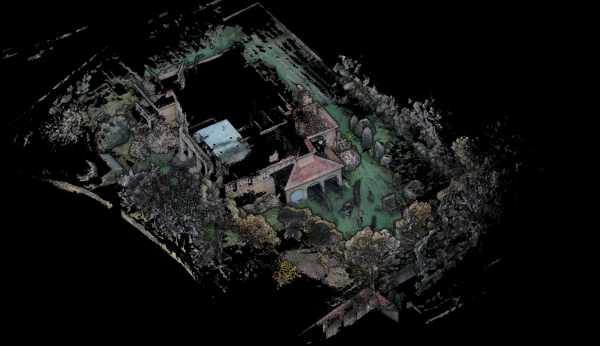
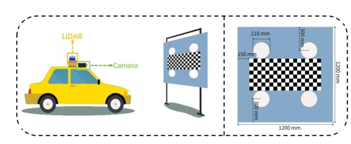
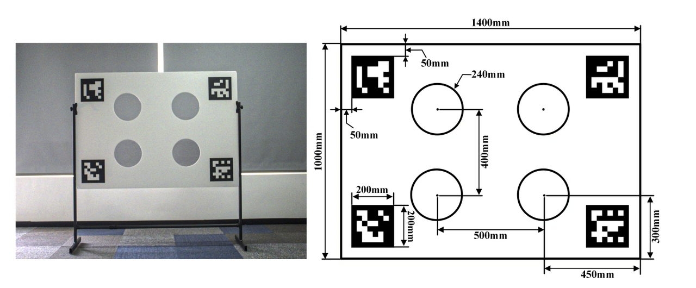

# Fast-LIVO2 全景地图预研 — Decisions

> 模块：`teams/fusion/modules/fastlivo/`
> 来源 inbox：`teams/fusion/inbox/004_融合定位/002_算法文档/011_Fast-livo`

---

## D-001 Fast-LIVO2 全景地图预研功能范围【已定案（预研阶段）】

**背景**
割草机激光项目（Versa）需要提升用户地图交互体验，传统平面 2D 地图不直观

**选定方案**
三核心功能：
1. **3D 地图**：激光点云三维重建，替代平面 2D 地图
2. **点云赋色**：为点云赋予场景颜色信息（相机 YUV→RGB）
3. **点云增强**：EDL/SSAO 渲染（增强深度效果）

**已完成工作**
- 雷达-相机标定（已完成）
- CPU 优化（75-90% → 60%）
- 染色调优（过曝/天空/灰白色过滤）
- 外场 60 栋验证（20251203）

**风险项**
- App 渲染难度（丝滑与清晰兼顾）
- 地图大（452.3MB pcd，内存 1.2G）
- 激光线数低时效果差
- 建图时（只走一圈）效果差；割草时（来回视角丰富）效果好

**未来工作**
- App 支持 EDL 渲染器（手机端开源代码：EDL shader 原理&调研）
- 地图传输功能
- 改为使用 SLAM 定位 pose 后处理（减少 CPU，保持一致性）

**来源** | 004_割草机全景地图预研功能简介

---

## D-002 FAST-LIVO2 CPU 优化方案【已定案】

**背景**
YUV 即时转 RGB 造成 CPU 75-90% 占用，严重影响实时性

**选定方案**
接收 YUV 帧时直接提取 Y 通道作灰度图用于视觉追踪（避免即时 YUV→RGB）；
保存原始 YUV 值；机器停止/空闲时异步批量执行 YUV→RGB 完成彩色点云渲染

**放弃方案**
即时 YUV→RGB（CPU 开销过大）

**来源** | 002_FAST-LIVO2优化

---

## D-003 Fast-LIVO2 存图策略【已定案（含临时方案）】

**背景**
需要在割草过程中构建彩色点云地图并持久化存储

**选定方案**
- 存图路径：`/mnt/data/rockrobo/devtest/color_voxel_map_ascii.pcd`
- 触发：临时方案使用 `SET_SLAM_MODE` 作为开始触发（正式应为 `SLAM_FSM_MOW`，因 controller 初始化前消息已发送而无法使用）
- 停止：`SLAM_FSM_DOCK`（回充时停止建图）
- 启动时处理：`SLAM_FSM_CHARGE`（上电时开始处理彩色点云）
- 写入：单文件追加分块，16KB/chunk（约 1024 点），每次建图/割草清空旧文件

**来源** | 005_FAST-LIVO2 存图及使用时机

---

## D-004 点云染色过滤策略【已定案】

**背景**
原始点云染色效果差（过曝、天空蓝、灰白色点污染）

**选定方案**
三层过滤：
1. 过曝过滤：`brightness = (R+G+B)/3 > 180` 跳过
2. 天空过滤：B 通道高（>150）且明显高于 G/R，亮度中高
3. 灰白色过滤：`cmax - cmin < 20` 跳过（色彩饱和度低的点）

**来源** | 001_点云染色调优

---

## D-005 LVIO/LIO 模式切换策略【已定案】

**背景**
上机时相机频繁开启/关闭，导致 LVIO 算法飘移；原算法不支持 LVIO/LIO 动态切换

**选定方案**
相机关闭时：关闭 LIO 模块并 reset VIO 模块；
相机重新开启时：重新启动 VIO 模块

**来源** | 002_FAST-LIVO2优化

---

## D-006 EDL Shader 点云渲染增强技术调研【已定案】

**背景**
为在客户端向用户展示 FAST-LIVO2 生成的彩色点云，需要 EDL（Eye Dome Lighting）Shader 增强效果，提升点云立体感和清晰度。

**EDL 原理**
EDL 不修改点云本身，而是对渲染产生的深度图进行屏幕空间后处理：`点云 → 深度图 → EDL 增强图像`，属于图像级增强，本质是边界增强（让点云轮廓更清晰）。

**渲染效果对比**

**结论：Android / iOS 均可行**

| 方案 | 平台 | 可用性 |
|------|------|--------|
| GLSL Fragment Shader（pnext/three-loader EDL.frag） | WebGL1/OpenGL ES2，Android/iOS Safari/Unity | **推荐**：跨平台通用 |
| Potree（EDLRenderer.js） | WebGL，含 EDL Shader 完整开源实现 | 可移植到 Android/iOS（OpenGL ES） |
| Unity ShaderLab/HLSL（BA_PointCloud EDL.shader） | Unity，PC/Android/iOS | 需接入 Unity 引擎 |
| LuciadCPillar Android SDK | 原生 Android | 商业库 |

**来源** | `inbox/0412新增/EDL shader 原理&调研_2026-04-12-20-02-18/EDL shader 原理&调研.md`

---

## D-007 多帧对齐策略结论：单帧对齐最优【已定案】

**结论**：1m 对齐和 2m 对齐均不可用；单帧对齐效果最优。

**验证过程**
- 刘宏伟：系统性对比 1m / 2m / 单帧三种对齐策略（2026-03~2026-04 测试验证）
- 1m 和 2m 对齐：存在累积误差，长通道场景下偏移明显
- 单帧对齐：误差最小，但需配合 fusion_path 尾部信任机制避免跳过 2m ignore 区域（见 P-012 修复）

**当前实现**
- 使用单帧对齐时，信任 fusion_path 尾部，不跳过 2m 的 ignore 区域（2026-04-09 合入）
- 向 RTK 模块发送多帧对齐完成标志位，多帧对齐未完成前相信所有固定解（2026-04-09 合入）

**来源** | 周报 2026-04-02 @刘宏伟；周报 2026-04-09 @刘宏伟

---

## D-008 AiryLite 扫描式激光 lidar-camera 外参标定方案选型【调研完成，待定案】

**背景**

割草机新项目（AiryLite）使用扫描式激光雷达，现有 MCT 工站的外参标定/评估方案基于旋转式 lidar 设计，不适用于扫描式器件。需要新的 lidar-camera 外参标定方案及对应 MCT 检测方案。

**选定方案**

静态棋盘格 + 圆孔标定板，机器静止，多角度（建议 4 个方向）采集：

1. 将已知参数（圆形半径、棋盘格大小）的标定板静止放置，机器正对标定板静止不动
2. 激光点云平面分割 → 提取标定板圆心点云
3. 图像特征点提取 → 计算圆心坐标
4. 两组圆心点云配准 → 得到外参；或输入外参 → 评估配准残差（理想：R≈I，t≈0）

**推荐参考实现：FAST-Calib**（见 G-004）

- 精度优于 velo2cam_calibration
- 支持扫描式激光 lidar，无须初始外参，计算速度快
- 主要配合 FAST-LIVO2 使用，3 个月前仍有活跃更新

**关键约束**

- 扫描式激光垂直分辨率低：圆形确定至少需要 4 个点，标定板圆孔尺寸须严格匹配激光分辨率，设计前需预先计算
- 标定板后 1m 放置遮挡物（箱子/墙面），通过距离过滤分离标定板点云
- 评估阈值需通过实测（以现有外参标定的机器定位/导航跑测结果为参考）确定

**来源** | `inbox/0412新增/扫描式多线lidar与camera标定调研总结/扫描式多线lidar与camera标定调研总结.md`

