# 融合定位 — Decisions

> 模块：`teams/fusion/modules/fusion/`
> 来源 inbox：`teams/fusion/inbox/004_融合定位`

---

## D-001 传感器组合选型【已定案】

**背景**
室外割草机场景：空旷、草皮重复纹理、存在遮挡/打滑/漂移干扰

**选定方案**
RTK + 双目视觉 VIO + 轮速计 + 陀螺仪 + 加速度计

**理由**
- RTK：空旷场景厘米级精度，提供绝对位置
- 双目 VIO：草皮丰富纹理支持局部 6DOF 相对位姿，RTK 遮挡时短时过渡
- 轮速计+陀螺仪+加速度计：短时相对位姿预测（方差设大，防打滑/漂移累积）
- 极端情况（多传感器均失效）：上报报警信息，导航调整路径

**来源** | 001_架构文档/002_割草机多传感器融合定位概要设计

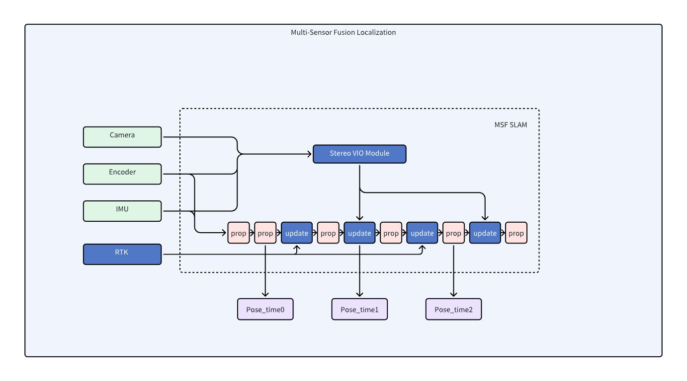

---

## D-002 选用 ESKF 框架作为多传感器融合核心【已定案】

**背景**
需要一个能融合 RTK（位置观测）、VIO（局部位姿观测）、轮速+IMU（预测）的统一滤波框架

**选定方案**
ESKF（Error-State Kalman Filter）

**理由**
- KF：仅适用线性系统
- EKF：对非线性系统全局线性化，精度受限
- ESKF：名义状态保持非线性更新，只对误差状态（小量）线性化 → 数值更稳定、计算效率更高；适合旋转、位姿等高维非线性系统

**来源** | 002_算法文档/006_ESKF算法

---

## D-003 VIO 模块算法框架【已定案】

**背景**
视觉模块需提供局部 6DOF 位姿供融合使用

**选定方案**
Feature Tracking + ESKF Propagate（gyro+wheel）+ ESKF Update（视觉观测）+ Local Map Optimize

**理由**
三部分协作：特征追踪提供图像观测，ESKF 做预测和更新，局部地图非实时优化提升准确性和稳定性

**来源** | 001_架构文档/002_割草机多传感器融合定位概要设计


---

## D-004 融合模块调用关系架构【已定案】

**背景**
需要明确各传感器数据流和融合模块内部调用关系

**选定方案**
见白板架构图

**来源** | 002_算法文档/001_融合模块调用关系


---

## D-005 ESKF 融合方案初始化【已定案】

**背景**
RTK 仅提供基站东北天系 xyz，启动时机器姿态未知，需初始化 `T_wi`

**选定方案**
两套方案并行设计：
- **简单方案**：机器沿 x 轴方向前进一段距离，通过 RTK 位移方向确定 yaw
- **通用方案**：机器不受限运动，已知 `T_iR`（外参）、`t_wR`（RTK）、`T_vi`（vslam）、`T_oi`（gyro+odo），最小二乘求解 `T_wv`、`T_wo`

**来源** | 002_算法文档/005_ESKF融合方案设计


---

## D-006 RTK 外参精度影响分析结论【已定案】

**背景**
RTK 观测模型 `z = R_nb * P_br + P_nb`，外参 `P_br` 误差对融合 pose 有影响，需量化

**选定方案**
外参 3.6cm 合理（原地旋转验证）；仿真场景：原地旋转+固定半径绕圈，改变 RTK 外参观察 yaw 角 RMSE

**来源** | 002_算法文档/002_RTK位置对于融合pose精度的分析

---

## D-007 RTK 固定解跳变判断逻辑 v1.0【已定案】

**背景**
RTK 固定解偶发跳变；浮点→固定→浮点过渡时出现假固定问题

**选定方案**
卡方检验：99% 门限，6D 为 16.81，3D 为 11.34
兜底策略：`fixed_rtk_failure_cnt > 50` 时强制融合（融合到 Mahalanobis 距离小于阈值）；机器静止时若超阈值直接拒绝，计数器不增加

处理目标：大跳变假固定 + 视觉恢复到固定解时刻的假固定

**来源** | 002_算法文档/004_RTK固定解跳变判断逻辑v1.0


---

## D-008 融合 RTK + VIO 逻辑 v1.0【已定案（已迭代至 v1.1）】

**背景**
ESKF 框架中需要决策何时接入视觉观测、何时信任 RTK 观测

**选定方案**
- `check_insert_entry()`：观测是否加入队列
- `check_update_entry()`：观测是否可用于更新
- 视觉使用策略：RTK 固定解时不使用视觉；非固定解超时后使用视觉；接入视觉时 RTK 与视觉起点对齐

**优化记录 v2（2025-07-03）**
- VIO R 矩阵设为 1e-8/1e-6/1e-4（置信度调节）
- 星数 <21 颗的固定解不参与更新
- 结论：视觉累计误差优于 IMU/Gyro

**来源** | 002_算法文档/007_融合RTK、VIO逻辑1.0

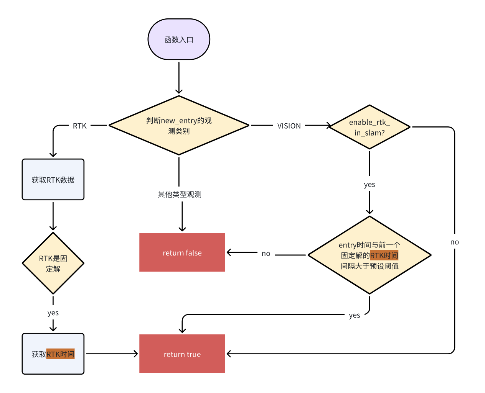


---

## D-009 融合 RTK + VIO 逻辑 v1.1【已定案】

**背景**
v1.0 在 RTK 4/5/4 来回跳变时处理不足；假固定识别能力弱

**选定方案**
1. 加入 RTK 位置方差/速度方差判断假固定（优先于后续判断）
2. 相邻 RTK 跳变 >0.2m 或状态转换（4↔5）时，改用 VIO 递推
3. VIO 检测 RTK 一致性：维护 20s 双队列，首尾位移偏差 <10% 才切换回 RTK 固定解
4. 静止状态下不响应 RTK 跳变

**风险**
5→4 且 RTK 为真固定解时，会多递推 20s

**来源** | 002_算法文档/007_融合RTK、VIO逻辑1.0/001_融合RTK、Vio逻辑1.1

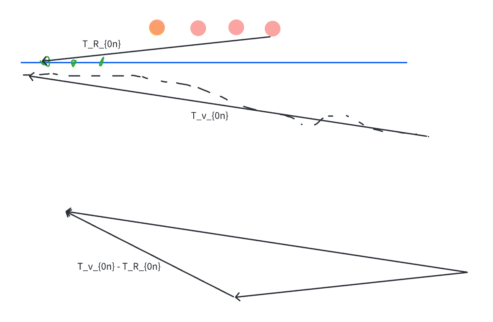

---

## D-010 RTK-odom 对齐线程设计【已定案】

**背景**
浮点→固定解、视觉→固定解等特殊切换时，融合定位 yaw 收敛慢

**选定方案**
独立对齐线程，一直做 odom 与 RTK 轨迹 SVD 对齐：
- 队列 fixed_size=10，RTK 数据均为固定解
- 质量检查：帧间行驶角度 <5deg，累计 RTK 长度 <1m（防固定解异常）
- 残差验证：平均角度误差 <5deg 认为 yaw 有效
- 时间戳检查：get_pose 与计算 yaw 时间差 <50ms 才使用

**后续改进方向**
- 滑动窗口替代 fixed_size；优化质量检查标准；yaw 作为观测进滤波器而非强制更改状态

**来源** | 002_算法文档/009_Rtk odom初始化线程

---

## D-011 非搬动重定位（融合定位）方案【已定案】

**背景**
RTK 非固定解 + vslam tracking lost 时，需要 SLAM 主动发起重定位而非等待外部触发

**选定方案**
1. vslam 维护队列，tracking lost 时提供 `T_wv0`（丢失时刻位姿）和 `t0`
2. 融合维护等长惯导队列，收到后算出当前位姿 `T_wf1`
3. 融合通知导航，导航转 180°回 RTK 良好区域（`T_wf2`）
4. 融合初始化 vslam（位姿 `T_wf1`，速度≈0）
5. vslam 尝试重定位；成功则正常割草；失败则依赖惯导沿原路返回，或走 2×2 矩形搜索

**来源** | 002_算法文档/008_重定位/002_非搬动重定位（融合定位）方案

---

## D-012 导航-SLAM 重定位接口定义【已定案】

**背景**
多种触发重定位场景（割草定位差、建图出错、搬动），需要统一接口

**选定方案**
`SlamToNavMsg` 新增 `RELOCATE_BAD_LOCATION` 类型；`relocate_cmd`（1 开始/0 结束）；导航速度减半（降低打滑影响）

三种场景：
1. 割草定位差（RTK 非固定解 + 视觉丢失）→ SLAM 主动触发
2. 建图失败
3. 搬动重定位

**来源** | 002_算法文档/008_重定位/001_导航-slam重定位接口

---

## D-013 重定位融合模块细节架构【已定案】

**来源** | 002_算法文档/008_重定位/003_重定位融合模块细节


---

## D-014 GAIA RTK 三种接入模式【已定案（先用 1+1）】

**背景**
GAIA 割草机需要选定 RTK 差分数据接入方式

**选定方案**

| 模式 | RTK 模组数 | 通信 | 费用 | 延时 |
|------|-----------|------|------|------|
| **1+1 RTK（先用）** | 2（固定站+移动站） | LoRa | 多一模组 | LoRa 延时 |
| 主机 nRTK | 1（割草机） | 4G | 流量+cors | 4G 延时 |
| 桩 nRTK | 1（割草机） | LoRa+4G | esp32+cors | LoRa+4G |

**来源** | 004_外部设备与slam/001_GAIA三种rtk模式


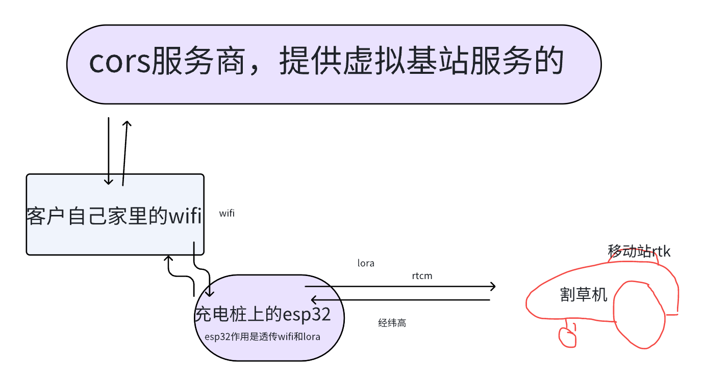

---

## D-015 MCU 时间同步方案【已定案】

**背景**
三处理器（MMCU/VMCU/AP），MMCU 以 10ms 读编码器，VMCU 以 20ms 上传 AP，两 MCU 无法直接时间同步

**选定方案**
MMCU 不打时间戳；VMCU 在收到左轮数据中断时打时间戳 `t2`（左右轮共用），消除 MMCU 内部 2ms 间隔影响。VMCU 无论是否凑齐 2 包都立即上传。

**放弃方案**
MMCU+VMCU 时间同步（修改量大）

**来源** | 004_外部设备与slam/002_MCU丢包问题与时间同步分析

---

## D-016 RTK 假固定识别参数结论【已定案】

**背景**
通过分析 diffage、std_e、std_n、sats 与假固定数据关系，提取识别阈值

**选定方案**
- `min(stde) = 0.0117`
- `min(stdn) = 0.0098`
- 数据来源：1036 条假固定样本

**来源** | 003_测试文档/001_RTK/005_RTK假固定原始数据分析

---

## D-017 RTK 建图中搬动恢复方案【待确认】

**背景**
遥控建图时搬动机器触发搬动重定位，建图中无法重定位，导致建图失败

**选定方案**
草坪边界对齐（优先草坪边界，考虑禁区/通道）+ 地图合并 / 轨迹融合（不擦除原轨迹）

**风险**
存在专利风险，方案仍在讨论中

**来源** | 002_算法文档/012_RTK机器建图中搬动，恢复建图方案

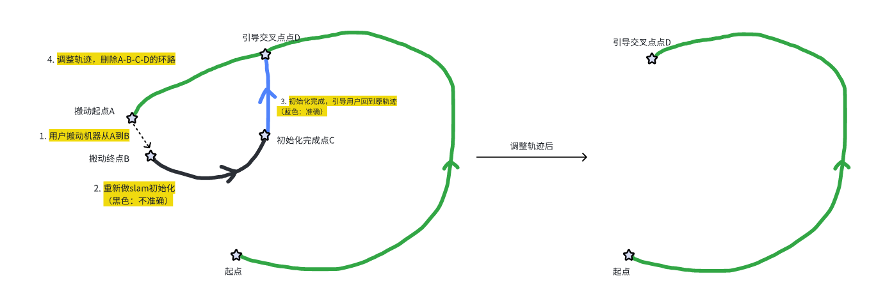

---

## D-018 nRTK 软件架构总体方案【已定案】

**背景**
产品需要支持主机通过 4G 连接 CORS 服务（网络RTK）替代 LoRa 基站方案，需要设计账号管理、坐标转换和多层软件交互。

**选定方案**
- 【中间层】调用 AP 接口关闭 LoRa，init_nrtk() 建立 NTrip 服务；定时器每 10s 发送 GGA 报文维持虚拟站；AGRICA 解析输出 BLH 坐标给定位
- 【定位】nRTK 模式下获取经纬高后转 ENU 坐标；建图第一个 RTK=4 点为原点；重启读取地图参考点
- 【导航】建图时在导航地图中新增基准原点（BLH 坐标系），其余接口不变
- 【账号管理】账号取还 + TTL 检验 + 异常更换；IoT 平台：账号池绑定 SN、设备离线 5min 后主动解绑、1h 心跳保活
- 【AP-Wlan Manager】任务期间 WiFi 信号不佳直接切换 4G，不再切回

**理由**
主机 nRTK 相比 1+1 RTK 减少一个基站模组，降低成本；通过 CORS 服务获取差分数据，适合无固定基站场景

**来源** | inbox/011_软件架构/010_nRTK技术方案/nRTK技术方案.md

---

## D-019 基站RTK / 主机nRTK / 桩nRTK 三模式切换设计（Gaia）【已定案】

**背景**
Gaia 产品需要支持三种 RTK 模式（1+1 基站RTK、主机nRTK、桩nRTK）之间的任意切换，且切换后地图需对准或复用

**选定方案**

| 切换方向 | 地图处理 |
|---------|---------|
| 基站RTK → 主/桩nRTK | 需地图对准（坐标系变换） |
| 主nRTK ↔ 桩nRTK | 不需地图对准（同为 nRTK，绝对坐标系相同） |
| 主/桩nRTK → 基站RTK | 需地图对准 |

- 【APP Proxy】透传切换指令、负责账号取还
- 【状态机】维护 RTK/nRTK 双状态机，处理故障码，调接口开/关 LoRa
- 【中间层】下发 set_nrtk / set_rtk，账号下发，GNGGA/AGRIC 解析
- 【AP/MCU】半双工串口模式调整，接收并切换通信模式
- 【导航】切换前暂存 ENU 坐标，切换后地图坐标转换，删地图时判断当前模式仅删当前模式地图
- 桩nRTK 新增：桩端 esp32 进行 Ntrip 鉴权、自组 GNGGA（2s 频率）、LoRa 传 RTCM 给主机；主机同步桩坐标到桩端

**理由**
主/桩 nRTK 共享同一 CORS 绝对坐标参考，切换时无需重校准；基站RTK 与 nRTK 坐标原点不同，须坐标转换

**来源** | inbox/011_软件架构/010_nRTK技术方案/nRTK技术方案.md；inbox/011_软件架构/018_nRTK需求分解-Gaia/nRTK需求分解-Gaia.md

---

## D-020 nRTK Auto 模式智能切换策略（Gaia）【已定案】

**背景**
用户不希望手动管理主机nRTK/桩nRTK切换，需要系统根据 LoRa 信号和网络状态自动决策

**选定方案**
- 设置 Auto 模式时先进行桩 LoRa 配对；初始若网络可用 → 主机nRTK，若不可用 → 桩nRTK
- 建图时：网络可用强制切主机nRTK
- 割草时切换策略：
  - 切桩nRTK 条件：桩在线 + LoRa 信号正常（开始割草时检测）
  - 回主机nRTK 条件：LoRa 中断（15s 内无心跳包）/ LoRa 即将断开（15s SNR均值<2dB）/ RTCM 中断（>30s 无差分包） 且主机已联网
  - 切回桩nRTK 条件：LoRa 稳定（15s SNR均值>4dB）+ 云端查询桩在线

**理由**
桩nRTK LoRa 无网络延时，信号稳定时优先使用；主机nRTK 作为桩nRTK 不可用时的兜底，保证定位连续性

**来源** | inbox/011_软件架构/018_nRTK需求分解-Gaia/nRTK需求分解-Gaia.md

---

## D-021 RTK 非固定解→固定解恢复时姿态收敛方案选型【已定案】

**背景**
Bug#391664：400 平地图弓字避障出界。根因：从 RTK 非固定解（使用视觉）恢复到 RTK 固定解时，姿态无法快速收敛，导致定位偏差出界。

**五种候选方案对比**

| 方案 | 思路 | 评估 |
|------|------|------|
| 方案一 | 修改更新方程，将 odo/RTK 速度作为新观测加快姿态收敛 | 效果不好（实验验证） |
| 方案二 | 使用完整 IMU 递推方程 + 方案一的速度观测 | 方案一效果差则此方案类似 |
| 方案三 | 抛弃之前姿态，直接将航向设为 RTK 固定解速度方向 | RTK 速度经验证可信（倒车/前进均准确） |
| 方案四 | 重新进行 SLAM 初始对准 | 延迟大，体验差 |
| **方案五** | 后台线程持续做 odo-RTK 轨迹对齐，切换时以 RTK 速度方向为初值，后台对齐完成后替换 yaw | **选定** |

**选定方案（方案五）：轨迹对齐**

单独开后台线程持续计算 odo 与 RTK 的对准 yaw。当从非固定解切换到固定解时：
1. 实时航向初值设为 RTK 速度方向
2. 后台线程完成 odo-RTK 对准计算后，以计算结果的 yaw 角替代状态中的 yaw


**理由**
方案五兼顾快速响应（RTK 速度方向初值）和精度（后台精确对齐），避免了方案三在低速/倒车场景下速度方向不稳定的风险。

**来源** | `inbox/0412新增/融合速度处理_2026-04-12-20-13-21/融合速度处理.md`

---

## D-022 nRTK 软件实现细节（中间层/定位/导航/账号管理）【已定案】

**背景**
基于产品需求（网络RTK PRD），分解 nRTK 各软件层的具体实现方案（V0.2 初版 → V1.1 最终版）。与 D-018 不同：D-018 描述架构总体方案，本条记录各层的实现细节和接口约定。

**nRTK 定位一阶段实现（已提 WI）**

- **中间层**：`init_nrtk()` 发送账号建立 NTrip 服务；每 10s 调用 `Send_GGA_To_Socket()` 维持虚拟站；AGRICA 语句解析下发 BLH 给定位
- **定位层**：NRTK 模式下获取经纬高（BLH），以建图第一个 RTK=4 点为原点转为 NEU；每次重启读取地图参考点
- **导航层**：建图新增参考原点（BLH）存入地图，其余不变

**账号管理机制**

| 流程 | 说明 |
|------|------|
| 账号获取 | APP Proxy 调用 IOT 接口，上传主机 SN，IOT 绑定账号并下发账号+密码+挂载点 |
| 账号归还 | APP Proxy 解绑 SN，账号状态置为未占用 |
| 超时解绑 | 设备离线超 5min 自动解绑；1h 心跳保活 |
| TTL 检查 | IOT 处理请求时检验 TTL：未过期下发当前账号；过期下发新账号 |

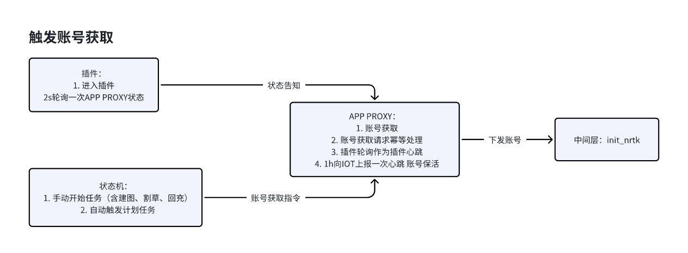

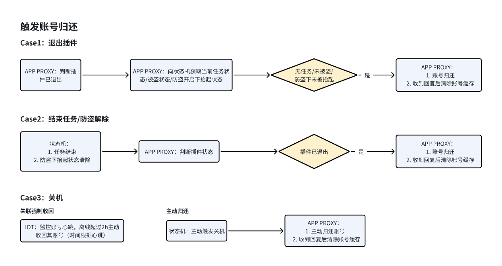

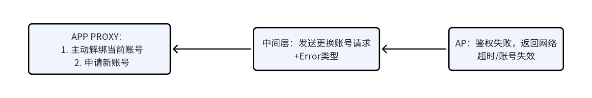

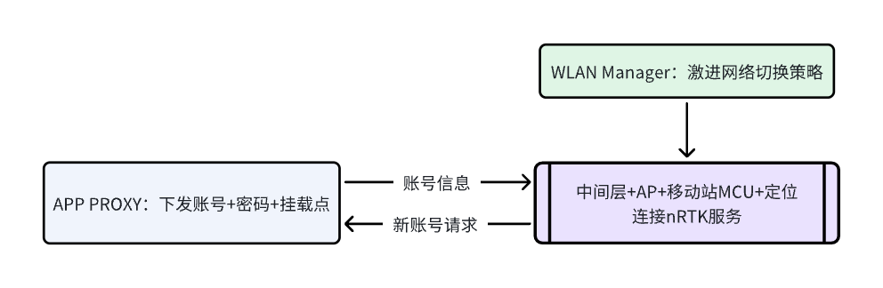

**模式切换（基站RTK ↔ nRTK）**

切换涉及 APP Proxy / 状态机 / 中间层 / AP / MCU / 定位 / 导航 / 插件各层协调：

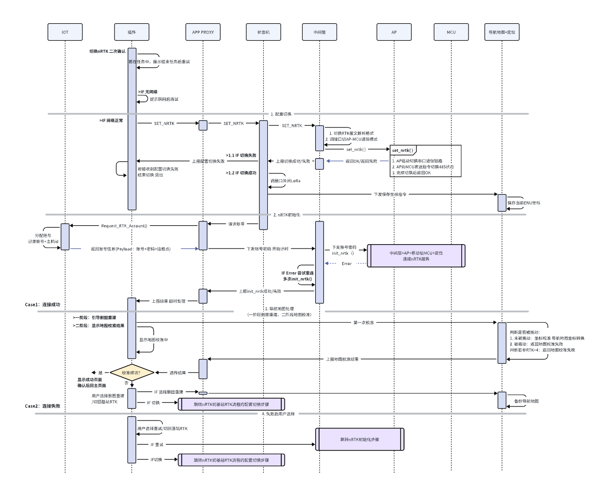

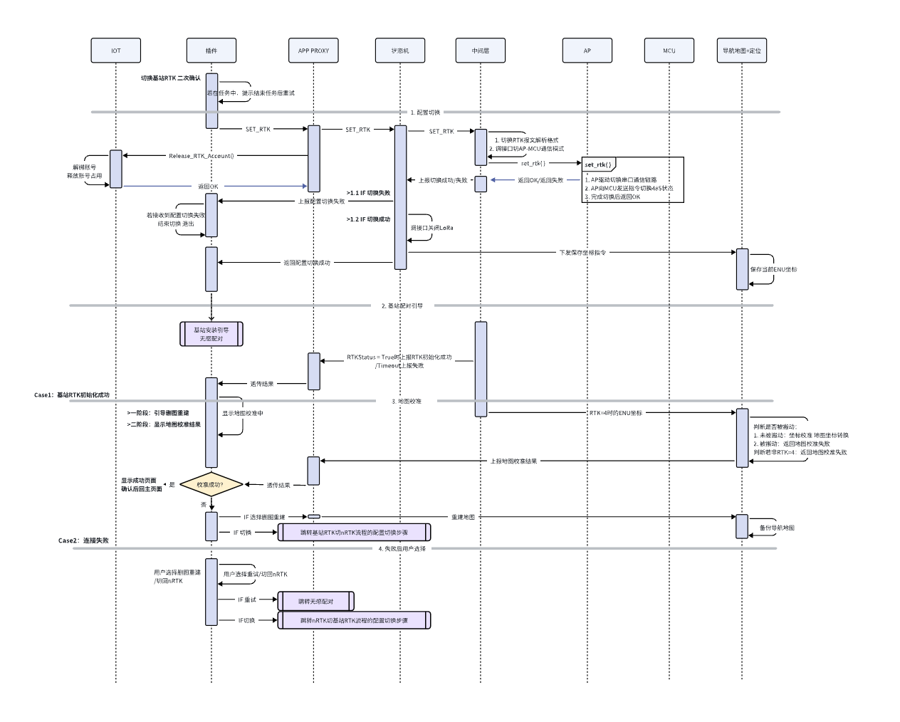

关键设计：
- 维护两套地图（基站RTK 地图 / nRTK 地图），切换时做坐标转换；删地图时仅删当前模式
- nRTK 模式下激进网络切换策略：任务中 WiFi 不佳直接切 4G，任务结束后切回
- nRTK 初始化失败时重试，重试失败上报故障码

**导航地图坐标转换**

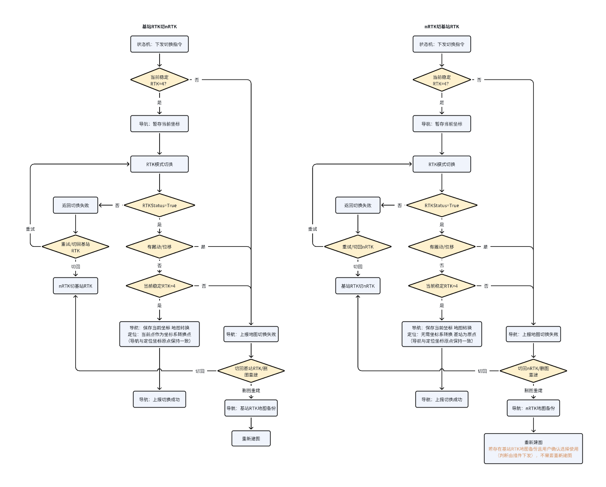

**插件交互需求**

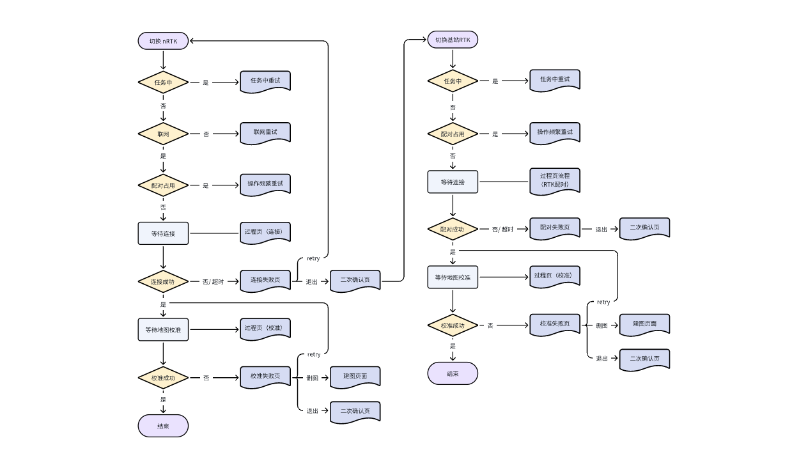

**版本记录**：V0.2（2026-01-09 初版）→ V1.0（2026-01-30 参照 PRD 完成总体方案）→ V1.1（2026-02-28 修改模式配置切换部分）

**来源** | `inbox/0412新增/nRTK技术方案_2026-04-12-21-27-57/nRTK技术方案.md`

---

## D-023 网络 RTK 产品需求设计（PRD V0.1~V0.2）【已定案】

**背景**
本地基站 RTK 部署成本高、步骤复杂，部分用户希望即开即用，引入 nRTK 网络差分定位服务作为补充/替代。

**核心功能设计**

| 功能 | 说明 |
|------|------|
| 初次检测 nRTK 可用性 | 检测用户所在区域是否支持网络 RTK，支持则减少基站配置流程 |
| 手动切换 RTK 模式 | 【设置】-【RTK设置】-【RTK模式】，支持基站RTK ↔ 网络RTK 双向切换 |
| 售后电离层检测 | 售后服务调用接口跳转电离层活动地图网页 |

**产品流程图**


**版本记录**：V0.1（2026-01-09）→ V0.2（2026-03-05）

**来源** | `inbox/0412新增/网络RTK_2026-04-12-21-28-46/网络RTK.md`

---

## D-024 NRTK / 实体 SIM 卡 / LoRa 接口定义【已定案】

**背景**
在完成 nRTK 产品需求后，需要定义具体的 APP 插件端接口（API 名称、交互方式、状态机）。

**NRTK 接口（新增）**

| 接口/事件 | 说明 |
|---------|------|
| `switchRtkLocationModel()` | 切换定位模式（nRTK/基站RTK） |
| 连接网络RTK + 广播结果 | 超时/失败→网络连接失败页；成功→进入地图校准 |
| 地图校准接口 + 广播结果 | 超时1min；超时/失败→校准失败页；成功→完成切换 |
| `getLocationRtkPaired()` | 获取基站 RTK 配对信息；未配对→无感配对流程 |

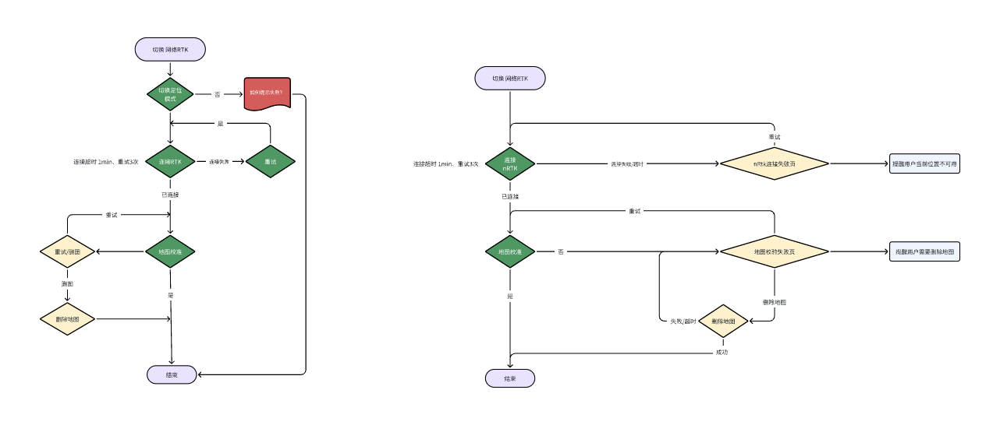

**实体 SIM 卡接口（新增）**

| 接口 | 说明 |
|------|------|
| 检测安装 SIM 广播 | 检测到用户安装实体 SIM 卡时广播通知 |
| `getESimInfo()` | 复用现有接口，获取 SIM 信号强度等信息 |
| SIM / eSim 选择弹窗 | 由关闭→打开蜂窝时，默认 eSim；ButChart/ButChartPro 支持 eSim+SIM 切换 |

适配规则：Monet/Versa 不支持 SIM（模组在机器内部），仅显示 eSim。

**LoRa**
底层接口方法修改，影响 RTK 配对相关功能，需复测：安装引导 RTK 配对、RTK 配置界面等。

**来源** | `inbox/0412新增/1. NRTK & 实体Sim卡 & Lora需求梳理_2026-04-12-21-33-02/1. NRTK & 实体Sim卡 & Lora需求梳理.md`

---

## D-025 通道外假固定判断策略（1.0 → 2.0）【已定案】

**背景**
RTK 在树下、屋檐下、通道外等受遮挡区域会出现"假固定解"——显示 Fixed 状态但实际误差大。需区分通道内/外状态，对假固定解做屏蔽并切换到 VIO 辅助。

**选定方案（2.0）**

通道进入/退出判断条件：

| | 进入通道内 | 退出通道（回到通道外） |
|---|---|---|
| 通道内 | 浮点解 / 3d跳变>10cm / 单帧std超阈值 | 固定解 && 速度>0.03 && 连续5帧 |
| 通道外 | 浮点解 / 2d跳变>15cm / 3d跳变>20cm | 固定解 && 速度std<0.2 && 位置std<0.02 && 速度>0.06 && 相邻两帧rtk2d距离<10cm |

**2.0 新增：** 兜底逻辑——整个区域 RTK 受影响、无符合条件固定解约 600 帧时强制恢复；增加单帧角度纠正航向角（先判速度std）；1.0 2d 跳变阈值从 20cm 收紧到 15cm。

**理由**
- 1.0 退出通道条件过宽，树下/屋檐下假固定解仍被接受，导致定位跳变
- 2.0 增加 3d 跳变条件和速度 std 限制，减少误判

**来源** | `inbox/0412新增/通道外假固定判断_2026-04-13-00-07-56/通道外假固定判断.md`

---

## D-026 搬动重定位融合模块设计【已定案】

**背景**
用户割草时搬动机器或机器被拖拽，RTK 位置突变，需检测搬动事件并触发重定位。

**选定方案**

检测阈值（当前已验证值）：

| 条件 | 变量 | 阈值 | 说明 |
|---|---|---|---|
| 是否有搬动 | MoveDistancreTh | 0.35 m | 距离阈值 |
| | MoveAngleTh | 20 deg | 角度阈值 |
| 无需重定位（自恢复） | ForwardVelTh | 0.4 m/s | 速度残差阈值 |
| | PositionRes | 0.05 m | 位置残差阈值 |
| | AngleRes | 5 deg | 角度残差阈值 |
| 直接触发重定位 | RTKUpdateTimeTh | 0.25 s | 最近 RTK 固定解时间阈值 |
| | CheckTimeoutTh | 15 s | 重定位最大延迟时间 |
| | CheckDistanceTh | 1.5 m | 重定位前最大行走距离 |

**自测关键结论：**
- 直行暂停/转弯掉头暂停/原地搬起放下 → 不触发（30~50 次/0 次），行为符合预期
- 原地搬起旋转 / 搬动移位 / 拖拽 → 触发（30 次/1~3 次），重定位成功后定位正常
- 回充中搬动超过 2s → 20/20 均触发


**来源** | `inbox/0412新增/搬动重定位融合模块_2026-04-13-00-06-54/` + `搬动重定位自测_2026-04-13-00-07-12/`

---

## D-027 VIO 对齐 RTK 方案（Pose Graph 优化）【研究中】

**背景**
RTK 信号恢复后，VIO 的累积漂移需要通过 RTK 固定解约束来校正。传统方法直接跳变；Pose Graph 方法通过优化 VIO 历史轨迹实现平滑对齐。

**选定方案**

约束建模（三类）：
1. RTK 与 VIO 帧时间对齐约束
2. VIO 帧间位姿连续性约束
3. VIO 帧间尺度与方向一致性约束（变换后相对位置尽可能不变）

关键结论：**加入尺度相似性约束**——只有靠近 RTK 固定解一定范围内的 VIO pose 会被优化，整体轨迹变化小；无该约束则全局轨迹变化随机，不可控。

**当前状态**：基本流程打通，优化权重（角度方向）尚未调好；多个 bug 数据已验证效果有改善（Bug#487694, Bug#470159, Bug#482646, Bug#478129 等）。


**来源** | `inbox/0412新增/vio对齐rtk方案_2026-04-13-00-05-58/vio对齐rtk方案.md`

---

## D-028 卡困检测细节逻辑（odo/gyro 旋转打滑 + RTK 前进/后退打滑）【已定案】

**背景**
机器割草时遇到障碍或草地打滑，需检测打滑事件并向上层（导航/调度）上报，触发脱困。

**选定方案**

两类检测：

**1. 基于 odo & gyro 旋转打滑检测**
- 滑窗内 odo 累积角度与 gyro 累积角度差超阈值触发
- 误报防护：odo 绝对角度需大于最小阈值（防静止时 gyro 漂移）；两者差值须超过正常旋转打滑基准
- 滑窗重启：任一传感器前后时间 gap 过大时重启

**2. 基于 odo & RTK 固定解前进/后退打滑检测**
- 滑窗内 odo 位移与 RTK 位移差超阈值触发
- 误报防护：时间戳对齐、gyro 旋转角度小于阈值（防 U 型轨迹）、RTK 移动量小于阈值

打滑方向编码：rotate_slip / move_slip 各 -1（右/后退）/ 0（不打滑）/ 1（左/前进）


**来源** | `inbox/0412新增/卡困检测细节逻辑_2026-04-13-00-10-10/卡困检测细节逻辑.md`

---

## D-029 打滑检测通信消息接口设计（v0.1）【已定案】

**背景**
卡困/打滑检测结果需通过 IPC 消息发布给导航/调度层。

**选定方案**

广播消息（prefer，频率 10Hz）；打滑期间持续发，状态改变停止发。

```c
// message id: eRRMsgType_SlipDetected
typedef struct rr_msg_slip_info {
    uint32_t timestamp;  // 判断窗口最后一个数据时间戳，单位毫秒
    int8_t rotate_slip;  // -1 右打滑 / 0 不打滑 / 1 左打滑
    int8_t move_slip;    // -1 后退打滑 / 0 不打滑 / 1 前进打滑
} rr_msg_slip_info_t;
```

旋转打滑阈值：M=9s 窗口，N=0.15 rad/s（9s 内 odo-gyro 角度积分差 >77.3°）；设计时需覆盖正常弓字割草旋转（>180°/次）。

**来源** | `inbox/0412新增/打滑检测功能定义及通信消息.md`
