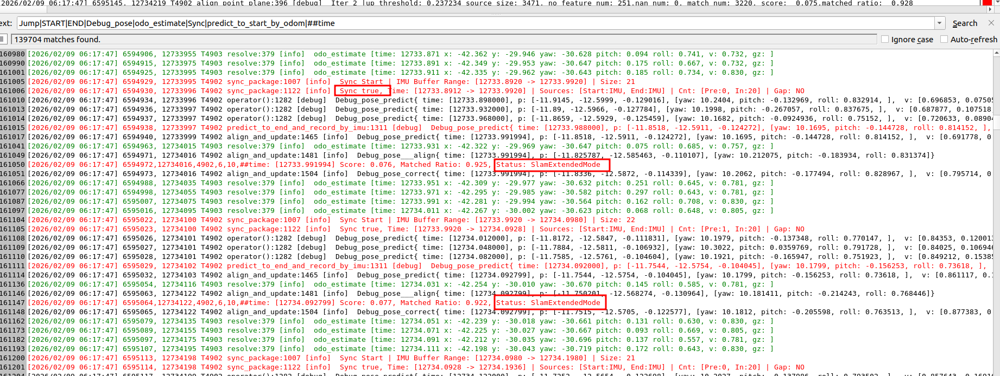
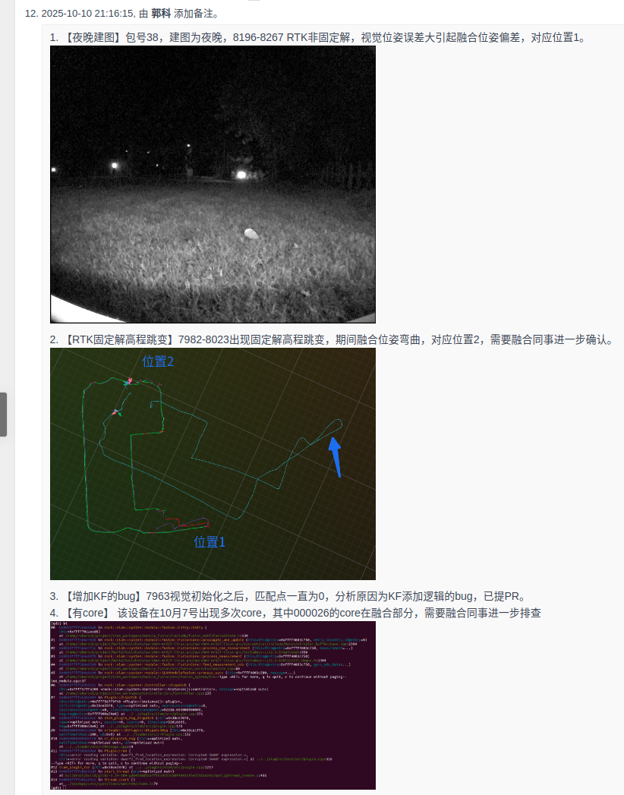
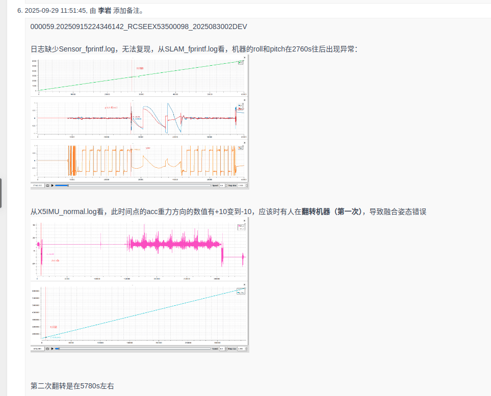
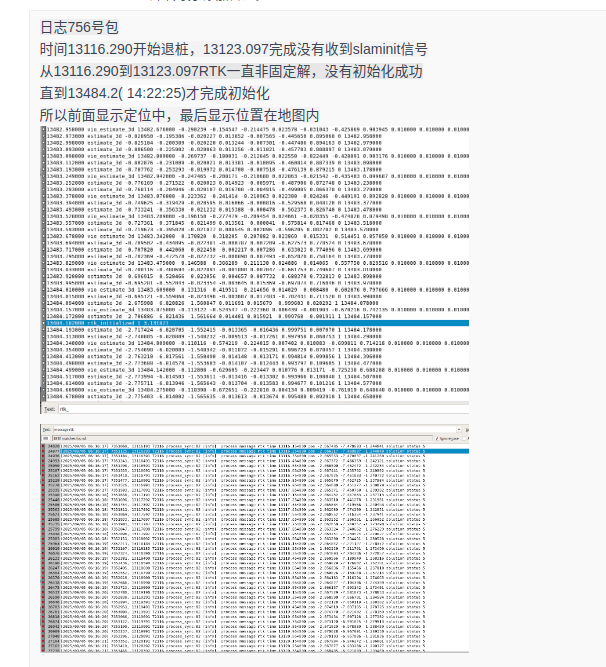
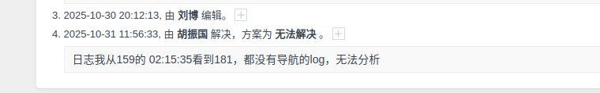
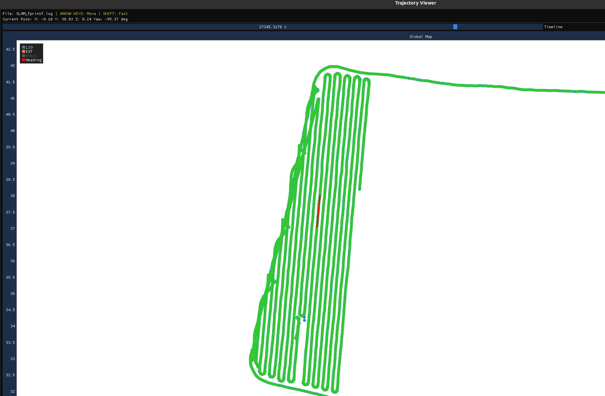
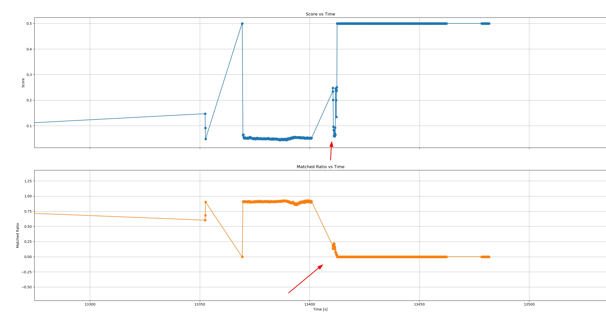
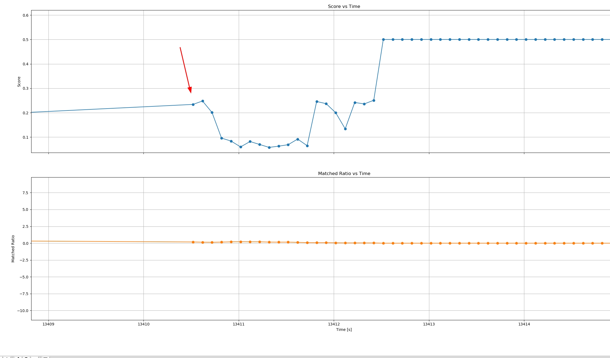
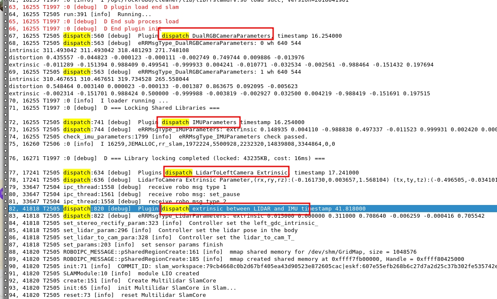
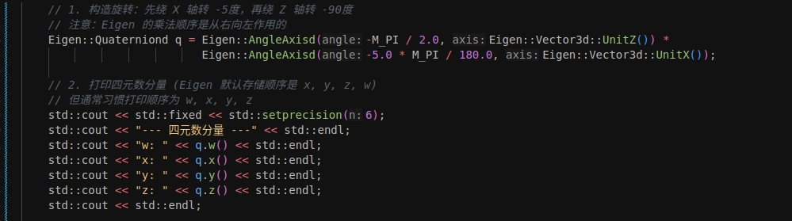

# bug分析步骤-多线slam项目

## 找对时间！是第一步；必要情况需要截图说明

## 1. 分析步骤（原则）

1. **&#x20;先确认时间; 无明确时间和测试同事沟通；**

2. **明确发生的问题：日志中机器的状态判断；+**&#x53EF;以和测试同事沟通

3. 然后**定位问题**，需要仔细分析，结合代码，比较复杂，无固定方法：
   轨迹：printf优先、norm

   关键词过滤：匹配度

时间--normal 9:00  1298998 &#x20;

&#x20;     fprintf

## 2. 关键词过滤：

1. printf过滤：

   &#x20;^((?!estimate\_3d).)\*$

   指令 ---

* printf:

  5. 关键词汇总(完整版本)：

     1. Jump|START|END|Debug\_pose|odo\_estimate|**Sync**|predict\_to\_start\_by\_odom|**#time**|CHECK\_POSE

     2. Gap: Y|START|END|**#time**|Sync

  

  * 关键词含义：

    1. 脏污检测：CHECK\_POSE&#x20;

    2. 指令相关： START|END

    3. **LDS&#x20;**&#x6FC0;光时间，原始的；

    4. Jump  激光 imu的断流相关

    5. \##time：得分变化，机器状态变化，有对应脚本

       \##time: \[12719.174335] Score: 0.072, **Matched Ratio**: 0.923, Status: SlamExtendedMode

    6. 轮速直接：odo\_estimate

    7. 初始化相关：各传感器之间外参：receive SensorParam

  * 组合功能：（少量这里，优先自己总结）

    1. PAUSE|RESUME|odo\_estimate：暂停期间机器是否发生了移动

    2. Jump\_|PAUSE|RESUME：暂停前后 lidar/imu 是否有断流现象

## 3. 轨迹绘制

工具和扫地同一个：/home/mk/tools/butchart/ml\_slam

快捷指令：写入bashrc

alias jx='python3 \~/tools/butchart/butchart\_convertor.py'&#x20;

alias **plot\_score**='python3 /home/mk/tools/butchart/ml\_slam/score.py'

alias pff='/home/mk/tools/butchart/ml\_slam/pf\_ml'

alias pa='python3 \~/tools/butchart/mlslam\_normal\_analyze.py.py'

alias pf='python3 \~/tools/butchart/plot\_mlslam\_fprintf.py'

alias pn='python3 \~/tools/butchart/plot\_mlslam\_normal.py'

1. 日志解析： jx -ml &#x20;

2. 轨迹绘制：pn slam\_normal\* （推举）；pf slam\_fprintf\* ; pff slam\_normal（推举）

## 4. 日志分析必要内容：

1. 日志标注：包号；**&#x20;必要的时候，需要说明和问题发生时间一致；（主要是方便管理自己，别分析错时间了）**

2. 问题发生时候，机器状态，及其分析；

   1. 示例：

   |  |   |
   | ----------------------------------------------------------------------------------- | - |
   |  |   |
   |  |   |

## 5. 确认日志丢失（要和测试同事确认是否是没有上传完毕，或者过了一天后），可以无法解决

## 6.  后续bug 分析案例汇总：

### 6.1 定位跑飞

常见原因，时间异常；dt\_s异常；断流相关的补偿异常；

一、先看轨迹（XY轨迹）

&#x20;        pff或者pf

二、看下匹配度下降位置

三、确定下降回不来的位置，基本定位到出问题的ms激光时间

（**alias pf='python3 \~/tools/butchart/plot\_mlslam\_fprintf.py'**

alias pn='python3 \~/tools/butchart/plot\_mlslam\_normal.py'

alias pff='/home/mk/tools/butchart/ml\_slam/pf\_ml'

**alias plot\_score='python3 /home/mk/tools/butchart/ml\_slam/score.py'**）

四、通过定位时间点再分析前后时刻具体发生的数据记录

### 6.2  机器启动不了：**没有初始化**

**没有初始化**的表现是：只能收到Ipc信息；无COMMIT打印；无ml\_core 参数加载和初始化打印；

一共四个外参，融合两3个：双目两个，双目imu一个；lidar一个； &#x20;

后面鹏飞会和姚远一块，再加一个，lidar和imu的外参

关键词：初始化相关：各传感器之间外参：receive SensorParam

再看其他的，比如LDS关键词没有传感器数据等

##

### 6.3 新项目建图漂移

结合外参文档[ ROBOROCK MOWER 整机参数](https://roborock.feishu.cn/wiki/ZYv2wPQnWiNKnnk5tnmcTFxGn2b?from=from_copylink)，先看外参是否正确；

\[2026/04/01 06:12:04] 126439, 7693591 T2514 dispatch:869 \[info]  receive SensorParam eRRMsgType\_LidarParameters: extrinsic 0.000000 0.000000 0.000000 1.000000 0.000000 0.000000 0.000000

再拿到数据仿真看看，异常

## 7. Bintotext 来源文件夹，解析日志专用：

smb://[192.168.111.103/mowerbuild/Butchart\_TOOL/2026022501PRI/bin](http://192.168.111.103/mowerbuild/Butchart_TOOL/2026022501PRI/bin)
最新的找找

tools替换&#x20;

## 8. 关键词汇总表格

|                                  |                                                |         |       |               |       |   |   |
| -------------------------------- | ---------------------------------------------- | ------- | ----- | ------------- | ----- | - | - |
| 日志定位关键字                          | 日志现象说明                                         | 禅道提示关键词 | Owner | 日志文件名         | 日期    |   |   |
|                                  |                                                |         |       |               |       |   |   |
|                                  |                                                |         |       |               |       |   |   |
| **estimate\_bg**                 | 静止估计的lidar imu角速度bg(静止无明显晃动时125个lidar imu打印一次) |         | 王亚萌   | SLAM\_normal  | 3月13日 |   |   |
| **inited\_angle**                | 建图初始化重力对齐姿态                                    |         | 王亚萌   | SLAM\_fprintf | 3月13日 |   |   |
| Don't align pose with gravity    | 建图初始化时没有重力对齐                                   |         | 王亚萌   | SLAM\_normal  | 3月13日 |   |   |
| odo\_time\_jump                  | odo数据断流                                        |         | 王亚萌   | SLAM\_normal  | 3月13日 |   |   |
| Not found pose2d                 | 没有查找到odo对应时间的pose                              |         | 王亚萌   | SLAM\_normal  | 3月13日 |   |   |
| insert\_odo                      | 断流odo补偿时根据时间段查找odo情况                           |         | 王亚萌   | SLAM\_normal  | 3月13日 |   |   |
| imu\_jump                        | lidar imu断流                                    |         | 王亚萌   | SLAM\_normal  | 3月13日 |   |   |
| inscan\_imu\_jump                | 雷达扫描期间imu断流                                    |         | 王亚萌   | SLAM\_normal  | 3月13日 |   |   |
| prescan\_imu\_jump               | 当前雷达start之前imu断流                               |         | 王亚萌   | SLAM\_normal  | 3月13日 |   |   |
| lidar\_end\_to\_final\_imu       | lidar end之前的imu断流                              |         | 王亚萌   | SLAM\_normal  | 3月13日 |   |   |
| with\_odo                        | 查看断流时odo补偿时间段等信息                               |         | 王亚萌   | SLAM\_normal  | 3月13日 |   |   |
| odo\_delta\_pose                 | odo补偿的delta pose                               |         | 王亚萌   | SLAM\_normal  | 3月13日 |   |   |
| predict\_to\_start\_by\_odom     | odo补偿到当前lidar start时刻                          |         | 王亚萌   | SLAM\_normal  | 3月13日 |   |   |
| predict\_to\_end\_by\_odom       | odo补偿到当前lidar end时刻                            |         | 王亚萌   | SLAM\_normal  | 3月13日 |   |   |
| **stationary**                   | **移动转静止时打印一次**                                 |         | 王亚萌   | SLAM\_normal  | 3月13日 |   |   |
| **moving**                       | **静止转移动时打印一次**                                 |         | 王亚萌   | SLAM\_normal  | 3月13日 |   |   |
| odo\_estimate                    |                                                |         |       |               |       |   |   |
|                                  |                                                |         |       |               |       |   |   |
|                                  |                                                |         |       |               |       |   |   |
| slam\_environment\_mode          | 是否进入展会模式                                       |         | 李鹏飞   | SLAM\_fprintf | 3月13日 |   |   |
| receive\_SensorParam             | 传感器、body之间外参                                   |         | 李鹏飞   | SLAM\_normal  | 3月13日 |   |   |
| Jump\_LDS                        | 监控雷达是否断流                                       |         | 李鹏飞   | SLAM\_normal  | 3月13日 |   |   |
|                                  |                                                |         |       |               |       |   |   |
| LIDAR CHECK END                  | 激光雷达是否脏污                                       |         | 周士伟   | SLAM\_normal  |       |   |   |
| LOAD\_MAP END                    | 地图加载是否失败                                       |         | 明坤    | SLAM\_normal  | 3月13日 |   |   |
| SET SLAM MODE END                | 模式切换是否失败                                       |         | 明坤    | SLAM\_normal  | 3月13日 |   |   |
| RELOCATE\_CALCULATE END          | 重定位是否失败                                        |         | 周士伟   | SLAM\_normal  | 3月13日 |   |   |
| SET\_POSE\_3D END                | 局部重定位是否失败                                      |         | 周士伟   | SLAM\_normal  | 3月13日 |   |   |
| COMMIT\_ID                       | 对应代码哈希                                         |         | 明坤    | SLAM\_normal  | 3月13日 |   |   |
| CANCEL RELOCATE\_ACC\_LOCAL\_MAP | 取消重定位                                          |         | 闫冬    | SLAM\_normal  | 3月13日 |   |   |

