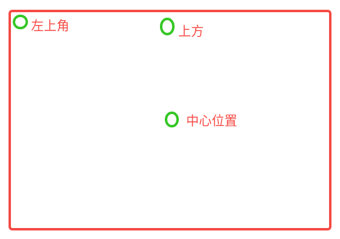
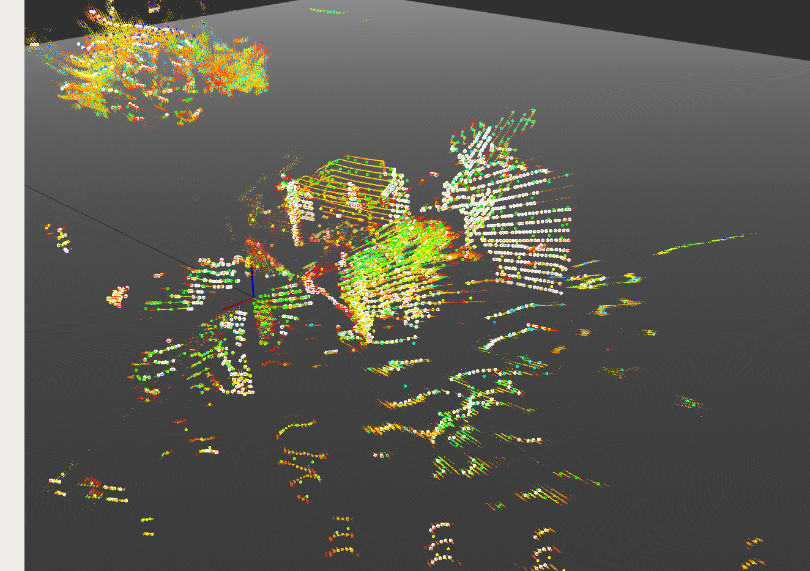
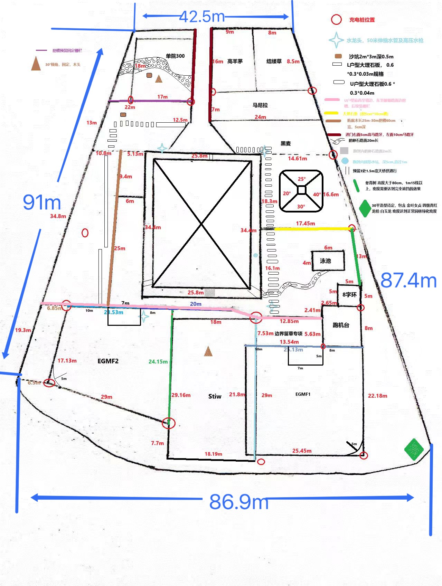
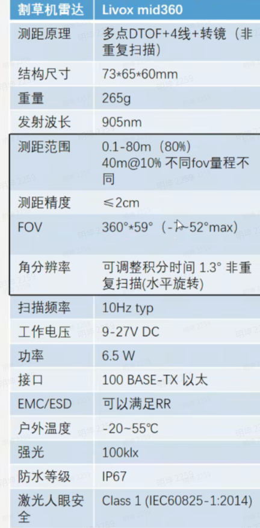
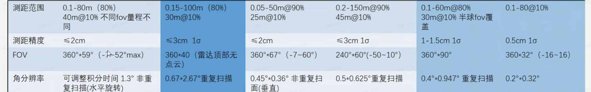

# 割草机slam激光雷达需求

## 一、激光雷达规格需求(以优先级排序)

### **有地面点 --P0**

负角度 ＞5° &#x20;

### **距离精度&准度 --P0**

准度：<15m 测距准度＜5cm       ＞15m  测距准度＜0.3%

精度（波动）： 全量程各距离标准差 ＜3cm &#x20;

**测试方法：**

白板标靶： 3m×3m

计算方式：采集连续两帧数据，选区落在标靶上的点，拟合平面

1. 测距距离 = 原点到拟合平面的距离

2. 测距标准差 = 所有点云到平面的距离计算标准差

**备注：**

1. 针对近距离，例如2m内（标靶能覆盖大部分fov），直接按照上述方案拟合平面即可。

2. 2m-15m中距离，标靶只能覆盖部分fov，需要通过旋转模组，分别测试正中心平面，正上方平面，左上方平面的平面情况，三个区域分别按照上述方案拟合平面即可。三个区域如下图所示：

   | 左上 | 上方 |   |
   | -- | -- | - |
   |    | 中心 |   |
   |    |    |   |

ps：假设左右以及上下点云生成原理相似，点云质量相同，故只测试三个平面即可。 如果大量测试表明整个平面的点云质量不受方位影响，那么可以只测试中心区域即可。

* ＞15m 远距离

由于距离远标靶面积小，落在标靶上的点云数量少，可以实验看看拟合平面是否准确，如果点云拟合平面准确，可以按照中距离的方案验证精度和准度。 若无法拟合平面，或者平面拟合的误差大，可以采样多帧，累积更多的点云进行平面拟合。如果还是无法拟合平面，那么可以使用多次单点测距来验证精度和准度，具体方案如下：

1、选取固定位置的单点测距数据，连续采样30次，计算均值和标准差。

2、选取的固定点位位置如下图所示：

ps：仍然做了假设，左右、上下区域点云质量相同。

参考：

禾赛精度： 全量成 3cm以内（1 sigma）

mid360精度： 3cm以内 （1 sigma）

蓝海精度： 50m量程内 小于3cm（1 sigma）

### **点云质量 --P0**

* **无MPI**

测试方法：正对直角墙壁，观察直角墙壁的点云情况，拟合两个垂直的直角平面，计算标准差。

测试距离：2m 5m 10m 15m

标准：

（1）两个拟合的墙面夹角＞89° 且＜91°

（2）两个拟合平面的标准差小于3cm

* **抗干扰能力**：直射阳光、雨雾、树叶等（尤其是雨滴对激光雷达的干扰，目前看起来很严重。需要产品确认，**下雨时或下雨后，是否需要割草**？）

* **无明显拖影，和测距不准**:[ 速腾airy和mid360 +禾赛对比分析](https://roborock.feishu.cn/wiki/GI8uwkO2ViDRm2k9akLcQk00nUc?from=from_copylink)参考速腾airy器件，拖影问题；

  * 速腾airy 的拖影，波动幅度达到0.5m \~ 2m（这个其实远超测距精度spec）

边缘点多一列，1度变1.5度；角度非运动畸变；不超过一个角分辨率；拖影

### **测距量程 --P0**

* **量程**： 40 m （10% 反射率下的测程);  70m/(80%反射率)

* **需求来源**：

  * 产品改需求为3000平米，咱们拍脑袋50m\*60m。这里的面积为草地面积，实际建图面积（点云覆盖的面积）可能更大。

  * 105场地，点云覆盖的面积：

    上下108m\*左右87m

  

补充： 目标物大小  [ mid360 远点的情况](https://roborock.feishu.cn/wiki/RzKKwyiFUieA77k7bZYcKjt6nhS?from=from_copylink)

### **延时 --P1**

&#x20; 雷达帧的最后一个点（时间戳t1），获取、解算、传输，到slam（时间戳t2）延时，控制在160ms以内（t2-t1<=160ms）；Mid360为参考，到驱动的延时是40ms；

原因：

1. 之前扫地机对延时的主要需求来自避障，对割草机项目，激光雷达不是避障传感器

### **分辨率 --P1**

* **水平角分辨率**：1度（我们还没有摸测过）

* **垂直角分辨率**：

  * **以线数衡量:  20线**（我们还没有摸测过）

自研： 水平1°， 线数垂直 20线

### **FOV --P1**

* **水平 FOV**：360° 或近似

* **垂直 FOV**：-7° 到 +40\~+45°左右；（正角度我们还没有摸测过）

  * 负角度对应地面点云需求

### **帧率 --P1**

* **频率**：10Hz（最低可能可以接受5HZ，5Hz我们还没有摸测过）

  * 过低的频率可能对运动补偿要求更高，IMU的选型不能太便宜

  * 速腾的imu效果比较好，可以参考

自研lds： 10hz能满足

### **盲区 --P1**

* **盲区**： ≤ 0.15 m，用于近距离检测

### **其他 --P0**

* 必须有时间同步的方案，例如秒脉冲

* 每包点云包含信息：

  * x y z&#x20;

  * 强度

  * 反射率&#x20;

  * 采样时间（或者一包数据一个采样时间，用于运动补偿）

* IMU需求

  * imu和激光雷达的外参标定

  * imu的内参标定：零偏、尺度因子、正交系数（可讨论，激光项目中还在验证这几个内参的必要性）

遗留问题：

* 定位模式和建图模式对激光雷达的需求有区别吗？

### **参考器件**

### 1. mid360参数

Q1： 100k lux下的测距量程是spec中说的80m嘛？ &#x20;

mid360 在100klux下可以保证在规格书标称精度内；但是可能会在量程外有个别随机噪点，噪点比较远，在测距范围外，基本不影响；

### 2. 其激光雷达的大致范围：

