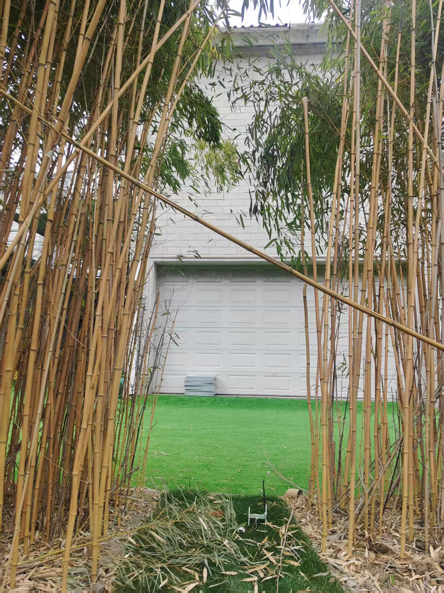
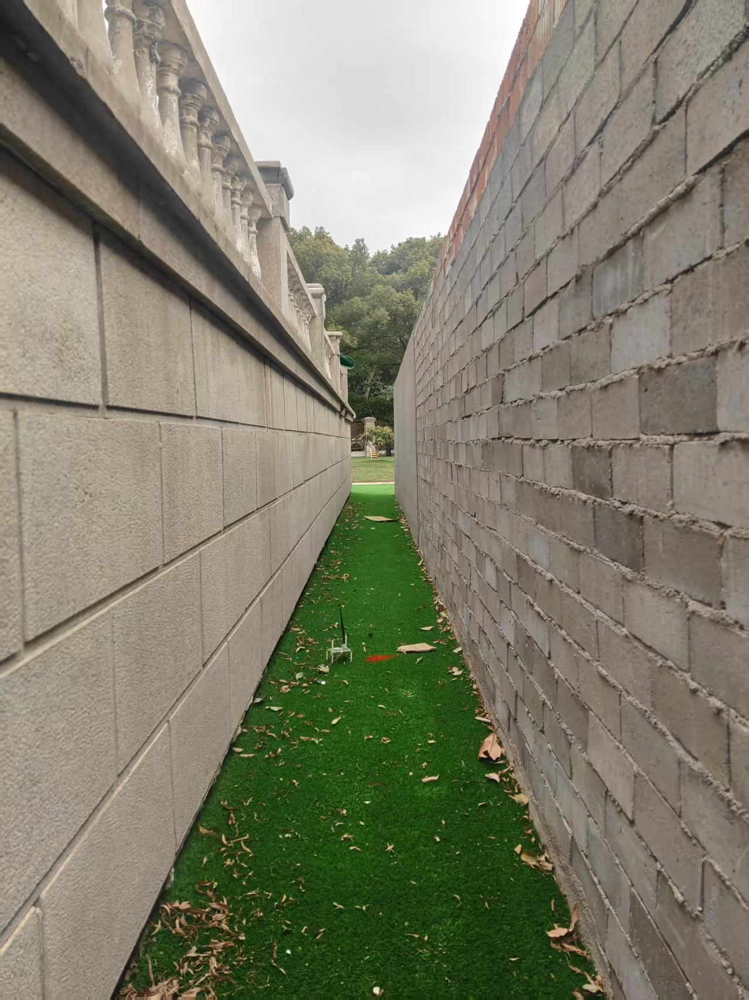

# 激光follow测试方案

# 简介：

&#x20;  目的：摸底slam系统的场景特性；

&#x20;   采集方法：[ slam采集需求](https://roborock.feishu.cn/wiki/A1YewlrXVikKI1kbzGSc6guXnfe?from=from_copylink)和之前相同，遥控采集即可，速度遥控的正常速度就行；

&#x20;   采集数据后，需要注明场地；每组数据需要单独一个包；

1-16项，tr4采集；其余后续再讨论

# 一 、测试场景

**天气要求**：白天有阳光  / 小雨 / 雨后&#x20;

**场景及采集方式：**

| 序号       | 场景描述                        | 场景图片                                                                                 | 采集方式：1和2是两组不同的数据，需单独一个包；                                      |                   |
| -------- | --------------------------- | ------------------------------------------------------------------------------------ | ------------------------------------------------------------- | ----------------- |
| 1        | 空旷（105别墅）                   |  | 1.静止3分钟，然后原地旋转一圈&#xA;2.走一个2\*2米的方形                            |                   |
| 2        | 树林  （105别墅）                 |  | 1.沿着树林行驶进行数据采集，这块的树的间隙都走一下（**阳光/ 雨后** 各一组）&#xA;2.走一个2\*2米的方形； |                   |
| 3        |  大面积水边（泳池或湖边）（105别墅）        |  | 1.沿着河边进行数据采集2. 走一个2\*2米的方形                                    |                   |
| 4        | 单边墙 （篱笆）（105别墅）             |  | 1.沿着单边墙行驶进行数据采集2.走一个2\*2米的方形                                  |                   |
| 5        | 单边墙  （围墙 带树林）（105别墅）        |  | 1.沿着单边墙行驶进行数据采集2.走一个2\*2米的方形                                  |                   |
| 6        |  L型角落（一面墙，一面灌木）（105别墅）      |  | 1.行驶L型轨迹进行数据采集2.走一个2\*2米的方形                                   |                   |
| 7        | 窄通道（双面竹林）（78别墅）             |  | 1.沿着宅通道行驶进行数据采集2.走一个走个小圈；                                     |                   |
| 8        | 窄通道（双面墙）（78别墅）              |  | 沿着宅通道行驶进行数据采集                                                 |                   |
| 9        | 坡上                          | 78的坡较高，可以                                                                            | 坡上走一个2\*2的方形                                                  |                   |
| 11       | 高反                          | 高反板子？**贴纸贴**墙上；&#xA;~~不锈钢；~~&#xA;                                                    | 静止3分钟，然后走一圈                                                   |                   |
| 12       | 玻璃材料，有对应测试房间？               |                                                                                      | 静止3分钟，然后走一圈                                                   |                   |
| 13       | **雨：下雨即可**                  | 最好整个场地走一下78/105均可                                                                    | **静止3分钟，然后走一圈**                                               |                   |
| 14       | 强光                          | 最好整个场地走一下78/105均可                                                                    | 静止3分钟，然后走一圈                                                   |                   |
| 15       | 雾：模拟这个                      | 最好整个场地走一下                                                                            | 静止3分钟，然后走一圈                                                   |                   |
| 16       | 只有铁丝网的后院场景：&#xA;后院无限大？没有实体墙 | **铁丝网，尼龙网；人工篱笆**                                                                     | 静止3分钟，然后走一圈                                                   |                   |
|          |                             |                                                                                      |                                                               |                   |
|          |                             |                                                                                      |                                                               |                   |
|          |                             |                                                                                      |                                                               |                   |
|          |                             |                                                                                      |                                                               |                   |
|          |                             |                                                                                      |                                                               |                   |
|          |                             |                                                                                      |                                                               |                   |
|          |                             |                                                                                      |                                                               |                   |
|          |                             |                                                                                      |                                                               |                   |
|          |                             |                                                                                      |                                                               |                   |
|          |                             |                                                                                      |                                                               |                   |
| tr4之后即可？ | 整机测试？？？                     | =======================                                                              | ================================                              | ================= |
| ~~硬件测试~~ | ~~高温：45，实验条件~~~~脏污~~        | ~~看看对点云影响？~~                                                                         |                                                               |                   |
| ~~脏污~~   | ~~种类大小，草zhi，树叶~~            | ~~面积占比？~~                                                                            |                                                               |                   |
|          |                             | 反光地砖                                                                                 |                                                               |                   |
|          |                             | 反光水塘                                                                                 |                                                               |                   |
|          |                             | 橡胶轮胎                                                                                 |                                                               |                   |
|          | 悬空障碍                        | 蹦床，秋千，树枝下垂；灌木；&#xA;&#xA;沿边是否有问题；                                                     |                                                               |                   |
|          |                             | **铁丝网，尼龙网；人工篱笆**                                                                     | 近处要看到，避障？                                                     | 后院无限大？只有铁丝网？的场景   |
|          |                             | 玻璃**阳光房**                                                                            |                                                               |                   |
|          |                             | 颠簸路面：鹅卵石                                                                             |                                                               |                   |
|          |                             |                                                                                      |                                                               |                   |
|          |                             |                                                                                      |                                                               |                   |
|          |                             |                                                                                      |                                                               |                   |
|          |                             |                                                                                      |                                                               |                   |
|          |                             |                                                                                      |                                                               |                   |
|          |                             |                                                                                      |                                                               |                   |

&#x20;              &#x20;

用哪个雷达罩子采集？等最后结论

&#x20;      &#x20;
