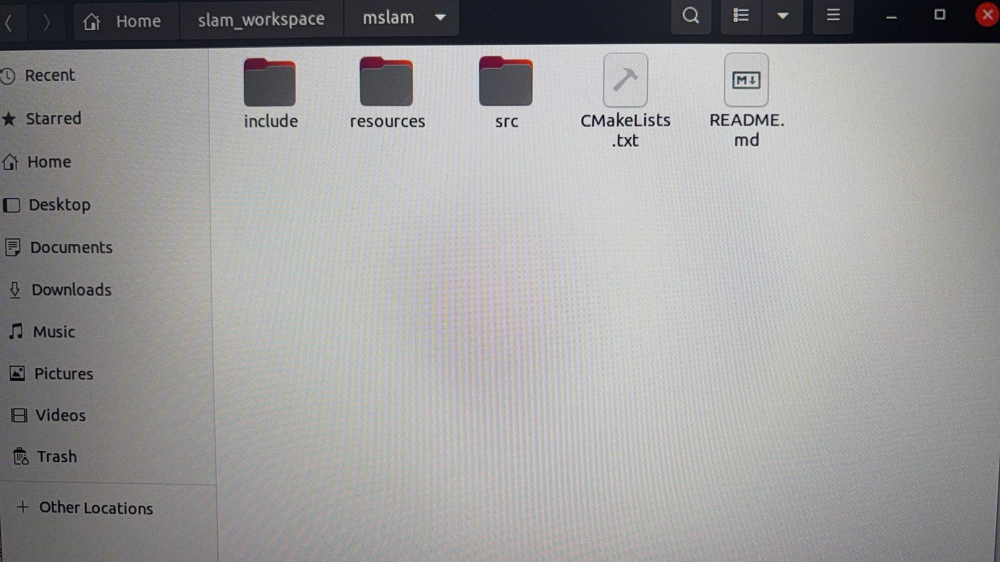
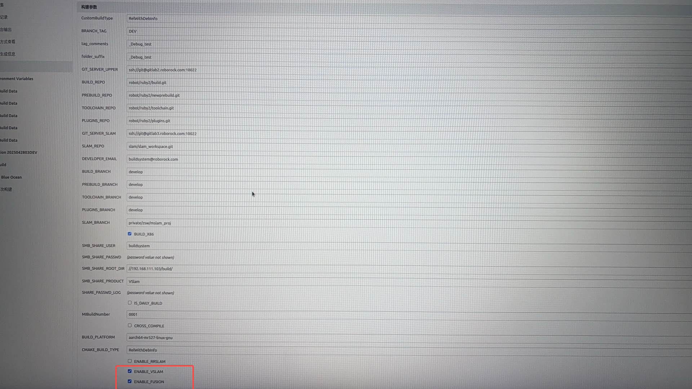
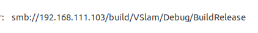
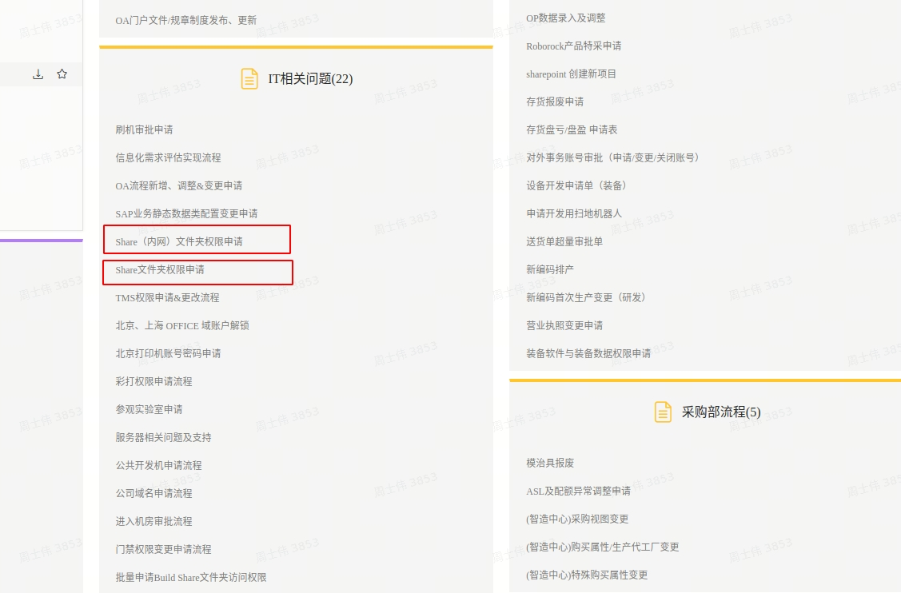
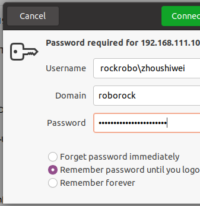
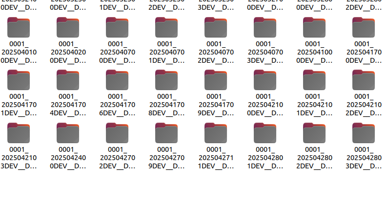
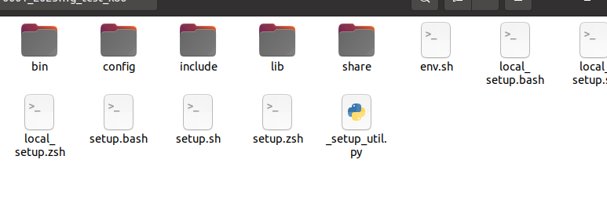
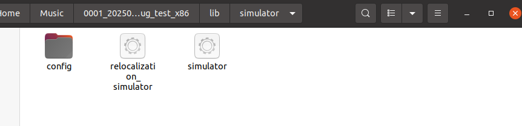
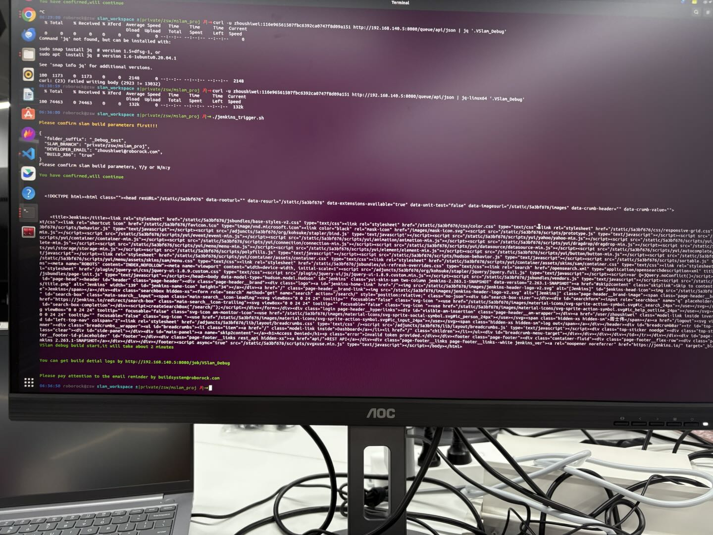

# mslam-jenkins构建

## **1.多线激光slam分支已梳理为slam\_workspace架构**

详见分支：

gitlab3.roborock.com/slam/slam\_workspace（private/zsw/mslam\_proj）

如需要增加模块，相关格式参照分支内mslam具体格式，拆分为以下目录格式：

## **2.编译jenkisn地址**

mslam编译jenkins同vslam:

192.168.140.5:8080/job/VSlam\_debug

如果没有权限，直接找李琳开通

打开之后，参数设置如下：

SLAM\_BRANCH填写编译分支（不要单独另外开repo，直接在slam\_workspace下面建分支）：

下面两个打勾的必须选上，否则在共享盘下面生成不了软件&#x5305;**（亲测坑）**

参数设置完毕以后，直接构建就行。

## **3.拿取软件包**

软件包放在共享盘下：

没有权限的话，走流程：

流程走完之后：

登陆时候账号，密码如下：

密码就是域账号密码。

## **4.软件包内部内容**

如上即为软件包具体信息。

## **5.软件包使用**

Jenkins默认在ubuntu18.04下面编译，仿真包为ros melodic格式，依赖库都是ubuntu18.04的，20.04环境配置麻烦，建议在18.04的系统下运行：

将软件包复制到自己的home目录下：

进入lib/simulator下，所见如下：

其中relocalization\_simulator为重定位可执行文件，simulator为重定位可执行文件，config为算法配置目录：

修改config目录下的bag包和pcd文件路径为自己的路径即可。

然后在lib/simulator下运&#x884C;**（务必在该目录下运行）**：

./relocalization或者./simulator即可。

## **6.脚本触发(由于公司未配置，脚本无法触发，需要从网页端触发)**

触发脚本如下：

这个脚本在触发别的项目都没问题，但是在触发Vslam\_debug时，在向Jenkins请求时，就会有下面的报错返回：

这个地方还需要向李琳确认下，这个项目是否开启了远程触发的权限。

