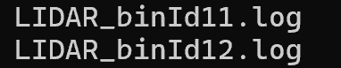
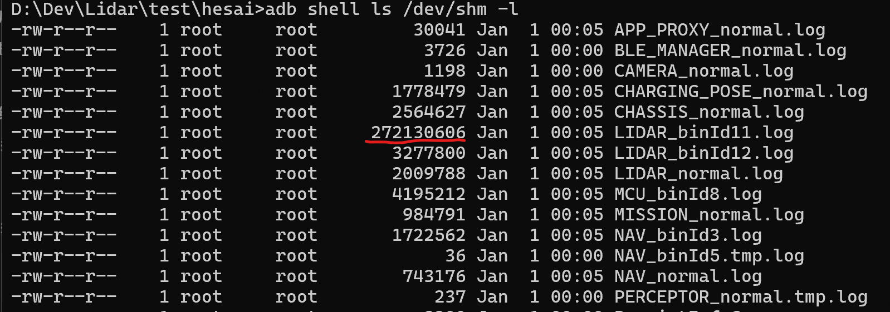
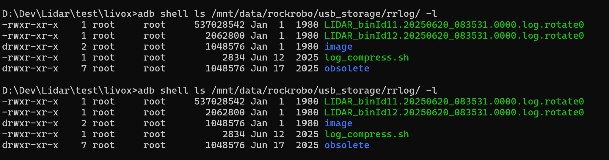
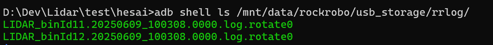
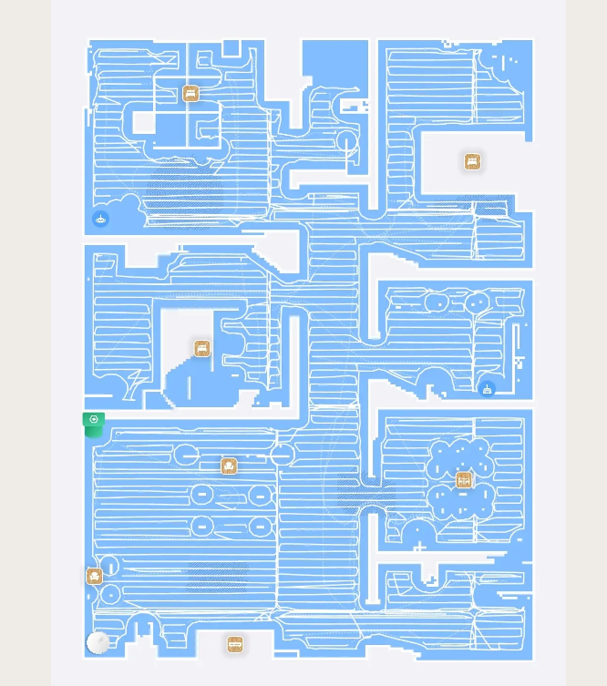

# slam采集需求

## 1. 我们这边需求的顺序：

1. 李鹏飞和姚远联调完成；（block）

   1. ~~三个雷达不能同时支持；~~

   2. ~~**没办法采超过1分钟数据；**~~

   3. ~~**提供1分钟数据和李鹏飞联调；**~~

   4. ~~时间同步多久能完成？软同步是否可靠~~

2. 选一个场景即可，采集一组数据，看下slam情况；采集的行走需求可以提供，其他场景没有特殊要求；

3. **为了验证雷达选型的场景：最好也是选固定场景，起始点固定；具体场景数量和情况，OLU型具体能创造哪些；可以以现有的为准；**

## 2. 采集方法

### 采集：

如果插有U盘，激光雷达相关数据会自动采集到U盘上，如没有U盘，会存储到/mnt/data/rockrobo/devtest。以下以插U盘为例。

雷达相关数据分为点云和imu，分别在LIDAR\_binId11.log和LIDAR\_binId12.log。由于点云数据庞大，每秒有15M左右数据产生。每当点云数据达到500M，会将两个bin log从/dev/shm转存到U盘（/mnt/data/rockrobo/usb\_storage/rrlog/）或/mnt/data/rockrobo/devtest下。

由于数据量很大，建议采用大容量U盘，且每次采集前我们需要将上一次的雷达数据清除，否则可能使得本次采集数据覆盖失效。~~例如采集10分钟就能产生约10G数据，而/mnt/data/rockrobo/devtest有27G左右空间，采集超过30分钟很可能使得本次采集失效，切记！~~

由于没有雷达软开关，上电后雷达自动工作。但速腾有航插头，在未开始采集或采集结束时，我们可以将连接雷达的航插头拔下来。以下是采集步骤（adb 或 rradb default）

1. 停止进程

`adb shell killall -SIGUSR2 WatchDoge`

* 清除之前存在的U盘中的雷达数据

`adb shell ls /mnt/data/rockrobo/usb_storage/rrlog/`

`adb shell rm -r /mnt/data/rockrobo/usb_storage/rrlog/LIDAR_binId*`

清除之前的log

`adb shell rm -rf /mnt/data/rockrobo/devtest/*`

* 确保航插头连接好，贴近激光雷达能听到转动的声音。重启机

`adb shell reboot`

* 重启后观察 /dev/shm路径下是否有LIDAR\_binId11.log和LIDAR\_binId12.log产生。tail LIDAR\_normal.log看是否正常输出数据，如果有数据一直输出表面正常。

`adb shell ls /dev/shm`

`adb shell tail -F /dev/shm/LIDAR_normal.log`

如果有这两个bin log，说明雷达数据已经开始记录。当/dev/shm Used大于500M之后就差不多可以看U盘中是否有雷达bin log了

`adb shell ls /mnt/data/rockrobo/usb_storage/rrlog/`

* 断开adb连接，开始用蓝牙遥控跑case

* 跑完之后，连接adb，查看U盘中的log，需确认binId11和binId12数量一致，确认最后一包数据无缺漏。

`adb shell ls /mnt/data/rockrobo/usb_storage/rrlog/`

* 有时最后一包不到~~512M~~预定的打包大小，就不会将/dev/shm下面的bin log转存到U盘。所以需要查看LIDAR\_binId11.log到达50M之后，重命名为以rotate结尾的文件之后，再查看U盘路径下是否转存成功。

`adb shell ls /dev/shm -l `

例如下面存到270M（此时预定大小为500M），需要等待binId11更名为rotate结尾的文件，再查看U盘路径是否有同名文件出现，出现表明采集及转存完成。

`adb shell ls /mnt/data/rockrobo/usb_storage/rrlog/`

在采完的那一刻，假如U盘中存在着后缀rotate0\~19的binId11和binId12。那么需要等待binId11.rotate20以及binId12.rotate20出现在U盘中，**且大小不再增大**。**注意：在这两个文件出现之后，关看门狗，**&#x4EE5;防新生成数据以及拉取devtest对U盘下的数据产生影&#x54CD;**。**

`adb shell killall -SIGUSR2 WatchDoge`

* 拉取`/mnt/data/rockrobo/devtest/`下的log。这里的log可以用于查看行走速度角速度等是否符合要求，以及其他交叉验证。

等待出现日志包后

`adb pull /mnt/data/rockrobo/devtest/`

### 数据处理：

U盘中的数据与log\_compress.sh于同一目录下，./log\_compress.sh运行即可打包。

### 开发数据处理

拿到的数据是LIDAR\_binId11.tar（点云）以及LIDAR\_binId12.tar（lidar imu），需要使用\\\10.250.4.29\build\Mower\Butchart\_TOOL中的工具log\_merge.sh以及BinToText来进行处理，方可得到txt形式的点云和imu数据。

在linux环境下，将脚本和数据放置同一目录，先后运行log\_merge.sh和BinToText

`./log_merge.sh`

`./BinToText`

解析之后的txt内容如下

LIDAR\_PointCLoud\_fprintf.log：

*rr\_msg\_lidar\_point\_data\_t* 报头部分

| ap timestamp | type  | point\_num | height | width  | is\_dense | Lidartimestamp | seq | frame\_id |
| ------------ | ----- | ---------- | ------ | ------ | --------- | -------------- | --- | --------- |
| 25912        | lidar | 10296      | 0(默认值) | 0(默认值) | 0(默认值)    | 25.912         | 0   | livox     |

*rr\_msg\_lidar\_point\_data\_t* points部分

| x (m)        | y (m)       | z (m)     | intensity | ring    | timestamp\_offset | tag |
| ------------ | ----------- | --------- | --------- | ------- | ----------------- | --- |
| 1.241000     | -34.249001  | 11.167000 | 10        | 0 (默认值) | 0.000069          |  0  |

注：tag参考livox定义

LIDAR\_Imu\_fprintf.log：

| Imu timestamp | type | ax (m/s2) | ay (m/s2) | az (m/s2) | vx (rad/s) | vy (rad/s) | vz (rad/s) | ox       | oy        | oz        | ow       |
| ------------- | ---- | --------- | --------- | --------- | ---------- | ---------- | ---------- | -------- | --------- | --------- | -------- |
| 25914         | imu  | 0.115046  | -0.690224 | 9.986226  | -0.016465  | -0.006794  | -0.001504  | 0.000000 |  0.000000 |  0.000000 | 1.000000 |

Timestamp&#x20;

## 3. slam初步验证的采集需求：

**测试前置条件：**&#x7B49;李鹏飞和姚远联调完成；保证数据有效性之后，才能开展；具体**出包需要姚远提供**；

**测试目的**：1. 采集一组数据，看下slam情况；场景没有特殊要求；

&#x20;                      2\. 选型评估，以下场景；

**参考场景（场景无特殊要求）**：面积尽可能在40\*60平方米左右的范围，采集数据的过程中尽可能多走小回环；此外，如果有长走廊场景也请多录制几组相关场景数据，有利于验证算法模块在退化场景下的性能表现。

1. 定位和建图场景示意图

2. 105整个场景跑一遍（沿边建图/定位/坡道）

3. 走廊场景-狭窄通道 78 ~~or105~~都有

* 落地窗场景：建筑物旁边布置一块玻璃测试（非强需求，优先级调低，有条件可以测试）

*

**机器要求**：同一款雷达测试的功能测试，比如建图和定位等数据采集必须用同一台机器同一个雷达完成；

**行驶速度等要求**：用遥控模式（遥控是否支持，能遥控最好遥控），小车行走中速度不要过快，尤其在转弯处。尽可能平稳（不高于：行走速度分别用0.6m/s和0.8m/s, 转弯速度40°/s 已确认Log存在）。过大的角速度对于验证算法的有效性，产生很大影响。

**初步验证的采集路径要求**：

1. 行驶轨迹，沿边建图；但是要有适当环路；上述两个场分别走一圈；

2. 每次测试机器起始点要一致，机器的起始朝向和行驶轨迹大致重合（建议在场景画起始标志）

3. 建图数据采集路径走沿边，参考一代机路径规划；

4. 定位数据采集路径走弓字，参考一代机路径规划；

**天气要求**：白天有阳光/夜晚/下雨

| 器件            | **场地** | 建图/定位 | 数据： |   |
| ------------- | ------ | ----- | --- | - |
| 速腾\*\*\*lidar | 78     | 建图    |     |   |
| 速腾\*\*\*lidar | 1      | 定位    |     |   |
|               |        |       |     |   |

