# Versa割草机 core dump问题的定位与查询

## 1. 建议

建议：

1. 为便于统一分析，在本地创建bug/(编号)的文件夹

2. 然后建立子文件夹：bug/(编号)/core

## 2. core日志，放在bug/(编号)下

* 日志压缩包，解压（butchart\_convertor.py）:

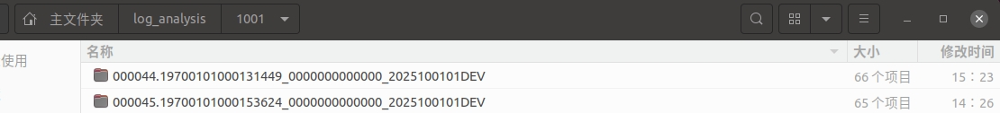

* 说明 “l\_s\_”开头的是slam相关的core文件（名字中带有“map”的是一个“假”的core文件，略过）。

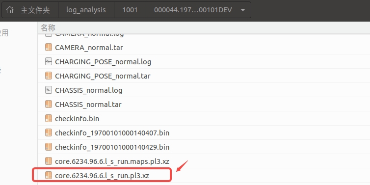

* 创建bug/(编号)/core文件夹，拷贝core文件到bug/(编号)/core；

* 解压core文件，生成data文件；

*

## 3. core文件加载和解析

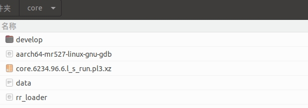

### 3.1  gdb工具

下载到core工具文件夹

###

### 3.2 上层软件包：

1. &#x20;根据日志后缀 和包对应名称一致性；从服务器上远程拉取对应上层软件包。

   日志：000044.19700101000131449\_0000000000000\_2025100101DEV

   上层包：0315\_2025100101DEV\_RelWithDebInfo\_EnSeboot\_debug\_with\_image\_taskid\_115663

* 上层软件包地址：

&#x20;  smb://192.168.111.103/build/Versa/FULLTEST/

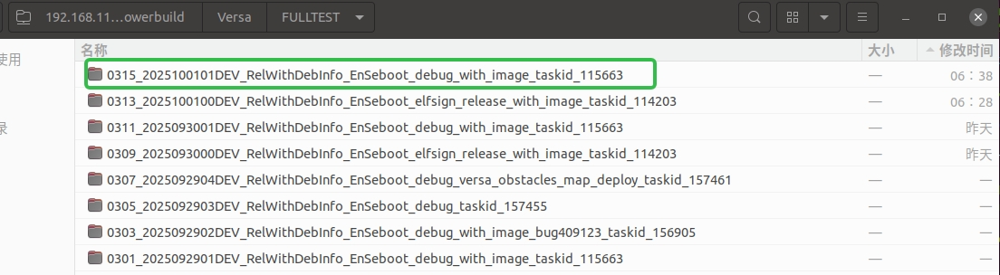

拷贝到bug/(编号)/core/下面，命名为develop，如下：

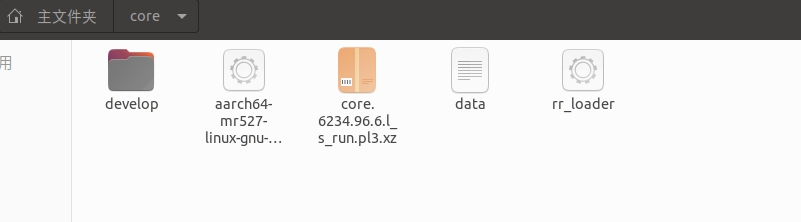

* rrloader将develop/opt/rockrobo/cleaner/bin/rrloader目录下的rrloader文件，拷贝到core文件夹下。

### 3.3 镜像文件

1. 镜像地址：

&#x20;      smb://192.168.111.103/build/Versa/DEVELOPER/对应时间的镜像文件/SDK/sdk.tgz，如下：

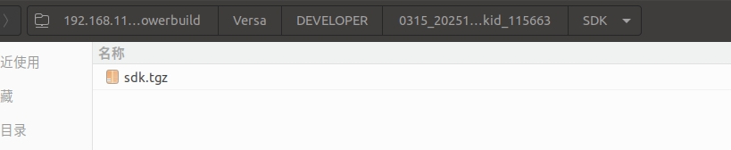

拷贝到core文件夹(或其他文件夹)，并解压为

### 3.4 关联镜像和core文件查看

#### 3.4.1 加载core文件，执行命令：./aarch64-mr527-linux-gnu-gdb rr\_loader data

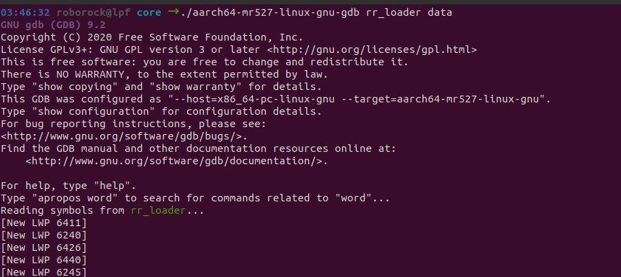

执行之后：

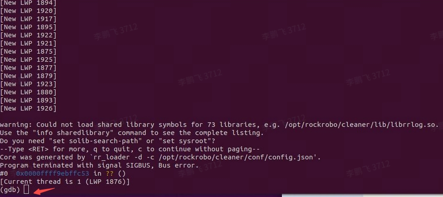

在 (gdb) 后面输入：set sysroot /home/roborock/tools/sdk/rootfs/ ：

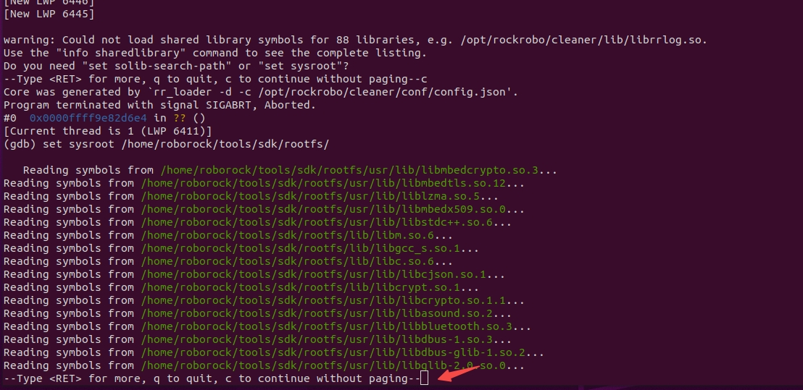

#### 3.4.2 加载上层软件：输入：

&#x20;       set solib-search-path /home/roborock/core/develop/opt/rockrobo/cleaner/lib，结果如下：

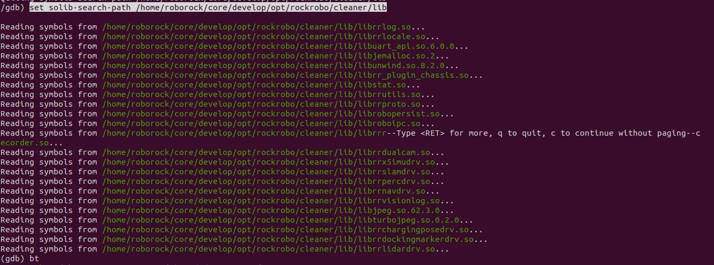

#### 3.4.3 具体core定位：

1. 基础：在(gdb) 后面输入指令：bt，初步定位，查找我们的程序core

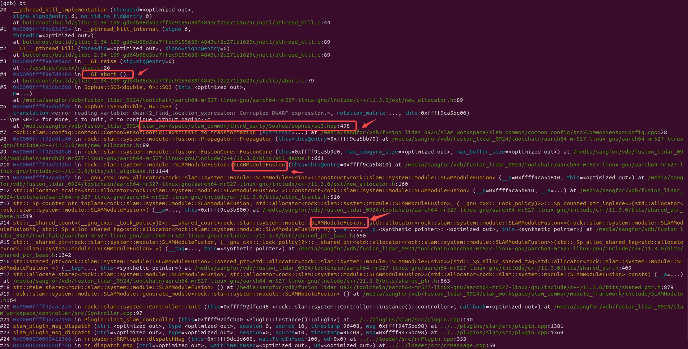

通过从下往上层层查找，我们可以看到，是slam\_common中的一个名叫se3.hpp头文件中的line498行除了问题，我们可以在内网机中更新develop分支最新的slam\_common代码后，找到这个文件进一步查找详细原因。

