# 重定位代码解析

# **1.特征提取**

# **（1）非地面点提取**

相比Tio里的重定位算法，当前第一步就是要去除地面点，原因便是在大场景中，地面点的密度一般比较高，但是后面在做描述子粗匹配的过程中，用的是类似link-3D的方案，示意图如下：

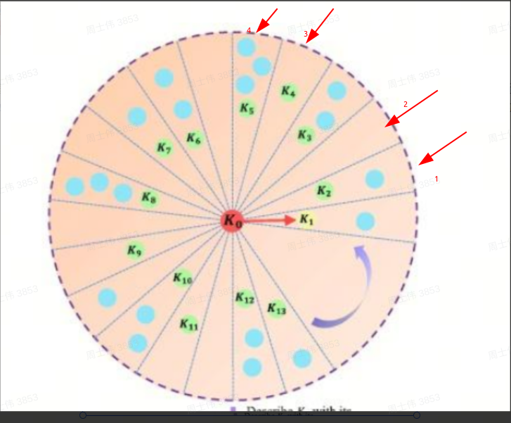

这里的描述子分为方向描述子和距离描述子。从距离描述子来看，对于两个不同的Ko点来说，地面点密度比较大，比较区域内的距离描述子（取最近点）极有可能一样，同理方向描述子（主方向之间的差值）因为地面点主方向都向上，没有任何区分度。因为这两个原因，便会使得点的粗匹配产生很多的误匹配，影响效果。

非地面点提取这里之前采用了多个方法，第一种方法，利用非平面点的法向量与（0，0，1）之间的夹角过滤掉地面点，然后将物体划分到不同的扇形中，分成不同的簇，再求簇的分布主方向，利用主方向来划分树干等。

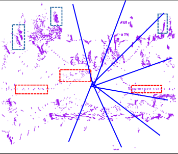

但是这种方法，能区分的很有限，且扇形画的太大有粘连，划的太小，有缺失，不怎么好用，最大的问题的是，这种方法不适用坡度，会将坡度当成障碍物划分进去，如下场景：

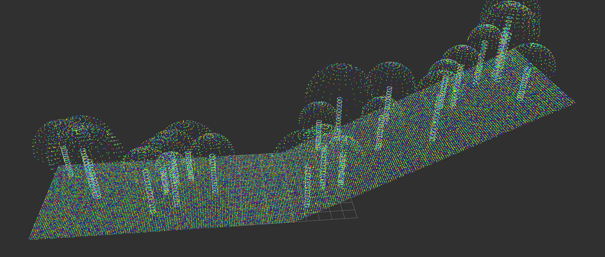

后面利用地面起伏线的方式，可以比较灵活的适应坡度：

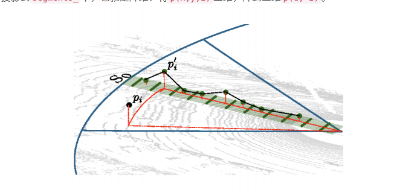

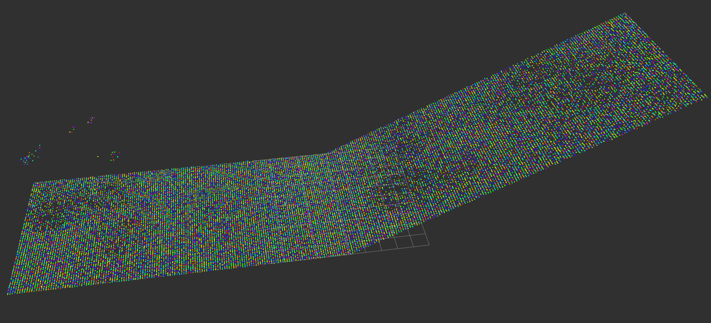

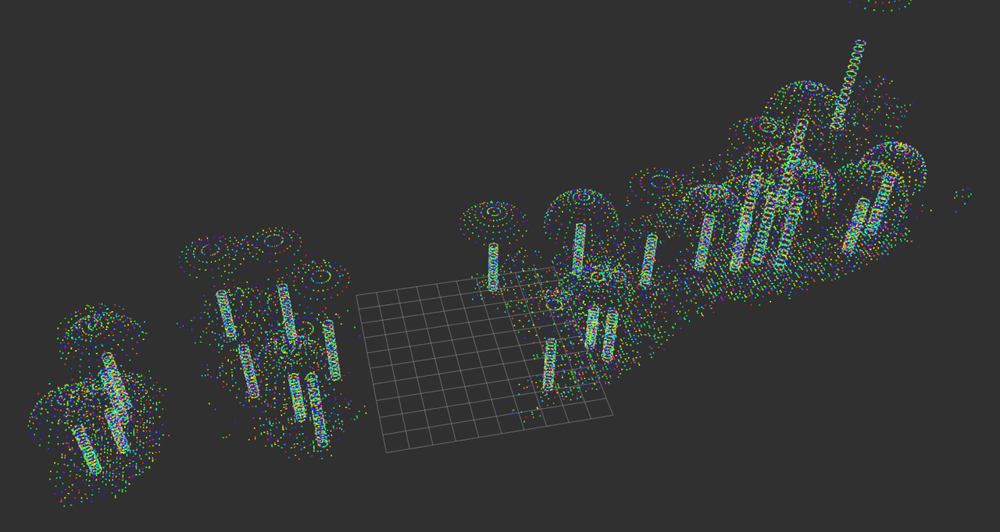

地面点分类，首先计算出每个点的线性度、平面度、曲率，根据这几个量设定阈值，即可区分出树干点、屋顶点、建筑物立面等：

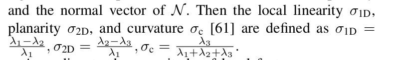

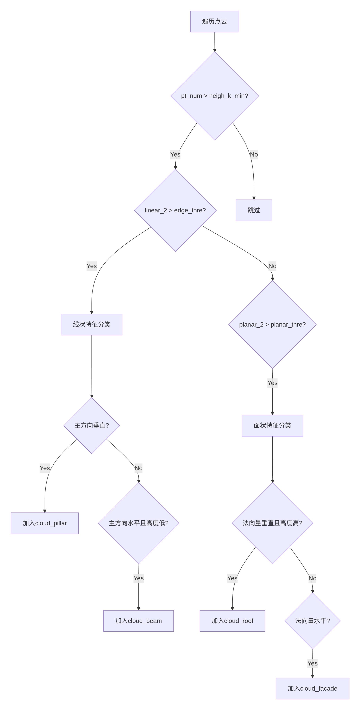

效果：

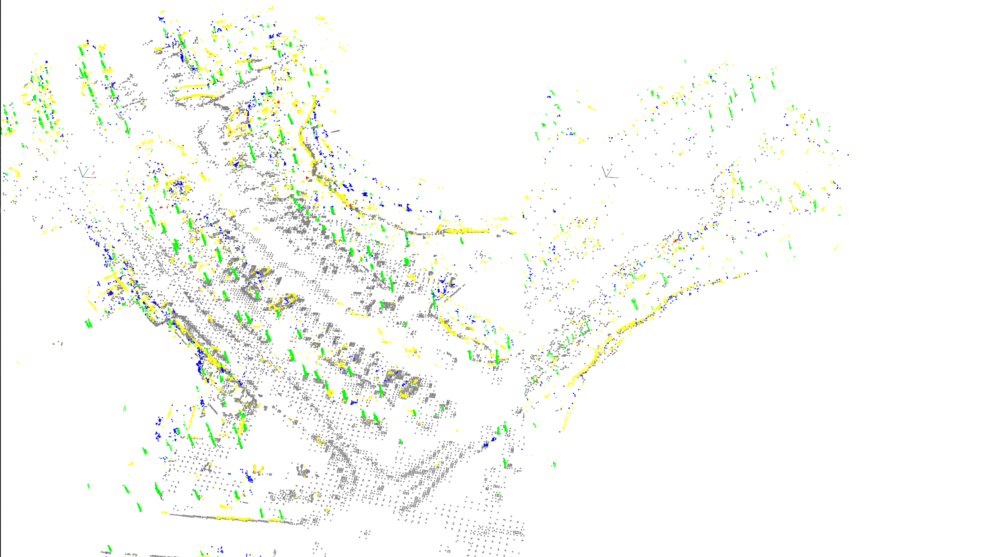

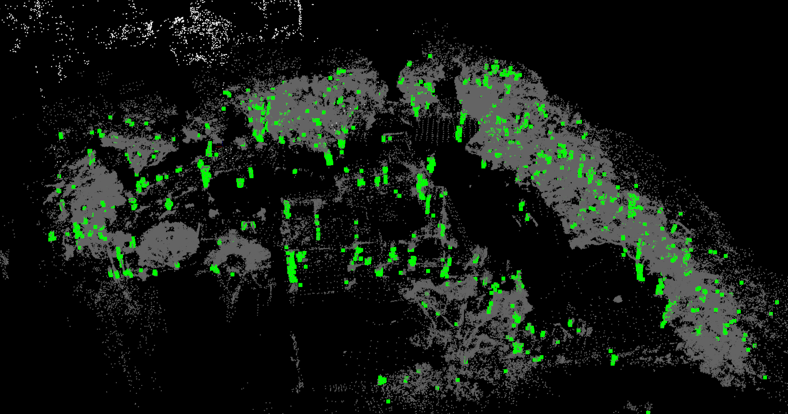

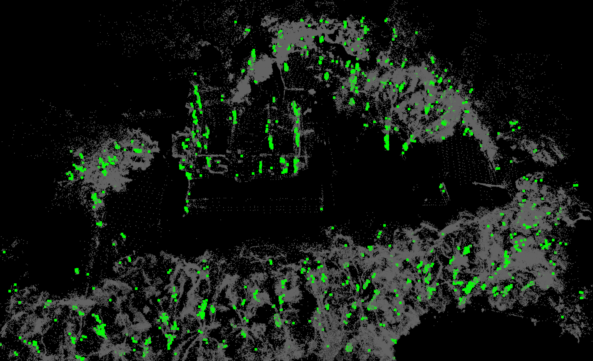

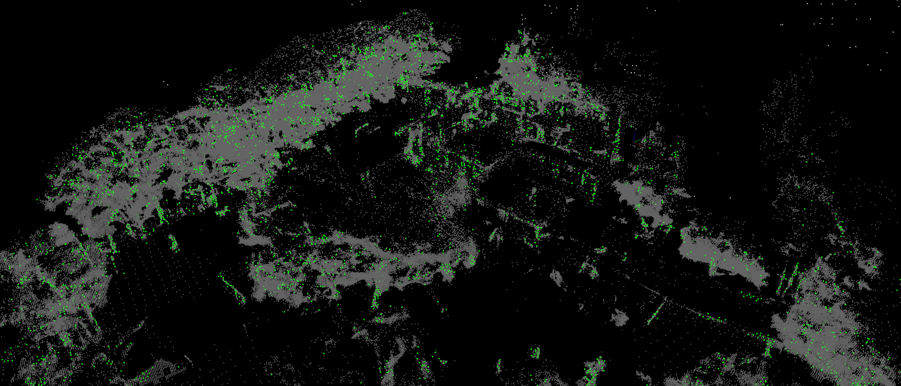

# **2.粗匹配**

这里借用了Link\_3D的方式，使用扇形的方式，将点周围的空间划分了90个空间，取最近点获取方向描述子和距离描述子，方向描述子：n1 - n2 ，距离描述子为中间连线长度（**这里生成描述子的时候，需要注意的是，在大场景时，描述子的距离等一定要设置的大一点，否则会很伤全局性**），这里方向描述子用的法向量对于杂点过于敏感，最好用一些对杂点不敏感的量？？**局部线性度？？**

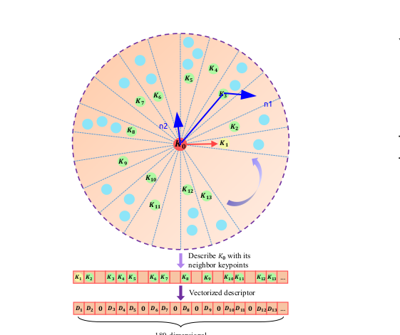

**比较方法：**

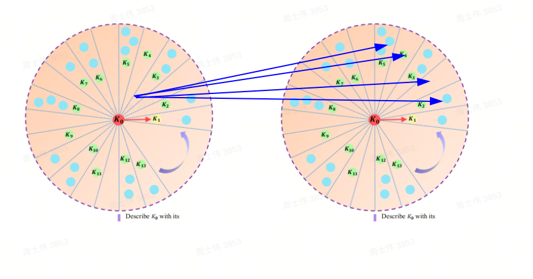

指定区域内比较附近+-2区域，比较方向描述子和方向描述子的距离是否在指定阈值之内，若在指定阈值范围内，则算做已匹配上。

# **3.Teaser**

上面第二步已经得到了初步的对应点，但是这个对应点里面混着大量的误匹配点，首先Teaser要做的第一步就是提取最大团：

首先获得两组特征点的完全图，通过握手的方式：

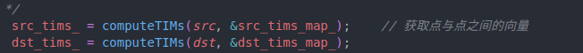

初步剔除误匹配：

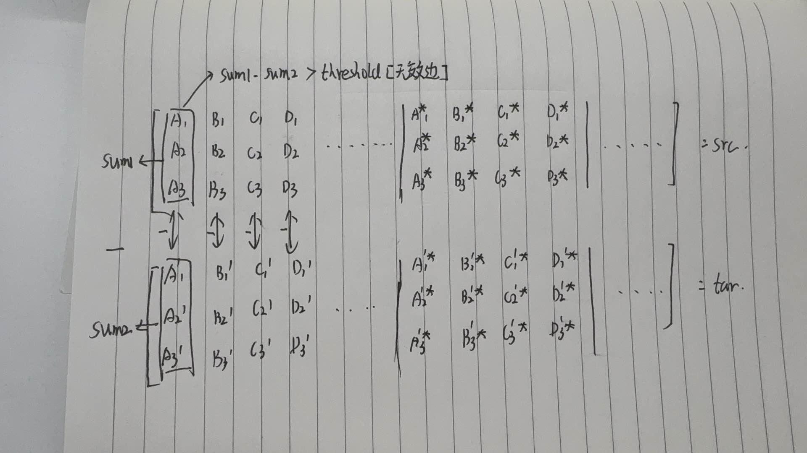

因为都是一一匹配的点，超过阈值之后，则认为差别较大，无效边。

剔除之后，再在初步去除误匹配的点集中，寻找最大团点，最大团定义如下：

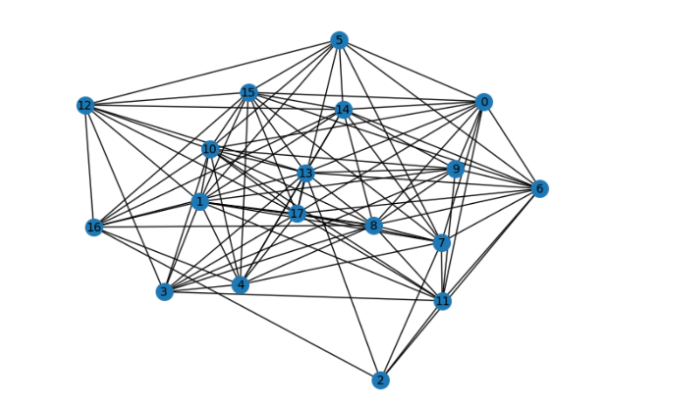

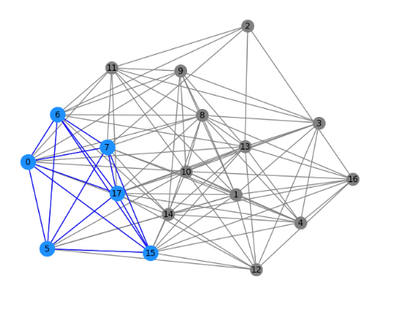

最大团也就是在一堆点形成的完全图中，寻找出一个图，他的所有点之间都存在边，节点数最多的这样的图即为称为最大团。正是因为这个原因，这样的匹配方式不存在多个解，数目最多的图只有一个。通过这种方式会剔除掉很多离群点，因为一般的离群点不会形成这样的团，这也是Tease里面进一步剔除误差点的方式。通过这样的方式，找到对应的点之后，进入截断最小二乘。

这里通过最大团找到最终的匹配点之后，求解旋转使用了加权的方式，残差大超过阈值的，就会在下次迭代的过程中，减小其在残差方程中的比重，防止因为坏点影响Tease的匹配结果：

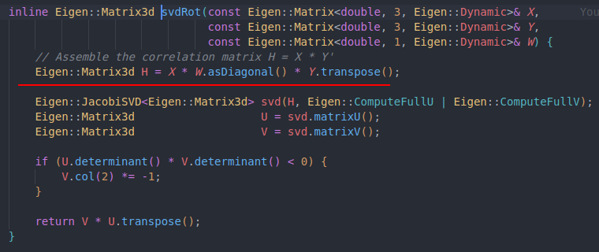

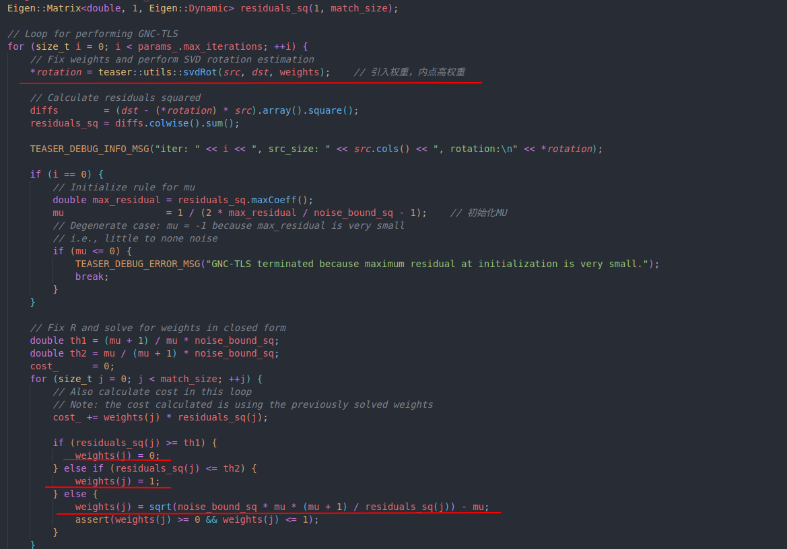

上述即为SVD求解旋转的片段，每次迭代的时候都会在其中加入权重，权重加进去的目的，**显然就是改变坏点（残差太大）在残差中的比重，防止因为差点的存在，影响收敛。**

求解平移的时候，用了一种近似投票的方式，当然这里同求解旋转不同的是，这里用到了求解出的旋转作为了先验值。具体思想如下：

将点划分到不同的区间中，这么设置的目的是为了最大程度的避免离群点的影响：

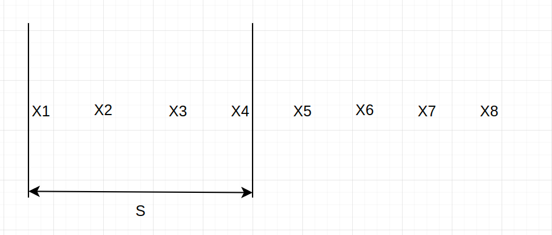

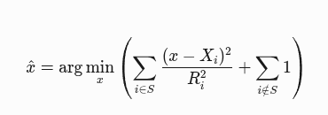

求导：

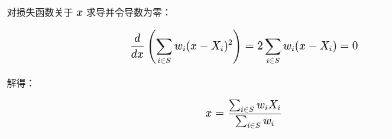

x即所求解。

代码反应：

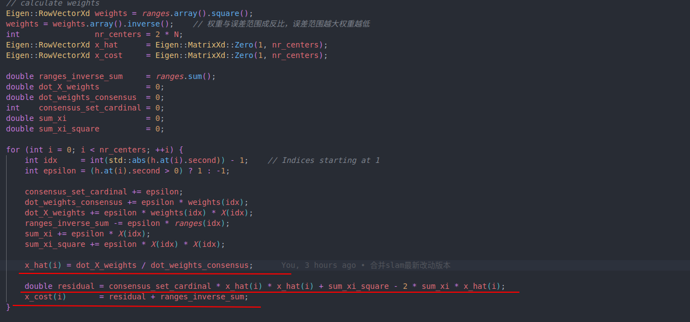

# **4.ICP**

这里充分利用了八叉树地图的结构，首先计算当前点的栅格索引，然后在目标地图中，寻找离当前栅格最近的栅格，该栅格中包含平面法向量（即属于栅格的点拟合出来平面的法向量），之后就是point-to-plane去求解，这里寻找最近栅格的过程中，利用了hash的数据结构，耗时极少，也不需要再去拟合平面，拥有时间优势，之后就是和多线slam一样用LM求解R和T。代码段如下：

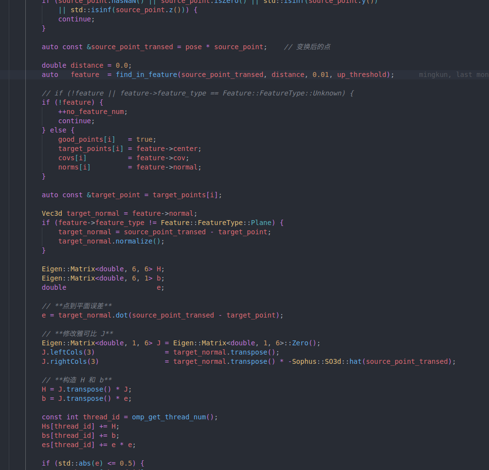

# **5.BBS-2D**

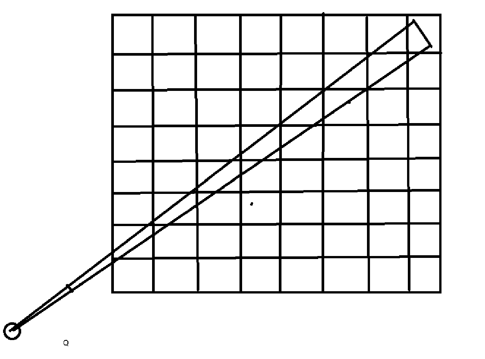

这里实际上就是将当前的目标点云地图和源点云地图按照多层分辨率划分为不同分辨率的体素地图，不同的层，分辨率不同，每一层设置搜索范围（角度、XY方向移动），分辨率越小，角度分辨率越小，每次移动的角度就越小，逐层细化。对于每个位姿，计算匹配得分，匹配得分的计算方法如下：将目标点云投影到栅格中，有点云的栅格即为命中的栅格，经过候选位姿变换为，将待匹配点云投影过去，如果栅格被击中则得分，否则不得分，但是这个方法存在两个问题。

第一，**依赖投影，坡度投影不正常，在一定程度上，反应不出来实际环境**；

第二，**平面点过多，会导致整体算法对yaw轴变换不敏感，导致yaw结果不对**。

# **6.重定位使用的局部地图**

当前定位使用的局部地图，其建图方式主要是建立局部地图，多帧汇聚在一起形成的小地图，机器人移动范围如下：大概前向走4-5m，旋转在30度左右，在这个范围内，重定位的成功率如下：

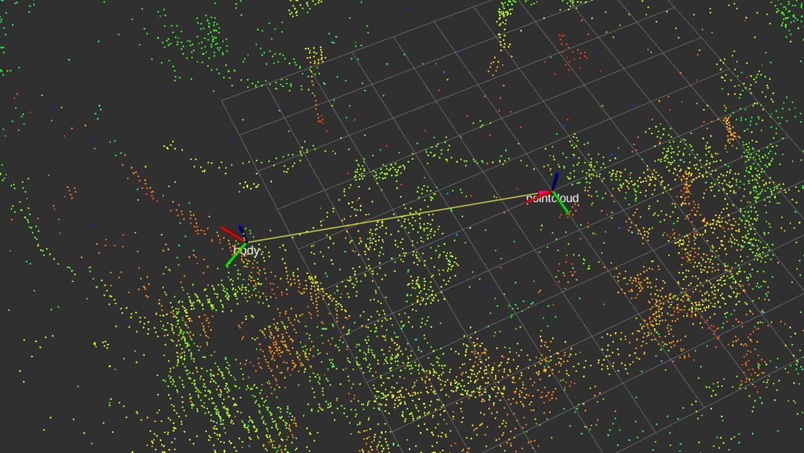

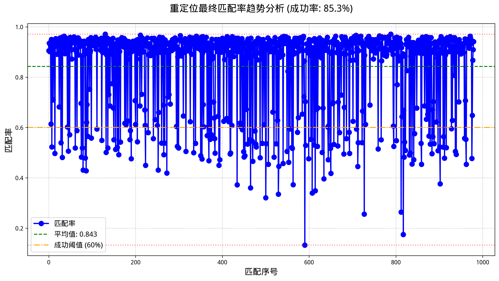

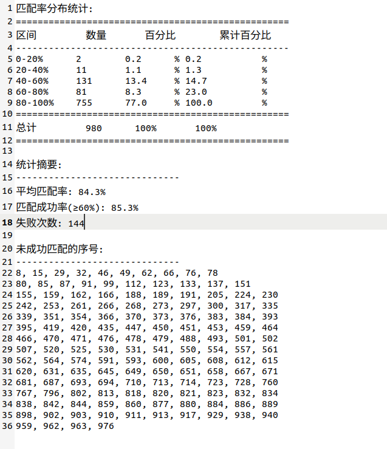

但是当前安规要求机器人前进在2m左右，这里当前还在采集数据，测试结果得看有数据之后。

# **7.优化方向**

1.GPU加速描述子匹配的过程

2.GPU加速最大团的寻找过程

3.GPU加速BBS的过程
