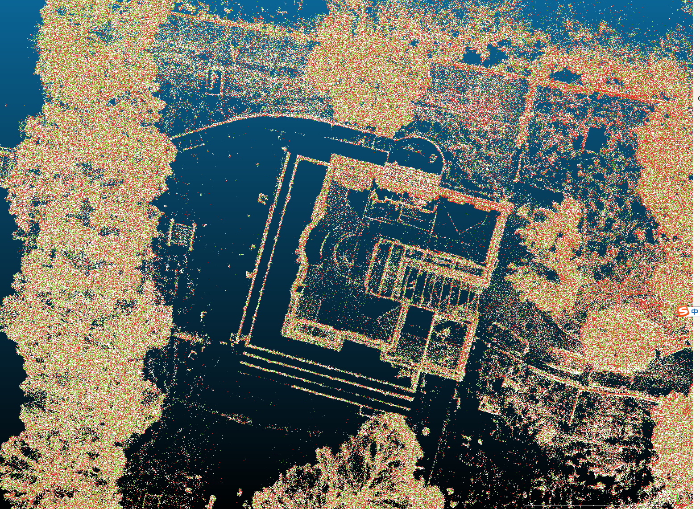
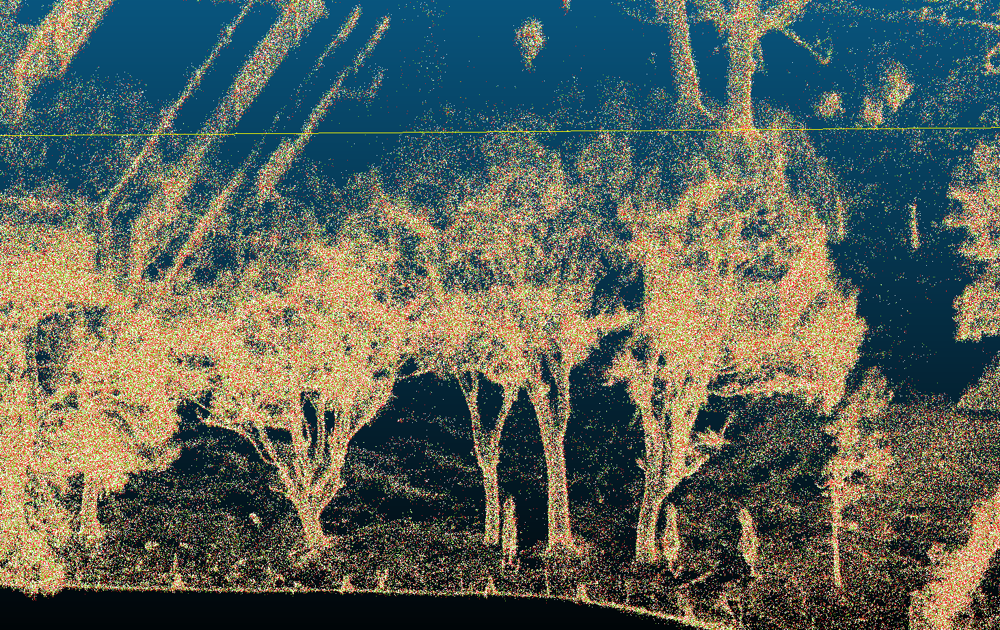
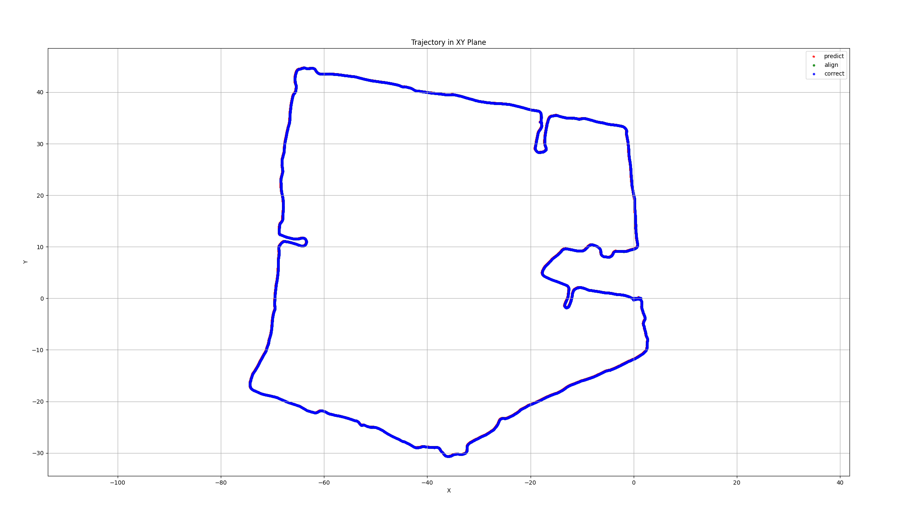
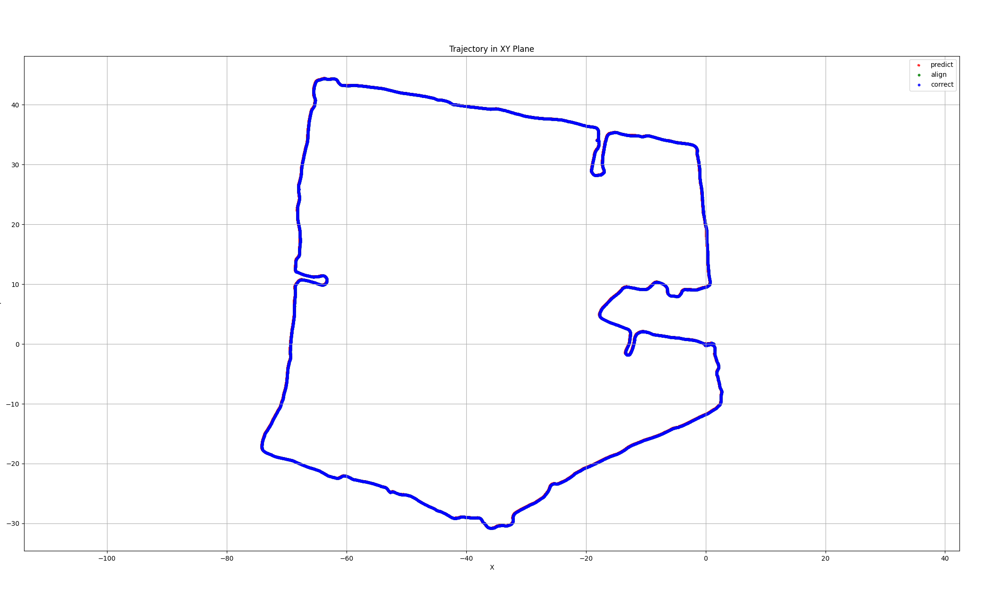
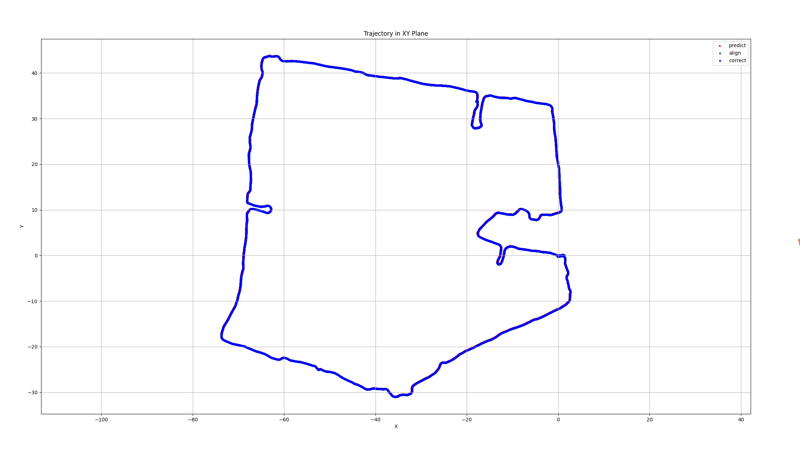
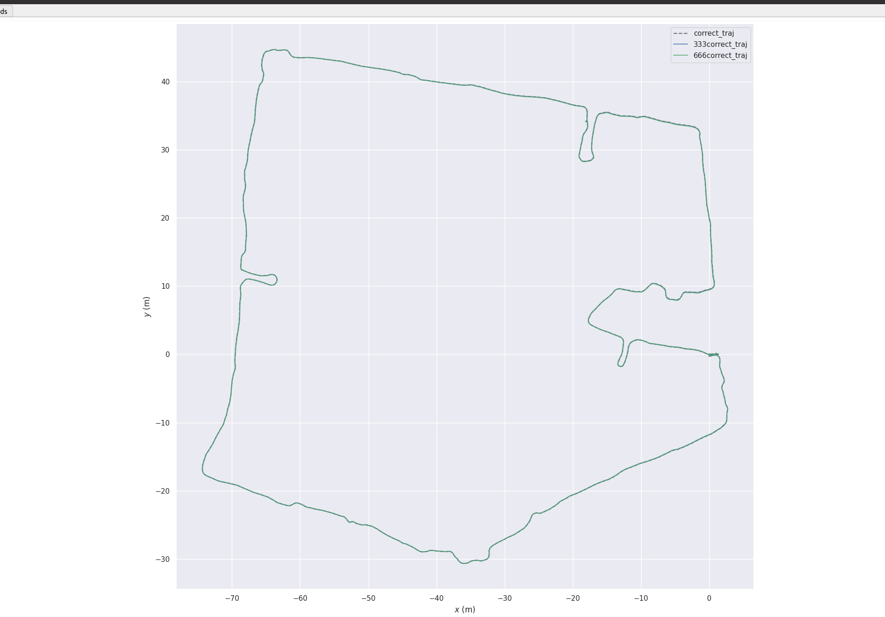
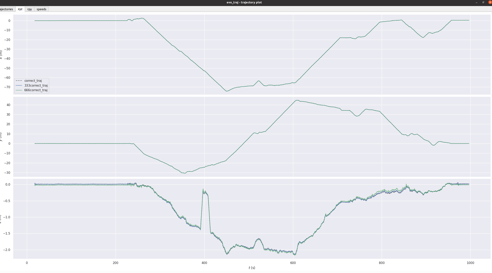
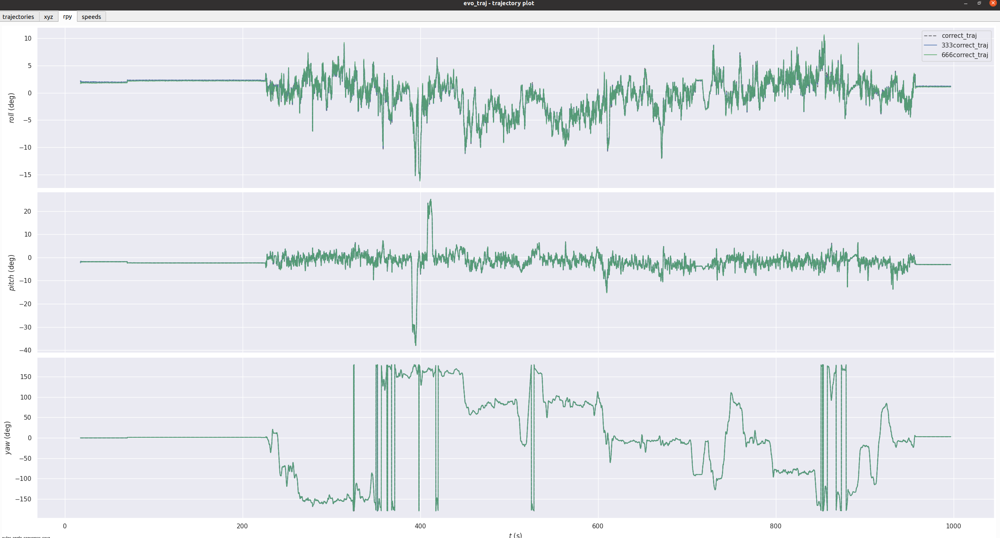

# 外参对slam算法影响测试

# 测试结论：

在外参roll、pitch及yaw在3°以内，对建图结果影响很小，可忽略

| 外参                   | roll: 0°pitch : 0°yaw: 0°                                                                                                                                                                                                                                 | roll: 3°pitch : 3°yaw: 3°                                                           | roll: 6°pitch : 6°yaw: 6°                                                           |
| -------------------- | --------------------------------------------------------------------------------------------------------------------------------------------------------------------------------------------------------------------------------------------------------- | ----------------------------------------------------------------------------------- | ----------------------------------------------------------------------------------- |
| 建图效果（对齐后）：           |                                                                                     |                                                                                     |                                                                                     |
| 建图轨迹：                |                                                                                                                                                                        |  |  |
| &#xA;不同维度下轨迹对齐后的对比图： |  |                                                                                     |                                                                                     |

