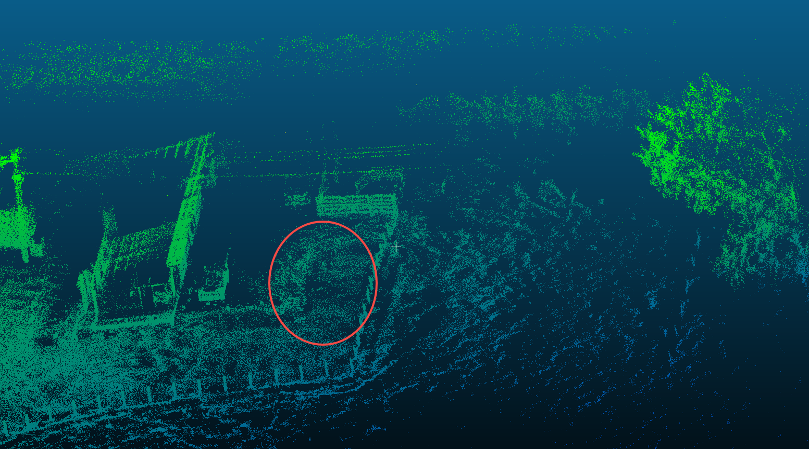
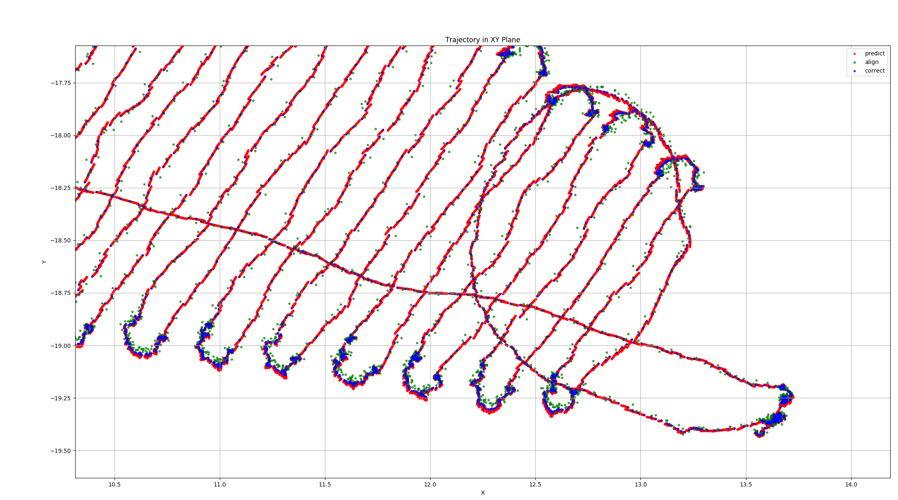
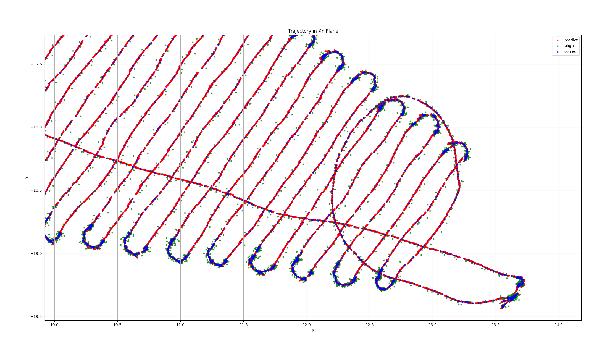
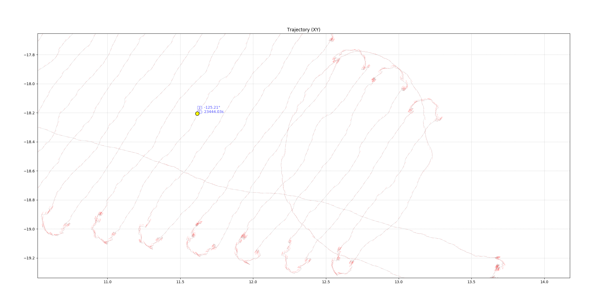
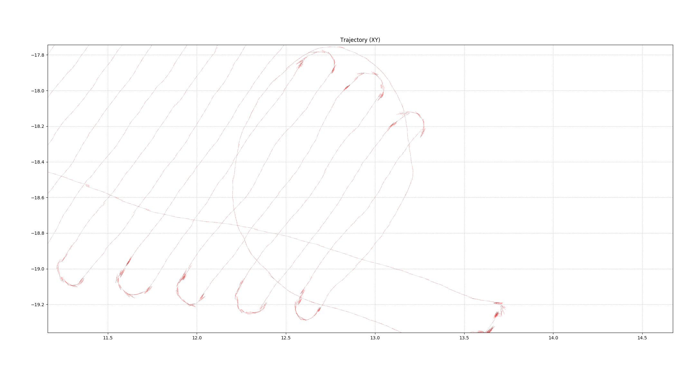
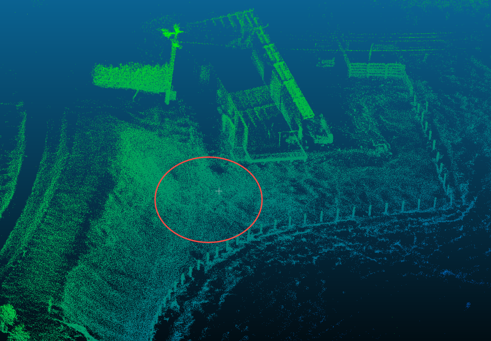
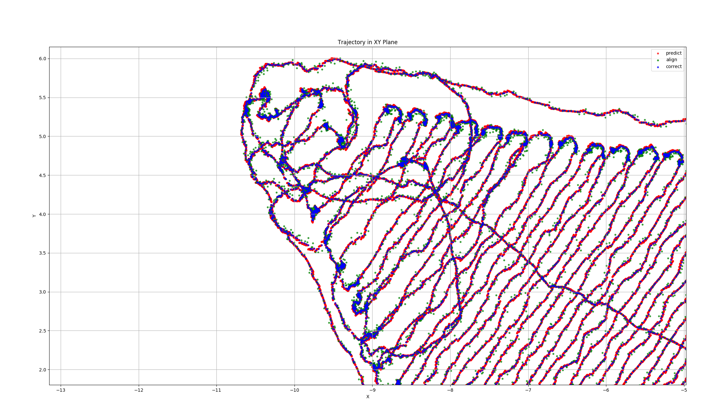
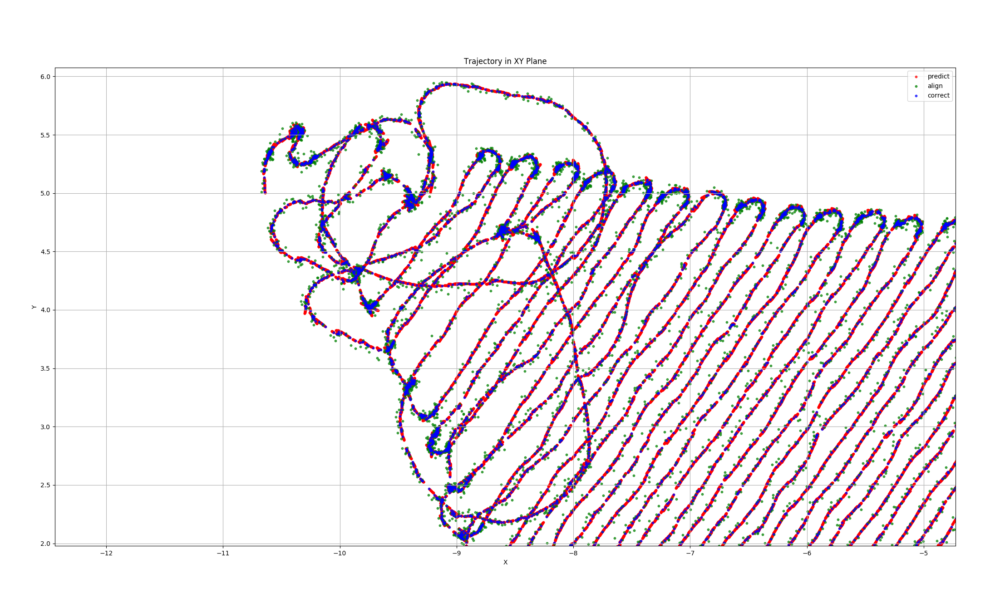
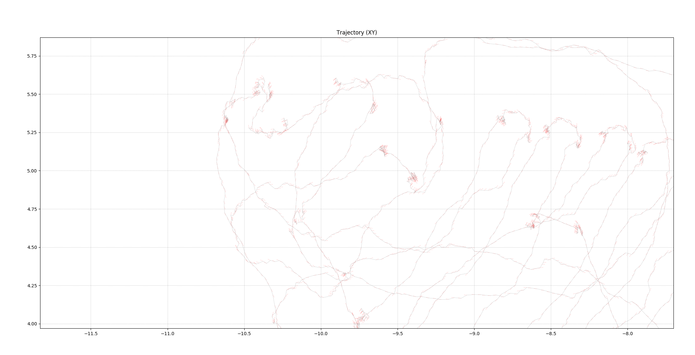
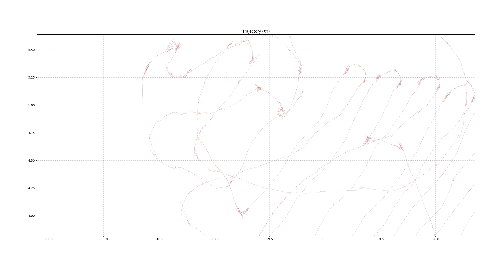

# 海外测试轨迹对比（滤波方案）

数据来源：http://chandao.roborock.com/index.php?m=bug\&f=view\&t=html&=\&bugID=458149

日志包：92及94

|           | 场景                                                                                  | 滤波前                                                                                 | 滤波后                                                                                 |
| --------- | ----------------------------------------------------------------------------------- | ----------------------------------------------------------------------------------- | ----------------------------------------------------------------------------------- |
| 1         |  |  |  |
| 位置航向一致性结果 |                                                                                     |  |  |
| 2         |  |  |  |
| 位置航向一致性结果 |                                                                                     |  |  |
