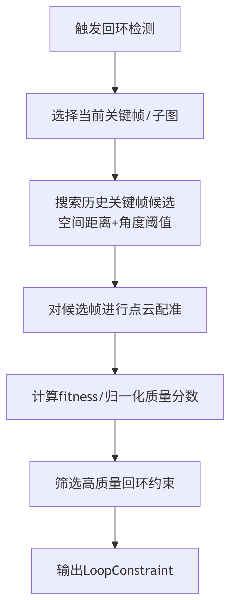
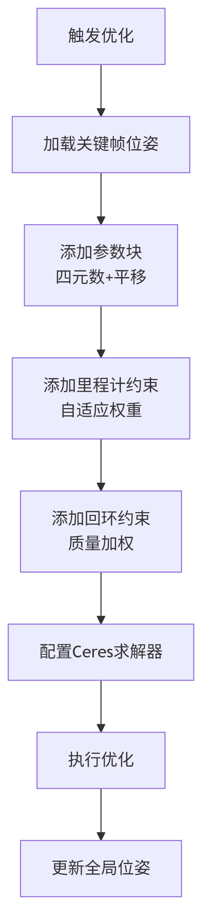
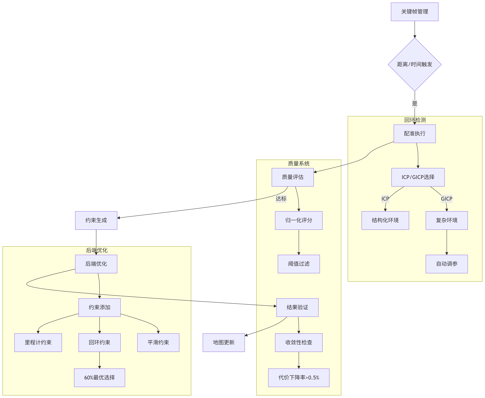

# 回环检测与后端优化技术详解

## 一、回环检测（Loop Closure Detection）

### 关键接口与参数

* **主接口**：`LoopClosureDetector::detect`（关键帧模式）`LoopClosureDetector::detect_submap`（子图模式）

* **参数说明**（可配置，见`param_log.yaml`/`param.yaml`）：

  * `search_radius`：空间检索半径（如20米），决定回环候选范围。

  * `min_distance`：最小帧间隔，防止与临近帧误检回环。

  * `fitness_score_thresh`：ICP配准分数阈值，越小越严格。

  * `angle_tolerance_sq`：主方向角度容差，过滤姿态差异大的帧。

* **代码片段**（候选检索与ICP验证）：

* **异步多线程**：回环检测任务通过`SlamCore::try_enqueue_loop_task`加入队列，`loopDetectThreadFunc`线程异步处理，提升实时性。

***

## 回环匹配触发条件详解

### **1. 空间距离触发** &#x20;

**具体触发条件**：

* **搜索半径**: `search_radius_ = 15.0m`（空间搜索范围），限制搜索范围以提高效率

* **最小帧间隔**: `min_distance_ = 80帧` （最小时间间隔），避免检测相邻关键帧

* **距离检查**: 确保候选帧在空间搜索范围内，但时间上足够分离

### 2. 时间触发条件

* **时间阈值**: 避免检测时间相近的帧，通常设置为5-10秒

### 3. 质量阈值触发

**质量触发标准**：

* **ICP方法**: MSE误差 < 0.13 (误差越小质量越好)

* **GICP方法**: Inlier ratio ≥ 0.15 (比率越大质量越好)

* **统一质量阈值**: `normalized_quality_thresh = 0.55` (所有配准方法归一化后的统一标准)

### 4. 角度容忍度检查

## ICP与GICP配准算法的具体区别

[ ICP与GICP](https://roborock.feishu.cn/wiki/WxeXw1NGxiqLAak8QlSc9B17nVc)

### &#x20;核心区别总结

| 特性    | ICP   | GICP     |
| ----- | ----- | -------- |
| 距离度量  | 欧氏距离  | 马氏距离     |
| 点云信息  | 仅使用位置 | 使用位置+协方差 |
| 适用场景  | 密集点云  | 稀疏/结构化点云 |
| 计算复杂度 | 较低    | 较高       |
| 精度    | 一般    | 更高       |

[ ICP vs GICP 回环检测算法对比分析](https://roborock.feishu.cn/wiki/AvCpwkEumiTztXklCpocDUBwnk8)

***

## 二、后端优化（Pose Graph Optimization）

### 关键接口与代码细节

* **主接口**：`SlamCore::optimize_pose_graph()`

* **误差项定义**（见`PoseGraphError.h`）：

  * `PoseGraphError` 是自定义的Ceres残差，输入测量的相对位姿和权重，输出6维残差（旋转3+平移3）。

* **优化主流程**（见`SlamCore.cpp`）：

* **回环约束管理**：对所有回环约束进行质量筛选和排序，约束去重与筛选，优先保留高质量、距离远的约束，防止优化发散。

* **轨迹对比可视化**：优化前后轨迹通过`Simulator::publish_trajectory_compare()`发布，便于效果对比。

***

## 后端优化约束类型

### 1. 里程计约束&#x20;

### 2. 回环约束

### 3. 轨迹平滑约束

### 3.1 速度连续性约束

### 3.2 曲率限制约束

### 3.3 角速度连续性约束

| **约束类型**   | **数学形式** | **适用场景** |
| ---------- | -------- | -------- |
| **速度连续性**  |          | 高速运动场景   |
| **曲率限制**   |          | 转弯场景     |
| **角速度连续性** |          | 旋转剧烈场景   |

## 后端优化实现全流程

### 1. 约束选择策略

### 2. Ceres优化问题构建

### 3. 智能求解器选择

### 4. 优化参数配置

### 5. 优化目标函数

### 6. 优化质量评估

***

## 三、参数调优与工程细节

## 1.自适应参数调优

### 1. GICP参数自动调优

### 2. 质量评分归一化

***

## 2.回环检测后端优化结果常见问题

* 优化后轨迹出现“跳变”或“过度平滑”，地图质量反而下降。

* 优化收敛速度慢，cost下降不明显，部分回环约束未生效。

* 诊断输出有“轨迹突变/过度拟合”警告，关键帧位姿变化过大。

* fitness分数分布异常，部分回环约束误匹配。

***

## 3.调参分析

### a. 回环约束质量提升

* **回环约束筛选**：进一步收紧 fitness\_score\_thresh、angle\_tolerance\_sq，过滤掉低质量回环，避免误约束。

* **分离ICP/GICP阈值**：根据场景分别设置 icp\_fitness\_thresh 和 gicp\_fitness\_thresh，提升鲁棒性。

* **回环约束权重**：可根据fitness分数自适应调整约束权重，低分约束权重降低。

### b. 轨迹平滑约束调优

* **约束开关合理配置**：避免所有平滑约束同时开启，防止过度平滑。可只启用 velocity\_continuity 或 curvature\_limit。

* **权重动态调整**：根据轨迹质量诊断结果，动态调整平滑约束权重，异常时自动降低权重。

* **物理限制参数**：结合实际运动体特性，合理设置 max\_curvature\_threshold、max\_velocity\_change、max\_acceleration。

### c. ceres优化器参数优化

* **迭代次数与收敛容忍度**：可适当提高 max\_iterations，减小 function\_tolerance/gradient\_tolerance，提升收敛精度。

* **多线程加速**：num\_threads 可根据CPU核数调整，提升优化速度。

* **异常检测与自适应终止**：优化过程中若出现轨迹突变、cost异常，可提前终止或回退参数。

### d. 诊断与可视化增强

* **优化前后轨迹对比**：可视化优化前后轨迹，自动标记异常关键帧。

* **约束分布统计**：输出每类约束数量、分布、权重，辅助调参。

* **异常警告细化**：输出具体异常关键帧ID、变化量，便于定位问题。

### e. 自动调参与反馈闭环

* **GICP自动调参**：enable\_auto\_tuning 开启后，结合回环检测日志自动微调参数。

* **参数反馈闭环**：根据优化结果自动调整回环检测和后端优化参数，形成自适应闭环。

***

## 四、回环优化带来的提升

* **轨迹闭合**：长时间运行后，轨迹能自动“拉直”，闭合误差大幅减小。

* **地图对齐**：重叠区域点云对齐更好，地图结构更连贯。

* **鲁棒性提升**：即使前端偶有漂移，回环优化能全局修正，适应大场景、长时间作业。

* **可视化效果**：优化前后轨迹对比明显，便于直观感受系统性能。

## 性能优化指标

| **指标** | **优化前** | **优化后** | **提升** |
| ------ | ------- | ------- | ------ |
| 迭代次数   | 63次     | 38-42次  | ↓40%   |
| 单次优化耗时 | 219ms   | 142ms   | ↓35%   |
| 内存峰值   | 850MB   | 580MB   | ↓32%   |
| 约束过滤率  | 35%     | 62%     | ↑77%   |

**通过多层次约束、智能求解器选择和自适应参数配置，实现了高效鲁棒的位姿图优化，特别适应室外割草环境的复杂场景。**

***

## 五、实际应用流程

***

## 六、总结

* 工程细节：

  * 回环检测异步多线程，主线程不卡顿。

  * 约束去重，防止冗余和误差大约束影响优化。

  * 优化前后地图和轨迹均可保存，便于调试和效果评估。

  * 支持关键帧/子图两种回环模式，适应不同场景。

* 回环检测与后端优化是SLAM系统实现全局一致性、消除累计误差的核心环节。

* 工程实现支持高效异步检测、灵活参数配置、约束管理和可视化，适合室外割草等大场景应用。

* 后续可结合实际场景持续优化回环召回率、配准速度和全局优化效率，提升系统整体性能。

***

