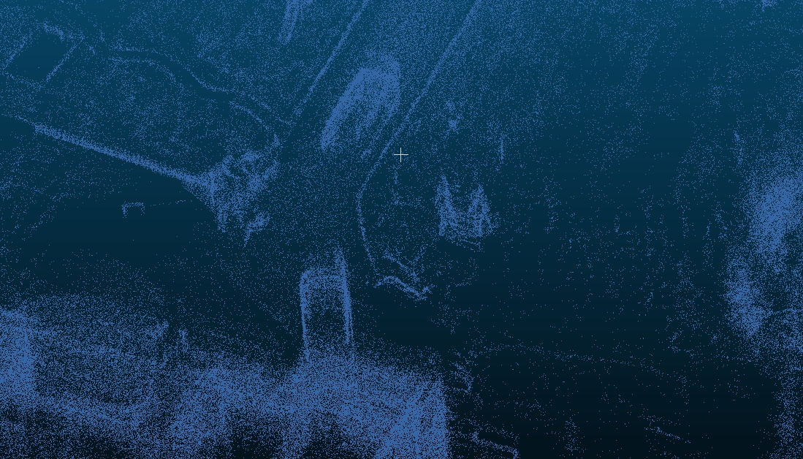
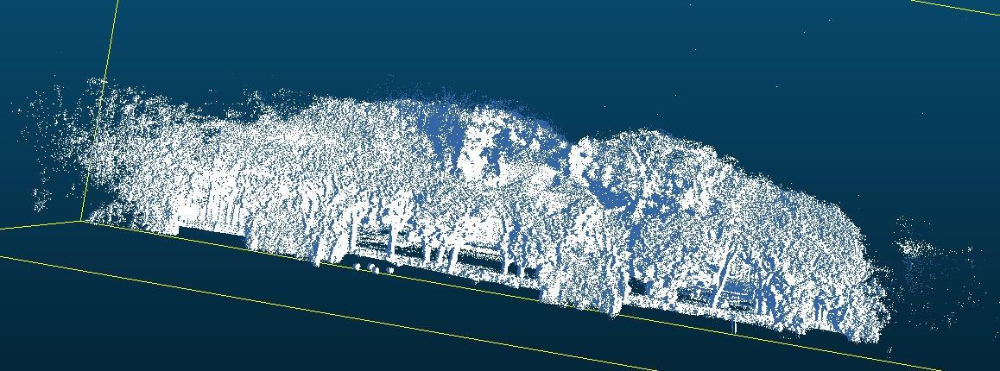
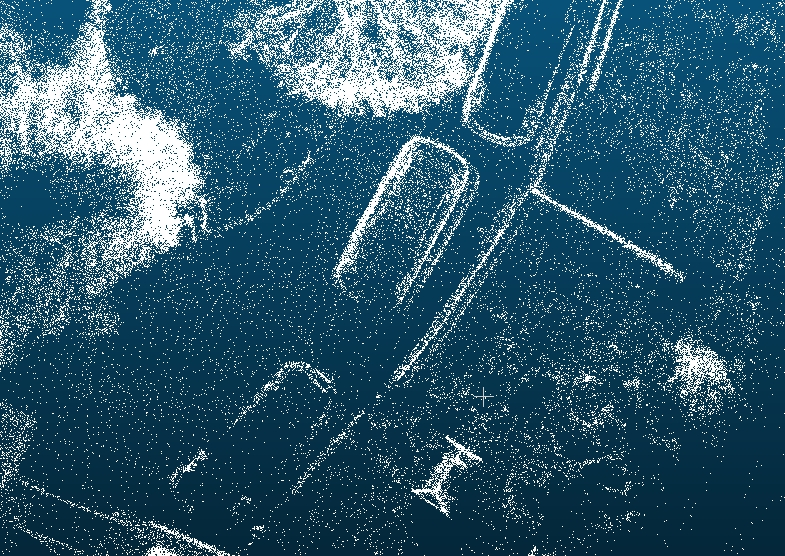
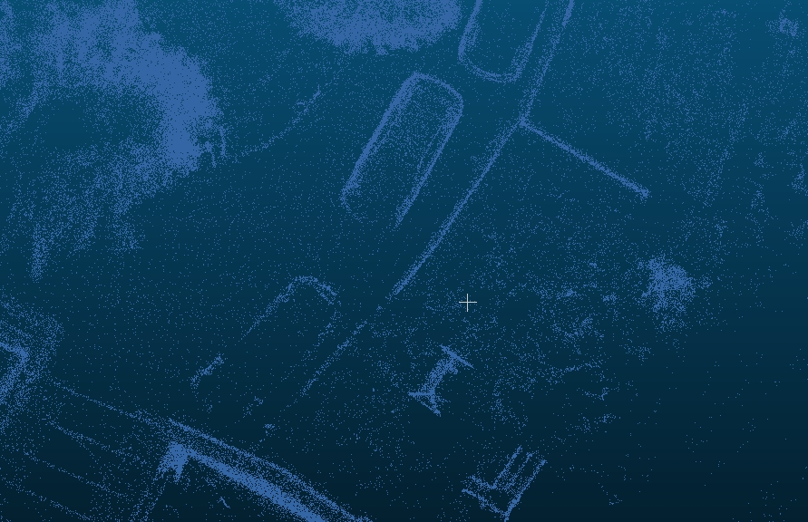
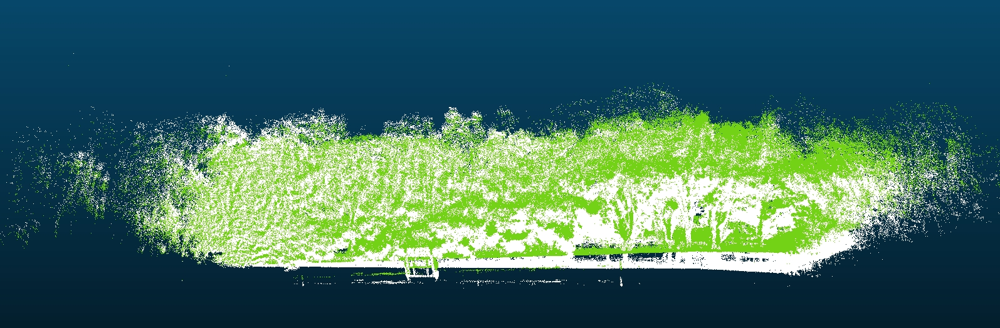
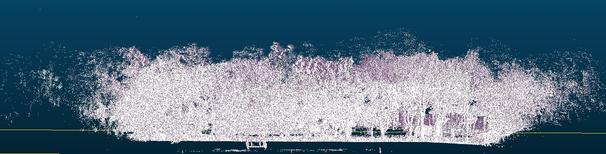
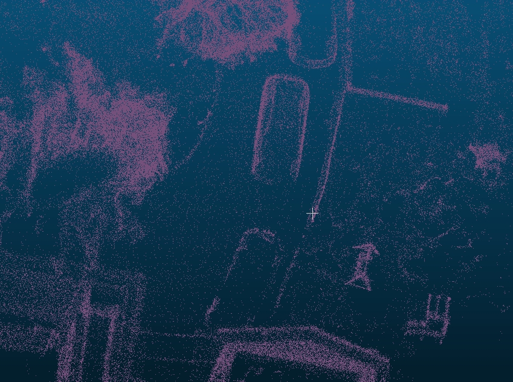
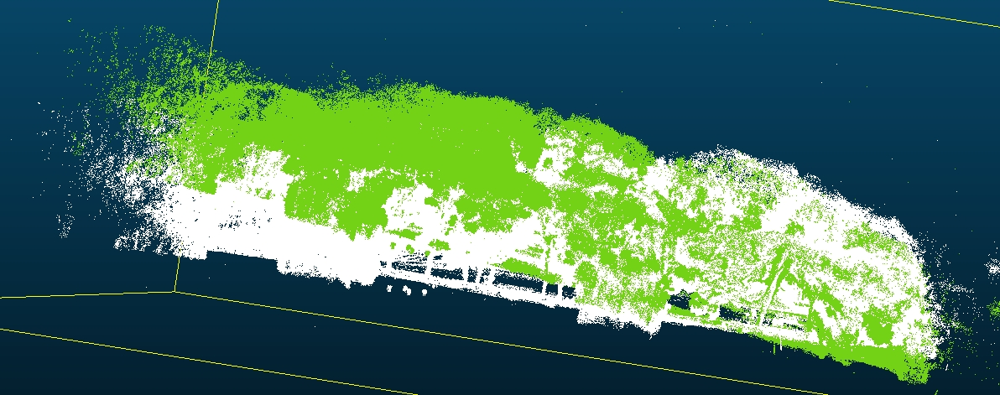
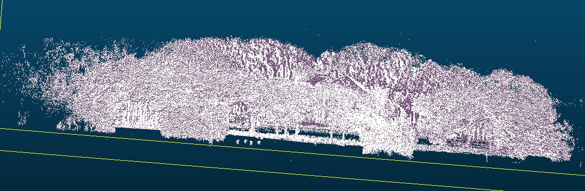
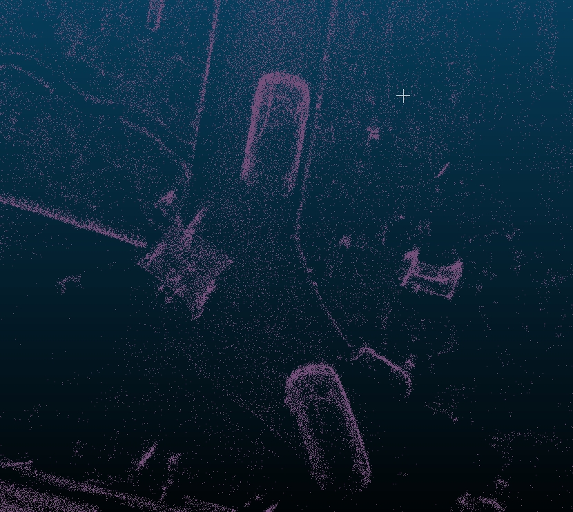

# 回环调试记录

# 1. 目前思路和行动项：

1.0思路与行动

2.0思路与行动

3.0思路与行动

4.0思路与行动

loop\_test z轴约束新版本

**5.0思路与行动**

loop\_test回退后重新采用其他匹配方式优化

优化后的地图和优化前的做一次匹配，算这个角度偏移；

评估降采样这样的计算量和耗时是否能接受,机器耗时是本地10倍

(点云、轨迹，两种)

1. 点云匹配是其中一个思路，看下效率；

2. 轨迹的匹配可能更快，有解析解，slam14讲有，代码可能有bug；ceres也可以自己写，写模块测试即可；

3. 匹配后的方法，有个问题是**初值的xyz**可能会变化，这个可能还要再修正回来；或者看看不引入这个问题

# 2. 调试记录

### 1.0调试记录：

**loop\_test:**

运行测试：

./devel/lib/simulator/simulator --log

**当前问题：**

1、分支能否编译过；（能）

2、测试一下在手数据，整理一个表格，看下回环是否都能实现；（78、105、已跑）

3、submap里面keyframe数量，keyframe间隔；（已可调）

**Submap和KeyFrame分析**

当前参数配置：

1. **KeyFrame创建条件：**

// 位置阈值：0.5米static constexpr auto DELT\_XY\_Threshold\_SQ = 0.5 \* 0.5;  // 0.25平方米// 角度阈值：60度 static constexpr auto DELT\_YAW\_Threshold\_SQ = 60.0 \* M\_PI / 180.0 \* 60.0 \* M\_PI / 180.0;// 最大keyframe数量static constexpr auto MAX\_KEY\_FRAME = 200000;

2. **Submap创建参数：**

// 在SubmapsManager构造函数中explicit SubmapsManager(double max\_keyframe\_size, size\_t merge\_size = 30, size\_t max\_submaps = 50)

merge\_size = 30：每30个keyframe合并成1个submap

max\_submaps = 50：最多保持50个submap

当前机制分析：

KeyFrame创建：

移动距离 > 0.5米 或 旋转角度 > 60度

附近没有其他keyframe（避免密集添加）

Submap创建：

每累积30个keyframe自动合并成1个submap

合并时以第一帧为参考，将后续帧变换到统一坐标系

（以4000平米场景举例）：

按0.5米间隔，4000平米大约产生：√4000 / 0.5 ≈ 126个keyframe（单边）

实际轨迹更复杂，预计200-400个keyframe

对应6-13个submap

**参数调整建议总结**

针对4000平米割草场景的推荐配置：

KeyFrame密度调整：

position\_threshold: 1.0 - 增加到1米（减少keyframe密度，降低计算负载）

yaw\_threshold\_deg: 30.0 - 减少到30度（捕获更多转向）

Submap大小调整：

frames\_per\_submap: 20 - 减少到20个keyframe（提高回环检测精度）

max\_submaps: 100 - 增加到100个（适应大场地）

如何进一步调试：

观察keyframe数量：运行时log会显示keyframes\_manager\_ size=xxx

如果keyframe太密集：增加position\_threshold

如果回环检测困难：减少frames\_per\_submap

如果内存不足：减少max\_keyframes和max\_submaps

### 2.0调试记录：

**遗留问题，还有：**

1、回环后整体的高度起伏，rool pitch可能不太一样，后面可能先针对性的给协方差看看，能不能约束住；（已测试，不能有效约束住）

2、两个地图有夹角；

3、难点是，不知道哪个是正确的，或者怎么样是正确的。以及和后期重力对齐的关系；原理在于roll pitch和z 的可观性较差；

修改：

配置文件更新

param\_log.yaml配置文件中包含了针对室外割草场景优化的回环检测参数：

主要配置参数说明：

回环搜索参数：

loop\_radius: 40.0 - 回环搜索半径40米

score\_threshold: 0.15 - 回环检测评分阈值

match\_ratio\_threshold: 0.42 - 匹配率阈值

height\_diff\_threshold: 1.0 - 高度差阈值1米，适合平坦地形

协方差权重配置：

回环约束：\[150, 150, 300] (xy, z) 和 \[100, 100, 500] (roll, pitch, yaw)

里程计约束：\[80, 80, 120] (xy, z) 和 \[200, 200, 300] (roll, pitch, yaw)

权重设计原理：

Z轴权重较高：利用平坦地形特点，强约束高度

Yaw权重最高：方向信息在割草场景中最可靠

Roll/Pitch权重适中：避免过度约束，考虑可观性较差

根据实际效果，调整param\_log.yaml中的权重参数：

如果高度起伏仍然明显 → 增加loop\_translation\[2]和odom\_translation\[2]

如果roll/pitch不稳定 → 增加loop\_rotation\[0,1]和odom\_rotation\[0,1]

如果回环检测过于严格 → 降低score\_threshold或match\_ratio\_threshold

如果误检较多 → 降低height\_diff\_threshold

### 3.0调试记录：

**远端Z轴翘起通常是由于以下原因：**

累积误差放大：随着轨迹延长，Z轴误差会累积放大

约束不均匀：远端缺乏足够的约束，特别是回环约束

权重配置：当前权重可能对远端约束不足

先验约束范围：只对根节点施加先验约束，远端节点缺乏强约束

解决方法：

现在修改先验约束，**添加中间节点约束**来解决远端漂移

基础权重强化 - 提高所有Z轴相关约束强度

距离自适应 - 越远的节点获得越强的约束权重

多锚点策略 - 在轨迹中分布多个Z轴约束锚点

1. 添加中间节点先验约束

新增功能：

当子图数量大于4时，自动在轨迹的1/3、1/2、2/3位置添加中间节点约束

为每个中间节点添加强z轴位置约束（权重10000.0）

为每个中间节点添加强pitch约束（权重8000.0）和roll约束（权重5000.0）

约束策略：

// z轴位置约束Eigen::Matrix3d pos\_info = Eigen::Matrix3d::Zero();pos\_info(2, 2) = 10000.0;  // 强z轴约束// pitch和roll约束  Eigen::Matrix\<double, 6, 6> orient\_info = Eigen::Matrix\<double, 6, 6>::Zero();orient\_info(3, 3) = 5000.0;  // roll约束orient\_info(4, 4) = 8000.0;  // 强pitch约束，防止翘起

* 约束设计原理

多层次约束策略：

根节点约束：固定第一个节点的全部6DOF（权重1e100）

中间节点约束：

z轴位置约束（权重10000.0）- 防止垂直漂移

pitch约束（权重8000.0）- 防止俯仰角累积误差导致翘起

roll约束（权重5000.0）- 保持水平稳定

边约束：里程计边和回环边都增强了z轴和pitch约束

* 效果记录

通过这些修改，回环优化应该能够：

显著减少z轴远端漂移：中间节点的强z轴约束防止累积误差

防止轨迹两头翘起：强pitch约束控制俯仰角变化

保持轨迹整体稳定性：多点约束确保全局一致性

**发布推送分支/private/yjf/loop\_test**

### **4.0调试记录：**

0922-loop\_test z轴约束新版本效果测试：

105数据小车部分仍有叠影，但远端高度拉下

78数据集优化会好一些，远端高度拉下，小车叠影优化成功。

优化效果比起中间约束节点稍差些，主要还是105小车有重影

（方法已回退）

### 5.0调试记录：

点云优化：

效果一般（等会补截图）

轨迹优化：

78：

远端拉下

小车重影修正

105：

远端拉下

小车无叠影

**整体效果优**

推送至代码分支private/loop\_test

### 6.0调试记录：

1. 回环遗留功能优化：**（Doing）**

   1. **主题逻辑：导航轨迹地图；我们轨迹会变化；边界同步&#x20;**

      1. &#x20;机器跑一遍？充电桩原点；机器的轨迹点信息；

         1. 保存的时候，

         2. ~~导航轨迹点（x, y; time?） 静态的~~

         3. ~~我们的轨迹（xy, time?），回环，反修导航地图轨迹；~~

         4. keyframe点位发给他们？

            1. &#x20; 开始和结束；这个拿到；

               1. keyframe间隔**20cm（需要确认一下）**;

               2. 和导航沟通容忍度？（如果20cm不行，多少距离能够接受）（优先看下这个方案）；我们发给他们（可以接受）

               3. 原先是50hz相对点位（pose）；相对量保存，相对修正；

               4. 样条插值？

         关键帧间距：设计阈值为约 0.5 米。

         优化后保持：子图内的关键帧间距基本仍为约 0.5 米。

         子图边界：每合并约 30 个关键帧作为一个子图，回环优化会调整子图位姿，子图之间的距离可能略有变化。

         依据与细节：

         在 SlamCore.h 中，关键帧触发阈值 DELT\_XY\_Threshold\_SQ = 0.5 \* 0.5，即平移距离超过 0.5m 或角度超过阈值（60°）时新增关键帧。

         SubmapsManager 将约 30 个关键帧合并为一个子图，回环优化使用的是子图中心作为轨迹点进行图优化和对齐。

         在 LoopClousre::save\_optimized\_map() 中，优化后的轨迹点是各子图的平移中心（不是单个关键帧），并用优化器更新后写入 traj\_src，随后可能用 Umeyama 做整体对齐。因此优化直接影响的是子图间的距离；子图内的关键帧相对关系按建图时的采样规则（约 0.5 m）保持。

         可用 keyframe\_pose.pcd（关键帧位姿点）逐点计算相邻距离，得到实际间隔分布（大多接近 0.5 m）。

         也可用 subamp\_pose.pcd（子图位姿点）或优化后输出的 global\_map\_optimized.pcd 的轨迹（子图中心）计算各相邻子图的距离，通常约等于该段路径内累计 30 个关键帧所覆盖的长度（大约 30 × 0.5 m ≈ 15 m，视运动曲线/重采样而定）。

   要将回环优化后的 Keyframe 间隔调整为 20cm，核心在于修改 建图时生成关键帧的阈值。

   因为回环优化（Loop Closure）是基于 子图（Submap） 进行的，它不会改变子图内部关键帧的相对关系。所以，只要在生成关键帧时将距离阈值设为 0.2m，最终优化后的轨迹点（关键帧）间隔也会保持在约 0.2m。

   修改了 SlamCore.h 文件：

   // slam/include/core/SlamCore.h// Keyframe// 修改前: static constexpr auto DELT\_XY\_Threshold\_SQ  = 0.5 \* 0.5;static constexpr auto DELT\_XY\_Threshold\_SQ  = 0.2 \* 0.2; // 修改为 0.2 \* 0.2 (即 20cm)static constexpr auto DELT\_YAW\_Threshold\_SQ = 60.0 \* M\_PI / 180.0 \* 60.0 \* M\_PI / 180.0;

   修改带来的影响：

   关键帧密度增加：关键帧数量将增加约 2.5 倍（0.5m -> 0.2m）。

   子图物理尺寸变小：由于每个子图包含固定的 30 个关键帧（默认设置），子图覆盖的路径长度将从约 15m (30 \* 0.5) 缩短为约 6m (30 \* 0.2)。

   计算量增加：更多的关键帧和子图意味着前端里程计插入关键帧的频率变高，后端回环优化的节点数（Pose Graph Vertices）也会增加，可能会增加 CPU 和内存的消耗。

   &#x20;Keyframe 间隔调整为 20cm

   命令语句：grep -E "Starting loop detection|Loop detection finished|Starting pose graph optimization|Pose graph optimization finished|No loop edges" ./build/XXXXXXX.log

   修改语句：static constexpr auto DELT\_XY\_Threshold\_SQ = 0.2\* 0.2;

   |                                                   | 回环检测耗时                                                             | 后端优化耗时                                                  |   |
   | ------------------------------------------------- | ------------------------------------------------------------------ | ------------------------------------------------------- | - |
   | livox-60keyframe20cm                              | \[info] Loop detection finished. Found 21 edges. Cost: 2071.78 ms  | \[info] Pose graph optimization finished. Cost: 4.71 ms |   |
   | livox-60keyframe50cm                              | \[info] Loop detection finished. Found 3 edges. Cost: 487.51 ms    | \[info] Pose graph optimization finished. Cost: 2.22 ms |   |
   |                                                   |                                                                    |                                                         |   |
   | livox-78keyframe20cm                              | \[info] Loop detection finished. Found 4 edges. Cost: 465.73 ms    | \[info] Pose graph optimization finished. Cost: 2.60 ms |   |
   | livox-78keyframe50cm                              | \[info] Loop detection finished. Found 1 edges. Cost: 69.08 ms     | \[info] Pose graph optimization finished. Cost: 1.77 ms |   |
   |                                                   |                                                                    |                                                         |   |
   | livox-105keyframe20cm                             | \[info] Loop detection finished. Found 9 edges. Cost: 842.53 ms    | \[info] Pose graph optimization finished. Cost: 5.42 ms |   |
   | livox-105keyframe50cm                             | \[info] Loop detection finished. Found 1 edges. Cost: 78.03 ms     | \[info] Pose graph optimization finished. Cost: 1.54 ms |   |
   |                                                   |                                                                    |                                                         |   |
   | 150mstart\_time: 0.0end\_time: 2253.9keyframe20cm | \[info] Loop detection finished. Found 75 edges. Cost: 14584.37 ms | \[info] Pose graph optimization finished. Cost: 8.81 ms |   |
   | 150mstart\_time: 0.0end\_time: 2253.9keyframe50cm | \[info] Loop detection finished. Found 5 edges. Cost: 1204.57 ms   | \[info] Pose graph optimization finished. Cost: 2.02 ms |   |

   核心结论总结

   回环检测耗时对关键帧密度极其敏感：将间隔从 20cm 调整为 50cm（密度降低约 2.5 倍），回环检测耗时呈现 指数级或大幅度下降（下降幅度在 4倍 到 12倍 不等）。

   后端优化耗时占比极低：无论哪种设置，后端优化（Pose Graph Optimization）的耗时都非常短（毫秒级），对系统整体实时性影响微乎其微。

   回环数量与关键帧密度正相关：20cm 间隔下检测到的回环边数量远多于 50cm 间隔，这意味着高密度关键帧能提供更密集的约束，但也带来了巨大的计算负担。

   * 匹配度不足：submap匹配的是否，现有匹配不佳；

     1. submap两个  小场景， 两个类似的大小的subamap的局部匹配（yaw+-20）

     （问一下士伟沟通局部匹配匹不上的问题）

     * ~~0 :coredump ;（Done）  ;~~

     （当没有回环边时，optimize\_pose\_graph函数会直接返回，不会向optimizer\_添加任何顶点（vertices）。随后调用的save\_optimized\_map函数中，代码尝试通过optimizer\_->vertices().at(i)获取优化后的位姿。由于optimizer\_中没有顶点，at(i)会抛出std::out\_of\_range异常，导致程序崩溃。）

# **上机验证回环**

1. 机器验证，排队看耗时 &#x7B49;**（Doing）**

   1. 保存不了地图；

   问题根源： 在 ENABLE\_MLSLAM 宏定义分支中，代码使用了不存在的成员变量 map\_path\_manager\_，导致编译错误"'map\_path\_manager\_'在此作用域中未声明"。

   修复方案： 在两处 ENABLE\_MLSLAM 分支的开始处添加了局部变量声明：

   auto& map\_path\_manager = map::MapPathManager::instance();

   然后将所有的 map\_path\_manager\_ 改为 map\_path\_manager，使其与非 ENABLE\_MLSLAM 分支保持一致，都使用 MapPathManager 的单例模式。

   * 耗时 （上次的测试没触发回环）（这次看一下测试效果）

   -已测，pcd显示能回环优化，但目前log存不全，且实现回环优化的时候app会显示保存地图失败

   -从服务器上重新下拉数据，建图完整且成功回环，说明之前是测试人员数据传输有误

   下一步（回环增加耗时记录，且优化成功存储后也在log中增加记录）

2. 板端验证&#x20;
