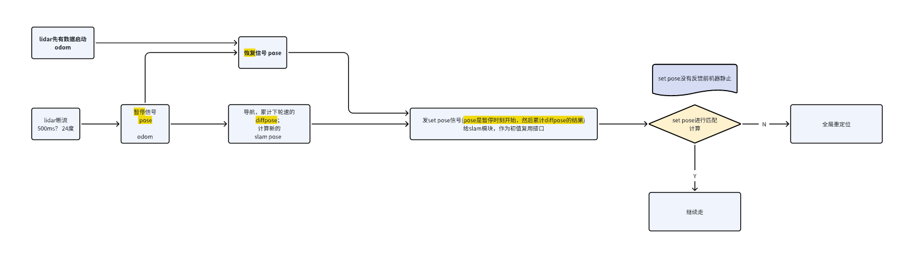

# 雷达机器断流后slam动作

lidar时间同步断流，通常在2s

1. 初步方案：

   1. 需求：

      1. 导航在暂停的时候记录slam pose 然后，用轮速递推下；（目前好像diff算了，可以乘一下）

      2. lidar恢复后，set pose 进行交互

问题：lidar断流500ms才报告，这个值能快速调整吗？

* 更长远的优化：

  1. set pose 保证机器能静止了；slam做更多位姿的搜索；流程图一致

